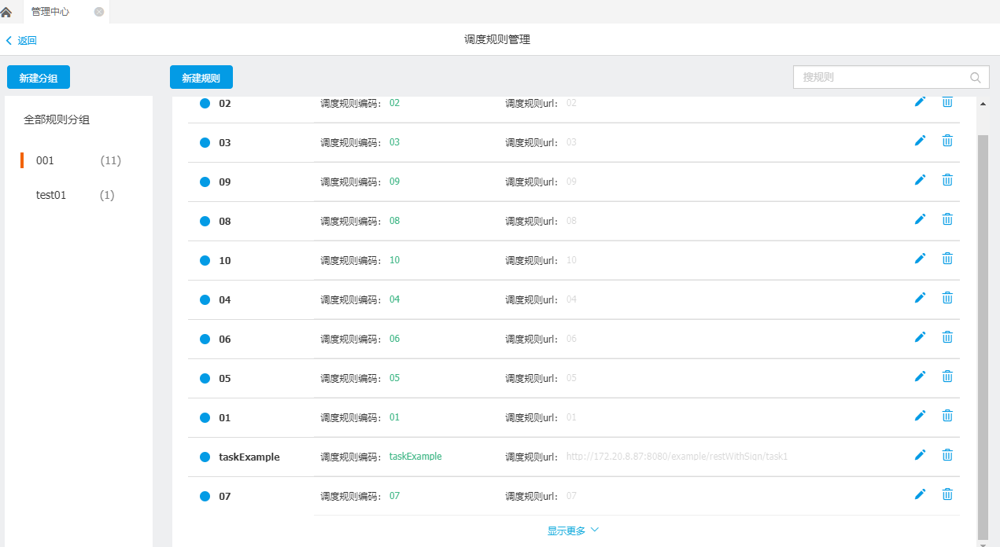
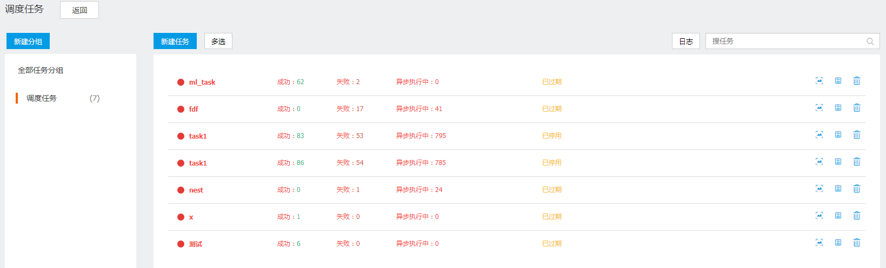

# 后台调度任务

调度任务提供基于给定时间点，给定时间间隔或者给定执行次数自动执行任务的调度任务框架。通过后台调度任务功能我们可以启动和终止作业调度，可以配置调度策略，查看调度的执行历史和执行日志，进行统一的后台管理。

## 调度任务规则管理

　　点击管理中心主界面上的【调度任务规则管理】，进入调度任务规则管理界面，如下图所示：

　　左侧为规则分组，每个分组后的数字表示它包含的规则个数。右侧为规则信息，规则编码、规则名称、规则URL，顶部两个按钮可以新建分组和新建规则。

将鼠标放置于某个任务上，可以删除、编辑该规则。

点击〖搜规则〗，输入规则名称，可以搜索规则。

### 新建分组

点击〖新建分组〗，输入分组名称，即可新建一个分组。

### 新建规则
选择一个分组，点击〖新建规则〗，打开新建规则界面，如下图所示：

规则编码、规则名称、调度规则URL为必填项。

调用规则就是按照规则执行任务，例如预警或定时执行等，根据不同业务场景选择调用规则后，取相应的参数值。

点击右侧的〖增行〗，可以对参数进行设置，设置完，点击〖增行〗即可保存：

## 调度任务管理

点击管理中心主界面上的【调度任务管理】，进入调度任务管理界面，如下图所示：

左侧为任务分组，每个分组后的数字表示它包含的任务个数。右侧为任务信息，包括任务成功次数、失败次数、任务状态，右边三个蓝色按钮分别表示查看任务详情、日志和删除。

将鼠标放置于某个任务上，可以启用、停用该任务，或者显示任务是否已过期。

点击〖搜任务〗，输入任务名称，可以搜索任务。

任务栏上方的日志是所有任务的日志，每条任务右侧的日志按钮显示该条任务的日志。

点击〖多选〗可以选择对多个任务进行操作： 

### 新建分组
点击〖新建分组〗，输入分组名称，即可新建一个分组。

界面说明如下：

分组名称：分组的标识

### 新建任务

选择一个分组，点击〖新建任务〗，打开新建任务界面，如下图所示：

任务编码、任务名称、调用规则和定时规则为必填项。

界面说明如下：

1. 任务编码：任务的标识
2. 任务名称：具有识别意思的名字
3. 任务分组：指定任务所属的组
4. 消息接收：配置任务成功后发送消息的接收人和接收方式（需要扩展实现消息发送逻辑)
5. 定时规则：任务具体执行时间，每多少天执行一次，并指定开始时间
6. 调用规则：指定要执行的任务，具体规则详见下面预制数据说明。
7. 参数：任务执行时，会根据指定的参数值调用业务服务。

调用规则就是按照规则执行任务，例如预警或定时执行等，根据不同业务场景选择调用规则后，取相应的参数值。

点击&quot;消息接收&quot;右侧的〖设置〗，可以对消息接收人进行设置：

 

选择一个或多个接收人。邮件和手机短信在消息通道进行配置，具体可见&quot;消息通道配置&quot;部分内容。消息中心是在消息中心进行接收，具体可见&quot;消息中心&quot;部分内容。

点击&quot;定时规则&quot;右侧的〖设置〗，可以设置定时规则，一次发生还是周期发生，如下图所示：

  

开始时间和结束时间规定了定时规则的时间范围。

界面说明如下：

1. 支持指定任务开始结束时间
2. 支持指定每天、每周（可选择周几）、每月第几天执行任务
3. 支持在上面选择的日期一天内，指定发生次数、间隔时间和起止时间

如果选择&quot;周期发生&quot;，举例来说，

A． 开始时间是2016-12-29 16:22，开始于8:00，每5分钟执行一次，则当天第一次执行是16:25；结束时间是2016-12-29 17:00，终止于16:55，则当天最后一次执行是16:55。

B． 开始时间是2016-12-29 16:22，开始于16:30，每5分钟执行一次，则当天第一次执行是16:30；结束时间是2016-12-29 16:50，终止于16:55，则当天最后一次执行是16:50。

### 查看任务详情
  

操作说明：点击主界面列表的数据行右侧查看任务详情图标。弹出任务详情界面。

界面说明如下：

1. 左侧显示任务的名称和执行情况
2. 右侧显示任务的详细信息
3. 编辑：进入任务编辑界面
4. 日志：进入日志查看界面，显示当前任务的日志

### 修改任务
  

操作说明：在主界面列表的数据行右侧点击编辑任务图标。弹出任务编辑界面，填写后保存。

界面说明如下：

1. 任务编码：任务的标识
2. 任务名称：具有识别意思的名字
3. 任务分组：指定任务所属的组
4. 消息接收：配置任务成功后发送消息的接收人和接收方式（需要扩展实现消息发送逻辑）
5. 定时规则：任务具体执行时间，每多少天执行一次，并指定开始时间
6. 调用规则：指定要执行的任务，具体规则详见下面预制数据说明
7. 参数：任务执行时，会根据指定的参数值调用业务服务。

### 删除任务

操作说明：在主界面列表的数据行右侧点击删除任务图标

### 启用任务

执行后结果会显示在界面上

 

操作说明：鼠标选择已停用的任务时，列表行显示启用按钮。点击按钮启用该任务。

### 停用任务

操作说明：鼠标选择正在运行中的任务时，列表行显示停用按钮。点击按钮停用该任务。

### 批量操作任务

操作说明：点击多选按钮时，会滑出启用、停用、删除按钮。列表界面切换为多选状态，选择多个任务后，点击按钮进行操作。点击多选回到原有状态。

### 查看任务执行日志

操作说明：

1. 点击主界面左上角的&quot;日志&quot;按钮，显示全部任务日志
2. 点击任务详情界面的&quot;日志&quot;按钮，显示当前任务的日志
3. 在日志界面的左上角可以选择要查询的任务，选择后，根据指定的任务查询并显示日志信息详见下图。

过滤任务界面：

操作说明：

1. 选择任务分组显示分组下的任务
2. 选择具体任务后，界面会按照选择的任务过滤显示

### 查看日志详情

操作说明：点击任务日志列表界面的数据行右侧的&quot;查看原因&quot;按钮，显示日志详情。

描述信息：对任务的简单描述