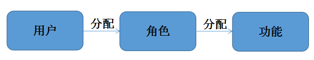
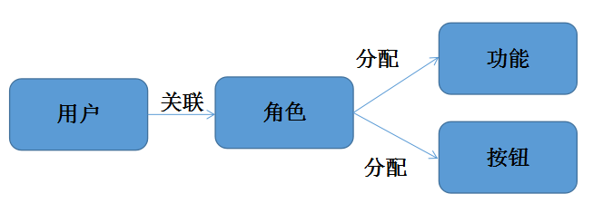

#功能权限和按钮权限
 
##1.概述
为了实现对用户功能应用和按钮权限的统一管理，应用平台提供了一套对二者进行管理的体系，用户只需遵守一定的开发规范，就能够方便的实现对功能和按钮权限的管理；

##2.实现模式

###2.1实现方式
这里讲述的是一种实现方式。关于用户、角色和功能的关系描述如下图所示：

用户：登录到系统的用户，往往真实的对应到一个人员，一个人员可以有多个用户。 
角色：往往指的是一种职能或者职责的集合，一个用户可以拥有多个角色。 
功能：功能点。

功能权限要求： 
&nbsp;&nbsp;&nbsp;&nbsp;&nbsp;&rsaquo; 在用户登录时，不同的用户需要看到不同的功能点。也就是只能看到自己有权限访问的功能点。  
&nbsp;&nbsp;&nbsp;&nbsp;&nbsp;&rsaquo; 如果有更细粒度的功能划分，比如打开页面后，只能看到某些按钮【资源】，那么可以使用“按钮权限”的功能开发。 
所以我们需要对用户、角色、功能、按钮等进行创建（请参考功能按钮权限快速入门），并建立他们之间的关系。业务上要求增加用户、角色、功能、按钮节点，通过可视化界面建立好关系后，提供根据用户查询角色，每个角色对应不同功能以及按钮的API，提供给登录认证功能使用。

###2.2 功能权限控制

功能权限包括两个处理： 
一、功能节点权限控制：用户登录时加载的菜单项目是自己有权限访问的菜单【功能点】； 
二、按钮权限实现：打开界面时只能看到有权限的按钮。
 

用户登录认证后，会将用户能够访问的功能等信息写进redis缓存，具体可参考workbench-core-3.3.0-SNAPSHOT.jar中 com.yonyou.uap.wb.overwrite.service.ApLoginServiceImpl.afterLogin(User user)方法和iuap-authrbac-core-3.3.0-SNAPSHOT.jar包中com.yonyou.uap.ieop.security.cache.RbacCacheManager.login(String tenantId, String sysId, String userId)方法。

当用户访问菜单界面时会向后台发出请求，后台从缓存中查出可以进行访问的功能，并返回给前台，这部分是通过后台workbench-web-3.3.0-SNAPSHOT.jar中 com.yonyou.uap.wb.web.controller.management.WBAppMenuController.sidebarList(HttpServletRequest request, HttpServletResponse response)提供的服务，获取当前用户具有权限访问的功能；

<pre>
     @RequestMapping(value = "/sidebarList", method = RequestMethod.GET)
     public @ResponseBody Map<String, Object> sidebarList(HttpServletRequest request, HttpServletResponse response) {
          Map<String, Object> results = new HashMap<String, Object>();
          try {
               List<SideBarMenu> data = menuAppService.listBarTree().getChildren();
               results.put("status", 1);
               results.put("msg", "操作成功！");
               results.put("data", data);
          } catch (UserCenterIntegException ucE) {
               results.put("status", 0);
               results.put("msg", "用户中心集成用户查询角色异常！");
               log.error("用户中心集成用户查询角色异常！", ucE);
          } catch (Exception e) {
               results.put("status", 0);
               results.put("msg", "服务异常，请稍后重试！");
               log.error("服务异常：", e);
          }
          return results;
      }
</pre>

前端界面初始化进行动态渲染菜单theme.js相关代码如下： 
<pre>
     axios.get(contextRoot +'/appmenumgr/sidebarList?r='+Math.random())
          .then(function (response) {

     var data = response.data.data || [];

     if(response.data.status==0){
         console.log(response.data.msg);
     }
     self.setMenu(response);
     self.setState({
          menu: data,
          num:data?data.length:0
     });
     self.initRouter();
     }).catch(function (err) {
          console.log(err);
     });
     }

</pre>

根据获取的数据生成菜单节点  
<pre>
     &lt;div className="sidebar-content">
          &lt;Menu  onClick={this.handleClick.bind(this)}  className="u-menu-max1"  style={{marginTop:'-'+this.state.curNum*50}}  mode="vertical" >
               {
                    this.state.menu.map(function (item) {
                    return (
                         &lt;SubMenu onTitleMouseEnter={self.onTitleMouseEnter.bind(self)} key={item.menuId} className={'second-menu '+selected+ ' '+ noSecond +' menu-cloum-'+pages} children={item.children} title={title}>
                              &lt;li className="arrow-menu">&lt;/li>
                     
                              {
                                   menulist.map(function(ite,i){
                                         ite = ite.length!=0?&lt;li className="u-menu-list">{ite}&lt;/li>:ite;
                                         return (
                                             ite
                                         )
                                    })

                               }
                         &lt;/SubMenu>
                    )
               }
               &lt;/Menu>				
     &lt;/div>
</pre>

###2.3 按钮权限控制
按钮权限控制应该从三个方面实现控制： 
一、在具体功能实现界面上，不同用户，不同角色授权了不同的按钮，因此界面上只应该展示有权限访问的按钮； 
二、按钮权限的第二层控制是，对于不同用户，不同角色进行了权限控制限定，不能够通过url非法请求后台服务； 这里对于按钮权限的控制提供一种思路，建议使用将相关数据进行cache缓存； 
三、对于每个功能需要将该功能的按钮都在按钮表中进行注册做预置数据；应用平台对功能注册和按钮注册提供了维护界面，可以从界面上进行维护；并提供了功能授权和按钮授权功能； 

1) 后台提供服务 
按钮控制权限是通过访问iuap-authrbac-core-3.2.0-RC003.jar包中com.yonyou.uap.ieop.security.web.controller.MyBtnAuthController. handleBtnGroups(@RequestParam("funcCode") String funcCode)方法根据用户信息从redis缓存中获取所有有权限的按钮名称，其中对于没有启用按钮权限的则会返回所有的按钮名称。 
2)按钮界面控制实现 
界面UI层，添加按钮实现时，需要对visible属性的ko绑定的动态控制；ygdemo_yw_info.html中相关代码如下： 
<pre>
    &lt;button class="u-button u-button-primary " data-bind="click: event.addClick, visible: buttonShowGroup['add']">
        增加
    &lt;/button>
    &lt;button class="u-button u-button-primary " data-bind="click: event.editClick, visible: buttonShowGroup['update']">
        编辑
    &lt;/button>
    &lt;button class="u-button u-button-primary" data-bind="click: event.delRow, visible: buttonShowGroup['delete']">
        删除
    &lt;/button>
</pre>
数据集中对于visible中ko的绑定，页面初始化数据时，向服务器端发起请求获取当前功能具有访问权限的按钮，并设置按钮的可见性，ygdemo_yw_info.js中相关代码如下：
<pre>
    if(arg && arg.vtype && arg.vtype=='bpm'){
        window.initButton(viewModel, $(element)[0], "ygdemo_yw_info");
        }else{
        window.initButton(viewModel, element);
    }
</pre>
window.initButton()函数中进行了对buttonShowGroup事件的创建，此处应用平台的按钮权限过滤功能帮我们完成了按钮权限的过滤，需要注意的是：buttonShowGroup['按钮编码']，引号中的内容必须与下图右侧的按钮权限编码完全一致，权限过滤才能生效。

 
###2.4 网页拦截开发步骤
权限拦截器用于实现上述的第二个方面的请求控制，即对url非法请求后台服务进行拦截，该拦截器需要配置在src/main/webapp/WEB-INF/web.xml中的shiroFilter的后面即iuap-auth认证组件的之后，只有请求经过登陆认证组件验证过的请求，才需要进行权限拦截；
####在web.xml中进行拦截器的配置
<pre>
    &lt;filter>
        &lt;filter-name>shiroFilter&lt;/filter-name>
        &lt;filter-class>org.springframework.web.filter.DelegatingFilterProxy&lt;/filter-class>
        &lt;init-param>
            &lt;param-name>targetFilterLifecycle&lt;/param-name>
        &lt;param-value>true&lt;/param-value>
        &lt;/init-param>
    &lt;/filter>
    &lt;filter-mapping>
        &lt;filter-name>shiroFilter&lt;/filter-name>
        &lt;url-pattern>/*&lt;/url-pattern>
    &lt;/filter-mapping>
    &lt;filter>
        &lt;filter-name>authorizationCheckFilter&lt;/filter-name>
        &lt;filter-class>com.yonyou.iuap.crm.ieop.security.filter.AuthorizationCheckFilter&lt;/filter-class>
    &lt;/filter>
    &lt;filter-mapping>
        &lt;filter-name>authorizationCheckFilter&lt;/filter-name>
        &lt;url-pattern>/*&lt;/url-pattern>
    &lt;/filter-mapping>
</pre>
 
在拦截器中需要验证当前用户是否具有当前请求即操作功能节点的权限，并且对于该功能的按钮操作是否有权限的验证；详细实现，可查阅com.yonyou.iuap.crm.ieop.security.filter.AuthorizationCheckFilter代码实现。

