# 开发指南

## 环境变量
环境变量作为容器配置项， 可以在Dockerfile 中用 ENV设置环境变量 ， 也可以使用docker run 命令用 -e 设置环境变量。云启作为容器托管平台，也提供动态配置环境变量的方式。应用发布时，环境变量的配置是默认的，不需要用户设置。 如果有自定义环境变量的需求，在应用发布后，用户可以在应用管理菜单中找到发布的应用，在属性页签中修改环境变量。

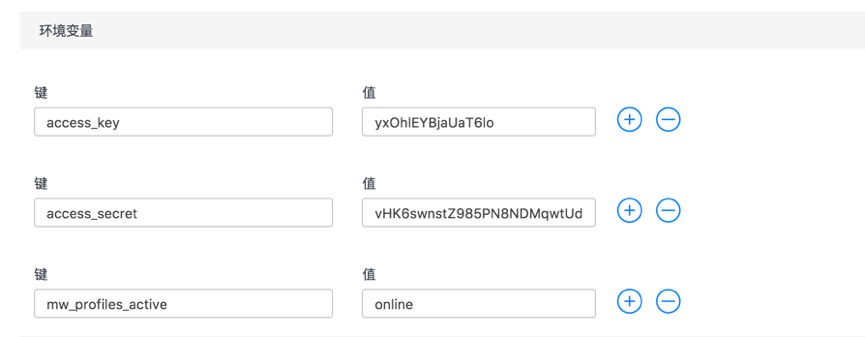

修改完成后，点击保存并重启按钮，重启应用即可生效。 在容器中使用env命令，即可查看容器的环境变量。 应用中可以通过代码获取容器的环境变量，以java为例， 使用System.getenv() 可以获取环境变量的map对象。
若使用iuap平台开发框架， 需要执行以下操作：

#### 1.	修改applicationContext.xml文件
在applicationContext.xml文件中，增加systemPropertiesMode属性，并将value设为2（这里是设置变量获取方式优先级，环境变量优先，然后是系统变量，最后是properties文件方式获取）

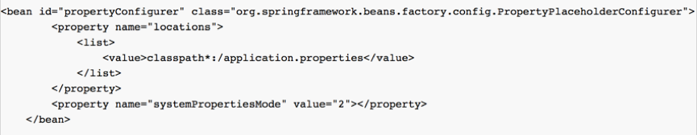
#### 2.	pom.xml中增加maven依赖，引入iuap-utils组件
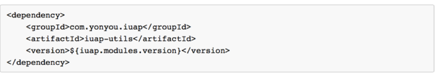
> 以jdbc.url为例，在applicationContext.xml里的数据源配置中使用${jdbc.url}方式读取jdbc配置。

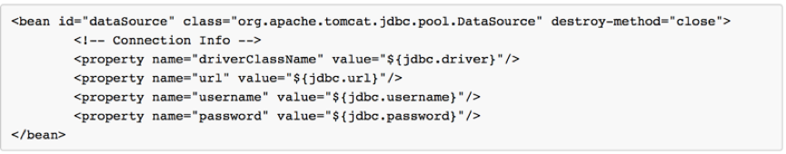
如果按上述方法设置了环境变量，则环境变量中的value会替换源代码中application.properties中的值，实现动态配置。

也可以通过设置环境变量的方式实现java代码的远程调试。Java远程调试的原理是两个Java VM之间通过debug协议进行通信，然后以达到远程调试的目的。两者之间可以通过socket进行通信，被debug程序的Java虚拟机在启动时开启debug模式，启动debug监听程序。
具体步骤如下：

#### 1.	应用属性增加环境变量
```
CATALINA_OPTS = -Xdebug -Xrunjdwp:transport=dt_socket,address=8000,server=y,suspend=n
```
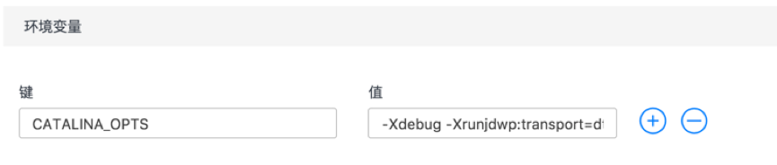

其中address为调试监听端口，不要与应用访问端口冲突。

#### 2.	增加应用调试端口

增加的调试端口需和步骤1中的属性address=8000一致，如8000

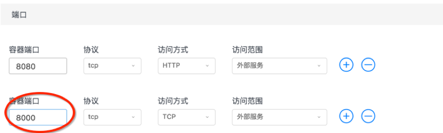
#### 3.	保存并重启实例

实例重启完毕后，点击需要远程调试的实例控制台。在实例控制台中输入echo $PORT0,$PORT1,输出信息为应用放开的端口对应该实例的数组，PORT0对应8080端口，PORT1对应实例的8000端口（即远程调试使用的端口号）

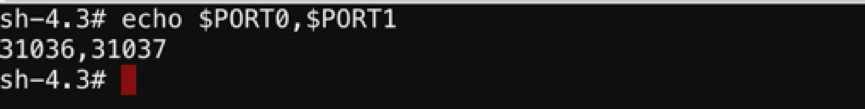

#### 4.	查看实例运行的主机，获取容器运行的宿主机ip
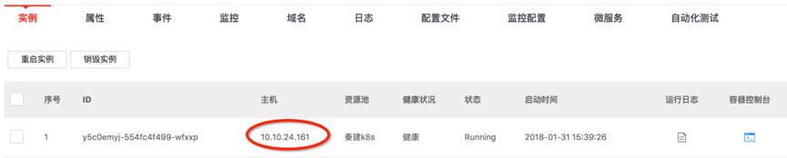

#### 5.	配置开发工具IDE的远程调试信息为以上步骤获得的IP地址和端口
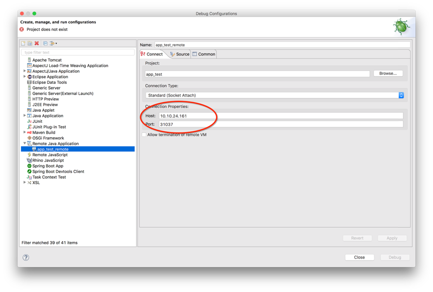

如此就可以在IDE中进行java代码的远程debug调试了

## 健康检查

在分布式系统中，经常需要利用健康检查机制来检查服务的可用性，防止其他服务调用时出现异常。云启平台提供对应用容器的健康检查配置。应用发布后，用户通过应用管理菜单中找到发布的应用，在属性页签中修改健康检查配置。
如下图所示：

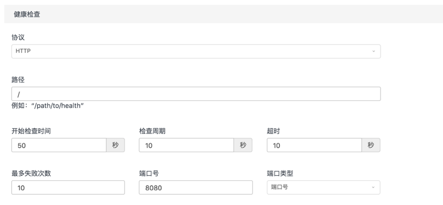

云启提供HTTP，TCP, COMMAND三种方式的健康检查策略。
HTTP方式工作在第七层，通过设定路径向指定的url执行http请求，根据设置的超时时间和最多失败次数判断检测是否成功。 TCP方式工作在第四层，执行健康检查时，向容器服务发起一个tcp连接请求，如果服务没有响应或者超时，健康检查不通过。COMMAND方式可以允许用户自定义命令执行健康检查，如“curl -f -X GET http://$HOST:$PORT0/health”等。根据请求返回码判断检查是否成功。
如果容器启动时没有通过健康检查，则实例状态显示不健康，提醒用户检查容器状况定位问题。

以HTTP方式的java应用为例，需要提供健康检查的api接口，如下：

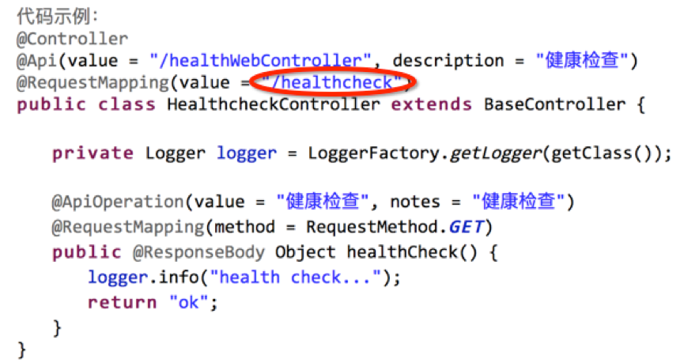

然后在应用管理的属性标签下修改健康检查的配置如下：

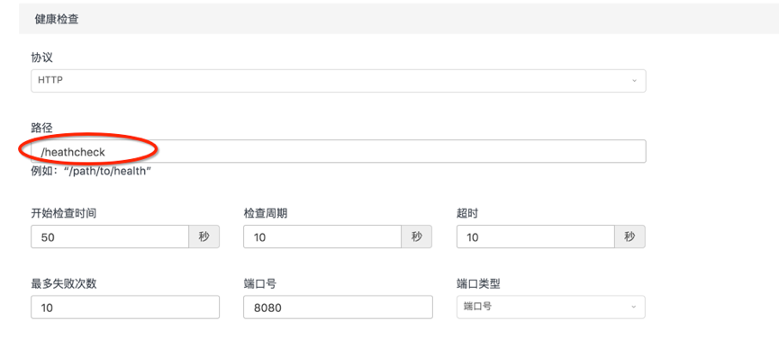