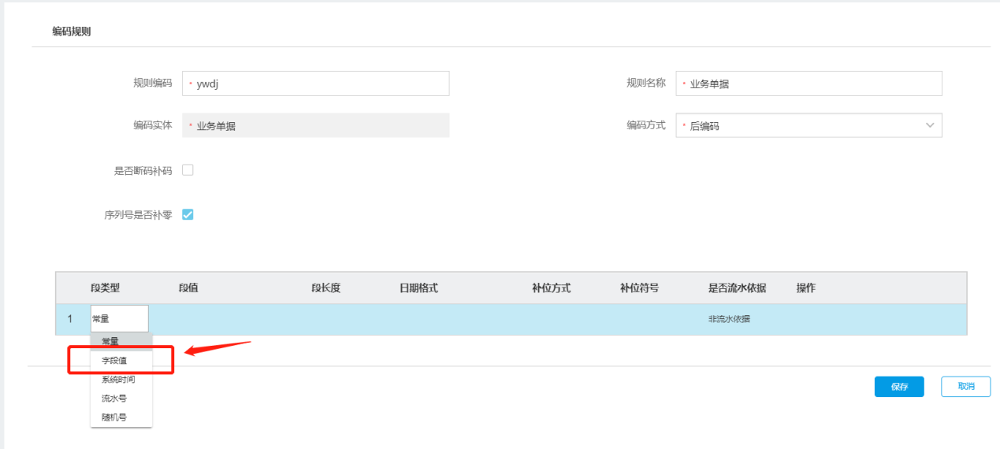
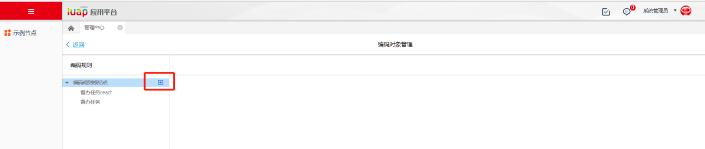
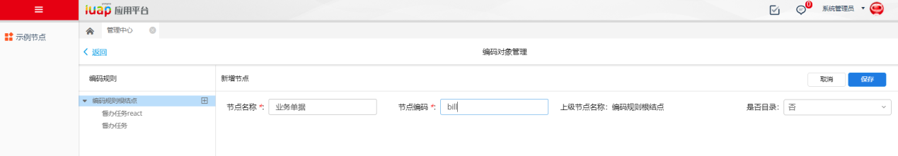
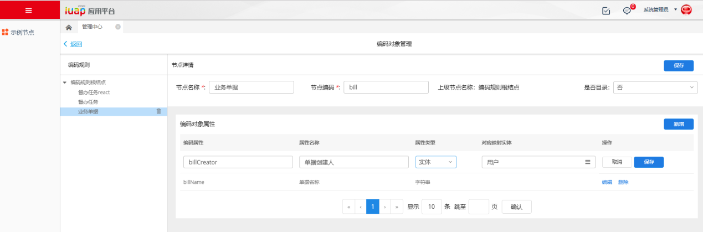
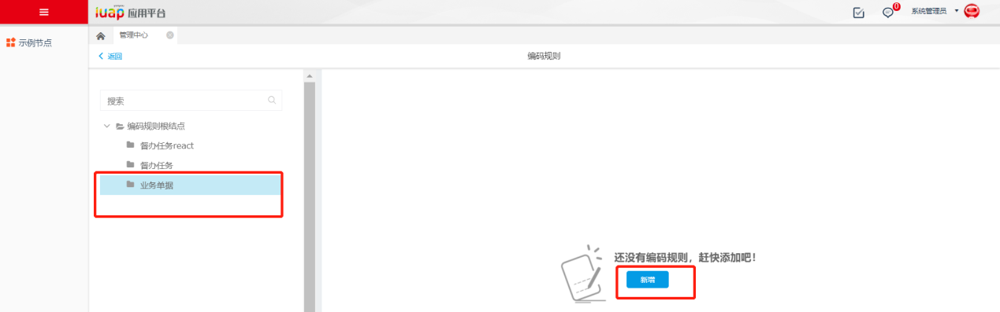
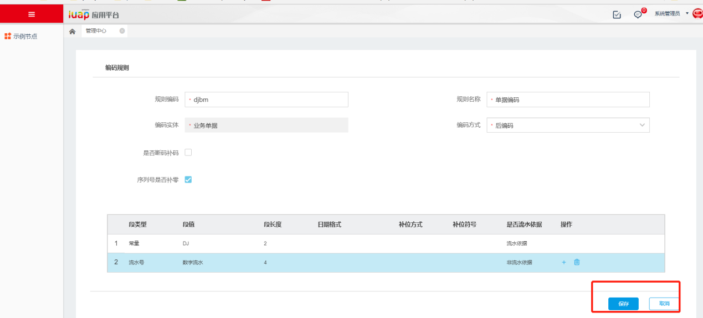

开发示例
========

编码规则设定
------------

### 编码对象、属性定义

如果需要生成的编码值不涉及业务表单里的单据字段，此节点可以忽略不进行配置。只有在定义编码规则用到段类型为“字段值”时才需设定编码对象和属性。

图 7

(1)进入编码对象管理节点，新增对象节点。

图 8

增加业务对象。

图 9

(2)增加业务对象的属性,属性类型中“字符串”代表编码

图 10

### 编码规则定义

进入编码规则定义节点，左侧树中选择需要定义编码规则的业务节点，新增编码规则。

图 11

填写编码基本信息和编码元素完成之后保存，编码规则定义完成。

图 12

配置文件
--------

业务代码里增加配置文件billcode-sdk.properties，文件中配置编码规则的服务地址。示例：

billcode.base.url=http:**//10.10.24.84:8080/iuap-saas-billcode-service**

业务代码调用编码接口
--------------------

（1）引入编码的sdk。

\<dependency\>

\<groupId\>com.yonyou.iuap.pap.billcode\</groupId\>

\<artifactId\>iuap-billcode-sdk\</artifactId\>

\<version\>\${project.version}\</version\>

\</dependency\>

（2）调用BillCodeSignUtil类中的getBillCode()方法获取编码，具体编码接口详见6.2。示例：

String code=BillCodeSignUtil.getBillCode(JsonParam);

JsonParam为json格式：

{  
    **"billVo"**:**" {"code":"001", "name":"督办名称"}"**,  
    **"pkAssign"**:**""**,  
    **"billObjCode"**:**"ygdemo"**  
}