基本概念
========

背景
----

在业务系统中，业务对象通常会有一个业务对象编号，业务对象编号作为业务对象具有业务意义的标识，一般由时间、序列号、常量等子段按照一定的规则拼接而成，这个规则我们称为“编码规则”，各个子段我们称之为“编码元素”。考虑如下的业务对象编号：'TT-20150615-0001',编码规则为:（常量'TT-'+yyyyMMdd类型的时间'20150615'+常量'-'+序列号'0001'),如果时间变为'20150616',序列号重新从'0001'开始流水，那么我们称此时间编码元素是“流水依据元素”,所有的流水依据元素合起来叫做本编码规则的“流水依据”。

目前比较少编码规则的开源组件，网上能找到的也只是一些简单的实现类或者设计思路，要么将规则写死在代码中，缺乏通用性和灵活性，要么缺少全面的考虑，本组件提供了一种通用的编码规则解决方案。

本组件的核心是根据编码规则和一些必要信息，生成业务对象编码。本组件提供了存储在数据库中一种实现，提供了基本的增加，删除，修改编码规则的服务方法，用户可以在此调用此服务，开发出自己的编码规则设计工具，也可以直接设计符合自己要求的编码规则数据库结构和服务，编码规则VO符合组件的模型即可（实现组件的规则接口）。

名词解释
--------

**业务对象**：此处指软件中业务主体，可以是基础数据、单据类型。例如：凭证、人员、采购订单、销售订单等。

**编码对象**：此处指业务对象中需要进行编码规则定义的主体，可以对应基础数据、单据类型。

**映射对象：**此处指可以定义编码规则主体的具体字段对应的实体。例如人员的所属部门，采购订单的物料。

**编码映射：**指为编码对象定义在编码规则中使用的属性值。

**编码规则：**此处指通过对需要进行分类管理的业务对象进行一系列规则设置，使其在创建时根据定义的规则自动生成档案、单据的编码。

技术架构
========

架构设计
--------

图1

编码组件对外提供编码、查询等服务。编码服务通过已经定义的编码规则生成对应规则的编码，并返回给业务系统；查询服务可以查询相应编码规则对应的流水值，并提供修改流水的功能。

编码生成模式
------------

编码规则组件支持借助zklock和Redis两种生成编码的方式，在billcode-base.xml中进行相应配置。其中zklock方式能保证编码不断码，redis方式在高并发下性能要更好。

### Redis模式

Redis模式下编码获取过程：

1、客户端请求接口想要获取编码；

2、获取对应业务节点的默认编码规则；

3、生成客户端UUID，将“billcode:”+UUID拼接后放入redis管道中。

4、客户端线程进入线程循环等待，每隔固定时间去redis中请求获取key为UUID的值。

5、服务端生产者线程从redis管道中持续获取值，获取到值之后生成编码，并以获取值中的UUID为key，生成的编码为value生成新数据放入redis中。

6、客户端以UUID为key从redis中成功获取编码值。

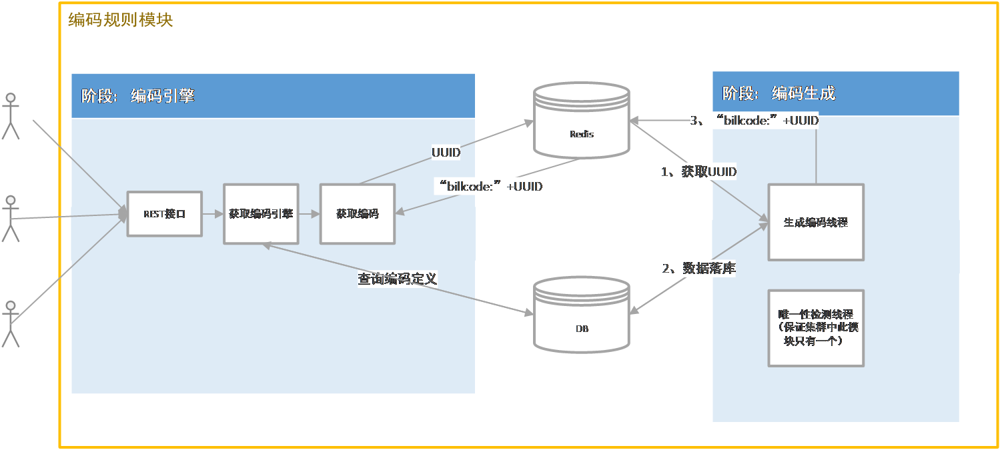

图 2

### Zklock模式

**Zklock**模式下编码获取过程：

1、客户端请求接口想要获取编码；

2、获取对应业务节点的默认编码规则；

3、zk加锁；

4、生成编码；

5、释放锁；

6、返回编码；

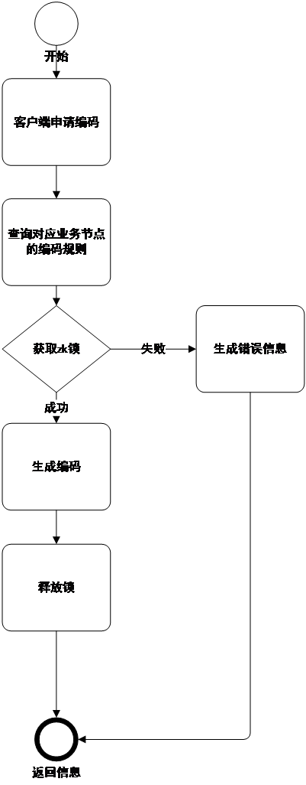

图3

功能介绍
========

功能概述
--------

编码规则组件对系统中使用的单据编码、档案编码等自动编码进行统一管理，具有实现按照编码规则定义自动生成编码的功能。通过编码规则定义，可以根据系统属性、对象的属性、固定值（常量）、流水号等类别的属性按照一定的规则组织自动生成对象编码。通过删除保留占用、自动进行断号补号等功能，使得编码规则管理的更加系统和完善。

编码规则组件包含编码规则定义、编码映射、编码对象管理、映射对象管理四部分。

编码规则定义
------------

如下图所示,编码规则定义页面包含了基本信息和编码元素两部分：

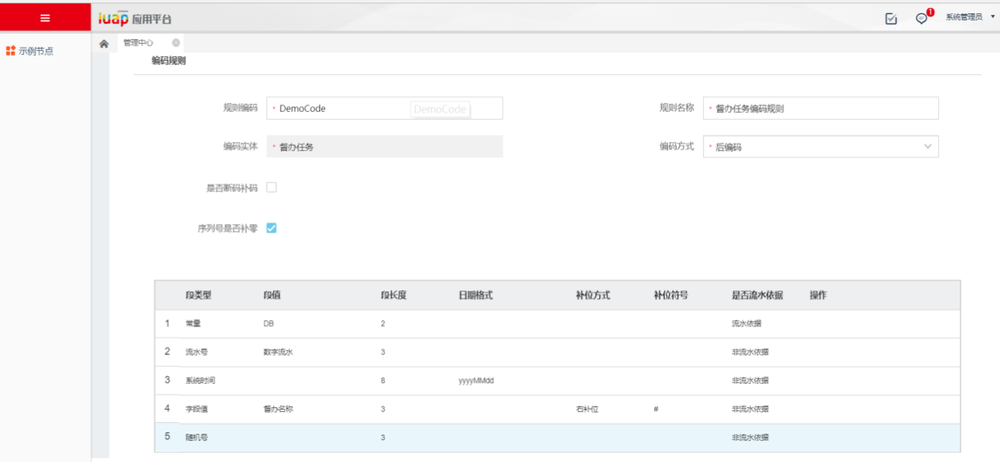

图 4

### 基本信息

编码规则的基本信息包含如下几项：

-   规则编码：规则标识；

-   规则名称：规则标识；

-   规则实体：编码规则对应的业务单据实体名称；

-   编码方式：可选择前编码、后编码两种方式，前编码方式即在用户新增单据时即生成编码，此时新增单据很多相关项还没有赋值，所以前编码方式不能支持在编码中出现业务实体和业务时间，后编码方式是在用户新增单据后，保存时生成单据编码，没有什么特殊限制；

-   是否断码补码：如果删除一个单据，或者申请一个单据出错，那么它们所使用的单据号是否要再被使用；

-   序列号是否补零：控制流水号的长度，比如流水号是1，规定流水号长度为4位，补位的情况是
    1前边补3个0，流水号 0001不补位的情况流水号就显示1位1。

### 编码元素

（1）单据编码通常包含固定的字符串、分隔符、单据相关的数据项的值、时间和编号构成，在编码规则中用五种编码元素来描述上述的编码项：

-   常量：来表示固定字符串和分隔符；

-   字段值（编码实体）：来表示与单据相关的数据项的值（客商，人员），而这些值通常不是简单的使用其编码名称等，通过编码映射功能（见2.3），将这些值映射为最终展现到编码段中的值。

-   时间项：来表示时间属性，包含系统时间（取值为服务器时间）和业务时间（取值为单据上的相关时间项，如制单日期等）；

-   流水号：用来顺序记录单据编号的定长号；

-   随机号：由数字和字母随机生成的值；

（2）编码规则由上述五种或其中几种组成，对于每一个编码元素有如下四种属性：

-   元素类型：固定值，编码实体，时间属性，流水号；

-   元素值：固定值就是用户自定义的字符串；如果编码对象定义了元数据，那么业务实体值就是元数据上定义的属性，该属性必须是在编码映射中定义的且此编码对象可使用，如果非元数据，那么从单据类型与实体关联表中获取数据；如果是时间类型，编码对象定义了元数据，那么可以选择元数据上定义的时间属性或者系统时间作为值；流水号无此属性；

-   是否流水依据：此属性是针对编码实体和时间类型的。如果是编码实体，那么对于每一个实体值，都重新开始计数；对于时间类型，可以选择按年归零，按月归零，按日归零，这样在新的一年（月、日）流水号重新计数。

-   长度：对于固定值，长度即是输入的字符串长；对于业务实体，就是在实体映射值设置的长度；对于时间，根据时间格式来确定最大长度；对于流水号，这个值是可编辑的，输入一个认为合适的长度。

此外，还可以对流水号和断号进行管理功能，对同一编码规则，因为设置了流水依据，会根据流水依据的不同的值的组合，生成多套流水号，每套流水号都会有根据流水依据产生的唯一标识，可以手工修改流水号，修改后，流水号以当前修改的值作为基准继续流水。断号管理可以查看不同标识的流水断号情况。

下图为流水号管理界面，可以修改流水号。

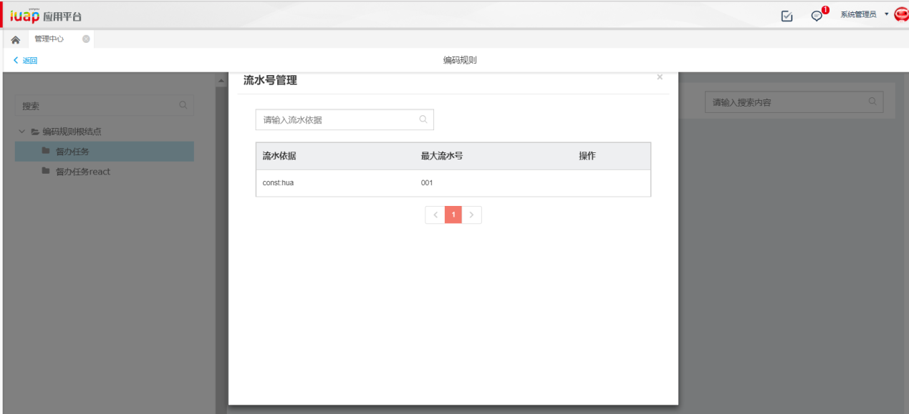

图 5

编码映射
--------

业务节点如果期望单据号与表单中所选择的参照值有关，每一个参照值对应编码中的一个特定值。例如在填写表单时部门参照里选择部门为“云平台”时，单据号中对应“YPT”，编码组件中生成编码“20180101YPT001”；选择部门为“财务”时，单据号中对应“CW”，编码组件中生成编码“20180101CW001”。编码映射节点就负责相关值的配置。

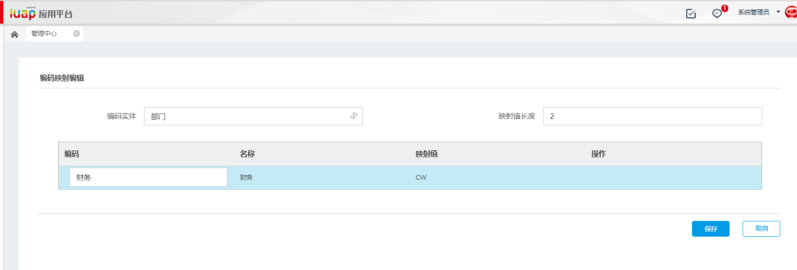

图 6

在编码对象和编码实体关联表中注册了编码对象需要使用的编码实体，为编码实体定义映射规则有几个关键属性：

-   映射值长度：最终要体现在编码中的值的长度；

-   名称：实体属性中原有的值；

-   映射值：体现在生成编码中的值；

典型业务场景介绍
================

编码规则定义
------------

进入编码规则定义节点，进行编码规则编辑或新增。

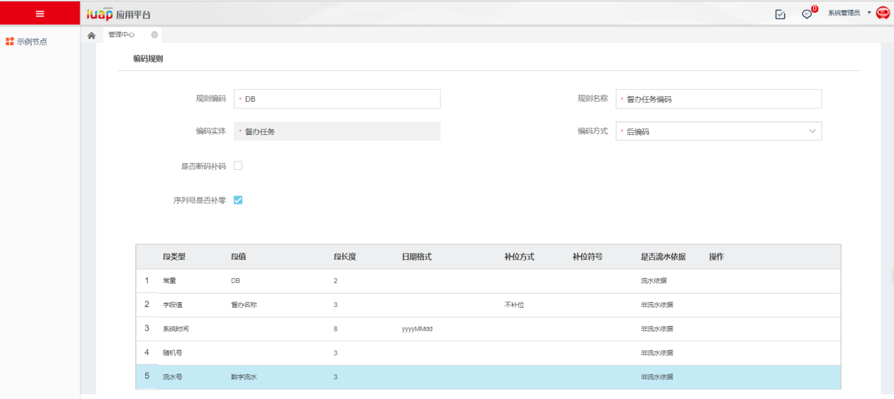

图 13

（1）流水号与流水依据

编码元素里面必须包含段类型为“流水号”的元素，且必须选定一个元素作为流水依据。可以作为流水依据的短类型有：常量、系统时间、字段值。

（2）补位

编码元素为“字段值”时需要选择补位方式，如果业务单据中的字段实际输入长度大于此元素中定义的段长度，会按照段长度截取单据中的段值；如果实际输入长度小于定义的段长度，补位方式为“左补位”或“右补位”时会按照补位符号补全位数，选择“不补位”则按照实际输入的字段生成编码。

（3）字段值

编码方式为“后编码”时，可以将业务单据中的输入值作为编码的一部分。段值分两种，一种将业务单据中的输入值直接作为编码的一部分，另一种将单据中的输入值与编码映射结合，将编码映射中设定的值作为编码的一部分。段值的类型在“编码对象管理”节点进行定义，“实体”对应编码映射中的值，“字符串”对应表单中的输入值。

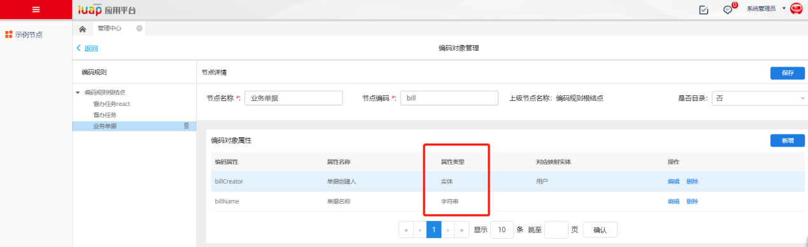

图 14

编码映射
--------

编码映射针对后编码中的字段值，从业务数据获取相关信息。编码映射为每一个可用于编码规则的业务实体的值进行重新映射。在生成编码规则时，按照映射后的值，作为编码的组成部分。

点击管理中心主界面上的【编码映射】，进入编码映射界面，如下图所示。鼠标放到每行的操作处，出现编辑和删除按钮。

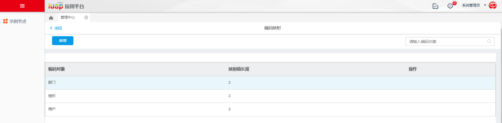

图 15

点击新增，进入编码映射新增界面，如下图所示：

图 16

选择编码实体，设置映射值长度，设置编码、名称和映射值。鼠标放到每行的操作处，出现增行和删行按钮。点击〖保存〗保存当前编码规则映射。

返回编码映射主界面，点击〖请输入编码〗，输入编码对象名称，可进行搜索。

完成设置后，按〖返回〗返回管理中心主界面。

修改编码流水
------------

编码规则定义节点可以直接修改当前编码的流水数值，常见于业务单据出现重码时重置编码用。

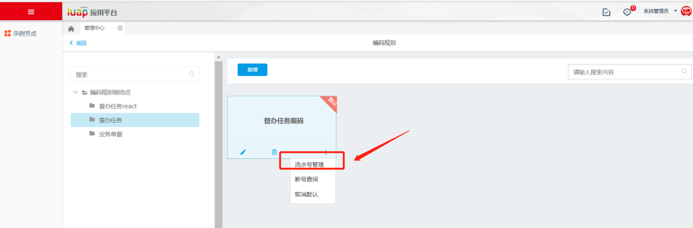

图 17

点击流水管理，在弹出的界面修改最大流失并保存。

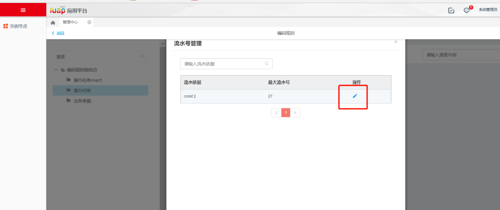

图 18

断码补码
--------

如果在定义编码规则时勾选“是否断码补码”，则编码规则会将删除的业务单据中的编码重新利用，断码可以在断号查询中查看。

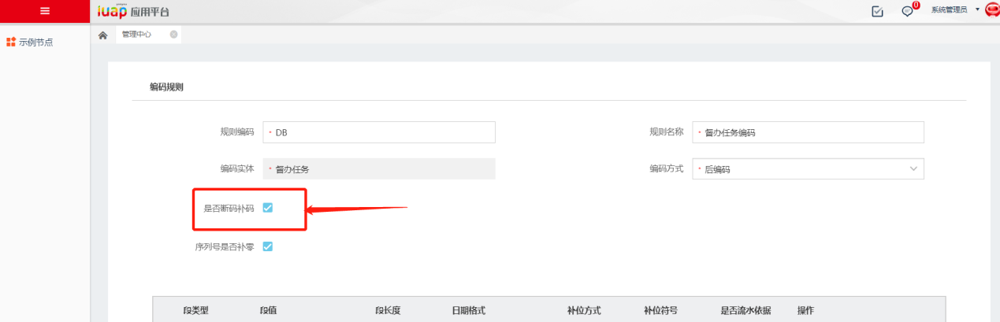

图 19

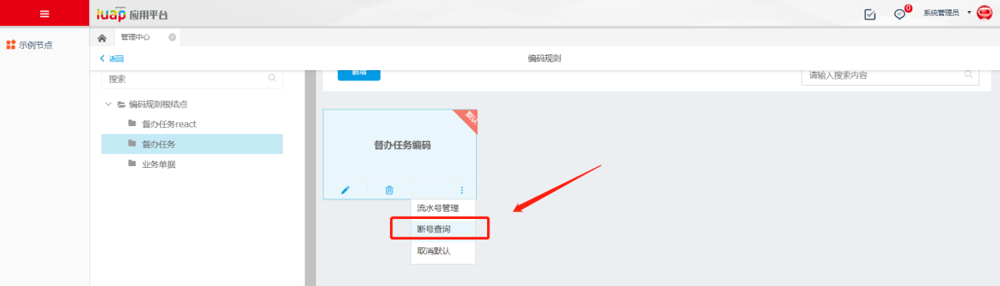

图 20