IUAP应用平台3.5.5红皮书

流程服务组件
用友网络科技股份有限公司
二零一八年五月


此文档为保密文档，未经用友软件股份有限公司书面同意，不得向任何单位或个人提供、转让本文档中的任何内容，用友软件股份有限公司将保留对泄漏文档内容的起诉权利。


# 版权

©2019用友集团版权所有。

未经用友集团的书面许可，本文档描述任何整体或部分的内容不得被复制、复印、翻译或缩减以用于任何目的。本文档描述的内容在未经通知的情形下可能会发生改变，敬请留意。请注意：本文档描述的内容并不代表用友集团所做的承诺。


iuap平台红皮书


| 文件状态：[  ]草稿[√]正在修改[]正式发布 | 文件标识： |  
| --- | --- 
| 当前版本： | V3.5.5 |
| 作者： | 高树江 |
| 完成日期： | 2018/12/27 |


版本历史


| 版本 | 作者 | 参与者 | 起止日期| 备注 |
| --- | --- | --- | --- | --- |
| V3.5.2 | 高树江 | 史晓腾 | 2018-10-18 | 第一次评审 |
| V3.5.3 | 高树江 | 史晓腾 | 2018.10.16- |  |
| V3.5.5 | 史晓腾 | 张镐 | 2018.12.27 |  |


审核记录


| 版本 | 姓名 | 职位 | 审阅日期 | 备注 |
| --- | --- | --- | --- | --- |
|  |  |  |  |  |
|  |  |  |  |  |
|  |  |  |  |  |
|  |  |  |  |  |
|  |  |  |  |  |
|  |  |  |  |  |
|  |  |  |  |  |
|  |  |  |  |  |
|  |  |  |  |  |  |


# 第一章 流程框架

## 1.1.流程框架概述

通过流程设计器或者流程定义生成接口创建流程定义；流程引擎对流程定义进行解析，按照不同的指令将单据按照一定顺序流转处理。用户可通过“任务中心"查看、审批单据；通过“流程监控"监控流程，通过实例查询查看流程实例相关信息；通过流程图和流程历史查看当前运行流程及任务状态，通过流程分析查看流程及任务完成情况。平台提供统一的审批界面，通过引擎总适配器分别获得不同流程引擎的相关动作以及实体属性等。

## 1.2. 业务模型

设计业务数据模型，从业务流程定义出发，分析设计业务数据实体及其关系。


图 1

业务模型表【iuap_bpm_buzimodel】：

| 字段 | 类型 | 描述 |
| --- | --- | --- |
| id | varchar | 主键 |
| code | varchar | 编码 |
| name | varchar | 名称 |
| buzientity_id | varchar | 业务实体 |
| msgtemplateclass_id | varchar | 消息模板 |
| createtime | timestamp | 创建时间 |
| sysid | varchar | 应用ID |
| tenantid | varchar | 租户ID |

业务实体表【iuap_bpm_buzientity】:

| 字段 | 类型 | 描述 |
| --- | --- | --- |
| id | varchar | 主键 |
| model_id | varchar | 业务模型ID |
| formcode | varchar | 表单编码 |
| formname | varchar | 表单名称 |
| formdiscription | varchar | 表单描述 |
| formurl | timestamp | 表单URL |

业务实体属性表【iuap_bpm_buzientity】：

| 字段 | 类型 | 描述 |
| --- | --- | --- |
| id | varchar | 主键 |
| buzientity_id | varchar | 业务实体ID |
| model_id | varchar | 模型ID |
| fieldcode | varchar | 属性编码 |
| fieldname | varchar | 属性名称 |
| fieldtype | varchar | 属性类型 |
| typeoptions | varchar | 类型选项 |
| defaultvalue | varchar | 默认值 |


## 1.3. 流程模型

定义流程模型，调用流程设计器实现流程设计以及流程规则定义，并提供流程的删除、编辑、复制、导入、导出以及流程部署的功能。

## 1.4. 流程设计器

流程设计器：对业务过程进程可视化描述，以便用XML表示业务过程，提供流程定义（设计态，运行态）的工具。

### 1.4.1. 流程设计器的组成

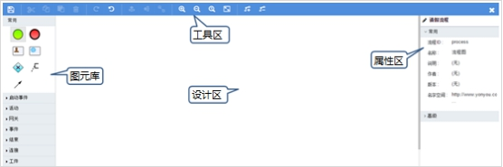

图 2

#### 1.4.1.1. 工具区

设计器的上方是工具区，可以保存流程图，剪切、复制，粘贴、删除，恢复、撤销操作，垂直对齐、水平对齐，把相同类型的多个元素设成相同大小，放大、缩小、还原，让元素适应窗口，为选中的顺序流增加弯曲顶点、移除选中的顺序流上的弯曲顶点。

| 图标 | 名称 | 描述 | 备注 |
| --- | --- | --- | --- |
|  | 保存模型 | 弹出保存模型对话框，点击“保存"则保存流程图但不退出，点击“保存并关闭设计器"则保存流程图，跳转到流程设计工作区画面。 |  |
|  | 剪切 | 剪切选中的一个或多个元素 |  |
|  | 复制 | 复制选中的一个或多个元素 | Crtl + C键实现同样的效果 |
|  | 粘贴 | 粘贴选中的一个或多个元素 | Crtl + V键实现同样的效果 |
|  | 删除 | 删除选中的一个或多个元素 | Delete键实现同样的效果 |
|  | 恢复 | 恢复上一个操作 | Crtl + Y键实现同样的效果 |
|  | 撤销 | 撤销上一个操作 | Crtl + Z键实现同样的效果 |
|  | 垂直对齐 | 垂直对齐选中的多个元素 |  |
|  | 水平对齐 | 水平对齐选中的多个元素 |  |
|  | 相同大小 | 按最大的尺寸，把选中的同一类型的元素统一设成相同大小 |  |
|  | 放大 | 放大中央设计区，元素随之放大 |  |
|  | 缩小 | 缩小中央设计区，元素随之缩小 |  |
|  | 实际大小 | 还原中央设计区，元素回到初始大小 |  |
|  | 适应窗口 | 以合适的大小显示中央设计区 |  |
|  | 增加弯曲顶点 | 在顺序流线上增加弯曲顶点，拖动弯曲顶点可以改变线的弯曲 |  |
|  | 移除弯曲顶点 | 移除选中的顺序流上的弯曲顶点，可以把弯曲线恢复成直线 |  |  |

表1： 面板的工具按钮介绍


#### 1.4.1.2. 图元库

设计器的左侧是图元库，包含了流程定义所需的启动事件、活动、网关、事件、结束、连接、工件元素。用鼠标把元素拖到中间的设计区进行流程图设计。

<table>
   <tr>
      <td>图标</td>
      <td>元素名称</td>
      <td>描述</td>
   </tr>
   <tr>
      <td colspan=3>启动分组</td>
   </tr>
   <tr>
      <td> </td>
      <td>启动</td>
      <td>不指定启动流程实例的触发条件。该元素用于当流程实例要通过API启动的场景</td>
   </tr>
   <tr>
      <td></td>
      <td>定时启动</td>
      <td>定时启动用来在指定的时间创建流程实例</td>
   </tr>
   <tr>
      <td></td>
      <td>错误启动</td>
      <td>错误启动可以用来触发一个事件子流程，错误启动不能用来启动流程实例</td>
   </tr>
   <tr>
      <td colspan=3>活动分组</td>
   </tr>
   <tr>
      <td></td>
      <td>用户任务</td>
      <td>用户任务用来设置必须由人员完成的工作。 当流程执行到用户任务，会创建一个新任务， 并把这个新任务加入到分配人或群组的任务列表中</td>
   </tr>
   <tr>
      <td></td>
      <td>审批任务</td>
      <td>可对接人员，机构和角色的活动，当流程执行到该活动时会创建新任务，新任务的执行人为人员或机构下的人员或角色下的人员，审批任务支持抢占，会签。</td>
   </tr>
   <tr>
      <td></td>
      <td>脚本任务</td>
      <td>脚本任务是一个自动节点。当流程到达脚本任务，会自动执行对应的脚本</td>
   </tr>
   <tr>
      <td></td>
      <td>服务任务</td>
      <td>服务任务用来调用外部java类</td>
   </tr>
   <tr>
      <td></td>
      <td>邮件任务</td>
      <td>支持自动邮件任务，它可以发送邮件给一个或多个参与者</td>
   </tr>
   <tr>
      <td></td>
      <td>手工任务</td>
      <td>表示工作需要某人完成，而引擎不需要知道，也没有对应的系统和UI接口</td>
   </tr>
   <tr>
      <td></td>
      <td>接受任务</td>
      <td>接收任务是一个简单任务，它会等待对应消息的到达。 当前，我们只实现了这个任务的java语义。 当流程达到接收任务，流程状态会保存到存储里。 意味着流程会等待在这个等待状态， 直到引擎接收了一个特定的消息， 这会触发流程穿过接收任务继续执行</td>
   </tr>
   <tr>
      <td></td>
      <td>业务规则任务</td>
      <td>业务规则用户用来同步执行一个或多个规则</td>
   </tr>
   <tr>
      <td></td>
      <td>事件子流程</td>
      <td>由事件触发的子流程</td>
   </tr>
   <tr>
      <td></td>
      <td>子流程</td>
      <td>是一个包含其他节点，网关，事件等等的节点。 它自己就是一个流程，同时是更大流程的一部分。 子流程是完全定义在父流程里的</td>
   </tr>
   <tr>
      <td></td>
      <td>调用活动</td>
      <td>引用流程定义外部的一个流程</td>
   </tr>
   <tr>
      <td colspan=3>网关分组</td>
   </tr>
   <tr>
      <td></td>
      <td>并行网关</td>
      <td>将流程分成多条分支，也可以把多条分支 汇聚到一起。如果同一个并行网关有多个进入或多个外出顺序流，它就同时具有分支和汇聚功能，并行网关不会解析条件，即使顺序流上定义了条件也会被忽略</td>
   </tr>
   <tr>
      <td></td>
      <td>独占网关</td>
      <td>当流程执行到这个网关，所有外出顺序流都会被处理一遍。 其中条件解析为true的第一个顺序流（或者没有设置条件，概念上在顺序流上定义了一个'true'） 会被选中，让流程继续运行。即使有多个返回值为true的顺序流但流程依然只走第一个</td>
   </tr>
   <tr>
      <td></td>
      <td>包含网关</td>
      <td>是独占网关和并行网关的结合体。和独占网关一样，可以在外出顺序流上定义条件，包含网关会解析它们。 但是主要的区别是包含网关可以选择多于一条顺序流，这和并行网关一样</td>
   </tr>
   <tr>
      <td></td>
      <td>事件网关</td>
      <td>允许根据事件判断流向。网关的每个外出顺序流都要连接到一个中间捕获事件。 当流程到达一个基于事件网关，网关会进入等待状态：会暂停执行。 与此同时，会为每个外出顺序流创建相对的事件订阅</td>
   </tr>
   <tr>
      <td colspan=3>事件分组</td>
   </tr>
   <tr>
      <td></td>
      <td>定时器边界事件</td>
      <td>一个暂停等待警告的时钟。当流程执行到绑定了边界事件的环节， 会启动一个定时器。 当定时器触发时（比如，一定时间之后），环节就会中断， 并沿着定时边界事件的外出连线继续执行</td>
   </tr>
   <tr>
      <td></td>
      <td>错误边界事件</td>
      <td>定义一个边界错误事件，大多用于内嵌子流程， 或调用节点，对于子流程的情况，它会为所有内部的节点创建一个作用范围。 错误是由错误结束事件抛出的。 这个错误会传递给上层作用域，直到找到一个错误事件定义向匹配的边界错误事件</td>
   </tr>
   <tr>
      <td></td>
      <td>信号边界事件</td>
      <td>节点边界的中间捕获信号，它会捕获信号定义引用的相同信号名的信号</td>
   </tr>
   <tr>
      <td></td>
      <td>消息边界事件</td>
      <td>捕获信号定义引用的相同信号名的信号</td>
   </tr>
   <tr>
      <td></td>
      <td>补偿边界事件</td>
      <td>在节点的边界捕获补偿，用来设置一个节点的补偿处理器</td>
   </tr>
   <tr>
      <td></td>
      <td>定时器中间事件（捕获）</td>
      <td>定时中间事件作为一个监听器。当执行到达捕获事件节点， 就会启动一个定时器。 当定时器触发（比如，一段时间之后），流程就会沿着定时中间事件的外出节点继续执行</td>
   </tr>
   <tr>
      <td></td>
      <td>信号中间事件（捕获）</td>
      <td>通过引用信号定义来捕获相同信号名称的信号</td>
   </tr>
   <tr>
      <td></td>
      <td>消息中间事件（捕获）</td>
      <td>一个中间捕获消息事件，捕获特定名称的消息</td>
   </tr>
   <tr>
      <td></td>
      <td>中间事件(抛掷)</td>
      <td>中间抛掷事件</td>
   </tr>
   <tr>
      <td></td>
      <td>信号中间事件（抛掷）</td>
      <td>定义的信号抛出一个信号事件</td>
   </tr>
   <tr>
      <td></td>
      <td>补偿中间事件</td>
      <td>中间触发补偿事件 可以用来触发补偿</td>
   </tr>
   <tr>
      <td colspan=3>结束分组</td>
   </tr>
   <tr>
      <td></td>
      <td>结束事件</td>
      <td>表示（子）流程（分支）的结束</td>
   </tr>
   <tr>
      <td></td>
      <td>错误结束事件</td>
      <td>当流程执行到错误结束事件，流程的当前分支就会结束，并抛出一个错误</td>
   </tr>
   <tr>
      <td></td>
      <td>终止结束事件</td>
      <td>当到达终止结束事件时，终止事件</td>
   </tr>
   <tr>
      <td colspan=3>连接分组</td>
   </tr>
   <tr>
      <td></td>
      <td>顺序流</td>
      <td>顺序流是连接两个流程节点的连线。 流程执行完一个节点后，会沿着节点的所有外出顺序流继续执行</td>
   </tr>
   <tr>
      <td></td>
      <td>关联</td>
      <td>把元素关联起来</td>
   </tr>
   <tr>
      <td colspan=3>工件分组</td>
   </tr>
   <tr>
      <td></td>
      <td>注释</td>
      <td>说明文字</td>
   </tr>
</table>


表2： BPM图元库中的元素

#### 1.4.1.3. 属性区

设计器右侧是属性区，可以设置流程的属性和元素的各种属性，元素的属性请参考《元素说明》章节。

#### 1.4.1.4. 元素的使用

##### 1.4.1.4.1. 改变位置和大小

把元素拖到设计区，在设计区还可以通过拖动再次调整元素的位置。

对于活动，连接，工件元素，还可以调整元素的大小。

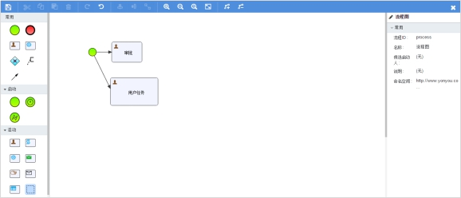

图 3：改变元素大小位置图


##### 1.4.1.4.2. 连接元素

点击元素，在元素的周边会出现常用元素的浮动图标，点击图标就会添加元素并自动连上线，如下图：

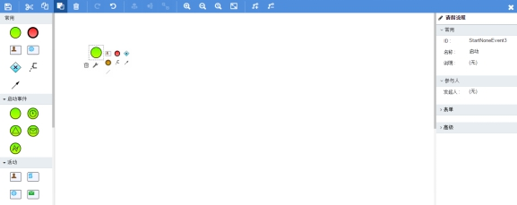

图 4：点击元素效果图


点击用户任务元素后的效果图：

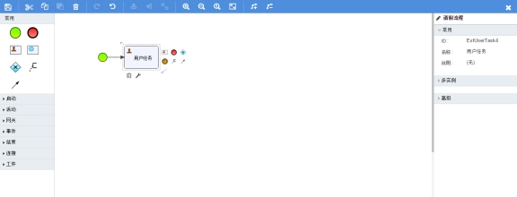

图1： 点击用户任务元素效果图

也可从元素区拖动元素和连接线，手动连接两个元素。

元素连接后，拖动元素时，连接线会自动改变形状，如果不理想，还可手动调整连接线的形状。

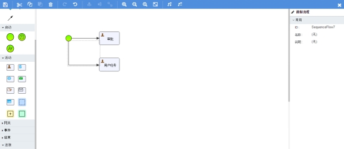

图2： 调整连接线的形状图


##### 1.4.1.4.3. 设置属性

不选中元素时，可设置流程模型的ID，名称，说明和命名空间等。

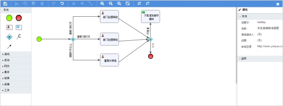

图3： 流程模型属性设计图

选中元素时，在属性区设置元素的ID，名称，说明等属性。元素的名称要简明，并能出直观的反映元素的功能。

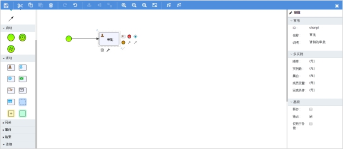

图4： 属性设计图


##### 1.4.1.4.4. 请假的流程图例

下面定义一个简单的请假流程例子。

根据请假的天数，有不同权限的人员审核，业务规则是：

请假1到2天，由项目经理审批，

请假3到5天，由部门经理审批，

请假5天以上，由董事长审批。

不批准时，通过邮件通知申请人。

要用到启动、顺序流、独占网关、用户任务、邮件任务、结束，最终的流程图如下:

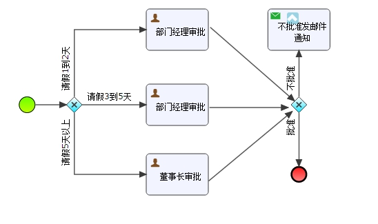

图 5：请假流程图

步骤一：拖动启动元素到中央设计区，点击图标周边的独占网关图标。

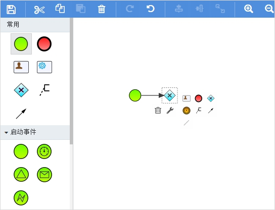

图 6：启动和网关示意图

步骤二：点击独占网关周边的用户任务图标，点出三个任务图标。

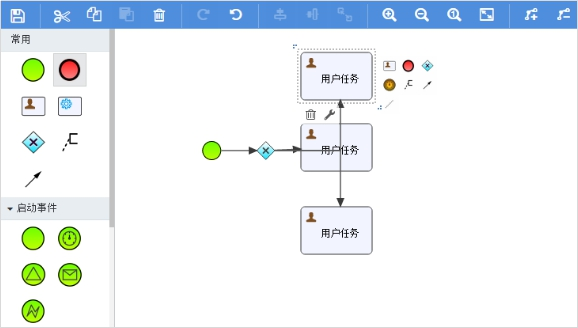

图 7：任务示意图

步骤三：调整顺序流线，用功能区的垂直对齐功能使三个用户任务对齐。


图 8：调整连接线图

步骤四：根据业务给顺序流线设上流转条件、改用户任务的名称属性。

点击下图右边属性里的条件框，弹出顺序流条件对话框。

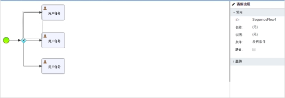

图 9：顺序流的属性图

顺序流条件对话框中输入流程运行时的判断条件，请假天数变量为holidayDays，则表达式为：${holidayDays > 1 && holidayDays <= 2}。

同理，在顺序流的名称框里输入“请假1到2天"。

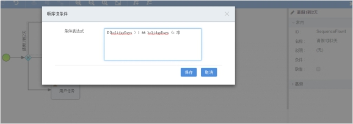

图 10：顺序流条件对话框

结果如下：

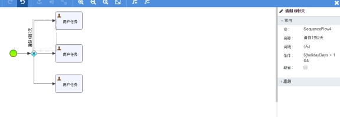

图5： 输入名称和设置网关的流转条件

设置剩余顺序流和用户任务的名称和流转条件。


图 11：输入名称和设置网关的流转条件图

步骤五：添加邮件任务、结束元素，并用顺序流把它们连接起来。

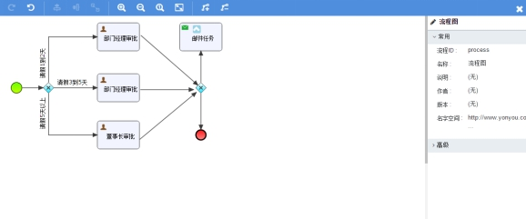

图 12：添加邮件任务和结束图

步骤六：设置顺序流的名称和批准的流转条件，设置邮件任务的名称和邮件属性。

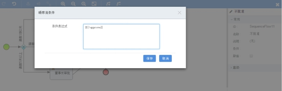

图 13：不批准的流转条件图

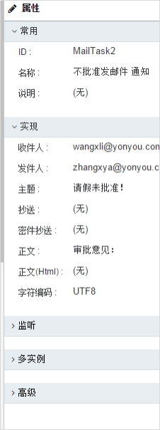

图 14：邮件属性设置图

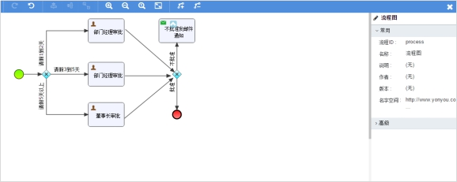

图 15：最终的请假流程图

步骤七：保存请假流程图，可以在描述框里追加描述。点保存并关闭设计器后，回到流程一览画面。

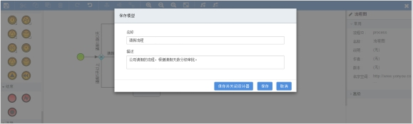

图 16：保存请假流程图


### 1.4.2. 元素说明

#### 1.4.2.1. 启动事件类

##### 1.4.2.1.1. 启动事件

1、描述

不指定启动流程实例的触发条件。

2、图形标志


3、属性说明

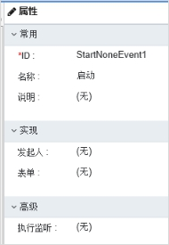

图 17


<table>
   <tr>
      <td>
         属性分类
      </td>
      <td>
         属性
      </td>
      <td>
         描述
      </td>
   </tr>
   <tr>
      <td rowspan=3>
         常用
      </td>
      <td>
         ID
      </td>
      <td>
         元素的唯一标识
      </td>
   </tr>
   <tr>
      <td>
         名称
      </td>
      <td>
         元素的名称
      </td>
   </tr>
   <tr>
      <td>
         说明
      </td>
      <td>
         对元素的说明
      </td>
   </tr>
   <tr>
      <td rowspan=2>
         实现
      </td>
      <td>
         发起人
      </td>
      <td>
         可以用来记录启动流程的人的ID（或人的名称），启动流程之后此属性指定的变量会自动设置当前人的名称
      </td>
   </tr>
   <tr>
      <td>
         表单
      </td>
      <td>
         填写外接表单的表单ID，指定事件关联的表单文件。
      </td>
   </tr>
   <tr>
      <td>
         高级
      </td>
      <td>
         执行监听
      </td>
      <td>
         为事件配置执行监听器,事件包括开始事件、结束事件
      </td>
   </tr>
</table>


表3： 启动事件的属性说明图

##### 1.4.2.1.2. 定时启动事件

1、描述

按照设定的时间启动流程实例。

2、图形标志


3、属性说明

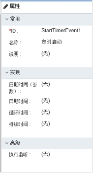

图 18
<table>
   <tr>
      <td>
         属性分类
      </td>
      <td>
         属性
      </td>
      <td>
         描述
      </td>
   </tr>
   <tr>
      <td rowspan=3>
         常用
      </td>
      <td>
         ID
      </td>
      <td>
         元素的唯一标识
      </td>
   </tr>
   <tr>
      <td>
         名称
      </td>
      <td>
         元素的名称
      </td>
   </tr>
   <tr>
      <td>
         说明
      </td>
      <td>
         对元素的说明
      </td>
   </tr>
   <tr>
      <td rowspan=3>
         实现
      </td>
      <td>
         循环时间
      </td>
      <td>
         周期性启动任务，用来设定循环的时间间隔，表示多长时间执行一次循环，用ISO-8601格式设定。 例如:R3/PT10H，循环3次以上，每次间隔10小时。
      </td>
   </tr>
   <tr>
      <td>
         日期时间
      </td>
      <td>
         一次性定时启动，具体到日期，用ISO-8601格式设定例如：2015-12-12T20:30:16在2015年12月12日晚上8点30分16秒时执行。
      </td>
   </tr>

   <tr>
      <td>
         持续时间
      </td>
      <td>
         设置多长时间之后启动流程，用ISO-8601格式设定。例如:PT5M，部署流程或输出流的上一个任务完成10分钟之后启动流程
      </td>
   </tr>
   <tr>
      <td>
         监听
      </td>
      <td>
         执行监听
      </td>
      <td>
         通过配置执行监听器的方式监听各种事件，并可以执行JAVA代码或表达式,事件包括开始事件、结束事件。
      </td>
   </tr>
</table>

表4： 定时启动事件的属性说明图

##### 1.4.2.1.3. 错误启动事件

1、描述

错误开始事件可以用来触发一个事件子流程，错误开始事件不能用来启动流程实例。

2、图形标志

 

3、属性说明


图 19


<table>
   <tr>
      <td>
         属性分类
      </td>
      <td>
         属性
      </td>
      <td>
         描述
      </td>
   </tr>
   <tr>
      <td rowspan=3>
         常用 
      </td>
      <td>
         ID
      </td>
      <td>
         元素的唯一标识
      </td>
   </tr>
   <tr>
      <td>
         名称 
      </td>
      <td>
         元素的名称
      </td>
   </tr>
   <tr>
      <td>
         说明
      </td>
      <td>
          对元素的说明
      </td>
   </tr>
   <tr>
      <td>
         错误 
      </td>
      <td>
         错误码
      </td>
      <td>
          错误ID，其他错误时间处理器通过该引用捕获这个错误。
      </td>
   </tr>
   <tr>
      <td>
         高级 
      </td>
      <td>
         执行监听  
      </td>
      <td>
         通过配置执行监听器的方式监听各种事件，并可以执行JAVA代码或表达式,事件包括开始事件、结束事件。
      </td>
   </tr>
</table>
表5： 错误启动事件的属性说明图

#### 1.4.2.2.活动类


##### 1.4.2.2.1. 用户任务

1、描述

用户任务用来设置必须由人员完成的工作。当流程执行到用户任务，会创建一个新任务，并把这个新任务加入到分配人或群组的任务列表中。

2、图形标志

 

3、属性说明

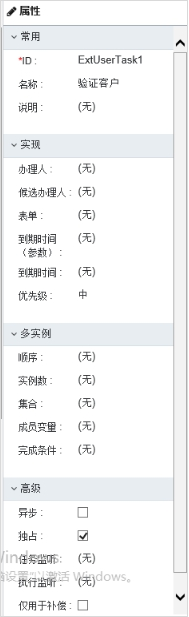

图 20


<table>
   <tr>
      <td>
         属性分类
      </td>
      <td>
         属性
      </td>
      <td>
         描述
      </td>
   </tr>
   <tr>
      <td rowspan=3>
         常用
      </td>
      <td>
         ID
      </td>
      <td>
         元素的唯一标识
      </td>
   </tr>
   <tr>
      <td>
         名称
      </td>
      <td>
         元素的名称
      </td>
   </tr>
   <tr>
      <td>
         说明
      </td>
      <td>
         对元素的说明
      </td>
   </tr>
   <tr>
      <td rowspan=5>
         实现
      </td>
      <td>
         办理人
      </td>
      <td>
         把任务分配给一个办理人
      </td>
   </tr>
   <tr>
      <td>
         候选办理人
      </td>
      <td>
         把任务分配给多个候选人
      </td>
   </tr>
   <tr>
      <td>
         表单
      </td>
      <td>
         设置外接表单的ID
      </td>
   </tr>
   <tr>
      <td>
         到期时间
      </td>
      <td>
         设置任务到期时间，可以是具体日期也可以是变量值，用ISO-8601格式设定。
      </td>
   </tr>
   <tr>
      <td>
         优先级
      </td>
      <td>
         设置优先级，可以是具体的值也可以是变量值
      </td>
   </tr>
   <tr>
      <td rowspan=5>
         多实例
      </td>
      <td>
         顺序
      </td>
      <td>
         实例执行顺序。选择是，顺序执行实例，顺序执行是指一个任务完成后才会产生下一个任务实例；选择否，并行执行实例，并行执行时会一次性产生实例数个实例。
      </td>
   </tr>
   <tr>
      <td>
         实例数
      </td>
      <td>
         创建任务实例的数量，可以是动态计算的表达式，也可以是固定值
      </td>
   </tr>
   <tr>
      <td>
         集合
      </td>
      <td>
         设置集合
      </td>
   </tr>
   <tr>
      <td>
         成员变量
      </td>
      <td>
         设置成员变量
      </td>
   </tr>
   <tr>
      <td>
         完成条件
      </td>
      <td>
         设置结束条件，当条件表达式值为true时结束该任务
      </td>
   </tr>
   <tr>
      <td rowspan=5>
         高级
      </td>
      <td>
         异步
      </td>
      <td>
         是否异步执行，选择异步，在流程启动之后，会为任务创建一个作业记录，用于记录异步作业的到期时间。 
      </td>
   </tr>
   <tr>
      <td>
         独占
      </td>
      <td>
         设置是否独占执行，选择独占，同一个流程实例在同一时刻只能执行一个任务，避免多任务同时执行导致事务问题。
      </td>
   </tr>
   <tr>
      <td>
         任务监听
      </td>
      <td>
         设置任务监听器，通过配置任务监听器的方式监听各种事件，并可以执行JAVA代码或表达式,,事件包括创建事件、分配事件、完成事件、删除事件
      </td>
   </tr>
   <tr>
      <td>
         执行监听
      </td>
      <td>
         设置执行监听
      </td>
   </tr>
   <tr>
      <td>
         仅用于补偿
      </td>
      <td>
         选择为“是"时，如果是边界补偿事件输出流到此用户任务上，到补偿时则执行用户任务，如果不是补偿则不执行该用户任务
      </td>
   </tr>
</table>

表6： 用户任务的属性说明图

##### 1.4.2.2.2. 审批任务

1、描述

审批任务用来设置必须由多人或多部门的人同时完成的工作。当执行到审批任务时，根据审批模式的不同产生审批任务。审批任务可以分配到不同部门中的不同人，不同角色，不同机构下所对应的人。

2、图形标志

 

3、属性说明

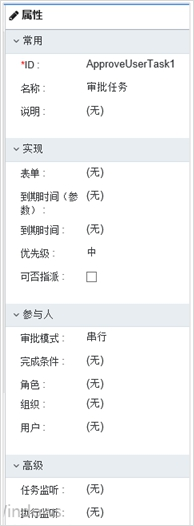

图 21


<table>
   <tr>
      <td>
         属性分类
      </td>
      <td>
         属性
      </td>
      <td>
         描述
      </td>
   </tr>
   <tr>
      <td rowspan=3>
         常用
      </td>
      <td>
         ID
      </td>
      <td>
         元素的唯一标识
      </td>
   </tr>
   <tr>
      <td>
         名称
      </td>
      <td>
         元素的名称
      </td>
   </tr>
   <tr>
      <td>
         说明
      </td>
      <td>
         对元素的说明
      </td>
   </tr>
   <tr>
      <td rowspan=5>
         实现
      </td>
      <td>
         表单
      </td>
      <td>
         设置外接表单的ID
      </td>
   </tr>
   <tr>
      <td>
         到期时间(参数)
      </td>
      <td>
         设置任务到期时间，到期时间变量值。
      </td>
   </tr>
   <tr>
      <td>
         到期时间
      </td>
      <td>
         设置任务到期时间，具体的到期时间，用ISO-8601格式设定。
      </td>
   </tr>
   <tr>
      <td>
         优先级
      </td>
      <td>
         设置优先级，可以是具体的值也可以是变量值
      </td>
   </tr>
   <tr>
      <td>
         可否指派
      </td>
      <td>
         在为执行该审批任务之前可以对该审批任务的审批人进行动态指定。
      </td>
   </tr>
   <tr>
      <td rowspan=5>
         参与人
      </td>
      <td>
         审批模式
      </td>
      <td>
         审批模式是多人审批时采用哪种方式去审批任务，有串行、并行、会签、抢占四种模式。串行模式：任务审批按人一步步审批，一个人审批完成产生第二个人的审批任务，以此类推，知道所有人都审批完成。并行模式：多个人的审批任务同时进行。抢占模式：审批任务执行后会产生指定所有人的审批任务，其中一个人的审批过后，审批任务结束。会签模式：审批任务执行后会产生指定所有人的审批任务，必须所有人都审批过后审批任务结束。
      </td>
   </tr>
   <tr>
      <td>
         完成条件
      </td>
      <td>
         设置审批人处理审批任务的数量所占的比例作为审批任务完成的条件
      </td>
   </tr>
   <tr>
      <td>
         人员
      </td>
      <td>
         把任务分配给需要审批的审批人，选取为多个。
      </td>
   </tr>
   <tr>
      <td>
         角色
      </td>
      <td>
         把审批人任务分配给指定角色下的人员审批
      </td>
   </tr>
   <tr>
      <td>
         机构
      </td>
      <td>
         把审批人任务分配给指定机构下的人员审批
      </td>
   </tr>
   <tr>
      <td rowspan=5>
         多实例
      </td>
      <td>
         顺序
      </td>
      <td>
         实例执行顺序。选择是，顺序执行实例，顺序执行是指一个任务完成后才会产生下一个任务实例；选择否，并行执行实例，并行执行时会一次性产生实例数个实例。
      </td>
   </tr>
   <tr>
      <td>
         实例数
      </td>
      <td>
         创建任务实例的数量，可以是动态计算的表达式，也可以是固定值
      </td>
   </tr>
   <tr>
      <td>
         集合
      </td>
      <td>
         设置集合
      </td>
   </tr>
   <tr>
      <td>
         成员变量
      </td>
      <td>
         设置成员变量
      </td>
   </tr>
   <tr>
      <td>
         完成条件
      </td>
      <td>
         设置结束条件，当条件表达式值为true时结束该任务
      </td>
   </tr>
   <tr>
      <td rowspan=2>
         高级
      </td>
      <td>
         任务监听
      </td>
      <td>
         设置任务监听器，通过配置任务监听器的方式监听各种事件，并可以执行JAVA代码或表达式,,事件包括创建事件、分配事件、完成事件、删除事件
      </td>
   </tr>
   <tr>
      <td>
         执行监听
      </td>
      <td>
         设置执行监听
      </td>
   </tr>
</table>


表7： 用户任务的属性说明图


##### 1.4.2.2.3. 脚本任务

1、描述

脚本任务时一个自动节点。当流程到达脚本任务，会执行对应的脚本。

2、图形标志

 

3、属性说明

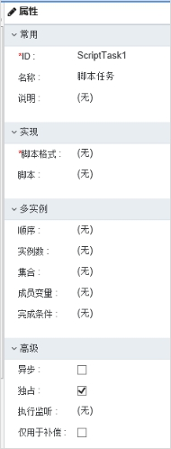

图 22


<table >
   <tr>
      <td>
         属性分 类
      </td>
      <td>
         属性
      </td>
      <td>
         描述
      </td>
   </tr>
   <tr>
      <td rowspan=3>
         常用
      </td>
      <td>
         ID
      </td>
      <td>
         元素的唯一标识
      </td>
   </tr>
   <tr>
      <td>
         名称
      </td>
      <td>
         元素的名称
      </td>
   </tr>
   <tr>
      <td>
         说明
      </td>
      <td>
         对元素的说明
      </td>
   </tr>
   <tr >
      <td rowspan=2>
         实现
      </td>
      <td>
         脚本格式
      </td>
      <td>
         选择脚本格式，目前支持javascript和groovy
      </td>
   </tr>
   <tr>
      <td>
         脚本
      </td>
      <td>
         输入脚本
      </td>
   </tr>
   <tr >
      <td rowspan=5>
         多实例
      </td>
      <td>
         顺序
      </td>
      <td>
         是否按顺序执行
      </td>
   </tr>
   <tr>
      <td>
         实例数
      </td>
      <td>
         可以是动态计算的表达式，也可以是固定值
      </td>
   </tr>
   <tr>
      <td>
         集合
      </td>
      <td>
         设置集合
      </td>
   </tr>
   <tr>
      <td>
         变量
      </td>
      <td>
         设置任务变量
      </td>
   </tr>
   <tr>
      <td>
         完成条件
      </td>
      <td>
         脚本任务的完成条件
      </td>
   </tr>
   <tr >
      <td rowspan=4>
         高级
      </td>
      <td>
         异步
      </td>
      <td>
         是否异步
      </td>
   </tr>
   <tr>
      <td>
         独占
      </td>
      <td>
         是否独占执行
      </td>
   </tr>
   <tr>
      <td>
         执行监听
      </td>
      <td>
         为任事件配置监听器,事件包括开始事件、结束事件
      </td>
   </tr>
   <tr>
      <td>
         是否补偿
      </td>
      <td>
         选择为“是"时，如果是边界补偿事件输出流到此用户任务上，到补偿时则执行用户任务，如果不是补偿则不执行该用户任务
      </td>
   </tr>
</table>


表8： 脚本任务的属性说明图

##### 1.4.2.2.4. 服务任务

1、描述

java服务任务用来调用外部java类。

2、图形标志

 

3、属性说明

属性中的多实例和高级属性和监听后面的不再描述，参见用户任务中的描述。

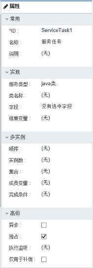

图 23

<table>
   <tr>
      <td>
         属性分类
      </td>
      <td>
         属性
      </td>
      <td>
         描述
      </td>
   </tr>
   <tr>
      <td rowspan=3>
         常用
      </td>
      <td>
         ID
      </td>
      <td>
         元素的唯一标识
      </td>
   </tr>
   <tr>
      <td>
         名称
      </td>
      <td>
         元素的名称
      </td>
   </tr>
   <tr>
      <td>
         说明
      </td>
      <td>
         对元素的说明
      </td>
   </tr>
   <tr>
      <td rowspan=6>
         实现
      </td>
      <td>
         服务类型
      </td>
      <td>
         类型包括：Java类，表达式，委托表达式，WebService
      </td>
   </tr>
   <tr>
      <td>
         类名称
      </td>
      <td>
         系统可以通过该类名对该类进行调用
      </td>
   </tr>
   <tr>
      <td>
         表达式
      </td>
      <td>
         可以通过该表达式调用某个对象
      </td>
   </tr>
   <tr>
      <td>
         委托表达式
      </td>
      <td>
         定义委托表达式
      </td>
   </tr>
   <tr>
      <td>
         字段
      </td>
      <td>
         表达式的参数
      </td>
   </tr>
   <tr>
      <td>
         结果变量
      </td>
      <td>
         设置结果变量信息
      </td>
   </tr>
</table>

表9： 服务任务的属性说明图

##### 1.4.2.2.5. 邮件任务

1、描述

支持了自动邮件任务，它可以发送邮件给一个或多个参与者。

2、图形标志

 

3、属性说明

属性中的多实例和高级属性和监听后面的不再描述，参见用户任务中的描述。

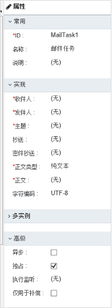

图 24


<table>
   <tr>
      <td>
         属性分类
      </td>
      <td>
         属性
      </td>
      <td>
         描述
      </td>
   </tr>
   <tr>
      <td rowspan=3>
         常用
      </td>
      <td>
         ID
      </td>
      <td>
         元素的唯一标识
      </td>
   </tr>
   <tr>
      <td>
         名称
      </td>
      <td>
         元素的名称
      </td>
   </tr>
   <tr>
      <td>
         说明
      </td>
      <td>
         对元素的说明
      </td>
   </tr>
   <tr>
      <td rowspan=8>
         邮件
      </td>
      <td>
         收件人
      </td>
      <td>
         设置收件人，多个收件人之间用逗号分隔
      </td>
   </tr>
   <tr>
      <td>
         发件人
      </td>
      <td>
         设置邮件的发件人。如果邮件服务器配置中配置了默认的发件人，这里可以不设置。
      </td>
   </tr>
   <tr>
      <td>
         主题
      </td>
      <td>
         邮件的主题
      </td>
   </tr>
   <tr>
      <td>
         抄送
      </td>
      <td>
         设置邮件要抄送给的人员，多人时逗号分隔。
      </td>
   </tr>
   <tr>
      <td>
         密件抄送
      </td>
      <td>
         设置密件抄送给的人
      </td>
   </tr>
   <tr>
      <td>
         正文
      </td>
      <td>
         邮件的内容，在需要使用原始文字（非富文本）的邮件时使用。 可以与html一起使用，对于不支持富客户端的邮件客户端。 客户端会降级到仅显示文本的方式
      </td>
   </tr>
   <tr>
      <td>
         正文(Html)
      </td>
      <td>
         以Html格式展示的邮件正文形式，支持表达式
      </td>
   </tr>
   <tr>
      <td>
         字符编码
      </td>
      <td>
         设置邮件的字符编码方式，比如UTF8
      </td>
   </tr>
</table>
表10： 邮件任务的属性说明图

##### 1.4.2.2.6. 手工任务

1、描述

表示工作需要某人完成，而引擎不需要知道，也没有对应的系统和UI接口。

2、图形标志

 

3、属性说明

属性中的多实例和高级属性和监听后面的不再描述，参见用户任务中的描述。

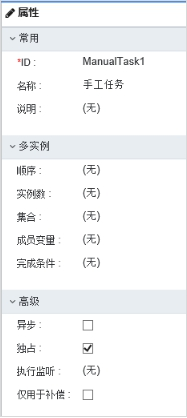

图 25

##### 1.4.2.2.7. 接收任务

1、描述

接收任务是一个简单任务，它会等待对应消息的到达。当前，我们只实现了这个任务的java语义。 当流程达到接收任务，流程状态会保存到存储里。 意味着流程会等待在这个等待状态， 直到引擎接收了一个特定的消息， 这会触发流程穿过接收任务继续执行。

2、图形标志

 

3、属性说明

属性中的多实例和高级属性和监听后面的不再描述，参见用户任务中的描述。

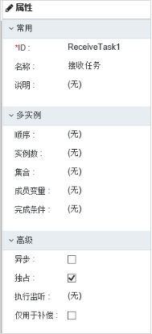

图 26

##### 1.4.2.2.8. 业务规则任务

1、描述

业务规则用户用来同步执行一个或多个规则。

2、图形标志

 

3、属性说明

属性中的多实例和高级属性和监听后面的不再描述，参见用户任务中的描述。


图 27


<table>
   <tr>
      <td>
         属性分类
      </td>
      <td>
         属性
      </td>
      <td>
         描述
      </td>
   </tr>
   <tr>
      <td rowspan=4>
         实现
      </td>
      <td>
         规则
      </td>
      <td>
         在规则文件.drl中定义的规则名称，多个规则用逗号分隔。
      </td>
   </tr>
   <tr>
      <td>
         传入变量
      </td>
      <td>
         业务规则执行需要的数据源，使用${fooVar}方式定义，多个规则用逗号分隔
      </td>
   </tr>
   <tr>
      <td>
         排除
      </td>
      <td>
         用于设置是否排除某些规则，如选择，则忽略activiti:rules指定的规则。
      </td>
   </tr>
   <tr>
      <td>
         结果变量
      </td>
      <td>
         规则执行结果变量，变量的值为ruleVariablesInput定义的变量集合
      </td>
   </tr>
</table>


表11： 业务规则任务的属性说明图

##### 1.4.2.2.9. 调用活动

1、描述

调用节点引用流程定义外部的一个流程。

2、图形标志

 

3、属性说明

属性中的多实例和高级属性和监听后面的不再描述，参见用户任务中的描述。

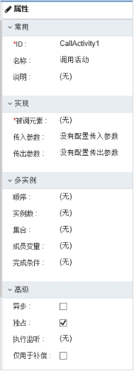

图 28


<table>
   <tr>
      <td>
         属性分类
      </td>
      <td>
         属性
      </td>
      <td>
         描述
      </td>
   </tr>
   <tr>
      <td rowspan=3>
         调用
      </td>
      <td>
         被调元素
      </td>
      <td>
         被调用的流程ID
      </td>
   </tr>
   <tr>
      <td>
         传入参数
      </td>
      <td>
         调用外部流程时传入的变量
      </td>
   </tr>
   <tr>
      <td>
         传出参数
      </td>
      <td>
         调用活动执行完成后的结果
      </td>
   </tr>
</table>


表12： 调用活动的属性说明图

##### 1.4.2.2.10. 子流程

1、描述

是一个包含其他节点，网关，事件等等的节点。它自己就是一个流程，同时是更大流程的一部分。子流程是完全定义在父流程里的。

2、图形标志

 

3、属性说明

属性中的多实例和高级属性和监听后面的不再描述，参见用户任务中的描述。

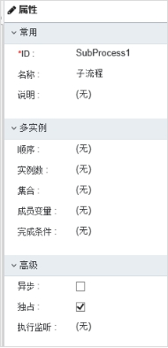

图 29

##### 1.4.2.2.11. 事件子流程

1、描述

由事件触发的子流程。

2、图形标志

 

3、属性说明

属性中的多实例和高级属性和监听后面的不再描述，参见用户任务中的描述。

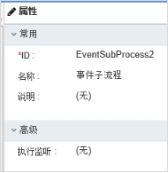

图 30

#### 1.4.2.3. 网关类

##### 1.4.2.3.1. 独占网关

1、描述

当流程执行到这个网关，所有外出顺序流都会被处理一遍。其中条件解析为true的顺序流（或者没有设置条件，概念上在顺序流上定义了一个'true'） 会被选中，让流程继续运行。

2、图形标志

 

3、属性说明

属性中的常用和监听后面的不再描述，参见用户任务中的描述。

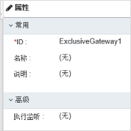

图 31

##### 1.4.2.3.2. 并行网关

1、描述

将流程分成多条分支，也可以把多条分支汇聚到一起。

2、图形标志

 

3、属性说明

属性中的常用和监听后面的不再描述，参见用户任务中的描述。属性见下图：

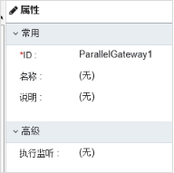

图 32

##### 1.4.2.3.3. 包含网关

1、描述

是独占网关和并行网关的结合体。和独占网关一样，可以在外出顺序流上定义条件，包含网关会解析它们。但是主要的区别是包含网关可以选择多于一条顺序流，这和并行网关一样。

2、图形标志

 

3、属性说明

属性中的常用和监听后面的不再描述，参见用户任务中的描述。属性见下图：

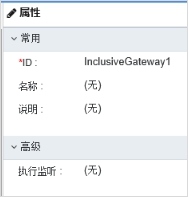

图 33

##### 1.4.2.3.4. 事件网关

1、描述

据事件判断流向。网关的每个外出顺序流都要连接到一个中间捕获事件。当流程到达一个基于事件网关，网关会进入等待状态：会暂停执行。与此同时，会为每个外出顺序流创建相对的事件订阅。

2、图形标志

 

3、属性说明

属性中的常用和监听后面的不再描述，参见用户任务中的描述。属性见下图：

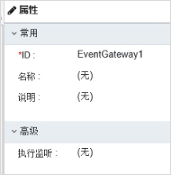

图 34


#### 1.4.2.4. 事件类

##### 1.4.2.4.1. 定时边界事件

1、描述

一个暂停等待警告的时钟。当流程执行到绑定了边界事件的环节，会启动一个定时器。当定时器触发时（比如，一定时间之后），环节就会中断，并沿着定时边界事件的外出连线继续执行。

2、图形标志

 

3、属性说明

属性中的常用，实现和监听后面的不再描述，参见定时启动事件中的描述。属性见下图：

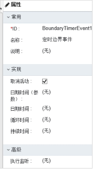

图 35

##### 1.4.2.4.2. 错误边界事件

1、描述

定义一个边界错误事件，大多用于内嵌子流程，或调用节点，对于子流程的情况，它会为所有内部的节点创建一个作用范围。错误是由错误结束事件抛出的。这个错误会传递给上层作用域，直到找到一个错误事件定义向匹配的边界错误事件。

2、图形标志

 

3、属性说明

属性中的常用，实现和监听后面的不再描述，参见错误启动事件中的描述。属性见下图：

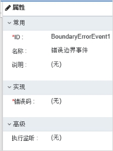

图 36

##### 1.4.2.4.3. 信号边界事件

1、描述

节点边界的中间捕获信号，或简称为边界信号事件，它会捕获信号定义引用的相同信号名的信号。

2、图形标志

 

3、属性说明

属性中的常用和监听后面的不再描述，参见用户任务中的描述。属性见下图：

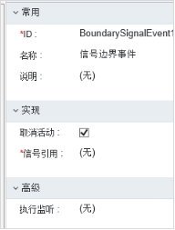

图 37

<table>
   <tr>
      <td>
         属性分类
      </td>
      <td>
         属性
      </td>
      <td>
         描述
      </td>
   </tr>
   <tr>
      <td rowspan=2>
         实现
      </td>
      <td>
         取消活动
      </td>
      <td>
         设置常用属性中的取消为未勾中状态，则运行时自动根据定时器输出流产生新任务，但不会自动完成附属任务的任务，附属任务依然可以继续办理；设置常用属性中的取消为勾中状态，运行时自动完成附属任务的任务的同时根据定时器输出流产生新的任务。
      </td>
   </tr>
   <tr>
      <td>
         信号引用
      </td>
      <td>
         设置引用的信号
      </td>
   </tr>
</table>

表13： 信号边界事件的属性说明图

##### 1.4.2.4.4. 消息边界事件

1、描述

捕获信号定义引用的相同信号名的信号。

2、图形标志

 

3、属性说明

属性中的常用和监听后面的不再描述，参见信号边界事件中的描述。属性见下图：

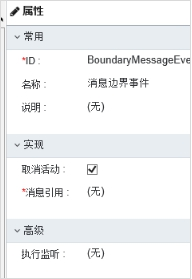

图 38

##### 1.4.2.4.5. 补偿边界事件

1、描述

在节点的边界捕获补偿，用来设置一个节点的补偿处理器。

2、图形标志

 

3、属性说明

属性中的常用和监听后面的不再描述，参见信号边界事件中的描述。属性见下图：

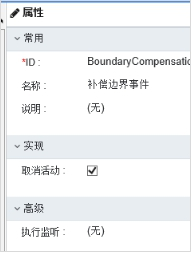

图 39


##### 1.4.2.4.6. 定时中间事件（捕获）

1、描述

定时中间事件作为一个监听器。当执行到达捕获事件节点，就会启动一个定时器。当定时器触发（比如，一段时间之后），流程就会沿着定时中间事件的外出节点继续执行。

2、图形标志

 

3、属性说明

属性中的常用，实现和监听后面的不再描述，参见定时启动事件中的描述。属性见下图：

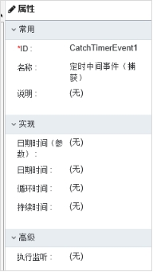

图 40

##### 1.4.2.4.7. 信号中间事件（捕获）

1、描述

中间捕获信号事件通过引用信号定义来捕获相同信号名称的信号。

2、图形标志

 

3、属性说明

属性中的常用和监听后面的不再描述，参见信号边界事件中的描述。属性见下图：


图 41

##### 1.4.2.4.8. 消息中间事件（捕获）

1、描述

一个中间捕获消息事件，捕获特定名称的消息。

2、图形标志

 

3、属性说明

属性中的常用和监听后面的不再描述，参见消息边界事件中的描述。属性见下图：

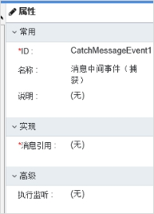

图 42

##### 1.4.2.4.9. 信号中间事件（抛掷）

1、描述

中间触发信号事件为定义的信号抛出一个信号事件。

2、图形标志

 

3、属性说明

属性中的常用和监听后面的不再描述，参见信号边界事件中的描述。属性见下图：

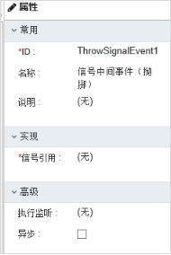

图 43

##### 1.4.2.4.10. 中间事件（抛掷）

1、描述

中间抛掷事件主要用于二次开发抛掷信息。

2、图形标志

 

3、属性说明

属性中的常用和监听后面的不再描述，参见用户任务中的描述。属性见下图：


图 44

##### 1.4.2.4.11. 补偿中间事件（抛掷）

1、描述

中间触发补偿事件可以用来触发补偿。

2、图形标志

 

3、属性说明

属性中的常用和监听后面的不再描述，参见用户任务中的描述。属性见下图：

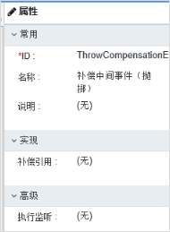

图 45

| 属性分类 | 属性 | 描述 |
| --- | --- | --- |
| 实现 | 补偿引用 | 补偿内嵌子流程 |

表14： 补偿中间事件(抛掷)的属性说明图

#### 1.4.2.5. 结束类

##### 1.4.2.5.1结束

1、描述

表示（子）流程（分支）的结束。

2、图形标志

 

3、属性说明

属性中的常用和监听后面的不再描述，参见用户任务中的描述。属性见下图：

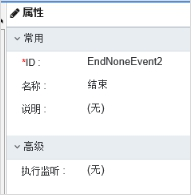

图 46

##### 1.4.2.5.2错误结束

1、描述

当流程执行到错误结束事件，流程的当前分支就会结束，并抛出一个错误。

2、图形标志

 

3、属性说明

属性中的常用和监听后面的不再描述，参见错误启动事件中的描述。属性见下图：


图 47

##### 1.4.2.5.3终止结束

1、描述

当到达终止结束事件时，会终止当前整个流程实例。当存在多分支时，某分支上有终止结束，当任务流转到该节点，不管其他分支是否办理完成都会结束整个流程实例。

2、图形标志

 

3、属性说明

属性中的常用和监听后面的不再描述，参见用户任务中的描述。属性见下图：

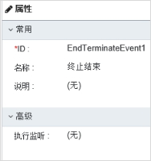

图 48


#### 1.4.2.6. 连接类

##### 1.4.2.6.1顺序流

1、描述

顺序流程是连接两个流程节点的连线。流程执行完一个节点后，会沿着节点的所有外出顺序流继续执行。

2、图形标志

 

3、属性说明

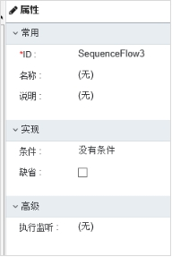

图 49


<table>
   <tr>
      <td>
         属性分类
      </td>
      <td>
         属性
      </td>
      <td>
         描述
      </td>
   </tr>
   <tr>
      <td rowspan=2>
         实现
      </td>
      <td>
         条件
      </td>
      <td>
         定义条件表达式，只有满足条件才能通过顺序流到达目标活动。 表达式的写法：${aaa==1},其中aaa是变量。
      </td>
   </tr>
   <tr>
      <td>
         缺省
      </td>
      <td>
         设置默认顺序流，只有在节点的其他外出顺序流不能被选中是，才会使用它作为外出顺序流继续执行。注意条件和缺省设置互斥。
      </td>
   </tr>
</table>

表15： 顺序流程的属性说明图

##### 1.4.2.6.2关联

1、描述

在图元之间建立关联。比如连接注释图元到活动图元。

2、图形标志

 

3、属性说明

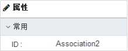

图 50


#### 1.4.2.7. 工件类

##### 1.4.2.7.1注释

1、描述

对流程中的元素增加文字注释。

2、图形标志


3、属性说明

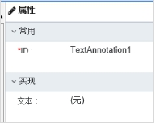

图 51

| 属性分类 | 属性 | 描述 |
| --- | --- | --- |
| 常用 | ID | 元素唯一标识 |
| 实现 | 文本 | 注释内容 |


## 1.5. 流程开发指南

### 1.5.1设置业务模型

业务模型数据结构详见章节1.2。

步骤1：插入业务模型数据，脚本示例如下：

``` sql
INSERT INTO `iuap_bpm_buzimodel` (`id`, `code`, `name`, `buzientity_id`, `msgtemplateclass_id`, `createtime`, `sysid`, `tenantid`) VALUES ('EBB007', 'shippingflow', '销售订单业务模型', 'BEI007', 'MTI002', '2018-06-11 09:04:36', 'iuap-eiap-bpm', 'tenant'); 
```

步骤2：插入业务实体数据，脚本示例如下：
``` sql
INSERT INTO `iuap_bpm_buzientity` (`id`, `model_id`, `formcode`, `formname`, `formdiscription`, `formurl`) VALUES ('BEI007', 'EBB007', 'shipping_form', '销售订单', '销售订单流程', '/ocm/pages/shipping/shipping.html'); 
```

步骤3：插入业务实体属性数据，脚本示例如下：
``` sql
 INSERT INTO `iuap_bpm_buzientityfield` (`id`, `buzientity_id`, `model_id`, `fieldcode`, `fieldname`, `fieldtype`, `typeoptions`, `defaultvalue`) VALUES ('F00009', 'BEI007', 'EBB007', 'ordertype', '订单类型', 'int', NULL, '0'); 
```

### 1.5.2创建业务单据

根据业务抽象业务单据，本示例以工单单据（SANY_ORDER）为例，数据结构如下：

| 字段 | 类型 | 描述 |
| --- | --- | --- |
| ID | VARCHAR2 | 主键 |
| ORDERCODE | VARCHAR2 | 订单号 |
| ORDERNAME | VARCHAR2 | 标题 |
| SUPPLIER | VARCHAR2 | 供应商 |
| SUPPLIERNAME | VARCHAR2 | 供应商名称 |
| TYPE | NUMBER | 单据类型 |
| PURCHASING | VARCHAR2 | 采购人 |
| PURCHASINGGROUP | VARCHAR2 | 采购组织 |
| VOUCHERDATE | VARCHAR2 | 支付日期 |
| APPROVALSTATE | NUMBER | 审批状态 |
| CONFIRMSTATE | NUMBER | 确认状态 |
| CLOSESTATE | NUMBER | 关闭状态 |
| REMARK | VARCHAR2 | 备注 |
| VERSION | NUMBER | 版本 |
| CREATE_TIME | VARCHAR2 | 创建时间 |
| CREATE_USER | VARCHAR2 | 创建人 |
| LAST_MODIFIED | VARCHAR2 | 最后修改时间 |
| LAST_MODIFY_USER | VARCHAR2 | 最后修改人 |
| TS | VARCHAR2 | 时间戳 |
| DR | NUMBER | 删除标识 |
| BPM_STATE | NUMBER | 流程状态 |
| BPM_TASK_KEY | VARCHAR2 | 流程业务Key |
| BPM_TASKID | VARCHAR2 | 流程任务ID |
| BPM_PROCESS_INSTANCE | VARCHAR2 | 流程实例 |
| BPM_PROCESS_DEFINE | VARCHAR2 | 流程定义 |
| ISPAYMENT | VARCHAR2 | 是否支付 |


注：BPM_STATE：审批状态，BPM_TASK_KEY：流程业务Key。

l 审批状态记录流程审批状态，状态值（0：未提交1：已提交 2：审批中 3：已办结 4：终止）

详见iuap-pap-baseservice包中com.yonyou.iuap.baseservice.bpm.utils.BpmExUtil类。业务也可自行定义。

l 业务key用来与流程关联，可通过业务key查询单据对应流程。

### 1.5.3流程定义设计

通过“流程模型"节点下“新增流程"功能，在线设计流程。

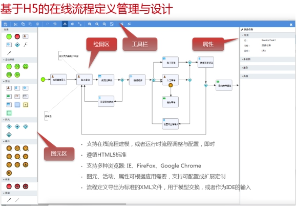

图 52

### 1.5.4提交流程

提交动作后，根据流程定义，流转单据。如有指派进行指派设置之后进行指派提交。

### 1.5.5监控流程

流程参与者和代理人以及流程监控人（流程定义时设定），可通过“流程监控"功能管理流程实例、查看流程历史。详情见流程监控。

## 1.6. 流程引擎

流程引擎：可提供根据参与者、条件等的不同决定信息传递路由、内容的解决方案的系统。

### 1.6.1流程定义

流程定义：描述一个完整的业务过程，有若干个活动组成。可通过流程设计器进行可视化设计，也可通过代码生成。

### 1.6.2流程实例

特指流程从开始到结束的最大执行分支。

### 1.6.3活动实例

按流程定义的规划执行一次的过程。

### 1.6.4任务

执行到任务环节时生成的任务信息。

### 1.6.5引擎核心

#### 1.6.5.1核心服务与接口

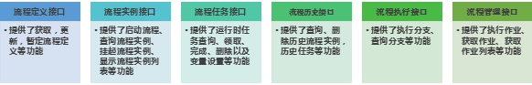


#### 1.6.5.2多语言的SDK和流程应用控件


#### 1.6.5.3完备的Rest API


图 53

# 第二章流程外围业务

## 2.1 流程管理

流程管理模块主要实现流程实例监控、任务管理、分组管理以及流程部署管理等功能。

### 2.1.1流程中心

#### 2.1.1.1流程模型

##### 2.1.1.1.1流程分组

流程分组根据业务分类、分级要求，实现流程分组以及分组所包含业务资源的分级管理。流程分组管理主要实现流程分组的增加、编辑、删除操作。选择管理中心应用“流程管理à目录"，进入“流程管理"操作主页面，页面以树形方式显示流程管理列表，如下图所示：


图 54

##### 2.1.1.1.2新增流程

1：进入应用平台管理中心，找到流程模型，点击进入流程模型管理界面。


图 55

2：点击上图所示“新增流程"，进入新增流程界面。


图 56

3：填写流程名称，选择业务模型（详见第一章业务模型章节），点击右上角“保存"按钮即可新增流程。


图 57

##### 2.1.1.1.3流程设计

1：调用流程设计器，设计、编辑流程图以及定义相关规则。选中流程分组中流程分组名称后，在流程列表中选择流程，点击【设计】图标，进入流程设计器页面，如下图所示：


图 58

2：弹出流程设计界面，进行流程设计。


图 59

##### 2.1.1.1.4流程部署

1：将流程部署到工作流引擎上。选中流程分组树中流程分组名称后，在流程列表中选择流程，点击【发布】图标，如流程部署成功显示部署成功提示，否则显示部署失败提示。


图 60

2：流程支持多版本管理，通过流程发布历史查看流程部署历史及版本信息。


图 61

#### 2.1.1.2流程监控

流程监控主要包括流程查看，流程管理，如挂起、恢复、终止等

• 快速查找、定位流程实例，以图形化方式展现流程实例执行情况及各流转节点详细信息

• 支持流程实例的挂起、恢复、终止操作

##### 2.1.1.2.1挂起

暂停正在执行的流程实例，保存流程实例挂起时状态。在流程实例列表中选择要挂起的流程实例状态为“运行"的流程实例，点击【挂起】图标，如挂起成功，系统提示成功，流程实例状态由“运行"变为“挂起"。

注：只能对流程实例状态为“运行"的实例执行挂起操作。


图 62

##### 2.1.1.2.2恢复

激活挂起的流程实例，恢复到挂起时的状态，并且继续执行。在流程实例列表中选择要挂起的流程实例状态为“挂起"的流程实例，点击【恢复】图标，如恢复成功，流程实例状态由“挂起"变为“运行"。

注：只能对流程实例状态为“挂起"的实例执行恢复操作


图 63

##### 2.1.1.2.3终止

终止流程实例继续执行，被终止的流程实例不能够再恢复。在流程实例列表中选择要挂起的流程实例状态为“挂起"或“运行"的流程实例，点击【终止】按钮，如终止成功，系统提示成功，流程实例状态由变为“终止"。


图 64


系统提供“已完成"、“未完成"两种分类快速选择，显示不同分类的流程实例。


图 65

##### 2.1.1.2.4查看实例详细情况

在流程实例列表中选择要查看的流程实例，点击流程实例名称，显示流程详细情况页面，如下所示：


图 66

以图形化方式展示流程实例执行过程以及流程实例的状态、流程流转情况、实例属性情况、异常情况；另外还通过列表方式展示流程活动详细情况。

## 2.2 流程组件

开源文档地址：[<u>https://www.npmjs.com/package/yyuap-bpm</u>](https://www.npmjs.com/package/yyuap-bpm)

### 2.2.1简介

基于tinper-bee组件库对iUap原有UUI流程业务组件流程部分进行封装React版本

总共包含8种组件，分别是：

| 序号 | 组件名称 | 备注 |
| --- | --- | --- |
| 1 | BpmFlowChart | 流程图 |
| 2 | BpmTable | 流程历史表格 |
| 3 | BpmTaskApproval | 流程审批面板 |
| 4 | BpmButtonSubmit | 流程提交按钮 |
| 5 | BpmButtonRecall | 流程收回按钮 |
| 6 | BpmWrap | 包含流程图和流程历史表格 |
| 7 | BpmTaskApprovalWrap | 流程整合审批面板 |
| 8 | BpmTestCheckTable | 测试任务中心表格组件 |

实际使用中不需要使用全部组件

### 2.2.2安装

· 通过npm下载使用 npm install yyuap-bpm -S

### 2.2.3\.使用

如果使用流程图相关组件那么导入:

import { BpmWrap } from 'yyuap-bpm';

然后在render使用的时候传入相应组件需要的参数即可：


 _//__提交流程按钮使用
``` html

<BpmButtonSubmit
className="ml5"

checkedArray={[{"id":"02a128d65c47405494f8f2baf087117e"}]}

funccode="react"

nodekey="003"

url={'/sany_order/submit'}

urlAssignSubmit={'/sany_order/assignSubmit'}

onSuccess={() => console.log('success')}

onError={(err) => console.log(err)}

onStart={() => console.log('start loading')}

onEnd={() => console.log('end loading')}

/>

```
 

_//__收回流程按钮使用_

 
``` html
<BpmButtonRecall

className="ml5"

checkedArray={[{“id":"02a128d65c47405494f8f2baf087117e"}]}

url={`/sany_order/recall`}

onSuccess={() => console.log(‘success’)}

onError={(err) => console.log(err)}

onStart={() => console.log(‘start loading’)}

onEnd={() => console.log(‘end loading’)}

/>
```
 

_//__流程审批面板使用_

 
``` html
<BpmTaskApprovalWrap

id={rowData.id}

onBpmFlowClick={() => console.log(‘这里是流程图按钮的事件，用于跳转到流程图组件页面’) }

appType={“1"}

onSuccess={() => console.log(‘success’)}

onError={(err) => console.log(err)}

onStart={() => console.log(‘start loading’)}

onEnd={() => console.log(‘end loading’)}

/>
```


### 2.2.4\. API

##### BpmFlowChart

| 序号 | 参数 | 类型 | 说明 |
| --- | --- | --- | --- |
| 1 | host | string | 请求流程图的接口前缀一般不需要设置默认走本地部署服务 |
| 2 | processDefinitionId | string | 流程图服务必备参数 |
| 3 | processInstanceId | string | 流程图服务必备参数 |
| 4 | width | string | 流程图宽度 |
| 5 | height | string | 流程图高度 |

##### BpmTable

| 序号 | 参数 | 类型 | 说明 |
| --- | --- | --- | --- |
| 1 | host | string | 请求流程图的接口前缀一般不需要设置默认走本地部署服务 |
| 2 | processDefinitionId | string | 流程图服务必备参数 |
| 3 | processInstanceId | string | 流程图服务必备参数 |

##### BpmTaskApproval

| 序号 | 参数 | 类型 | 说明 |
| --- | --- | --- | --- |
| 1 | host | string | 请求审批的接口前缀一般不需要设置默认走本地部署服务 |
| 2 | id | string | 审批的任务ID |
| 3 | appType | string | 审批面板类型1=待审批、2=弃审、3=无显示 |
| 4 | onStart | function | 调用异步服务回调，一般用于请求Loading处理 |
| 5 | onSuccess | function | 调用后端服务成功后的回调 |
| 6 | onError | function | 调用后端服务错误后的回调 |
| 7 | onEnd | function | 结束的回调Loading |


##### BpmButtonSubmit

| 序号 | 参数 | 类型 | 说明 |
| --- | --- | --- | --- |
| 1 | checkedArray | array | 传入的选中状态数组(流程单据前面的选择框数据) |
| 2 | text | string | 按钮的文本，默认提交 |
| 3 | funccode | string | 功能节点编码 |
| 4 | nodekey | string | nodekey |
| 5 | url | string | 提交流程所需要的地址，必须传入 |
| 6 | onSuccess | function | 提交流程业务成功后回调 |
| 7 | onError | function | 提交流程业务失败后回调{type:1,msg:"错误消息"}type=1代表逻辑错误，type=2代表服务器错误 |
| 8 | className | string | 传入class |
| 9 | onStart | function | 调用异步服务回调，一般用于请求Loading处理 |
| 10 | urlAssignSubmit | string | 流程指派最后提交的接口 |
| 11 | onEnd | function | 结束的回调Loading |

##### BpmButtonRecall

| 序号 | 参数 | 类型 | 说明 |
| --- | --- | --- | --- |
| 1 | checkedArray | array | 传入的选中状态数组(流程单据前面的选择框数据) |
| 2 | text | string | 按钮的文本，默认提交 |
| 3 | url | string | 提交流程所需要的地址，必须传入 |
| 4 | onSuccess | function | 提交流程业务成功后回调 |
| 5 | onError | function | 提交流程业务失败后回调{type:1,msg:"错误消息"}type=1代表逻辑错误，type=2代表服务器错误 |
| 6 | className | string | 传入class |
| 7 | onStart | function | 调用异步服务回调，一般用于请求Loading处理 |
| 8 | onEnd | function | 结束的回调Loading |


##### BpmWrap

基于BpmFlowChart和BpmTable组合使用的流程查看组件 当传入id(TaskID)、processDefinitionId、processInstanceId的时候不请求getbillid接口 当只传入id(单据ID)的时候，组件会从getbillid处请求所需要的参数

| 序号 | 参数 | 类型 | 说明 |
| --- | --- | --- | --- |
| 1 | id | string | 传入的ID(注：只传ID的话，就是单据ID组件会去请求getbillid接口拿到流程需要的参数，如果传递3个参数的话ID就是TaskID,processDefinitionId,processInstanceId) |
| 2 | processDefinitionId | string | processDefinitionId |
| 3 | processInstanceId | string | processInstanceId |

##### BpmTaskApprovalWrap

| 序号 | 参数 | 类型 | 说明 |
| --- | --- | --- | --- |
| 1 | id | string | 传入的ID(注：只传ID的话，就是单据ID组件会去请求getbillid接口拿到流程需要的参数，如果传递3个参数的话ID就是TaskID,processDefinitionId,processInstanceId) |
| 2 | processDefinitionId | string | processDefinitionId |
| 3 | processInstanceId | string | processInstanceId |
| 4 | onBpmFlowClick | function | 流程图按钮单击事件，一般用来给流程图页面跳转路由和参数使用 |
| 5 | appType | string | 审批面板类型1=待审批、2=弃审、3=无显示 |
| 6 | onStart | function | 调用异步服务回调，一般用于请求Loading处理 |
| 7 | onSuccess | function | 调用后端服务成功后的回调 |
| 8 | onError | function | 调用后端服务错误后的回调 |
| 9 | onEnd | function | 结束的回调Loading |


##### BpmTestCheckTable

用来开发的时候测试任务中心表格，禁止用于生产阶段切记！！！

## 2.3任务中心

### 2.3.1流程任务查询

提供两种查询方式：

2、 分类选择：系统提供“待办"、“已办"、“办结"分类快速选择条件，显示相应的任务。

点击“待办"、“已办"、“办结"图标按钮，任务列表中将展现相应的任务。

2、模糊查询：根据用户输入的查询条件，通过模糊查询方式，快速查询、定位满足条件的任务。查

询条件包括：任务名称，执行人。

输入查询条件，点击【查询】按钮，任务列表中将展现满足条件的任务。

### 2.3.2流程审批操作

| 名称 | 编码 | 详细介绍 |
| --- | --- | --- |
| 审批 | complete | 将单据发送给下下一步处理人 |
| 加签 | beforeAddSign | 选择前加签用户，指定加签任务执行方式（并行或串行 ），在当前活动上生成待办任务 |
| 改派 | delegate | 收回已经处理的任务（且下一步未处理）重新处理。A，加签节点，如果有前加签，想收回加签节点，只有通过加签停止来完成 ，加签节点串行，下一步执行不能收回，如果是并行或者下一步未执行只收回自己，不删除下一步任务 |
| 驳回 | reject | 根据流程配置信息选择驳回到的流程节点，驳回到某执行人 |
| 终止 | stop | 结束流程实例。 |
| 弃审 | withdraw | 选定审批任务，提交后在此环节后临时加入一审批环节。 |
| 指派 | assign | 由提交人或审批人动态设置其他环节审批人。 |


## 2.4 流程接入

### 2.4.1单据开发

业务单据开发部分属于业务领域，业务自行开发。开发完毕，需接入到应用平台，具体步骤如下：

步骤1：进入管理中心，选择功能注册应用，将功能注册到应用平台。


图 67


步骤2：进入管理中心，选择功能授权应用，选择授权角色，将功能授权给指定角色。


步骤3：进入管理中心，选择菜单管理应用，在关联功能列表选择注册功能。切换授权角色用户登录，即可看到新增菜单。


图 68

### 2.4.2资源分配

步骤：进入管理中心，选择资源分配应用，过滤需要接入流程的功能节点，新增资源配置。


图 69


资源类型选择流程，nodeKey业务人员自己定义（前后台保证一致即可），资源标识为已部署流程模型Key，流程设计发布详见流程管理2.1章节。


### 2.4.3流程对接

#### 2.4.3.1文档及源码


使用流程组件对接业务流程，流程组件可参阅2.2章节或查看在线文档（[https://www.npmjs.com/package/yyuap-bpm](https://www.npmjs.com/package/yyuap-bpm)）。

平台对流程对接示例工程完全开源，获取地址

前端示例：

[<u>https://github.com/yonyou-iuap/iuap_pap_react</u>](https://github.com/yonyou-iuap/iuap_pap_react)

后端示例：示例（[<u>sanyorder</u>](https://github.com/yonyou-iuap/iuap_pap_quickstart/tree/master/sanyorder/src/main/java/com/yonyou/iuap/example/sanyorder "This path skips through empty directories")）

[<u>https://github.com/yonyou-iuap/iuap_pap_quickstart</u>](https://github.com/yonyou-iuap/iuap_pap_quickstart)

#### 2.4.3.2提交收回


l 流程组件导入，代码中引入yyuap-bpm组件提交和收回按钮组件


| import {BpmButtonSubmit,BpmButtonRecall} from 'yyuap-bpm'; |
| --- |


l 提交收回业务使用提交和收回按钮组件


``` html 
<BpmButtonSubmit 
                        className="editable-add-btn ml5"
                        data = {data}
                        checkedArray = {checkedArray}
                        funccode = "react"
                        nodekey = "003"
                        url = "/iuap_pap_quickstart/sany_order/submit"
                        onSuccess = {this.onSubmitSuc}
                        onError = {this.onSubmitFail}
                        onStart={this.onSubmitStart}
                    />
<BpmButtonRecall 
                        className="editable-add-btn ml5"
                        data = {data}
                        checkedArray = {checkedArray}
                        url = "/iuap_pap_quickstart/sany_order/recall"
                        onSuccess = {this.onRecallSuc}
                        onError = {this.onRecallFail}
                        onStart = {this.onRecallStart}
                    />

```

注：funccode=“react"参数值为应用注册功能编码。nodekey="003"参数值为资源分配nodekey值。

提交核心服务如下：
``` java
BPMFormJSON bpmform = this.buildBPMFormJSON(processDefineCode, entity);
JSONObject resultJsonObject = this.bpmSubmitBasicService.submit(bpmform);
if (resultJsonObject.getBoolean("assignAble") != null && resultJsonObject.getBoolean("assignAble")) {
    return resultJsonObject;
} else {
    if (this.isSuccess(resultJsonObject)) {
        entity.setBpmState(1);
        this.save(entity);
    } else if (this.isFail(resultJsonObject)) {
        String msg = resultJsonObject.get("msg").toString();
        throw new BusinessException("提交启动流程实例发生错误，请联系管理员！错误原因：" + msg);
    }

    return resultJsonObject;
}


```


收回核心服务如下：

``` java
JSONObject result = bpmSubmitBasicService.unsubmit(entity.getId().toString());
if (result.get("success") != null ) {
    entity=findById(entity.getId().toString());
    entity.setBpmState(BpmExUtil.BPM_STATE_NOTSTART);// 从已提交状态改为未提交状态;
    //修改DB表数据
    save(entity);
}
return result;

```


收回规则说明：

1. 非提交人不能收回

2. 任务已经收回不能再次收回

3. 下一个任务已经开始不能收回

#### 2.4.3.3提交指派

提交指派即流程设置首环节可指派，提交时候弹出所有可指派节点进行参与人设置。前端采用流程组件实现提交，具体参见2.2.4章节，后端核心服务如下:

``` java
BPMFormJSON bpmform = this.buildBPMFormJSON(processDefineCode, entity);
JSONObject resultJsonObject = this.bpmSubmitBasicService.assignSubmit(bpmform, assignInfo);
if (this.isSuccess(resultJsonObject)) {
    entity.setBpmState(1);
    this.save(entity);
} else if (this.isFail(resultJsonObject)) {
    String msg = resultJsonObject.get("msg").toString();
    throw new BusinessException("提交启动流程实例发生错误，请联系管理员！错误原因：" + msg);
}

```


#### 2.4.3.4审批面板

l 流程整合审批面板组件导入，代码中引入yyuap-bpm组件流程整合审批面板组件


| import { BpmTaskApprovalWrap } from 'yyuap-bpm'; |
| --- |


l 审批面板事件定义

``` JavaScript

// 跳转到流程图
    onClickToBPM = (rowData) => {
        console.log("actions", actions);
        actions.routing.push({
            pathname: 'example-chart',
            search: `?id=${rowData.id}`
        })
    }
```

l 审批面板渲染代码示例如下（规则：查看详情时才可见流程组，btn==2表示查看详情按钮）：

``` JavaScript
let bpmClick = this.onClickToBPM;

{

                        function (btnFlag) {
                            if (btnFlag == 2) {
                                return <BpmTaskApprovalWrap
                                    id={rowData.id}
                                    onBpmFlowClick={bpmClick}
                                    appType={"1"}
                                />;
                            }

                        }(btnFlag, rowData, bpmClick)
}

```

#### 2.4.3.5流程图

l 引入流程图组件


| import {BpmWrap} from ‘yyuap-bpm’; |
| --- |


l 流程图组件使用


``` JavaScript

import React, { Component } from 'react';
import queryString from 'query-string';
import { BpmWrap } from 'yyuap-bpm';
import {Button} from 'tinper-bee';
import {actions} from 'mirrorx';
import './index.less';

class Bpm extends Component {
    constructor(props) {
        super(props);
    }

    onBack = ()=>{
        actions.routing.goBack();
    }
   
    render() {
        let { id, processDefinitionId, processInstanceId } = queryString.parse(this.props.location.search);
        return (
            <div>
                <div>
                    <div className="topPart">
                        <Button size="sm" colors="primary" className="editable-add-btn backBtn" onClick={this.onBack}>返回</Button>
                        <h1>流程管理</h1>
                        <Button size="sm" shape="border" colors="info" className={this.props.btnFlag == 2 ? "hide" : "cancelBtn"}>取消</Button>
                        <Button size="sm" colors="primary" className={this.props.btnFlag == 2 ? "hide" : "saveBtn"} onClick={this.saveClick}>保存</Button>
                    </div>
                </div>
                <BpmWrap
                    id={id}
                    processDefinitionId={processDefinitionId}
                    processInstanceId={processInstanceId}
                />
            </div>
        );
    }
}

export default Bpm;


```


## 2.5 流程回调

流程平台通过回调机制与业务系统通讯。目前支持流程核心操作审批、驳回、终止等业务进行回调。系统提供默认回调类（com.yonyou.iuap.bpm.web.

BPMBussinessProcessController），默认实现仅仅更新泛型类状态属性，实际业务可在此基础上重写具体业务回调方法进行扩展。

### 2.5.1审批回调

``` java

/**
       * 流程审批回调动作，主要判断流程是否结束，如果结束，设置流程结束状态
       * @param approvetype：审批类型
       * @param historicProcessInstance：流程实例
       */
@RequestMapping(value={"/doApprove"}, method={RequestMethod.POST})
@ResponseBody
public Object callbackApprove(@RequestBody Map<String, Object> params, HttpServletRequest request) throws Exception {
 Object node = params.get("historicProcessInstanceNode");
 if (node==null) throw new BusinessException("流程审批回调参数为空");
 Map hisProc = (Map)node;
 Object endTime = hisProc.get("endTime");
 String busiId = hisProc.get("businessKey").toString();
 T entity=service.findById(busiId);
 if (endTime != null && endTime != JSONNull.getInstance() && !"".equals(endTime)) {
    entity.setBpmState(BpmExUtil.BPM_STATE_FINISH);      //已办结
 }else {
    entity.setBpmState(BpmExUtil.BPM_STATE_RUNNING);  //审批中
 }
 T result = service.save(entity);
 return buildSuccess(result);
}

```


### 2.5.2驳回到制单人回调


``` java
/**
    * 流程驳回到制单人，设置状态
    * @param billId：单据id
    */
@RequestMapping(value = {"/doRejectMarkerBill"}, method = {RequestMethod.POST})
@ResponseBody
public JsonResponse doRejectMarkerBillAction(@RequestBody Map<String, Object> params) throws Exception {
 String billId = String.valueOf(params.get("billId"));
 service.doRejectMarkerBill(billId);
 return null;
}

```


### 2.5.2终止回调

``` java

    /**
    * 流程终止回调动作
    * @param historicProcessInstance：流程实例
    */
   @Override
   public JsonResponse doTerminationAction(@RequestBody Map<String,Object> data)throws Exception {
      String json = jsonResultService.toJson(data);
      JSONObject requestBody = jsonResultService.toObject(json, JSONObject.class);
      Object Node = requestBody.get("historicProcessInstance");
      HistoricProcessInstanceResponse historicProcessInstance= jsonResultService.toObject(Node.toString(), HistoricProcessInstanceResponse.class);
   
      String billId = historicProcessInstance.getBusinessKey();
      T vo = baseDAO.queryByPK(clazz, billId);
      vo.setAttribute("status",VOStatus.UPDATED);  //根据该字段判断实体是否有更改 
      vo.setAttribute("state",BPMUtil.BPM_BILLSTATUS_TERMINATION ); // (BPMUtil.BPM_BILLSTATUS_END_NAME); 审批终止
      baseDAO.save(vo);
      JsonResponse response = new JsonResponse();
      return response;
   }


```


## 2.6 实现流程动作的CMD

BpmRest：流程通用服务


调用该服务需要把一些信息放在当前应用的上下文中，以便后台获取，如：

``` java

baseParam.setOperatorID(userId);
// 1.rest服务地址
baseParam.setServer(serverUrl);

// 2.==========rest安全调用=========begin
// 租户code
// 管理端租户管理节点生成的token
baseParam.setTenant(tenant);
baseParam.setClientToken(token);
String limitTenantId = TenantLimit.getTenantLimit();
// ==========rest安全调用=========end
// 3.租户隔离
if (limitTenantId != null && !"".equals(limitTenantId.trim())) {
   baseParam.setTenantLimitId(limitTenantId);
}
return BpmRests.getBpmRest(baseParam);


```


前台cmd由BpmRest做统一入口。


#### 2.6.1提交调用CMD

步骤1：数据组装，提交之前业务需进行参数数据组装，把需要传入流程的数据组装为com.yonyou.iuap.bpm.pojo.BPMFormJSON对象数据，示例如下：

``` java

BPMFormJSON bpmform = new BPMFormJSON();
            bpmform.setProcessDefinitionKey(processDefineCode);
            String userName = InvocationInfoProxy.getUsername();
            try {
                userName = URLDecoder.decode(userName,"utf-8");
            } catch (UnsupportedEncodingException e) {
                userName =InvocationInfoProxy.getUsername();
            }
            //title
            String title = userName + "提交的单据,单号是" + entity.getBpmBillCode() + ", 请审批";
            bpmform.setTitle(title);
            // 单据id
            bpmform.setFormId(entity.getId().toString());
            // 单据号
            bpmform.setBillNo(entity.getBpmBillCode());
            // 制单人
            bpmform.setBillMarker(InvocationInfoProxy.getUserid());
            // 其他变量
            bpmform.setOtherVariables(buildEntityVars(entity));
            // 单据url
            bpmform.setFormUrl("/dist/#/templates/example-edit?btnFlag=2&search_id="+entity.getId());	// 单据url
            // 流程实例名称
            bpmform.setProcessInstanceName(title);										// 流程实例名称
            // 流程审批后，执行的业务处理类(controller对应URI前缀)
            bpmform.setServiceClass("/iuap_pap_quickstart/sany_order");// 流程审批后，执行的业务处理类(controller对应URI前缀)
            //设置单据打开类型 uui/react
            bpmform.setFormType(BPMFormJSON.FORMTYPE_REACT);
            return bpmform;


```


步骤2：调用BpmRest通用服务启动流程，示例如下：

``` java

RuntimeService runtimeService = bpmService.bpmRestServices(bpmjson).getRuntimeService();
ProcessInstanceStartParam parm = new ProcessInstanceStartParam();
parm.setProcessDefinitionKey(bpmjson.getProcessDefinitionKey());
parm.setAssignInfo(assignInfo);//设置带指派的提交
List<RestVariable> variables = buildVariables(bpmjson);
parm.setVariables(variables);
parm.setBusinessKey(bpmjson.getFormId());
parm.setProcessInstanceName(bpmjson.getProcessInstanceName());
parm.setReturnTasks(true);
Object ret = runtimeService.startProcess(parm);

```


#### 2.6.2审批调用CMD

步骤1：指派检查，判断是否指派，如果有指派，则正常走，否则，就走正常的审批

``` java

if (assignInfoJsonNode == null) {// 没有指派走正常审批
   return naturalApprove(data, userId);
}
ArrayNode assignlist = (ArrayNode) assignInfoJsonNode.get("assignInfoItems");
if (assignlist == null) {// 没有指派走正常审批
   return naturalApprove(data, userId);
}
List<AssignInfoItemResponse> list = new ArrayList<AssignInfoItemResponse>();
for (int i = 0; i < assignlist.size(); i++) {
   JsonNode jn = assignlist.get(i);
   // 反序列号对象
   AssignInfoItemResponse assignInfo = jsonResultService.toObject(jn.toString(), AssignInfoItemResponse.class);
   Participant[] Participants = assignInfo.getParticipants();
   String activityId = assignInfo.getActivityId();
   if (activityId != null && Participants == null && assignlist.size() == 1) {// 没有指派走正常审批,指派信息为单个子流程不指派
      return naturalApprove(data, userId);
   }
   list.add(assignInfo);
}
return bildResultMessage(new String[] { "assignAble", "assignList" },
      new Object[] { assignCheckResult.get("assignAble").booleanValue(), list });

```


步骤2：指定任务及审批意见进行审批动作。

``` java
TaskResourceParam taskParam = new TaskResourceParam();
Object taskUpdateResult = null;
Object approveResult = null;
JsonNode historicProcessInstanceNode = null;
String taskId = data.get("taskId");
String processInstanceId = data.get("processInstanceId");
String approvetype = data.get("approvetype");
taskParam.setDescription(approvetype);
TaskService taskService = bpmServioce.bpmRestServices(userId).getTaskService();
try {
// 添加审批类型
   taskUpdateResult = taskService.updateTask(taskId, taskParam);
   approveResult = bpmService.bpmRestServices(userId).getTaskService().completeWithComment(taskId, null, null,null, data.get("comment"));
   // 检查流程是否走完，走完进行状态回写。
   historicProcessInstanceNode = (JsonNode) bpmService.bpmRestServices(userId).getHistoryService().getHistoricProcessInstance(processInstanceId);
} catch (RestException e) {
   msg = "调用流程审批报错!";
   return bildResultMessage(jsonKey, new String[] { "faile", msg });
}
// 流程回调业务
String success = callbackProcess(approvetype, processInstanceId, historicProcessInstanceNode);
if (!"success".equalsIgnoreCase(success)) {
//回调失败后弃审
   withdraw(userId, taskId); 
}
//消息接入
return message(data, userId); 

```


#### 2.6.3驳回调用CMD

步骤1：判断是否为驳回到制单人环节。

``` java
// 制单人环节，调用流程终止，然后在回到制单环节
Boolean delFlag = bpmService.bpmRestServices(userId).getRuntimeService().deleteProcessInstance(processInstanceId);
```


步骤2：如果为驳回到非制单人环节，调用驳回CMD。

``` java
bpmService.bpmRestServices(userId).getRuntimeService().rejectToActivity(processInstanceId, acvtId, comment,taskId);
```


#### 2.6.4改派调用CMD

``` java
//改派
bpmService.bpmRestServices(userId).getTaskService().delegateTaskCompleelyWithCommants(taskId,delegateUser,comment);

```


#### 2.6.5加签调用CMD

``` java

//前加签
Object o=bpmService.bpmRestServices(userId).getTaskService().counterSignAddWithComment(taskId, paramList,comment);

```


#### 2.6.6弃审调用CMD

``` java
//弃审
bpmService.bpmRestServices(userId).getTaskService().withdrawTask(taskId);

```


#### 2.6.7终止调用CMD

``` java 

//流程终止
Object o=bpmService.bpmRestServices(userId).getRuntimeService().deleteProcessInstanceWithDeleteReason(processInstanceId,comment, taskId, comment);
```


#### 2.6.8指派调用CMD

``` java

//提交，如果有指派返回指派数据，否则直接提交启动流程。
BPMFormJSON bpmform = this.buildBPMFormJSON(processDefineCode, entity);
JSONObject resultJsonObject = this.bpmSubmitBasicService.submit(bpmform);
if (resultJsonObject.getBoolean("assignAble") != null && resultJsonObject.getBoolean("assignAble")) {
    return resultJsonObject;
} else {
    if (this.isSuccess(resultJsonObject)) {
        entity.setBpmState(1);
        this.save(entity);
    } else if (this.isFail(resultJsonObject)) {
        String msg = resultJsonObject.get("msg").toString();
        throw new BusinessException("提交启动流程实例发生错误，请联系管理员！错误原因：" + msg);
    }

    return resultJsonObject;
}

```
``` java
//审批指派
TaskService taskService = bpmServioce.bpmRestServices(userId).getTaskService();
//添加审批类型
TaskResourceParam taskParam = new TaskResourceParam();
taskParam.setDescription(approvetype);
taskService.updateTask(taskId, taskParam);
taskService.completeWithComment(taskId, null, assignInfo, null, comment);


```


## 2.7 流程相关的接口

### 2.7.1审批面板状态接口

1

#### 1. 功能说明

获取任务按钮列表数据

#### 2. 请求体说明

| url | /eiap-plus/process/getbillbpm |
| --- | --- |
| method | POST |
| header | {"Content-Type":"application/json;charset=UTF-8"} |

#### 3. 请求参数说明

参数以JSON格式提交，如下：

``` json
{  "billId": "8710842d-9a67-4d5a-b136-38c2f7969e17"}
```

#### 4. 参数描述

| 参数名 | 类型 | 意义 |
| --- | --- | --- |
| billId | String | 单据id |

#### 5. 返回值

成功:返回用户任务信息。任务信息有三种情况未启用流程，无待办任务，有待办任务。

status code： 200

message：NoBpm：未启用BPM， NoTask:无待办。

responseBody ：

``` Json
{
  "processInstanceId": "f971f358-6acb-11e8-84a5-0686c4000fcf",
  "processDefinitionId": "eiap906303:33:bd5e5b68-695e-11e8-a704-0686c4000fcf",
  "message": "NoTask|NoBpm"，
  "taskId": "待办任务ID"
}

```


失败：

| HTTP Status Code | 可能原因 |
| --- | --- |
| 400 | 参数不合法 |
| 401 | token无效/过期，或用户名与Token不对应 |
| 405 | Method Not Allowed，HTTP请求方法错误 |
| 415 | Unsupported Media Type，没有设置请求头的Content-type |
| 500 | 内部服务器错误 |

### 2.7.2查询办结任务列表

#### 1. 功能说明

查询办结任务列表

#### 2. 请求体说明

| url | /eiap-plus/process/finishTasklist |
| --- | --- |
| method | POST |
| header | {"Content-Type":"application/json;charset=UTF-8"} |

#### 3. 请求参数说明

参数以JSON格式提交，如下：


``` json
{
  "draw": 1,
  "length": 10,
  "order": {
    
  },
  "search": {
    "processDefinitionName": "",
    "billno": ""
  },
  "searchconfirm": {
    
  }
}
```

#### 4. 参数描述

| 参数名 | 类型 | 意义 |
| --- | --- | --- |
| draw | int | 页码 |
| length | int | 页大小 |
| search | JSON格式 | 流程定义名称，单据号 |

#### 5. 返回值

成功:会返回用户任务列表信息。上述示例中的任务列表有1条数据，结果只会显示一条记录。

status code： 200

responseBody ：

``` json

{
  "recordsTotal": 1,
  "recordsFilered": 1,
  "draw": 0,
  "data": [
    {
      "id": "db4d063d-679b-11e8-b821-069f62000162",
      "processDefinitionId": "eiap341786:3:29159eda-6611-11e8-95f4-069f62000162",
      "processInstanceId": "db21141b-679b-11e8-b821-069f62000162",
      "executionId": "db4a4719-679b-11e8-b821-069f62000162",
      "name": "系统管理员提交的【督办】,单号 是QBM201820, 请审批",
      "deleteReason": "deleted",
      "assignee": "8d8866ce86624ef99fd1185b5a1e1af5",
      "startTime": 1528077973000,
      "endTime": 1528101771000,
      "durationInMillis": 23798450,
      "taskDefinitionKey": "approveUserTask4818",
      "priority": 50,
      "dueDate": 33053450773000,
      "parentTaskId": null,
      "url": "db4d063d-679b-11e8-b821-069f62000162",
      "variables": [
      ],
      "tenantId": "default_tenant_id",
      "category": "default_tenant_id",
      "processFinished": false,
      "finished": false,
      "state": "delete_processUnFinished",
      "processDefinitionName": ""
    }
  ],
  "statusCode": "200",
  "message": "操作成功"
}
```


### 2.7.3查询已办任务列表

1 

#### 1. 功能说明

查询已办任务列表

#### 2. 请求体说明

| url | /eiap-plus/process/doneTasklist |
| --- | --- |
| method | POST |
| header | {"Content-Type":"application/json;charset=UTF-8"} |

#### 3. 请求参数说明

参数以JSON格式提交，如下：

``` json

{
  "draw": 1,
  "length": 10,
  "search": {
    "processDefinitionName": "流程定义名称",
    "billno": "单据号"
  }
}

```

#### 4. 参数描述

| 参数名 | 类型 | 意义 |
| --- | --- | --- |
| draw | int | 页码 |
| length | int | 页大小 |
| search | JSON格式 | 流程定义名称，单据号 |

#### 5. 返回值

成功:返回已办任务列表信息。

status code： 200

responseBody ：

``` json

{
  "recordsTotal": 1,
  "recordsFilered": 1,
  "draw": 0,
  "data": [
    {
      "id": "db4d063d-679b-11e8-b821-069f62000162",
      "processDefinitionId": "eiap341786:3:29159eda-6611-11e8-95f4-069f62000162",
      "processInstanceId": "db21141b-679b-11e8-b821-069f62000162",
      "executionId": "db4a4719-679b-11e8-b821-069f62000162",
      "name": "系统管理员提交的【督办】,单号 是QBM201820, 请审批",
      "deleteReason": "deleted",
      "assignee": "8d8866ce86624ef99fd1185b5a1e1af5",
      "startTime": 1528077973000,
      "endTime": 1528101771000,
      "durationInMillis": 23798450,
      "taskDefinitionKey": "approveUserTask4818",
      "priority": 50,
      "dueDate": 33053450773000,
      "parentTaskId": null,
      "url": "db4d063d-679b-11e8-b821-069f62000162",
      "variables": [
      ],
      "tenantId": "default_tenant_id",
      "category": "default_tenant_id",
      "processFinished": false,
      "finished": false,
      "state": "delete_processUnFinished",
      "processDefinitionName": ""
    }
  ],
  "statusCode": "200",
  "message": "操作成功"
}

```


失败：

| HTTP Status Code | 可能原因 |
| --- | --- |
| 400 | 参数不合法 |
| 401 | token无效/过期，或用户名与Token不对应 |
| 405 | Method Not Allowed，HTTP请求方法错误 |
| 415 | Unsupported Media Type，没有设置请求头的Content-type |
| 500 | 内部服务器错误 |

### 2.7.4查询待办任务列表

2 

#### 1. 功能说明

查询待办任务列表

#### 2. 请求体说明

| url | /eiap-plus/process/undoTasklist |
| --- | --- |
| method | POST |
| header | {"Content-Type":"application/json;charset=UTF-8"} |

#### 3. 请求参数说明

参数以JSON格式提交，如下：

``` json
{
  "draw": 1,
  "length": 10,
  "search": {
    "processDefinitionName": "流程定义名称",
    "billno": "单据号"
  }
}
```

#### 4. 参数描述

| 参数名 | 类型 | 意义 |
| --- | --- | --- |
| serviceid | String | 服务id |
| token | String | token |
| usercode | String | 用户编码 |
| getTaskBillContent | JSON格式 | 方法名 |


#### 5. 返回值

成功:返回待办任务信息。

status code： 200

responseBody ：

``` json
{
  "recordsTotal": 1,
  "recordsFilered": 1,
  "draw": 0,
  "data": [
    {
      "id": "db4d063d-679b-11e8-b821-069f62000162",
      "processDefinitionId": "eiap341786:3:29159eda-6611-11e8-95f4-069f62000162",
      "processInstanceId": "db21141b-679b-11e8-b821-069f62000162",
      "executionId": "db4a4719-679b-11e8-b821-069f62000162",
      "name": "系统管理员提交的【督办】,单号 是QBM201820, 请审批",
      "deleteReason": "deleted",
      "assignee": "8d8866ce86624ef99fd1185b5a1e1af5",
      "startTime": 1528077973000,
      "endTime": 1528101771000,
      "durationInMillis": 23798450,
      "taskDefinitionKey": "approveUserTask4818",
      "priority": 50,
      "dueDate": 33053450773000,
      "parentTaskId": null,
      "url": "db4d063d-679b-11e8-b821-069f62000162",
      "variables": [
      ],
      "tenantId": "default_tenant_id",
      "category": "default_tenant_id",
      "processFinished": false,
      "finished": false,
      "state": "delete_processUnFinished",
      "processDefinitionName": ""
    }
  ],
  "statusCode": "200",
  "message": "操作成功"
}
```


失败：

| HTTP Status Code | 可能原因 |
| --- | --- |
| 400 | 参数不合法 |
| 401 | token无效/过期，或用户名与Token不对应 |
| 405 | Method Not Allowed，HTTP请求方法错误 |
| 415 | Unsupported Media Type，没有设置请求头的Content-type |
| 500 | 内部服务器错误 |

### 2.7.5查询流程历史信息

3 

#### 1. 功能说明

查询流程历史信息

#### 2. 请求体说明

| url | /eiap-plus/process/hisTasklist |
| --- | --- |
| method | POST |
| header | {"Content-Type":"application/json;charset=UTF-8"} |

#### 3. 请求参数说明

参数以JSON格式提交，如下：

``` json
{
  "processDefinitionId": "eiap764916:16:310e7520-6304-11e8-8d04-0686c4000fcf",
  "processInstanceId": "509533c5-630d-11e8-8d04-0686c4000fcf"
}
```

#### 4. 参数描述

| 参数名 | 类型 | 意义 |
| --- | --- | --- |
| processDefinitionId | String | 流程定义id |
| processInstanceId | String | 流程实例id |

#### 5. 返回值

成功:返回流程历史信息。

status code： 200

responseBody ：

``` json
{
  "recordsTotal": 2,
  "recordsFilered": 2,
  "draw": 1,
  "data": [
    {
      "id": "50a70e36-630d-11e8-8d04-0686c4000fcf",
      "processDefinitionId": null,
      "processDefinitionUrl": null,
      "processInstanceId": null,
      "processInstanceUrl": null,
      "executionId": "系统管理员",
      "name": "提交人",
      "keyFeature": null,
      "description": "submit",
      "deleteReason": null,
      "owner": null,
      "assignee": null,
      "startTime": 1527576947367,
      "endTime": 1527576947367,
      "durationInMillis": null,
      "workTimeInMillis": null,
      "claimTime": null,
      "taskDefinitionKey": null,
      "formKey": null,
      "priority": null,
      "dueDate": null,
      "parentTaskId": null,
      "url": null,
      "variables": [
        
      ],
      "tenantId": null,
      "category": null,
      "ownerParticipant": null,
      "processFinished": false,
      "finished": false,
      "state": null,
      "processDefinitionName": null,
      "categoryResponse": null,
      "assigneeParticipant": null,
      "candidateParticipants": null,
      "historicProcessInstance": null,
      "taskComments": null,
      "activity": null
    },
    {
      "id": "50a70e36-630d-11e8-8d04-0686c4000fcf",
      "processDefinitionId": "eiap764916:16:310e7520-6304-11e8-8d04-0686c4000fcf",
      "processDefinitionUrl": "http://10.10.24.84:8080/ubpm-web-rest/service/repository/process-definitions/eiap764916:16:310e7520-6304-11e8-8d04-0686c4000fcf",
      "processInstanceId": "509533c5-630d-11e8-8d04-0686c4000fcf",
      "processInstanceUrl": "http://10.10.24.84:8080/ubpm-web-rest/service/history/historic-process-instances/509533c5-630d-11e8-8d04-0686c4000fcf",
      "executionId": "user3",
      "name": "1",
      "keyFeature": null,
      "description": "agree",
      "deleteReason": "",
      "owner": null,
      "assignee": "dfa4c7b841c247b38cf8e04074f6e330",
      "startTime": 1527576947367,
      "endTime": null,
      "durationInMillis": null,
      "workTimeInMillis": null,
      "claimTime": null,
      "taskDefinitionKey": "ApproveUserTask2",
      "formKey": null,
      "priority": 50,
      "dueDate": 33052949747371,
      "parentTaskId": null,
      "url": "50a70e36-630d-11e8-8d04-0686c4000fcf",
      "variables": [
        
      ],
      "tenantId": "default_tenant_id",
      "category": "default_tenant_id",
      "ownerParticipant": null,
      "processFinished": false,
      "finished": false,
      "state": null,
      "processDefinitionName": null,
      "categoryResponse": null,
      "assigneeParticipant": null,
      "candidateParticipants": null,
      "historicProcessInstance": null,
      "taskComments": null,
      "activity": null
    }
  ],
  "statusCode": "200",
  "message": "操作成功"
}
```


失败：

| HTTP Status Code | 可能原因 |
| --- | --- |
| 400 | 参数不合法 |
| 401 | token无效/过期，或用户名与Token不对应 |
| 405 | Method Not Allowed，HTTP请求方法错误 |
| 415 | Unsupported Media Type，没有设置请求头的Content-type |
| 500 | 内部服务器错误 |

### 2.7.6查询流程图信息

4 

#### 1. 功能说明

查询流程图信息

#### 2. 请求体说明

| url | /eiap-plus/process/processInstancediagram |
| --- | --- |
| method | GET |
| header | {"Content-Type":"application/json;charset=UTF-8"} |

#### 3. 请求参数说明

参数以JSON格式提交，如下：

```
processDefinitionId=eiap341786%3A3%3A29159eda-6611-11e8-95f4-069f62000162&processInstanceId=c046cadb-6ae5-11e8-a55a-06e0de000f8c&_=1528445299026
```

#### 4. 参数描述

| 参数名 | 类型 | 意义 |
| --- | --- | --- |
| processDefinitionId | String | 流程定义id |
| processInstanceId | String | 流程实例id |

#### 5. 返回值

成功:返回流程图信息。

status code： 200

responseBody ：

``` json
{
  "processDefinition": {
    "id": "eiap341786:3:29159eda-6611-11e8-95f4-069f62000162",
    "name": "01",
    "key": "eiap341786",
    "version": 3,
    "deploymentId": "2902da27-6611-11e8-95f4-069f62000162",
    "isGraphicNotationDefined": true
  },
  "highLightedActivities": [
    "approveUserTask4818",
    "approveUserTask4818"
  ],
  "highLightedFlows": [
    "SequenceFlow7215"
  ],
  "activities": [
    {
      "activityId": "approveUserTask4818",
      "properties": {
        "createTime0": "2018-06-08 14:32:48",
        "createTime1": "2018-06-08 14:32:49",
        "state": "run",
        "taskNum": 2,
        "extendAttributes": "[]",
        "addsignAble": "true",
        "multiInstance": "parallel",
        "canBeRejected": "true",
        "addsignbehindAble": "true",
        "name": "A",
        "type": "approveUserTask",
        "multipleTypeoperations": "null",
        "rejectAble": "true"
      },
      "multiInstance": "parallel",
      "x": 284,
      "y": 0.0,
      "width": 90,
      "height": 60
    },
    {
      "activityId": "ApproveUserTask2",
      "properties": {
        "taskNum": 0,
        "extendAttributes": "[]",
        "addsignAble": "true",
        "multiInstance": "parallel",
        "canBeRejected": "true",
        "addsignbehindAble": "true",
        "name": "B",
        "type": "approveUserTask",
        "rejectAble": "true"
      },
      "multiInstance": "parallel",
      "x": 419,
      "y": 0.0,
      "width": 90,
      "height": 60
    },
    {
      "activityId": "startEvent6889",
      "properties": {
        "taskNum": 0,
        "type": "startEvent"
      },
      "x": 210,
      "y": 18.0,
      "width": 24,
      "height": 24
    },
    {
      "activityId": "EndNoneEvent2",
      "properties": {
        "taskNum": 0,
        "name": "结束",
        "type": "endEvent"
      },
      "x": 554,
      "y": 18.0,
      "width": 24,
      "height": 24
    }
  ],
  "sequenceFlows": [
    {
      "id": "sid-3E79483E-930C-47FB-B72F-2F87A58755B4",
      "name": null,
      "flow": "(approveUserTask4818)--sid-3E79483E-930C-47FB-B72F-2F87A58755B4-->(ApproveUserTask2)",
      "sourseName": "A",
      "destinationName": "B",
      "xPointArray": [
        45,
        45
      ],
      "yPointArray": [
        -716.0,
        -716.0
      ]
    },
    {
      "id": "sid-7634168B-0F09-4BDD-9D3D-7225C1B2ADCF",
      "name": null,
      "flow": "(ApproveUserTask2)--sid-7634168B-0F09-4BDD-9D3D-7225C1B2ADCF-->(EndNoneEvent2)",
      "sourseName": "B",
      "destinationName": "结束",
      "xPointArray": [
        45,
        12
      ],
      "yPointArray": [
        -716.0,
        -734.0
      ]
    },
    {
      "id": "SequenceFlow7215",
      "name": null,
      "flow": "(startEvent6889)--SequenceFlow7215-->(approveUserTask4818)",
      "destinationName": "A",
      "xPointArray": [
        12,
        45
      ],
      "yPointArray": [
        -734.0,
        -716.0
      ]
    }
  ]
}
```


失败：

| HTTP Status Code | 可能原因 |
| --- | --- |
| 400 | 参数不合法 |
| 401 | token无效/过期，或用户名与Token不对应 |
| 405 | Method Not Allowed，HTTP请求方法错误 |
| 415 | Unsupported Media Type，没有设置请求头的Content-type |
| 500 | 内部服务器错误 |

### 2.7.7查询流程图高亮信息

5 

#### 1. 功能说明

查询流程图高亮信息

#### 2. 请求体说明

| url | /eiap-plus/process/highlightsprocessInstance |
| --- | --- |
| method | GET |
| header | {"Content-Type":"application/json;charset=UTF-8"} |

#### 3. 请求参数说明

参数以查询字符串格式提交，如下：

```
processInstanceId=c046cadb-6ae5-11e8-a55a-06e0de000f8c
```

#### 4. 参数描述

| 参数名 | 类型 | 意义 |
| --- | --- | --- |
| processInstanceId | String | 流程实例id |

#### 5. 返回值

成功:返回流程图高亮信息。

status code： 200

responseBody ：

```json
{
  "processInstanceId": "c046cadb-6ae5-11e8-a55a-06e0de000f8c",
  "processDefinitionId":"eiap341786:3:29159eda-6611-11e8-95f4-069f62000162",
  "activities": [
    "startEvent6889",
    "approveUserTask4818",
    "approveUserTask4818"
  ],
  "currentactivities": [
    "approveUserTask4818",
    "approveUserTask4818",
    "approveUserTask4818"
  ],
  "flows": [
    "SequenceFlow7215"
  ]
}
```


失败：

| HTTP Status Code | 可能原因 |
| --- | --- |
| 400 | 参数不合法 |
| 401 | token无效/过期，或用户名与Token不对应 |
| 405 | Method Not Allowed，HTTP请求方法错误 |
| 415 | Unsupported Media Type，没有设置请求头的Content-type |
| 500 | 内部服务器错误 |

### 2.7.8查询资源分配信息

6 

#### 1. 功能说明

查询资源分配信息

#### 2. 请求体说明

| url | /eiap-plus/appResAllocate/queryBpmTemplateAllocate |
| --- | --- |
| method | GET |
| header | {"Content-Type":"application/json;charset=UTF-8"} |

#### 3. 请求参数说明

参数以查询字符串格式提交，如下：

```
funccode=ygdemo_yw_info&nodekey=003
```

#### 4. 参数描述

| 参数名 | 类型 | 意义 |
| --- | --- | --- |
| funccode | String | 功能编码（应用注册时的功能编码） |
| nodekey | String | 节点key（资源分配时的nodekey） |

#### 5. 返回值

成功:返回资源分配信息。

status code： 200

responseBody ：

``` json
{
  "success": "success",
  "detailMsg": {
    "data": {
      "metaDefinedName": "TemplateAllocate",
      "namespace": "iuap_qy", 
      "pk": "fdf11261-9544-4d5a-a103-0770fc993d07",
      "funcid": "27228e888fc34440835fec75f8fe57b7",
      "funccode": "ygdemo_yw_info",
      "restype": "bpm",
      "nodekey": "003",
      "pk_res": "eiap764916",
      "res_name": "lzy001",
      "res_code": "eiap764916",
      "tenant_id": "tenant"
    }
  }
}
```


失败：

| HTTP Status Code | 可能原因 |
| --- | --- |
| 400 | 参数不合法 |
| 401 | token无效/过期，或用户名与Token不对应 |
| 405 | Method Not Allowed，HTTP请求方法错误 |
| 415 | Unsupported Media Type，没有设置请求头的Content-type |
| 500 | 内部服务器错误 |

### 2.7.9查询流程启用状态信息


#### 1. 功能说明

查询流程启用、停用状态信息

#### 2. 请求体说明

| url | /eiap-plus/appResAllocateRelate/getEnableBpm |
| --- | --- |
| method | GET |
| header | {"Content-Type":"application/json;charset=UTF-8"} |

#### 3. 请求参数说明

参数以查询字符串格式提交，如下：

```
funcCode=ygdemo_yw_info
```

#### 4. 参数描述

| 参数名 | 类型 | 意义 |
| --- | --- | --- |
| funcCode | String | 功能编码（应用注册时的功能编码） |

#### 5. 返回值

成功:返回流程启用状态信息，Y启用，N停用。

status code： 200

responseBody ：

``` json
{
  "success": "success",
  "detailMsg": {
    "data": "Y"
  }
}
```


失败：

| HTTP Status Code | 可能原因 |
| --- | --- |
| 400 | 参数不合法 |
| 401 | token无效/过期，或用户名与Token不对应 |
| 405 | Method Not Allowed，HTTP请求方法错误 |
| 415 | Unsupported Media Type，没有设置请求头的Content-type |
| 500 | 内部服务器错误 |

### 2.7.10查询审批人信息

8 

#### 1. 功能说明

查询审批人信息

#### 2. 请求体说明

| url | /eiap-plus/task/assignee/getlist |
| --- | --- |
| method | POST |
| header | {"Content-Type":"application/json;charset=UTF-8"} |

#### 3. 请求参数说明

参数以JSON格式提交，如下：

``` json
{
  "taskId": "8b2323b5-6961-11e8-9b4f-066af2000fa6",
  "processInstanceId": "ffba94a6-6953-11e8-9b4f-066af2000fa6",
  "processDefinitionId": "eiap115643:1:a82b918f-6939-11e8-9b4f-066af2000fa6",
  "comment": "审批意见", 
  "approvetype": "signAdd",
  "pageSize": 10,
  "pageNum": 1
}
```

#### 4. 参数描述

| 参数名 | 类型 | 意义 |
| --- | --- | --- |
| taskId | String | 任务id |
| processInstanceId | String | 流程实例Id |
| processDefinitionId | String | 流程定义Id |
| comment | String | 审批意见 |
| approvetype | String | 审批类型 （delegate:改派;signAdd：加签） |
| pageSize | int | 页大小 |
| pageNum | int | 页码 |

#### 5. 返回值

成功:会返回用户列表信息。

status code： 200

responseBody ：

``` json
{
  "msg": "操作成功!",
  "data": {
    "number": 0,
    "last": true,
    "firstPage": true,
    "lastPage": true,
    "numberOfElements": 4,
    "size": 10,
    "totalPages": 1,
    "sort": [
      {
        "nullHandling": "NATIVE",
        "ignoreCase": false,
        "property": "loginName",
        "ascending": true,
        "direction": "ASC"
      }
    ],
    "content": [
      {
        "code": "11",
        "enable": true,
        "name": "11",
        "id": "645c031a64b74b04a26f40cb7ea6d6ae",
        "sysadmin": false,
        "revision": 0
      },
      {
        "code": "12",
        "enable": true,
        "name": "12",
        "id": "9943304b46df4a85a4e43c95653159d2",
        "sysadmin": false,
        "revision": 0
      }
    ],
    "first": true,
    "totalElements": 4
  },
  "status": 1
}
```


失败：

| HTTP Status Code | 可能原因 |
| --- | --- |
| 400 | 参数不合法 |
| 401 | token无效/过期，或用户名与Token不对应 |
| 405 | Method Not Allowed，HTTP请求方法错误 |
| 415 | Unsupported Media Type，没有设置请求头的Content-type |
| 500 | 内部服务器错误 |

### 2.7.11获取驳回环节列表

9 

#### 1. 功能说明

获取驳回环节列表

#### 2. 请求体说明

| url | /eiap-plus/task/rejecttask/bfreject |
| --- | --- |
| method | POST |
| header | {"Content-Type":"application/json;charset=UTF-8"} |

#### 3. 请求参数说明

参数以JSON格式提交，如下：

``` json
{
  "taskId": "8b2323b5-6961-11e8-9b4f-066af2000fa6",
  "processInstanceId": "ffba94a6-6953-11e8-9b4f-066af2000fa6",
  "processDefinitionId": "eiap115643:1:a82b918f-6939-11e8-9b4f-066af2000fa6",
  "comment": "意见",
  "approvetype": "rejectToActivity"
}
```

#### 4. 参数描述

| 参数名 | 类型 | 意义 |
| --- | --- | --- |
| taskId | String | 任务id |
| processInstanceId | String | 流程实例ID |
| processDefinitionId | String | 流程定义ID |
| comment | String | 意见 |
| approvetype | String | 审批类型（rejectToActivity：驳回到环节） |

#### 5. 返回值

成功:返回驳回环节列表信息。

status code： 200

responseBody ：

``` json
{
  "flag": "success",
  "rejectlist": [
    {
      "activityId": "markerbill",
      "activityName": "制单人",
      "condition": null,
      "participants": null
    }
  ]
}
```


失败：

| HTTP Status Code | 可能原因 |
| --- | --- |
| 400 | 参数不合法 |
| 401 | token无效/过期，或用户名与Token不对应 |
| 405 | Method Not Allowed，HTTP请求方法错误 |
| 415 | Unsupported Media Type，没有设置请求头的Content-type |
| 500 | 内部服务器错误 |

### 2.7.12审批动作执行信息

#### 1 功能说明

审批动作执行接口，审批包括同意与不同意。

#### 2 请求体说明

| url | /eiap-plus/task/completetask/approveCard |
| --- | --- |
| method | POST |
| header | {"Content-Type":"application/json;charset=UTF-8"} |

#### 3 请求参数说明

参数以JSON格式提交，如下：

``` json
{
  "taskId": "50a70e36-630d-11e8-8d04-0686c4000fcf",
  "processInstanceId": "509533c5-630d-11e8-8d04-0686c4000fcf",
  "processDefinitionId": "eiap764916:16:310e7520-6304-11e8-8d04-0686c4000fcf",
  "comment": "同意",
  "approvetype": "agree"
}
```

#### 4 参数描述

| 参数名 | 类型 | 意义 |
| --- | --- | --- |
| taskId | String | 任务id |
| processInstanceId | String | 流程实例Id |
| processDefinitionId | String | 流程定义Id |
| approvetype | String | 审批类型（agree:同意，ungree：不同意） |
| comment | String | 审批意见 |

#### 5 返回值

成功:返回审批动作执行信息。

status code： 200

responseBody ：

``` json
{
  "msg": "审批成功!",
  "flag": "success"
}
```


失败：

| HTTP Status Code | 可能原因 |
| --- | --- |
| 400 | 参数不合法 |
| 401 | token无效/过期，或用户名与Token不对应 |
| 405 | Method Not Allowed，HTTP请求方法错误 |
| 415 | Unsupported Media Type，没有设置请求头的Content-type |
| 500 | 内部服务器错误 |

### 2.7.13驳回动作执行信息

#### 1 功能说明

驳回动作执行信息

#### 2 请求体说明

| url | /eiap-plus/task/rejecttask/reject |
| --- | --- |
| method | POST |
| header | {"Content-Type":"application/json;charset=UTF-8"} |

#### 3 请求参数说明

参数以JSON格式提交，如下：

``` json
{
  "taskId": "a5fd2397-631a-11e8-8d04-0686c4000fcf",
  "processInstanceId": "6316ad5a-631a-11e8-8d04-0686c4000fcf",
  "activityId": "ApproveUserTask2",
  "approvetype": "rejectToActivity",
  "comment": "4444444"
}
```

#### 4 参数描述

| 参数名 | 类型 | 意义 |
| --- | --- | --- |
| approvetype | String | 审批类型 |
| taskId | String | 任务Id |
| processInstanceId | String | 流程实例Id |
| activityId | String | 驳回到环节的Id |
| comment | String | 审批意见 |


#### 5 返回值

成功:返回驳回动作执行信息。

status code： 200

responseBody ：

``` json
{
  "msg": "驳回成功!",
  "flag": "success"
}
```


失败：

| HTTP Status Code | 可能原因 |
| --- | --- |
| 400 | 参数不合法 |
| 401 | token无效/过期，或用户名与Token不对应 |
| 405 | Method Not Allowed，HTTP请求方法错误 |
| 415 | Unsupported Media Type，没有设置请求头的Content-type |
| 500 | 内部服务器错误 |

### 2.7.14驳回到制单人动作执行信息


#### 1 功能说明

驳回到制单人动作，流程终止。

#### 2 请求体说明

| url | /eiap-plus/task/rejecttask/reject |
| --- | --- |
| method | POST |
| header | {"Content-Type":"application/json;charset=UTF-8"} |

#### 3 请求参数说明

参数以JSON格式提交，如下：

``` json
{
  "taskId": "a5fd2397-631a-11e8-8d04-0686c4000fcf",
  "processInstanceId": "6316ad5a-631a-11e8-8d04-0686c4000fcf",
  "activityId": "ApproveUserTask2",
  "approvetype": "rejectToBillMaker",
  "comment": "4444444"
}
```

#### 4 参数描述

| 参数名 | 类型 | 意义 |
| --- | --- | --- |
| approvetype | String | 审批类型 |
| taskId | String | 任务Id |
| processInstanceId | String | 流程实例Id |
| comment | String | 审批意见 |

#### 5 返回值

成功:返回驳回到制单人动作信息。

status code： 200

responseBody ：

``` json
{
  "msg": "驳回成功!",
  "flag": "success"
}
```


失败：

| HTTP Status Code | 可能原因 |
| --- | --- |
| 400 | 参数不合法 |
| 401 | token无效/过期，或用户名与Token不对应 |
| 405 | Method Not Allowed，HTTP请求方法错误 |
| 415 | Unsupported Media Type，没有设置请求头的Content-type |
| 500 | 内部服务器错误 |

### 2.7.15加签动作执行信息


#### 1 功能说明

加签动作执行信息

#### 2 请求体说明

| url | /eiap-plus/task/signaddtask/signadd |
| --- | --- |
| method | POST |
| header | {"Content-Type":"application/json;charset=UTF-8"} |

#### 3 请求参数说明

参数以JSON格式提交，如下：

``` json
{
  "approvetype": "signAdd",
  "taskId": "70b8432d-631f-11e8-9137-0686c4000fcf",
  "processInstanceId": "6316ad5a-631a-11e8-8d04-0686c4000fcf",
  "userIds": [
    "0ee562466635490c940dd5a5738f7812"
  ],
  "comment": "用友"
}
```

#### 4 参数描述

| 参数名 | 类型 | 意义 |
| --- | --- | --- |
| approvetype | String | 审批类型 |
| taskId | String | 任务ID |
| processInstanceId | String | 流程实例ID |
| userIds | JSON格式 | 加签人员列表 |
| comment | String | 审批意见 |

#### 5 返回值

成功:返回加签动作执行信息。

status code： 200

responseBody ：

``` json
{
  "msg": "加签成功!",
  "flag": "success"
}
```


失败：

| HTTP Status Code | 可能原因 |
| --- | --- |
| 400 | 参数不合法 |
| 401 | token无效/过期，或用户名与Token不对应 |
| 405 | Method Not Allowed，HTTP请求方法错误 |
| 415 | Unsupported Media Type，没有设置请求头的Content-type |
| 500 | 内部服务器错误 |

### 2.7.16改派动作执行信息


#### 1. 功能说明

改派动作执行信息

#### 2. 请求体说明

| url | /eiap-plus/task/delegatetask/delegate |
| --- | --- |
| method | POST |
| header | {"Content-Type":"application/json;charset=UTF-8"} |

#### 3. 请求参数说明

参数以JSON格式提交，如下：

``` json
{
  "approvetype": "delegate",
  "taskId": "70b8432d-631f-11e8-9137-0686c4000fcf",
  "processInstanceId": "6316ad5a-631a-11e8-8d04-0686c4000fcf",
  "userId": "0ee562466635490c940dd5a5738f7812",
  "comment": "888"
}
```

#### 4. 参数描述

| 参数名 | 类型 | 意义 |
| --- | --- | --- |
| approvetype | String | 审批类型 |
| taskId | String | 任务Id |
| processInstanceId | String | 流程实例Id |
| userId | String | 改派到用户的Id |
| comment | String | 审批意见 |

#### 5. 返回值

成功:返回改派动作信息。

status code： 200

responseBody ：

``` json
{
  "flag": "success",
  "msg": "改派成功!"
}
```


失败：

| HTTP Status Code | 可能原因 |
| --- | --- |
| 400 | 参数不合法 |
| 401 | token无效/过期，或用户名与Token不对应 |
| 405 | Method Not Allowed，HTTP请求方法错误 |
| 415 | Unsupported Media Type，没有设置请求头的Content-type |
| 500 | 内部服务器错误 |

### 2.7.17弃审动作执行信息


#### 1 功能说明

弃审动作执行信息

#### 2 请求体说明

| url | /eiap-plus/task/withdrawtask/withdraw |
| --- | --- |
| method | POST |
| header | {"Content-Type":"application/json;charset=UTF-8"} |

#### 3 请求参数说明

参数以JSON格式提交，如下：

``` json
{
  "taskId": "d5d67039-631a-11e8-8d04-0686c4000fcf",
  "processInstanceId": "d5c3ab59-631a-11e8-8d04-0686c4000fcf",
  "processDefinitionId": "eiap508870:4:c3bc57e8-631a-11e8-8d04-0686c4000fcf",
  "comment": "77777777777777777777",
  "approvetype": "withdraw"
}
```

#### 4 参数描述

| 参数名 | 类型 | 意义 |
| --- | --- | --- |
| taskId | String | 任务id |
| processInstanceId | String | 流程实例Id |
| processDefinitionId | String | 流程定义Id |
| comment | String | 审批意见 |
| approvetype | String | 审批类型 |

#### 5 返回值

成功:返回弃审执行信息。

status code： 200

responseBody ：

``` json
{
  "flag": "success",
  "msg": "弃审成功!"
}
```


失败：

| HTTP Status Code | 可能原因 |
| --- | --- |
| 400 | 参数不合法 |
| 401 | token无效/过期，或用户名与Token不对应 |
| 405 | Method Not Allowed，HTTP请求方法错误 |
| 415 | Unsupported Media Type，没有设置请求头的Content-type |
| 500 | 内部服务器错误 |

### 2.7.18附录

#### 系统截图

##### 1. 任务列表（待办，已办，办结）


图 70


图1：任务列表

##### 2. 任务详情


图 71：任务详情


##### 3. 流程图


图 72：流程图


##### 4. 审批操作


图 73


图 74：审批操作

##### 5. 驳回操作


图 75：驳回操作


##### 6. 加签操作


图 76：加签操作


##### 7. 改派操作


图 77：改派操作


##### 8. 提交指派操作


图 78

##### 9. 审批指派动作


图 79

## 2.8 消息提醒

流程审批过程中任务审批、驳回、加签、改派、终止等需要向相关用户发出消息以提醒该用户，其中消息提醒以消息中心的形式嵌入流程。

平台提供消息工具类NotifyService，消息方法如下：

``` java
/
 * 消息
 * 
 * @param data
 * @param userId
 * @return
 */
private JSONObject message(Map<String, String> data, String userId) {
   try {
      JSONObject notifyInfo = NotifyService.instance().taskNotify(messageservice, bpmServioce, userId,
            data.get("taskId"), data.get("processInstanceId"), data.get("approvetype"), data.get("comment"));
      if (notifyInfo != null) {
         logger.debug(notifyInfo.toJSONString());
      }
   } catch (Exception notifyException) {
      logger.error(notifyException.getMessage());
   }
   return bildResultMessage(jsonKey, new String[] { "success", "消息发送成功!" });
}
```

消息发送服务类CommonMessageSendService，消息提醒为消息中心组件形式实现。具体参见消息中心SDK：com.yonyou.uap.msg.sdk.MessageCenterUtil。

``` xml
<!-- 消息 -->
	<dependency>   
   		 <groupId>com.yonyou.iuap.pap.message</groupId>  
   		<artifactId>iuap-message-sdk</artifactId>
   		<version>3.3.0-SNAPSHOT</version>  
    </dependency>
```


