# 后台任务服务端组件概述 #

## 业务需求 ##

应用程序中经常会用到跑定时任务的需求，比如定时垃圾回收。有关任务调度需求有时候很复杂，如每隔多长时间重复执行，一个任务在不同时间段执行等。

## 解决方案 ##


调度任务组件提供了对 Quartz的封装，提供独立的任务调度服务，避免业务系统直接配置Quartz带来的性能消耗和集群环境的并发问题，为业务应用提供定时任务的统一管理和调度执行，节点去中心化保证任务的按时可靠执行。使用Quartz集群完成任务调度，调度节点去中心化，单节点宕机不影响业务。业务系统还提供通过Rest服务添加任务，任务调动执行时回调业务系统的URL启动任务等。

iuap-dispatch-service组件功能包括添加、删除、暂停、恢复、立即执行任务。不仅提供了外部调用的Rest服务，并且组件本身也有完整的任务配置界面，包括任务调度，日志查询等功能。

## 功能说明 ##
1.	提供独立的任务调度服务；
2.	支持定时任务执行；
3.	支持重复任务执行；
4.	提供Rest服务对任务进行操作，包括，添加、删除、暂停、重启任务等；
5.	支持集群环境下任务执行唯一；
6.	提供任务配置与管理API和界面；
7.	任务支持分组管理；
8.	支持任务日志查询和搜索；


# 整体设计 #

## 依赖环境 ##

组件采用Maven进行编译和打包发布，依赖Quartz框架,其对外提供的依赖方式如下：
```
	<dependency>
	  <groupId>com.yonyou.iuap</groupId>
	  <artifactId>iuap-dispatch-service</artifactId>
	  <version>${iuap.modules.version}</version>
	</dependency>
```

${iuap.modules.version} 为平台在maven私服上发布的组件的version。

## 功能结构 ##
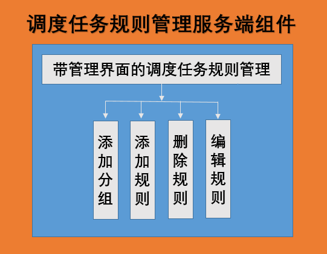
<center>功能架构图1</center>


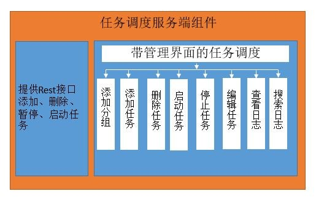
<center>功能架构图2</center>

## 功能说明 ##

iuap-dispatch-service组件功能包括添加、删除、暂停、重启任务。不仅提供了外部调用的Rest服务，并且组件本身也有完整的任务配置界面，包括任务调度，日志查询等功能。

# 使用说明 #

## 组件包说明 ##

iuap-dispatch-service组件功能包括添加、删除、暂停、重启任务。不仅提供了外部调用的Rest服务，并且组件本身也有完整的任务配置界面，包括任务调度，日志查询等功能。

## 服务端应用配置

从maven库上下载war包，下面说明获取到 iuap-saas-dispatch-service.war 后，需要修改的配置文件（相关数据库表，在执行iuap初始化脚本时已经添加，无需关注）。

第1步：修改dispatch-server.properties中调度服务的配置
<center>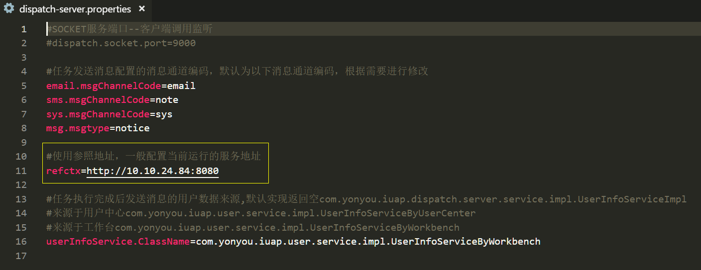</center>

第2步：修改auth.properties中redis的配置
<center>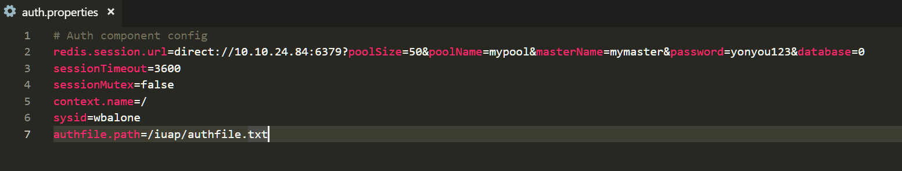</center>

第3步：修改jdbc.properties中的数据库配置

<center>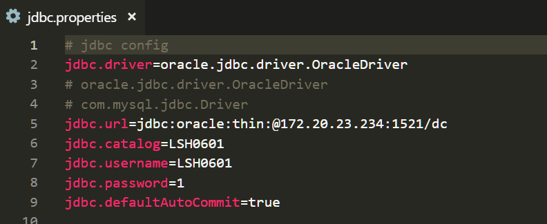</center>

<center>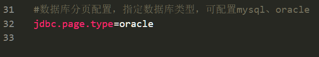</center>

第4步：如果与消息中心对接，需要修改msg-sdk.properties中消息中心和认证文件的配置，认证文件路径配置为本机authfile.txt的地址
<center>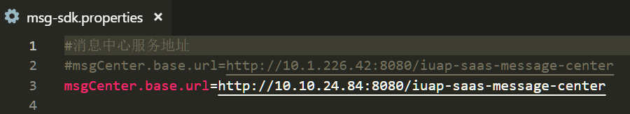</center>

第5步：修改sdk.properties中客户认证路径为本机路径:

client.credential.path=d:/iuap\_ieap/authfile.txt

第6步：配置workbench-sdk.properties工作台服务地址、客户认证路径
<center></center>


## 代码开发示例
###　客户端调用示例

接收任务调度组件传过来的参数，根据参数执行业务功能并返回执行结果给任务调度组件。

**要点 1：接收和返回的结果都是 Map&lt;String,Object&gt;类型的。并且，返回结果需要满足以下规范：**

调用接口返回json的格式:
```
{"success":"true","resultValue":"logContent:executesuccessfully","sendMsgContent":"msgContent,task executessuccessfully","asynchronized":"false"}
```
success指是否执行成功，如果成功，&quot;success&quot;:&quot;true&quot;，不成功，就不要返回

logContent指日志的内容

sendMsgContent指配置了消息模板，给消息接收人的内容。

asynchronized指是否是异步调用。

如果不成功，返回格式如下:
```
{"resultValue":"logContent:executefailure","sendMsgContent":"msgContent:task executesfailure","asynchronized":"false"}
```
**要点2：controller 的url路径要和点击【调度任务规则管理】-【编辑规则】下图中设定的&quot;调度规则url&quot;一致，接收的参数即为如下配置的参数test1，test2。**
<center></center>


**要点3：系统默认提供加签调用，是否验签由具体业务场景决定。**

**如下示例是默认加签调用，配置如下：**

**applicationContext-shiro.xml**
```
<!-- Shiro的Web过滤器 -->
<bean id="shiroFilter" class="org.apache.shiro.spring.web.ShiroFilterFactoryBean">
   <property name="securityManager" ref="securityManager" />
   <property name="loginUrl" value="/login" />
   <property name="successUrl" value="/" />
   <property name="filters">
      <util:map>
         <entry key="statelessAuthc" value-ref="statelessAuthcFilter" />
         <entry key="signAuth" value-ref="signAuthFilter" />
      </util:map>
   </property>
   <property name="filterChainDefinitions">
      <value>
         /logout = logout
         /**/static/** = anon
         /**/css/** = anon
         /**/images/** = anon
         /**/trd/** = anon
         /**/js/** = anon
         /**/api/** = anon
         /**/cxf/** = anon
         /**/druid/** = anon
         /**/jaxrs/** = anon
         /**/dataForPrint/** = anon
         /**/restWithSign/** = signAuth
         /** = statelessAuthc

      </value>
   </property>
</bean>
```
示例代码如下,实例中&quot;executeTask1&quot;执行的是异步调用，&quot;executeTask2&quot;执行的是同步调用。tasklogId为对应的任务日志的id，用于回写任务执行状态：
```
@Controller
@RequestMapping("/restWithSign")
public class TaskExampleController {
    private static Logger logger = LoggerFactory.getLogger(TaskExampleController.class);
    @Autowired
    private ThreadPoolTaskExecutor threadPoolTaskExecutor;
    @RequestMapping(value= "/task1", method = RequestMethod.POST)
    @ResponseBody
    public Map<String, String> executeTask1(HttpServletRequest request, HttpServletResponse response,@RequestBody JSONObject data) {
        // 规则参数格式
        // {"data":{"test1":"U001","test2":"U002"},"tasklogid":"2c8a836823b640aba64254be0763b4a2"}
        JSONObject postData = JSONObject.fromObject(data);
        JSONObject dataBody = postData.getJSONObject("data");
        String param1;
        String param2;
        if(dataBody != null && !dataBody.isNullObject()) {
            if(dataBody.has("test1")) {
                param1 = dataBody.getString("test1");
            }
            if(dataBody.has("test2")) {
                param2 = dataBody.getString("test2");
            }
        }
        final String tasklogid = postData.getString("tasklogid");
        response.setCharacterEncoding("utf-8");
        Map<String, String> map = new HashMap<String, String>();
        map.put("success", "true");
        map.put("resultValue", "任务执行中！");
        map.put("sendMsgContent", "任务执行中！");
        map.put("asynchronized", "true");//是否异步。如果异步的话，则显示任务执行中
        threadPoolTaskExecutor.execute(new Runnable() {
            @Override
            public void run() {
                try {
                    executeTask();
                    callBackResult(tasklogid, "true", "任务执行成功！");
                }catch(Exception e) {
                    callBackResult(tasklogid, "false", e.getMessage());
                }
            }
        });
        return map;
    }
    //此处为模拟业务逻辑执行占用时间
    private void executeTask() throws Exception{
        Thread.sleep(10000);
    }
    
    /**
     * 回调返回任务执行结果
     * @param tasklogid 任务ID
     * @param success 是否成功：true代表成功，其他代表失败
     * @param msg 具体消息内容
     */
    private void callBackResult(String tasklogid, String success, String msg) {
        String url = PropertyUtil.getPropertyByKey("base.url") + "/iuap-saas-dispatch-service/taskcallback/updateTaskLog";
        Map<String, String> map = new HashMap<String, String>();
        map.put("id", tasklogid);
        map.put("success", success);
        try {
            msg = URLEncoder.encode(msg,"utf-8");
        } catch (UnsupportedEncodingException e) {
            logger.error(e.getMessage());
        } finally {
        }
        map.put("resultValue", msg);
        Map<String, String> result =  RestUtils.getInstance().doPostWithSign(url, map, Map.class);
    }

		
    @RequestMapping(value= "/task2", method = RequestMethod.POST)
    @ResponseBody
    public Map<String, String> executeTask2(HttpServletRequest request, HttpServletResponse response) {
        response.setCharacterEncoding("utf-8");
        Map<String, String> map = new HashMap<String, String>();
        map.put("resultValue", "logContent:execute successfully");
        map.put("sendMsgContent", "msgContent,task executes successfully");
        map.put("asynchronized", "false");
        return map;
    }
}

```

## 组件使用说明 ##

任务调度提供两种方式如下：

### 通过界面进行任务调度 ###
将组件war包部署到服务器上访问首页http://IP:PORT/iuap-dispatch-service进行任务的添加.

#### 调度任务规则管理

　　点击管理中心主界面上的【调度任务规则管理】，进入调度任务规则管理界面，如下图所示：


　　左侧为规则分组，每个分组后的数字表示它包含的规则个数。右侧为规则信息，规则编码、规则名称、规则URL，顶部两个按钮可以新建分组和新建规则。


将鼠标放置于某个任务上，可以删除、编辑该规则。

点击〖搜规则〗，输入规则名称，可以搜索规则。

##### 新建分组
<center>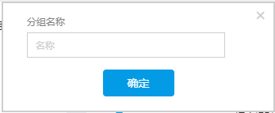</center>


点击〖新建分组〗，输入分组名称，即可新建一个分组。

##### 新建规则
选择一个分组，点击〖新建规则〗，打开新建规则界面，如下图所示：
<center>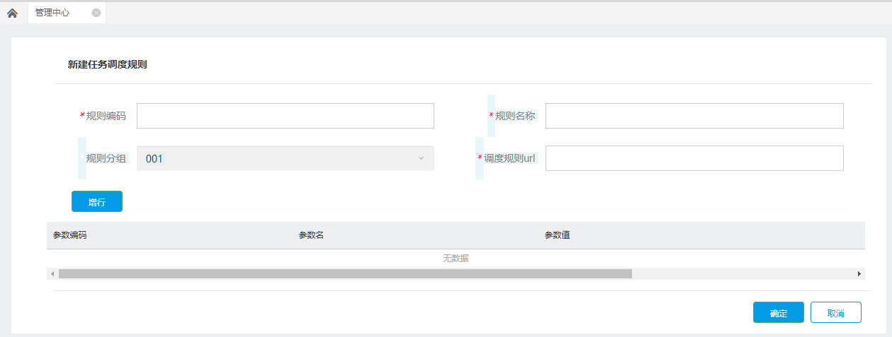</center>


规则编码、规则名称、调度规则URL为必填项。

调用规则就是按照规则执行任务，例如预警或定时执行等，根据不同业务场景选择调用规则后，取相应的参数值。

点击右侧的〖增行〗，可以对参数进行设置，设置完，点击〖增行〗即可保存：
<center></center>


#### 调度任务管理

点击管理中心主界面上的【调度任务管理】，进入调度任务管理界面，如下图所示：
<center></center>


左侧为任务分组，每个分组后的数字表示它包含的任务个数。右侧为任务信息，包括任务成功次数、失败次数、任务状态，右边三个蓝色按钮分别表示查看任务详情、日志和删除。

<center>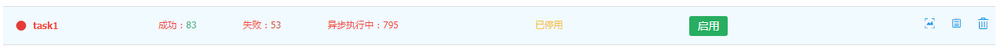</center>

将鼠标放置于某个任务上，可以启用、停用该任务，或者显示任务是否已过期。

点击〖搜任务〗，输入任务名称，可以搜索任务。

任务栏上方的日志是所有任务的日志，每条任务右侧的日志按钮显示该条任务的日志。

点击〖多选〗可以选择对多个任务进行操作： 
<center></center>


##### 新建分组
点击〖新建分组〗，输入分组名称，即可新建一个分组。
<center>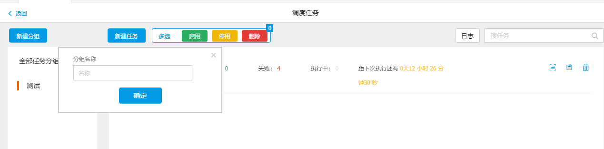</center>


界面说明如下：

分组名称：分组的标识

##### 新建任务

选择一个分组，点击〖新建任务〗，打开新建任务界面，如下图所示：
<center>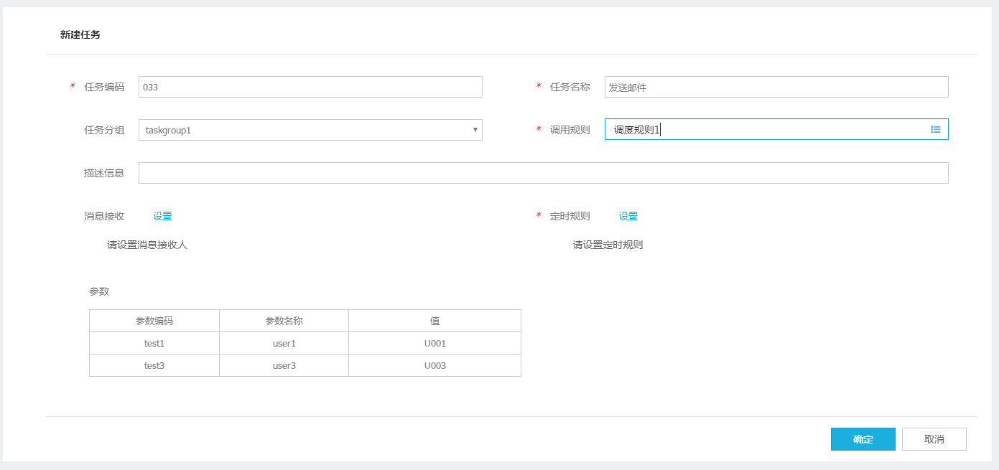</center>


任务编码、任务名称、调用规则和定时规则为必填项。

界面说明如下：

1. 任务编码：任务的标识
2. 任务名称：具有识别意思的名字
3. 任务分组：指定任务所属的组
4. 消息接收：配置任务成功后发送消息的接收人和接收方式（需要扩展实现消息发送逻辑)
5. 定时规则：任务具体执行时间，每多少天执行一次，并指定开始时间
6. 调用规则：指定要执行的任务，具体规则详见下面预制数据说明。
7. 参数：任务执行时，会根据指定的参数值调用业务服务。

调用规则就是按照规则执行任务，例如预警或定时执行等，根据不同业务场景选择调用规则后，取相应的参数值。

点击&quot;消息接收&quot;右侧的〖设置〗，可以对消息接收人进行设置：

 <center>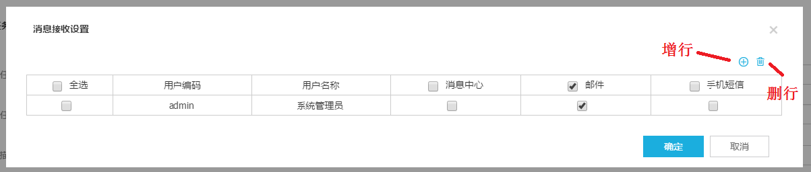</center>


选择一个或多个接收人。邮件和手机短信在消息通道进行配置，具体可见&quot;消息通道配置&quot;部分内容。消息中心是在消息中心进行接收，具体可见&quot;消息中心&quot;部分内容。

点击&quot;定时规则&quot;右侧的〖设置〗，可以设置定时规则，一次发生还是周期发生，如下图所示：

  <center>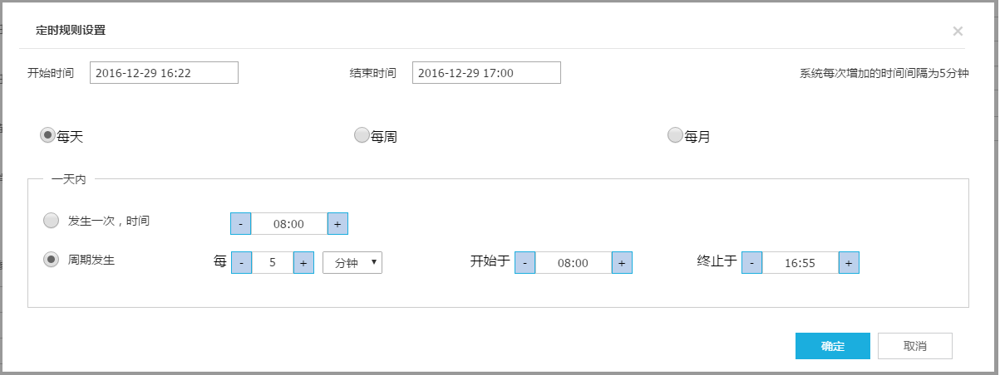</center>


开始时间和结束时间规定了定时规则的时间范围。

界面说明如下：

1. 支持指定任务开始结束时间
2. 支持指定每天、每周（可选择周几）、每月第几天执行任务
3. 支持在上面选择的日期一天内，指定发生次数、间隔时间和起止时间

如果选择&quot;周期发生&quot;，举例来说，

A． 开始时间是2016-12-29 16:22，开始于8:00，每5分钟执行一次，则当天第一次执行是16:25；结束时间是2016-12-29 17:00，终止于16:55，则当天最后一次执行是16:55。

B． 开始时间是2016-12-29 16:22，开始于16:30，每5分钟执行一次，则当天第一次执行是16:30；结束时间是2016-12-29 16:50，终止于16:55，则当天最后一次执行是16:50。

##### 查看任务详情
  <center>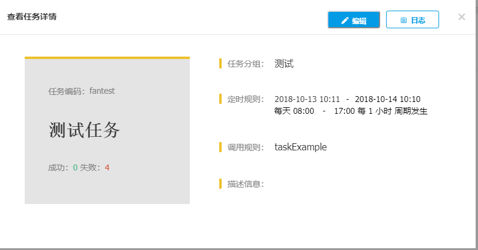</center>


操作说明：点击主界面列表的数据行右侧查看任务详情图标。弹出任务详情界面。

界面说明如下：

1. 左侧显示任务的名称和执行情况
2. 右侧显示任务的详细信息
3. 编辑：进入任务编辑界面
4. 日志：进入日志查看界面，显示当前任务的日志

##### 修改任务
  <center>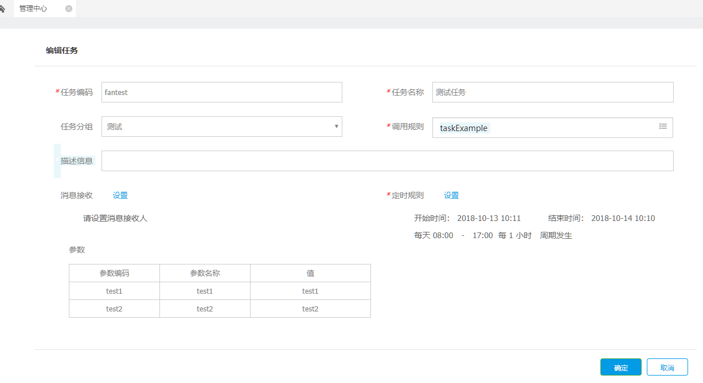</center>


操作说明：在主界面列表的数据行右侧点击编辑任务图标。弹出任务编辑界面，填写后保存。

界面说明如下：

1. 任务编码：任务的标识
2. 任务名称：具有识别意思的名字
3. 任务分组：指定任务所属的组
4. 消息接收：配置任务成功后发送消息的接收人和接收方式（需要扩展实现消息发送逻辑）
5. 定时规则：任务具体执行时间，每多少天执行一次，并指定开始时间
6. 调用规则：指定要执行的任务，具体规则详见下面预制数据说明
7. 参数：任务执行时，会根据指定的参数值调用业务服务。

##### 删除任务

操作说明：在主界面列表的数据行右侧点击删除任务图标

##### 启用任务

执行后结果会显示在界面上

 <center>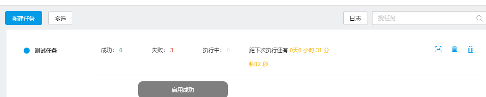</center>


操作说明：鼠标选择已停用的任务时，列表行显示启用按钮。点击按钮启用该任务。

##### 停用任务
<center>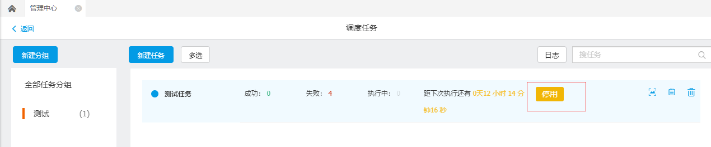</center>


操作说明：鼠标选择正在运行中的任务时，列表行显示停用按钮。点击按钮停用该任务。

##### 批量操作任务
<center></center>


操作说明：点击多选按钮时，会滑出启用、停用、删除按钮。列表界面切换为多选状态，选择多个任务后，点击按钮进行操作。点击多选回到原有状态。

##### 查看任务执行日志
<center>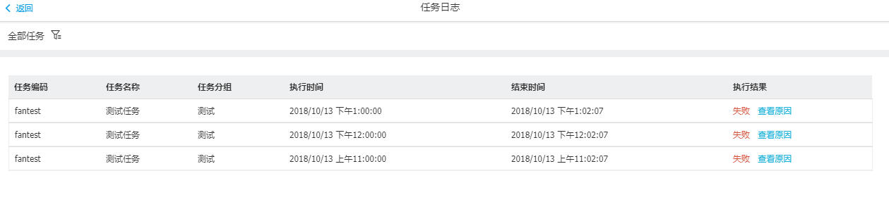</center>


操作说明：

1. 点击主界面左上角的&quot;日志&quot;按钮，显示全部任务日志
2. 点击任务详情界面的&quot;日志&quot;按钮，显示当前任务的日志
3. 在日志界面的左上角可以选择要查询的任务，选择后，根据指定的任务查询并显示日志信息详见下图。

过滤任务界面：

<center>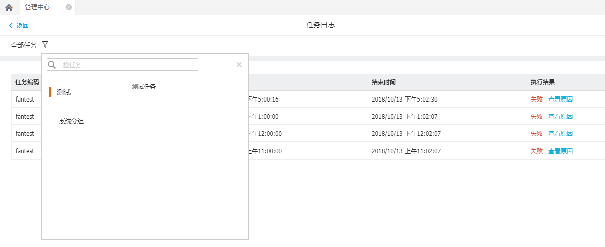</center>


操作说明：

1. 选择任务分组显示分组下的任务
2. 选择具体任务后，界面会按照选择的任务过滤显示

##### 查看日志详情
<center></center>


操作说明：点击任务日志列表界面的数据行右侧的&quot;查看原因&quot;按钮，显示日志详情。

描述信息：对任务的简单描述


### 通过Rest API任务调度 ###

####  新增定时任务

添加或覆盖基于Cron表达式的定时调度任务。

**请求体：**

| URl | /dispatchserver/add.do |
| --- | --- |
| Method | POST |

**请求参数说明：**

| 参数字段 | 必选 | 类型 | 长度限制 | 说明 |
| --- | --- | --- | --- | --- |
| recallConfig | True | String | 无 | 回调信息配置，Json格式，具体参考下面说明 |
| taskConfig | True | String | 无 | 任务执行配置，Json格式，具体参考下面说明 |
| replace | True | boolean | 无 | 是否覆盖，为ture时，自动覆盖，为false时，如果存在会返回错误信息 |

recallConfig内容格式：

| 参数字段 | 必选 | 类型 | 长度限制 | 说明 |   |
| --- | --- | --- | --- | --- | --- |
| recallType | True | String | 无 | 回调方式，SOCKET/HTTP |   |
| option | True | String | 无 | 回调的方式地址，&quot;recallType&quot; = &quot;HTTP&quot;时，格式为{&quot;url&quot;:&quot;[http://ip:port/XXX&quot;}](http://ip:port/XXX%22%7D)；&quot;recallType&quot; = &quot;SOCKET&quot;时，格式为{&quot;host&quot;:&quot;ip&quot;,&quot;port&quot;} |   |
| data | True | String | 无 | 任务附加数据，执行时传递给调用接口，建议为json格式 |   |

taskConfig内容格式：

| 参数字段 | triggerType | 必选 | 类型 | 长度限制 | 说明 |
| --- | --- | --- | --- | --- | --- |
| triggerType |   | True | String | 无 | 触发方式，SimpleTrigger/CronTrigger，下面参数根据类型不同变化，dk中的CronTaskConfig/SimpleTaskConfig两种配置类参数 |
| jobCode | SimpleTrigger/CronTrigger | True | String | 无 | 任务名称可参考s |
| groupCode | SimpleTrigger/CronTrigger | True | String | 无 | 组名称 |
| priority | SimpleTrigger/CronTrigger | True | int | 无 | 优先级，数字大的优先执行 |
| endDate | SimpleTrigger/CronTrigger | True | Date | 无 | 任务结束始时间 |
| cronExpress | CronTrigger | True | String | 无 | 表达式， |
| startDate | SimpleTrigger | True | Date | 无 | 任务开始时间 |
| timeConfig | SimpleTrigger | True | Json | 无 | 时间配置，json格式，参考TimeConfig类格式如下 |

timeConfig内容格式：

| 参数字段 | 必选 | 类型 | 长度限制 | 说明 |
| --- | --- | --- | --- | --- |
| interval | True | int | 无 | 执行间隔时间，具体单位见intervalType |
| intervalType | True | String | 无 | 执行间隔时间单位：NULL/MILLISECOND/SECOND/MINUTE/HOUR |
| isForever | True | boolean | 无 | 是否重复执行，为true时会一直定时执行，直到暂停或删除任务 |
| repeatCount | True | int | 无 | 重复次数，isForever为false时，任务仅执行指定的次数 |

**返回参数说明：**

| 参数字段 | 类型 | 说明 |
| --- | --- | --- |
| success | boolean | true/false |
| error | String | 错误信息 |
| resultValue | String | 返回值，一般为null |

#### 暂停任务

根据任务名称和组名称暂停任务

**请求体：**

| URl | /dispatchserver/pause.do |
| --- | --- |
| Method | POST |

**请求参数说明：**

| 参数字段 | 必选 | 类型 | 长度限制 | 说明 |
| --- | --- | --- | --- | --- |
| jobName | True | String | 无 | 任务名称 |
| groupName | True | String | 无 | 组名称 |

**返回参数说明：**

| 参数字段 | 类型 | 说明 |
| --- | --- | --- |
| success | boolean | true/false |
| error | String | 错误信息 |
| resultValue | String | 返回值，一般为null |

#### 恢复任务

根据任务名称和组名称恢复任务

**请求体：**

| URl | /dispatchserver/resumeTask.do |
| --- | --- |
| Method | POST |

**请求参数说明：**

| 参数字段 | 必选 | 类型 | 长度限制 | 说明 |
| --- | --- | --- | --- | --- |
| jobName | True | String | 无 | 任务名称 |
| groupName | True | String | 无 | 组名称 |

**返回参数说明：**

| 参数字段 | 类型 | 说明 |
| --- | --- | --- |
| success | boolean | true/false |
| error | String | 错误信息 |
| resultValue | String | 返回值，一般为null |

#### 删除任务

根据任务名称和组名称删除任务

**请求体：**

| URl | /dispatchserver/delete.do |
| --- | --- |
| Method | POST |

**请求参数说明：**

| 参数字段 | 必选 | 类型 | 长度限制 | 说明 |
| --- | --- | --- | --- | --- |
| jobName | True | String | 无 | 任务名称 |
| groupName | True | String | 无 | 组名称 |

**返回参数说明：**

| 参数字段 | 类型 | 说明 |
| --- | --- | --- |
| success | boolean | true/false |
| error | String | 错误信息 |
| resultValue | String | 返回值，一般为null |

#### 立即执行任务

根据任务名称和组名称立即执行任务

**请求体：**

| URl | /dispatchserver/ trigger.do |
| --- | --- |
| Method | POST |

**请求参数说明：**

| 参数字段 | 必选 | 类型 | 长度限制 | 说明 |
| --- | --- | --- | --- | --- |
| jobName | True | String | 无 | 任务名称 |
| groupName | True | String | 无 | 组名称 |

**返回参数说明：**

| 参数字段 | 类型 | 说明 |
| --- | --- | --- |
| success | boolean | true/false |
| error | String | 错误信息 |
| resultValue | String | 返回值，一般为null |
