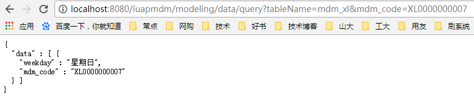
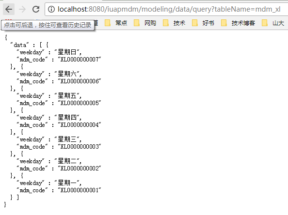

## 接口规范

自定义档案组件提供两种接口，供外部调用组件中的档案数据，一种是查询单条，一种是查询全部（接口属于前端调用，后端调用暂不提供）。

### 单条数据查询
<table>
    <tr>
        <td>请求地址：</td>
        <td>http://ip:port/iuaprmodel/modeling/data/query</td>
    </tr>
    <tr>
        <td>请求参数1：</td>
        <td>tableName——表名，在自定义档案建模页面可以查看到 </td>
    </tr>
    
	<tr>
        <td>请求参数2：</td>
        <td>mdm_code——自定义档案数据编码，在定义档案维护页面可查看</td>
    </tr>
	<tr>
        <td>Web示例：</td>
        <td>http://localhost:8080/iuaprmodel/modeling/data/query?tableName=mdm_xl&mdm_code=XL0000000007</td>
    </tr>
	<tr>
        <td>Ajax示例：</td>
        <td>$.ajax({
                type: GET,
                url: " iuaprmodel/modeling/data/query ",
                data: { tableName: "mdm_x", mdm_code: "XL0000000007"},
                dataType: "json",
                success: function(data){
                },
			    error:function(){}
            });
        </td>
    </tr>
</table>
样例数据：

            
图34：单条数据查询结果

### 全部数据查询
<table>
    <tr>
        <td>请求地址：</td>
        <td>http://ip:port/iuaprmodel/modeling/data/query</td>
    </tr>
    <tr>
        <td>请求参数1：</td>
        <td>tableName——表名，在自定义档案建模页面可以查看到 </td>
    </tr>
	<tr>
        <td>Web示例：</td>
        <td>http://localhost:8080/iuaprmodel/modeling/data/query?tableName=mdm_xl</td>
    </tr>
	<tr>
        <td>Ajax示例：</td>
        <td>$.ajax({
               type: GET,
               url: " iuaprmodel/modeling/data/query ",
               data: { tableName: "mdm_x"},
               dataType: "json",
               success: function(data){
               },
               error:function(){}
              });
        </td>
    </tr>
</table>
样例数据
 
            
图35：全部数据查询结果

