# **基础档案组件**

# 第一章 **基本概念**

基础档案是一套基础的组织架构组件,主要由以下要素：组织、部门、岗位、人员共同组成公司或机构的基本功能节点。

组织：职能节点名称，该节点支持层级结构、组织查询服务、查询职能数据、支持多租户隔离。组织下级可以有组织或部门，主要用来构建公司或组织的体系。

部门：职能节点名称，必须以组织为基础建立部门。可以在部门下再建部门。是岗位的上级。部门为其他节点：如督办任务等节点提供支持。

岗位：具体职能节点名称，以组织和部门为基础，是对工作性质、工作任务、工作职责与工作环境的描述，岗位与用户绑定下级绑定用户。

人员：指的是公司或机构的人员，是其他节点的基本组成部分，可以为其他节点提供基本服务支持。

# 第二章 **技术架构**

## 二.1 技术架构

基础档案提供了组织、部门、人员、岗位的管理设置功能及sdk的调用功能,基础档案集成了分布式会话组件及RBAC权限组件，以便支持基础档案在管理端会话验证与权限验权方面的的应用，同时基础档案集成了持久化组件，支持oracle、mysql、sqlserver多数据库支持。客户端提供sdk-api的方式的调用。方便管理基础数据。

图1 

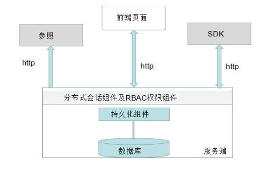

## 二.2 实现原理

基础档案把通用的组织、部门、岗位、人员抽离出一个模块，单独部署。使用关系型数据库保存数据。在一些数据热点上使用redis缓存。当其他模块需要使用这些数据的时候，直接调用SDK。避免了用户的重复开发。并对应了开发了一些参照组件。方便其他的功能节点上使用这些数据。该功能支持多租户隔离，满足多个租户场景的实现。

## 二.3 扩展机制

通过sdk的方式，暴露出接口，可以对基础档案进行操作。

# 第三章 **功能介绍**

## 三.1 **组织**

### 三.1.1 **新增组织**

步骤1、打开组织节点，点击新增按钮，输入相应的信息。

编码具有唯一性.

图2
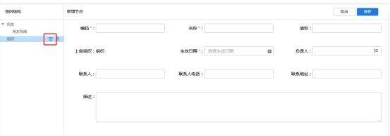
 

步骤2、保存；

### 三.1.2 **修改组织**

步骤1、打开组织节点点击需要修改的组织节点,对应修改相应的数据.
图3 
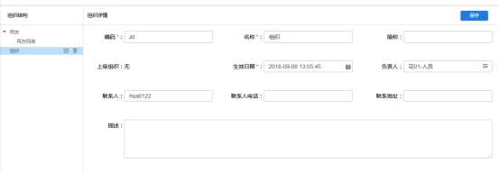

步骤2、保存；

### 三.1.3 **删除组织**

步骤1、选择要删除的组织节点；

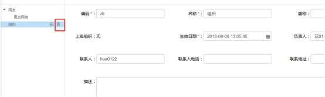

图 4

步骤2、点击删除按钮；

## 三.2 **部门**

### 三.2.1 **新增部门**

步骤1、部门需要在组织下创建,首先选择组织

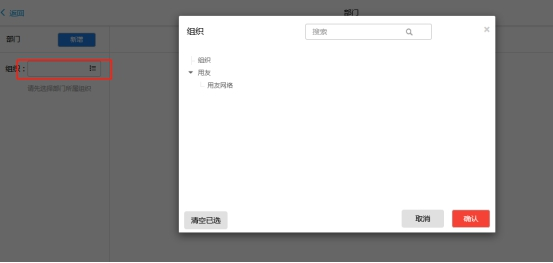

图 5

步骤2、选取组织后会列出组织下的部门,可以创建组织下一级部门,或多级部门.对应的有2个新增按钮.

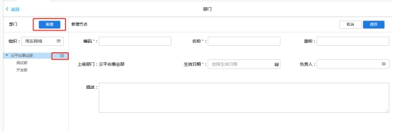

图 6

步骤3、填入相应的信息,保存.

### 三.2.2 **修改部门**

步骤1、选择需要修改的部门，修改对应的数据，保存。

图7 

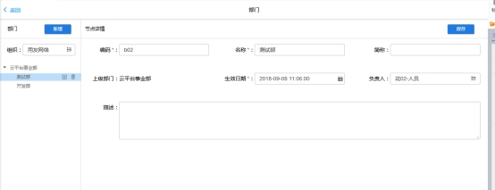

### 三.2.3 **删除部门**

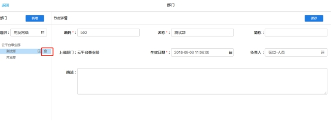

图8 

## 三.3 **岗位**

### 三.3.1 **新增岗位**

步骤1、进入岗位管理节点，点击新增，填写相应的信息。保存。

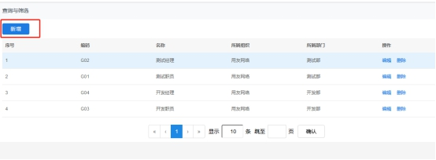

图9 

### 三.3.2 **修改岗位**

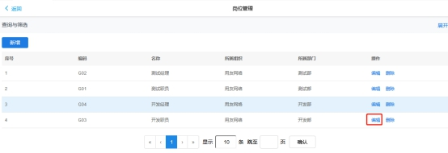

图10 

### 三.3.3 **删除岗位**

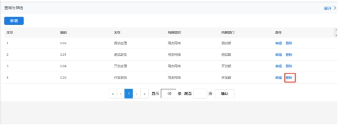

图 11

## 三.4 **人员**

### 三.4.1 **新增人员**

步骤1、进入人员节点，点击新增。

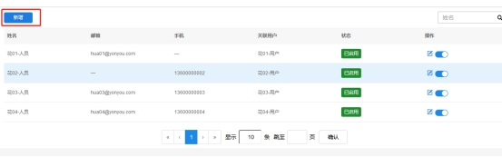

图 12

步骤2、填写相应的信息。

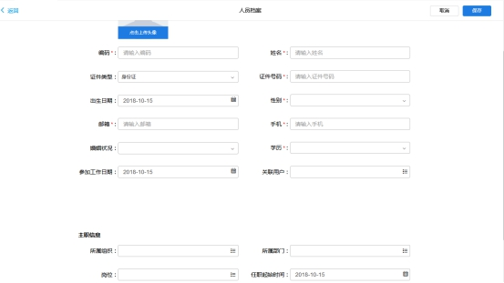

图 13

步骤3、新增的用户处于未初始化状态，需要点击，初始化才能使用平台的其他功能。

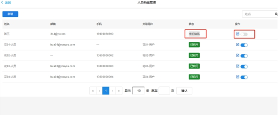

图14 

### 三.4.2 **修改人员**

步骤1、点击修改按钮。

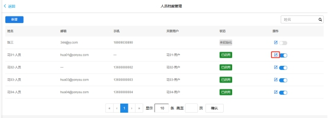

图15 

### 三.4.3 **停用人员**

人员管理节点不提供删除功能，有停用和启用。

图16 

### 三.4.4 **生成用户**

支持人员生成用户

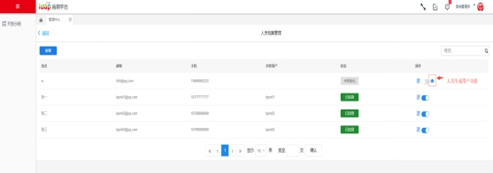

图17 

# 第四章 **数据库表**

## 四.1 **数据库表**

组织表：ORG_ORGANIZATION

| 列名 | 字段含义 | 类型 |
| --- | --- | --- |
| ID | 主键 | VARCHAR2(50) |
| PARENT_ID | 父id | VARCHAR2(50) |
| CODE | 编码 | VARCHAR2(50) |
| NAME | 名称 | VARCHAR2(50) |
| SHORT_NAME | 简称 | VARCHAR2(50) |
| INNER_CODE | 内联码（记录所有父级节点） | VARCHAR2(50) |
| SYSID | Sysid | VARCHAR2(50) |
| TENANTID | 租户id | VARCHAR2(50) |
| PRINCIPAL | 负责人 | VARCHAR2(50) |
| CONTACT | 联系人 | VARCHAR2(50) |
| CONTACT_ADDRESS | 联系地址 | VARCHAR2(50) |
| CONTACT_PHONE | 联系电话 | VARCHAR2(50) |
| EFFECTIVE_DATE | 生效日期 | DATE |
| CREATE_DATE | 创建日期 | DATE |
| DESCRIPTION | 描述 | VARCHAR2(50) |
| TS | 时间戳 | DATE |
| DR | 逻辑删除 | NUMBER(11,0) |

部门表：ORG_DEPARTMENT

| 列名 | 字段含义 | 类型 |
| --- | --- | --- |
| ID | 主键 | CHAR(36) |
| PARENT_ID | 父id | CHAR(36) |
| ORGANIZATION_ID | 组织id | VARCHAR2(36) |
| CODE | 编码 | VARCHAR2(50) |
| NAME | 名称 | VARCHAR2(50) |
| SHORT_NAME | 简称 | VARCHAR2(50) |
| INNER_CODE | 内联码（记录所有父级节点） | VARCHAR2(50) |
| SYSID | Sysid | VARCHAR2(40) |
| TENANTID | 租户id | VARCHAR2(40) |
| PRINCIPAL | 负责人 | VARCHAR2(50) |
| EFFECTIVE_DATE | 生效日期 | DATE |
| CREATE_DATE | 创建日期 | DATE |
| DESCRIPTION | 描述 | VARCHAR2(50) |
| TS | 时间戳 | DATE |
| DR | 逻辑删除 | NUMBER(11,0) |

岗位：BD_POSITION

| 列名 | 字段含义 | 类型 |
| --- | --- | --- |
| ID | 主键 | VARCHAR2(36) |
| CODE | 编码 | VARCHAR2(50) |
| NAME | 名称 | VARCHAR2(50) |
| CONTACT | 联系人 | VARCHAR2(50) |
| CONTACT_ADDRESS | 联系地址 | VARCHAR2(50) |
| CREATOR | 创建人 | VARCHAR2(50) |
| CREATIONTIME | 创建时间 | DATE |
| MODIFIER | 修改人 | VARCHAR2(50) |
| MODIFIEDTIME | 修改时间 | DATE |
| SYSID | Sysid | VARCHAR2(50) |
| TENANTID | 租户id | VARCHAR2(50) |
| CONTACT_PHONE | 联系电话 | VARCHAR2(50) |
| EFFECTIVE_DATE | 生效日期 | DATE |
| CREATE_DATE | 创建日期 | DATE |
| DESCRIPTION | 描述 | VARCHAR2(50) |
| TS | 时间戳 | DATE |
| DR | 逻辑删除 | NUMBER(11,0) |

人员：BD_STAFF（主表）

| 列名 | 字段含义 | 类型 |
| --- | --- | --- |
| ID | 主键 | VARCHAR2(36) |
| CODE | 编码 | VARCHAR2(50) |
| NAME | 名称 | VARCHAR2(50) |
| EMAIL | 邮箱 | VARCHAR2(50) |
| MOBILE | 手机 | VARCHAR2(50) |
| BIRTHDATE | 出生日期 | DATE |
| EDUCATIONBG | 学历 | VARCHAR2(50) |
| MARITALSTATUS | 婚姻状况 | VARCHAR2(50) |
| USERID | 关联用户id | VARCHAR2(50) |
| PARTICIPATEWORKDATE | 参加工作时间 | DATE |
| CONTACT | 联系人 | VARCHAR2(50) |
| CONTACT_ADDRESS | 联系地址 | VARCHAR2(50) |
| CREATOR | 创建人 | VARCHAR2(50) |
| CREATIONTIME | 创建时间 | DATE |
| MODIFIER | 修改人 | VARCHAR2(50) |
| MODIFIEDTIME | 修改时间 | DATE |
| ENABLE | 是否启用 | NUMBER(11,0) |
| AVATOR | 头像 | VARCHAR2(1024) |
| SYSID | Sysid | VARCHAR2(50) |
| TENANTID | 租户id | VARCHAR2(50) |
| CONTACT_PHONE | 联系电话 | VARCHAR2(50) |
| EFFECTIVE_DATE | 生效日期 | DATE |
| CREATE_DATE | 创建日期 | DATE |
| DESCRIPTION | 描述 | VARCHAR2(50) |
| TS | 时间戳 | DATE |
| DR | 逻辑删除 | NUMBER(11,0) |

人员：BD_MAIN_JOB（从表）

| 列名 | 字段含义 | 类型 |
| --- | --- | --- |
| ID | 主键 | VARCHAR2(36) |
| STAFFID | 人员id | VARCHAR2(36) |
| ORGID | 组织id | VARCHAR2(36) |
| DEPTID | 部门id | VARCHAR2(36) |
| POSITIONID | 岗位 | VARCHAR2(50) |
| STARTSERVETIME | 任职开始时间 | DATE |
| ENDSERVETIME | 任职结束时间 | DATE |

# 第五章 **问题排查**

1. 在bpm里的选择人员使用的以下sql

|       select u.id,u.name,u.login_name code from app_user u  where u.id IN ( SELECT staff.userid FROM bd_staff staff   INNER JOIN bd_main_job job ON job.staffid = staff.id  INNER JOIN org_department dept ON job.deptid = dept.id  where dept.ID = ? ) |
| --- |

所以数据的关联关系为：app_user表和 bd_staff 通过userid 一对一关联，bd_staff和bd_main_job通过bd_staff.id和bd_main_job.staffid一对一关联。

2.参照获取不到数据时，可以查看ref_refinfo 表中的地址url是否和基础档案中的对应url一致。

