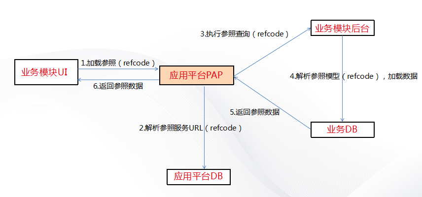
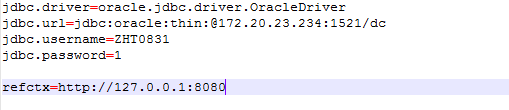
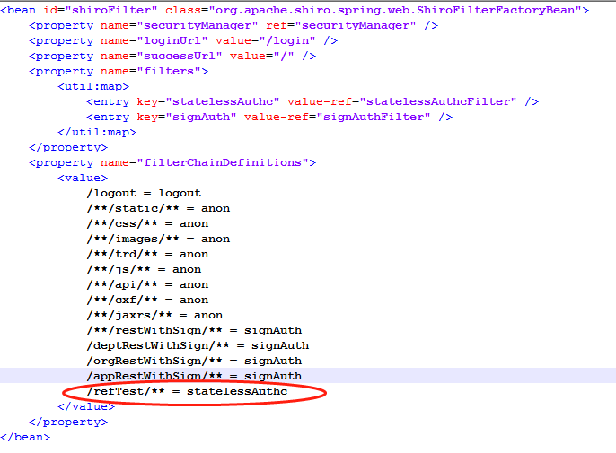
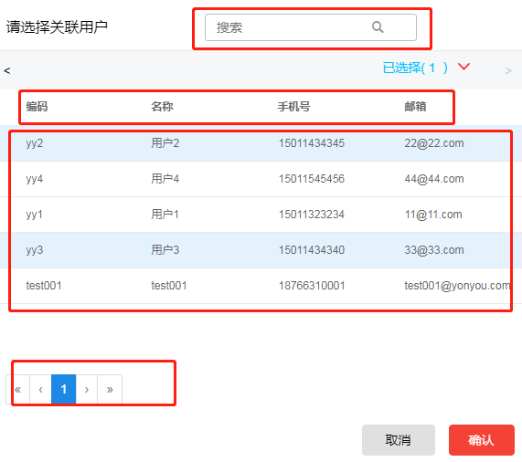
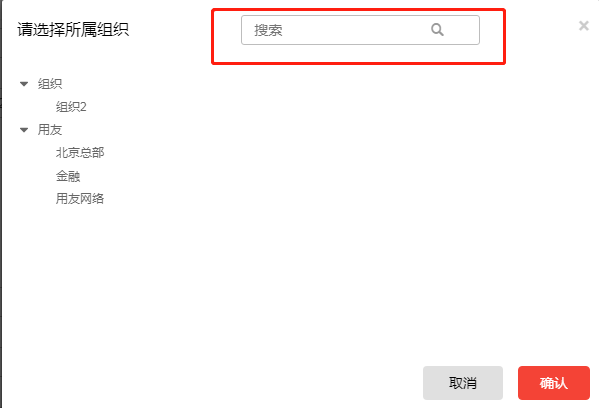
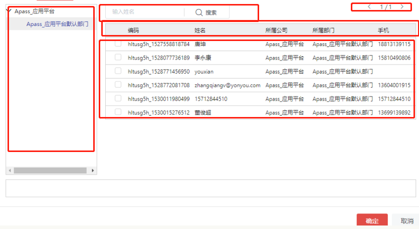
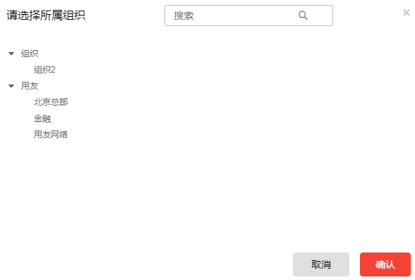
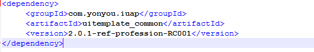
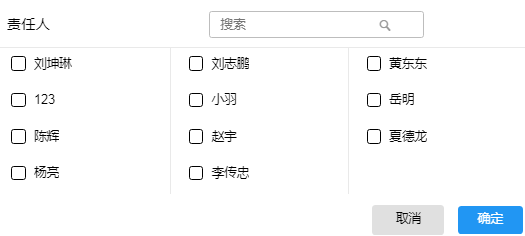

# 参照组件
# 基本概念

开发过程中经常遇到一些限定输入（也即下拉选择输入）场景，有的备选项信息简单，有的备选项信息复杂；有的备选项可以穷举，有的备选项会持续扩展。有的是单项选取，有的是多项选取；有的无需关联查找，有的需关联查找……面对此类复杂的开发需求，常规的下拉输入框等控件是不能满足要求的，为此IUAP提供了一套参照组件，用来解决类似的问题，提高开发效率。

参照组件是IUAP对外提供的一套UI组件，基于React开发，它提供固定的几种界面样式，用户可以按照规定的形式提供参数，即可实现完整的交互逻辑。  

图 1

使用参照的场景通常满足以下几个要求。第一，用户需要填写的数据不可以随意填写，且已经存在于数据库。第二，这些数据是一些常用和固定的数据，如组织、部门、人员、岗位等。第三，用户在选择数据时需要进行权限过滤，以防止用户越权选择自己无权管理的数据。

举个简单的例子。一个经理创建了一个任务，需要把这个任务分配下去。那么他在选择分配的人员时，这个人员一定是他部门存在的人，而不是其他部门或者不存在的人。这时，选择人员这个地方就需要做成一个人员参照。
# 技术架构

2.1技术架构

参照组件在服务端针对不同的参照类型提供了不同的调用接口，并且提供了抽象的参照事件控制类。客户端在创建参照事件控制类的时候可以选择继承抽象类，实现其中的方法，也可以直接根据参照类型直接创建同名的方法。参照组件支持mysql、oracle、sqlserver数据库。

图 2

2.2实现原理

1. 前端根据不同的参照类型，请求参照服务上不同的接口。
2. 应用平台通过refcode查询参照服务的url
3. 请求参照业务模块，执行参照查询
4. 从参照业务模块的数据库中查询出参照数据
5. 业务模块将参照数据返回给应用平台
6. 应用平台将参照数据返回给前端

2.3扩展机制  
2.3.1自定义通用型参照行数

在开发通用型参照时，通过传递transmitParam参数，可以自定义每一列的行数。

2.3.2自定义单表型参照分页参数

单表型参照是带有分页功能的，可以通过设置refClientPageInfo.currPageIndex 和refClientPageInfo.pageSize参数，来摄者当前页和每页数据数量，如果不设置的话，默认是第一页和每页100条数据。

2.3.3条件参数

可以通过设置condition参数来传递一些用于判断或者查询的参数。

2.3.4树型参照的懒加载

在开发树型参照时，如果有开发懒加载功能，可以通过设置treeloadData参数来控制树的懒加载。treeloadData默认为false，即不使用懒加载。设置成true则开启懒加载。

2.4问题排查方法  
2.4.1服务端问题

在开发时，服务端出现一般有两种情况，一种是配置文件的问题，另一种是数据库数据的问题。

1. 配置文件问题  
  

图 3
  
在开发的时候，在newref项目下的application.propertiesl文件里有数据库的配置，数据库配置不对会出问题。这个配置文件的重点在refctx这个参数，这个是参照上下文，用于请求客户端参照模块时，拼接url地址。如果ip地址不对，可能会请求到别的服务器的参照模块或者后台直接报404错误。
  
2. 数据库数据问题

在数据库的参照注册表REF\_REFINFO中有一个REFURL字段，这个字段一旦写错，请求参照模块时拼接的url地址肯定不对，会出现404错误。注意，REFURL一定要以&quot;/&quot;结尾，不然也会报404。

2.4.2客户端问题

1. 第一，要注意参照事件控制类里面的方法名，如果没有继承平台参照事件抽象类，参照事件控制类里面的方法名一定要写对，不然会请求不到。
2. 第二，如果出现306权限异常，需要增加参照事件控制类的访问权限。参照客户端采用shiro框架的无状态认证进行权限校验，其中有一个过滤器StatelessAuthcFilter，当服务端请求客户端的时候，该过滤器会对用户信息进行拦截，如果未登录，则无法请求，出现306异常。如果登录后依然出现306异常，则应该是没有在applicationContext-shiro.xml文件中配置url的认证方式，配置如图：

图 4
  
2.5现有参照  
2.5.1根据功能节点分类

| 功能节点名称 | 参照名称 | 参照对象 | 参照类型 | 参照新旧 |
| --- | --- | --- | --- | --- |
| 菜单管理 | 菜单参照 | 菜单 | 树型 | 老参照 |
|  | 功能参照 | 功能 | 树表型 | 老参照 |
| 组织 | 负责人 | 人员 | 表格型 | 新参照 |
| 部门 | 组织 | 组织 | 树型 | 新参照 |
| | 负责人 | 人员 | 表格型 | 新参照 |
| 岗位 | 所属组织 | 组织 | 树型 | 新参照 |
| | 所属部门 | 部门 | 树型 | 新参照 |
| 人员 | 关联用户 | 用户 | 表格型 | 新参照 |
| | 所属组织 | 组织 | 树型 | 新参照 |
| | 所属部门 | 部门 | 树型 | 新参照 |
| | 岗位 | 岗位 | 表格型 | 新参照 |
| 用户 | 所属组织 | 组织 | 树型 | 老参照 |
| | 分配角色 | 角色 | 树表型 | 老参照 |
| 数据权限 | 组织 | 组织 | 树表型 | 老参照 |
| | 部门 | 部门 | 树表型 | 老参照 |
| 资源分配 | 资源标识 | 流程定义 | 表格型 | 老参照 |
| | 资源标识 | 打印模版 | 表格型 | 老参照 |
| 编码对象管理 | 属性类型 | 编码映射实体 | 表格型 | 新参照 |
| 映射对象管理 | 参照编码 | 参照表 | 表格型 | 新参照 |
| 编码映射 | 编码实体 | 编码映射实体 | 表格型 | 老参照 |
| | 组织 | 组织 | 树型 | 老参照 |
| | 用户 | 用户 | 表格型 | 老参照 |
| | 部门 | 部门 | 树型 | 新参照 |
| 督办任务 | 责任单位 | 组织 | 树型 | 老参照 |
| | 协办单位 | 组织 | 树型 | 老参照 |
| | 主办人 | 人员 | 表格型 | 老参照 |
| | 创建人 | 用户 | 表格型 | 老参照 |
| | 所属组织 | 组织 | 树形型 | 新参照 |
| | 最后修改人 | 用户 | 表格型 | 老参照 |
| | 主办人 | 人员 | 表格型 | 老参照 |
| | 创建人 | 用户 | 表格型 | 老参照 |
| | 最后修改人 | 用户 | 表格型 | 老参照 |
| 调度任务管理 | 调度规则 | 调度规则 | 树表型 | 老参照 |
| 流程任务监控 | 操作 | 改派人员选择 | 树表型 | 新参照 |
| 督办react | 主办人 | 人员 | 表格型 | 新参照 |
| 任务中心 | 改派 | 用户 | 单表 | 老参照 |
| | 指派 | 用户 | 穿梭框 | 老参照 |
| | 加签 | 用户 | 穿梭框 | 老参照 |
| | 抄送-部门 | 部门 | 树表型 | 老参照 |
| | 抄送人员 | 用户 | 单表 | 老参照 |
| | 抄送岗位 | 岗位 | 单表 | 老参照 |
| | 抄送角色 | 角色 | 单表 | 老参照 |

2.5.2根据参照种类分类

| 参照种类 | 参照类型 | 参照新旧 |
| --- | --- | --- |
| 菜单 | 树型 | 老参照 |
| 功能 | 树表型 | 老参照 |
| 人员 | 表格型 | 新参照/老参照 |
| 组织 | 树型 | 新参照/老参照 |
| 组织 | 树表型 | 老参照 |
| 部门 | 树型 | 新参照 |
| 部门 | 树表型 | 老参照 |
| 用户 | 表格型 | 新参照/老参照 |
| 流程定义 | 表格型 | 老参照 |
| 打印模板 | 表格型 | 老参照 |
| 编码映射实体 | 表格型 | 新参照/老参照 |
| 调度规则 | 树表型 | 老参照 |
| 参照实体 | 表格型 | 新参照 |
| 改派人员 | 树表型 | 新参照 |
| 岗位 | 表格型 | 新参照 |
| 角色 | 树表型 | 新参照 |
# 功能介绍

3.1通用型参照（单选多选）

  

图 5

如图是一个通用型参照，用户可以通过【搜索框】查找自己想要的数据。勾选完要选择的数据点击确定即可。

3.2单表型参照  

图 6

如图是一个单表型参照。这个表由【数据头】和【数据体】两部分构成。表头就是编码，名称，手机号和邮箱；表体就是下面的数据。单表参照提供了查询功能，用户通过【搜索框】可以进行查询。下面有【分页】功能，便于用户浏览数据。点击击想要选择的数据，点确认即可。  

3.3树型参照  

图 7

如图是一个树形参照，参照的数据以树的形状展示出来，显示出数据之间的层级关系。用户可以通过【搜索框】来搜索数据。点击想要选择的数据，再点确认即可。  
3.4树表型参照

图 8

如图是一个树表型参照，左侧是一个树，右侧是一个单表。右侧表由【表头】和【表体】构成，并且有【分页】功能。用户可以使用【搜索框】进行数据的搜索。选择数据时，先点击左侧的树的节点，查询表的数据，然后在右侧的表中选择要选择的数据，点击确定即可。
# 典型业务场景介绍

5.1组织参照
5.1.1目标

使用户选择组织的时候，可以清晰的看到公司的组织架构，选择正确的组织，并且过滤掉用户没有权限看到的组织。在数据传递时，将组织的相关信息一起传递。

5.1.2实现方式

1. 配置环境  

图 24

2. 创建参照事件控制类,新建NewOrganizationRefController，创建blobRefTree方法。gblobRefTree方法对参照树的内容进行查询，当数据查询出来后，会调用DataPermissionCenter的filterRefData方法，filterRefData方法会根据前端传过来的参数来判断是否进行数据过滤。
3. 在数据库里注册参照信息。

5.1.3内容和效果

完成后的参照页面如下：

图 25

从图上可以看到，组织参照页面显示了参照信息，组织参照树，有搜索功能。各个组织之间的层级关系一目了然。

5.1.4价值

通过使用组织参照，可以提升相关功能模块的易用性，使用户在选择组织的时候，清晰的了解组织架构。参照组件使前后端分离，前端只要传递正确的refCode给后端就能够查询出参照信息，简化了开发，提升了代码的可维护性。

5.2人员参照
5.2.1目标

使用户可以在选择人员时可以方便的找到自己要的人员，并且根据权限限制用户可以选择的人员。

5.2.2实现方式

1.配置环境  

图 26

2.创建参照事件控制类,新建NewStaffRefController，创建getRefModelInfo和getCommonRefData方法，设置参照信息和查询参照数据。getRefModelInfo方法对参照的数据头进行设置。getCommonRefData方法对参照数据的内容进行查询，当数据查询出来后，会调用DataPermissionCenter的filterRefData方法，filterRefData方法会根据前端传过来的参数来判断是否进行数据过滤。

3.在数据库里注册参照信息。

5.2.3内容和效果  

图 27

可以看到各个人员以checkbox的形式列举出来，用户可以选择多个人员。并且用户可以通过搜索框进行快速搜索。

5.2.4价值

通过使用人员参照，使用户在选择用户的时候，可以清楚地知道有哪些用户可以选择，提升用户的体验。参照组件使前后端分离，前端只要传递正确的refCode给后端就能够查询出参照信息，简化了开发，提升了代码的可维护性。
