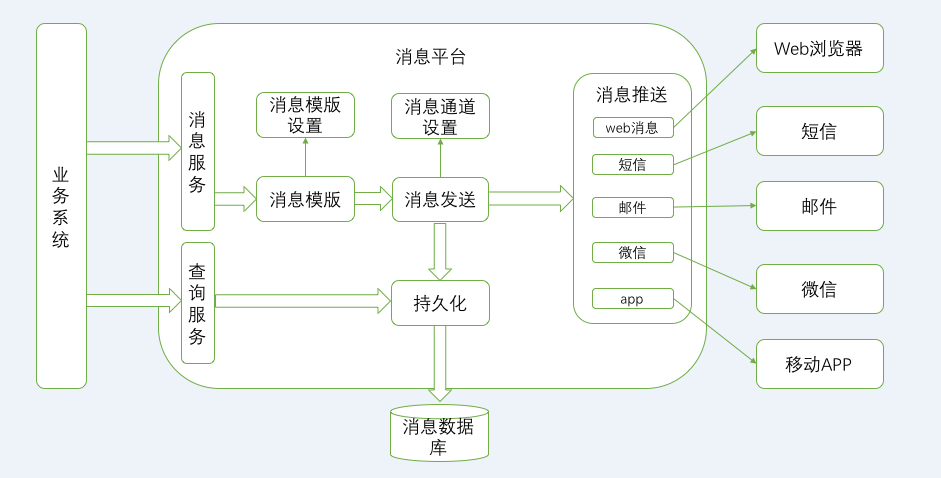
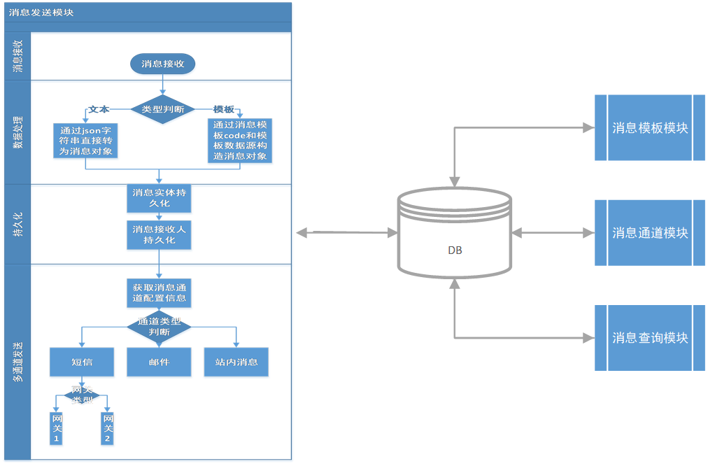
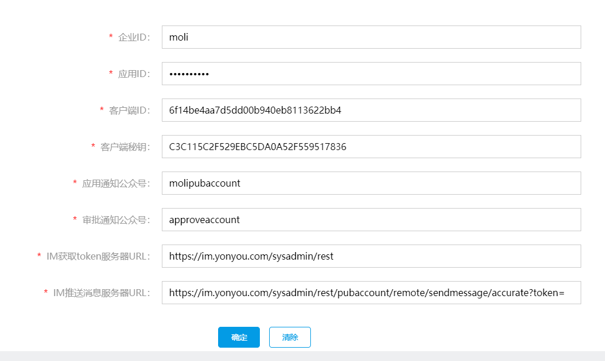
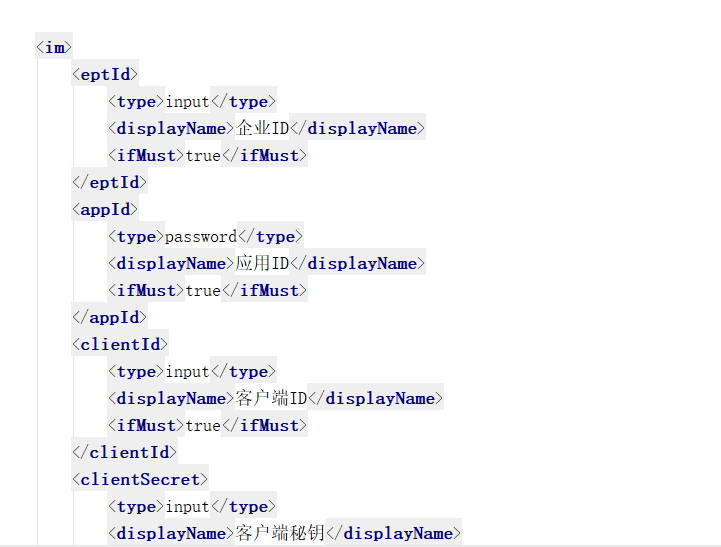
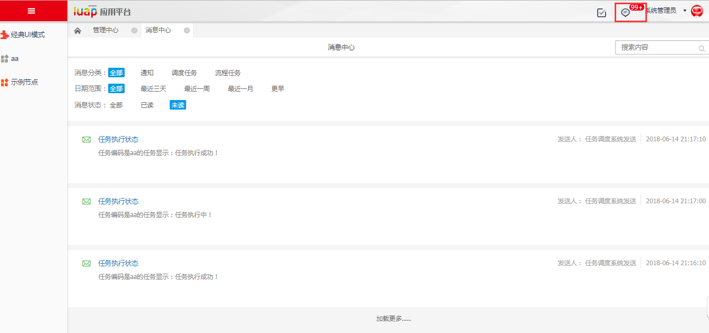

概述
====

>   消息组件提供通过邮件、短信、站内信等方式发送消息的能力，并支持消息内容按照预置模板方式发送。提供消息查询、消息通道配置、消息模板配置等节点用于展示消息内容，配置消息发送参数。

>   提供如下特性：

|        | **特性**                                                                   | **特性说明**                                                                                                                                           |
|--------|----------------------------------------------------------------------------|--------------------------------------------------------------------------------------------------------------------------------------------------------|
| 特性1  | 提供消息组件                                                               | 提供消息发送API/Rest API，提供给业务，让业务调用，以支持业务开发发送相应的业务消息；提供消息的统一存取模型和存取服务，支持消息的持久化                 |
| 特性2  | 消息组件提供消息转换接口和服务                                             | 消息组件提供消息转换接口和服务，把消息的原始业务对象信息、上下文信息和消息模板转换成最终消息；第三方可以实现这个消息转换接口，以实现自己的消息转换逻辑 |
| 特性3  | 消息组件提供消息发送通道接口和服务                                         | 实现消息组件的消息推送接口，然后根据业务要求的消息发送通道，调用相应的消息通道发送消息                                                                 |
| 特性4  | 提供消息通道配置功能                                                       | 配置每种通道进行消息推送时相关信息，如可以配置邮箱、短信和友信的upush相关信息                                                                          |
| 特性5  | 消息通道对接消息推送组件                                                   | 消息通道对接消息推送组件，以实现消息推送                                                                                                               |
| 特性6  | 消息通道支持扩展                                                           | 消息通道支持扩展，第三方可以扩展出自己的消息推送方式                                                                                                   |
| 特性7  | 支持WebPush的消息推送，并作为默认推送                                      | 支持WebPush的消息推送，并作为消息组件的默认推送方式                                                                                                    |
| 特性8  | 支持通过邮箱的消息推送                                                     | 支持通过邮箱进行消息推送，支持通过邮件进行消息发送                                                                                                     |
| 特性9  | 支持通过短信的消息推送                                                     | 支持通过短信进行消息推送，支持通过短信进行消息发送                                                                                                     |
| 特性10 | 支持通过友信的upush的消息推送                                              | 支持通过友信的upush进行消息推送，支持通过友信的upush进行消息发送                                                                                       |
| 特性11 | 提供消息模板管理                                                           | 提供消息模板显示清单页面；提供消息模板的维护功能；消息模板支持持久化                                                                                   |
| 特性12 | 提供消息模板设计功能                                                       | 提供消息模板HTML格式的复合文本设计页面，在消息模板里支持超级链接、图片和表格等                                                                         |
| 特性13 | 消息模板里支持系统变量                                                     | 消息模板设计时，在模板里支持系统变量并在消息模板转换时，支持解释这些系统变量                                                                           |
| 特性14 | 消息模板里支持业务对象属性                                                 | 消息模板设计时，在模板里支持业务对象属性并在消息模板转换时，支持解释这些业务对象属性                                                                   |
| 特性15 | 提供消息分类模型和相应服务                                                 | 提供消息分类模型和相应服务，可以预置消息分类，如任务消息，通知消息，公告消息，调度任务消息                                                             |
| 特性16 | 不同消息分类的消息模板实现可以不一样                                       | 不同消息分类的消息模板实现可以不一样，以便按照消息分类显示消息内容                                                                                     |
| 特性17 | 支持第三方的消息模板，用来替换我们的消息模板                               | 支持第三方的消息模板，用来替换我们默认的消息模板，以便用户实现个性化的消息模板                                                                         |
| 特性20 | 提供消息中心                                                               | 提供消息中心界面，以便集中显示和处理所有消息                                                                                                           |
| 特性21 | 消息中心里消息支持按照状态进行过滤和查询                                   | 消息中心里消息支持按照消息状态进行过滤和查询，以找到用户需要处理的消息                                                                                 |
| 特性22 | 消息中心里消息支持按照消息分类进行过滤和查询                               | 消息中心里消息支持按照消息分类进行过滤和查询，如全部，通知消息，调度任务消息，流程任务消息等                                                           |
| 特性23 | 消息中心里消息支持按照时间进行过滤和查询                                   | 消息中心里消息支持按照时间进行过滤和查询，如全部，最近三天，最近一周，最近一月，更早                                                                   |
| 特性25 | 支持在每种消息分类的显示模板里定义动作，动作对应的交互页面需要根据业务适配 | 支持在每种消息分类的显示模板里定义动作，动作对应的交互页面需要根据业务适配                                                                             |
| 特性26 | 消息中心支持多租户                                                         | 消息中心的模型和服务接口支持多租户                                                                                                                     |
| 特性27 | 推送到消息中心的消息要让用户能及时知道有新的消息信息                       | 推送到消息中心的消息要让用户能及时知道有新的消息信息定时同步消息信息条数到消息图标上                                                                   |
| 特性28 | 消息模板定义结果支持保存为纯文本                                           | 为短消息提供内容模板，方法是在原来的消息模板基础上进行扩展，增加保存为纯文本逻辑，也即使用消息模板来定义纯文本的消息内容模板                           |
| 特性29 | 消息中心增加调度任务类型消息                                               | 消息中心增加调度任务类型消息，消息中心里的消息分类里显示调度任务消息                                                                                   |
|        |                                                                            | 这样消息中心的消息分类有：通知 流程任务 调度任务3类消息                                                                                                |
| 特性30 | 消息模板树预制业务消息和流程消息两个分类                                   | 消息模板树预制业务消息和流程消息两个分类                                                                                                               |
| 特性31 | 消息模板树流程消息分类下自动同步已关联流程模型的功能                       | 消息模板树流程消息分类下自动同步已关联流程模型的功能，显示功能名称                                                                                     |
| 特性32 | 预制流程消息的消息模板                                                     | 预制流程消息的消息模板                                                                                                                                 |
| 特性33 | 流程流转时发送流程消息                                                     | 在流程发起、审批、指派、改派、加签、驳回、弃审时发送消息给相关人员 管理员挂起、恢复、终止流程时发送消息给制单人                                        |

技术架构
========

架构设计
--------

图 1

消息平台接收来自业务系统的消息发送请求，并按照相应消息模板和消息通道实现消息的发送。

消息通道支持扩展功能。

消息模板提供默认的消息模版类型：html消息模版、纯文本消息。Html消息模版主要用于web浏览器、邮件等显示支持富文本消息内容。纯文本的，一般为短信消息使用，支持配置短信模版时限制输入长度。

消息平台支持web端消息推送。Web端推送采用socket长链接的方式，使用vert.x构建web端未读消息推送服务，监控在线用户，向在线用户推送相应消息。

消息平台支持短信、邮件、APP等方式推送消息。

实现原理
--------

消息发送实现过程：

1、客户端请求消息发送接口；

2、判断消息类型，如果为模板消息需要查询对应的消息模板，组装消息内容；

3、进行消息实体持久化；

4、进行消息接收人持久化；

5、获取消息通道，调用相应通道对应的消息发送接口进行短信、邮件或者站内信的发送；

图 2

扩展机制
--------

消息通道扩展：

1、数据库表：iuap_msgchannel新增通道信息；

2、message-channelName.xml配置消息通道信息；

3、新建类并实现 IMessageSendChannelExt接口；

4、message-channelExt.xml配置新通道发送消息的类；

图 3

图 4

功能介绍
========

消息组件分为：消息发送、消息中心、消息模板、消息通道等模块。

消息发送
--------

消息发送模块让用户把提醒、通知、推销等信息发到各种渠道上，如短信、移动App、邮件等。

通过消息推送组件可以向手机发送短信、发送电子邮件、向APP推送消息。

-   消息推送：基于用友消息发送平台，完成app的推送。

-   手机短信：基于用友消息发送平台，完成短信的发送。目前支持国内的移动、联通、电信三大网络。

-   发送邮件：基于JavaMail实现邮件的发送服务。

消息推送组件提供以下功能：

1.  向手机发送短信

2.  发送电子邮件

3.  向APP推送消息的功能

4.  可扩展的消息发送方式

消息中心
--------

消息中心提供消息管理功能，包括消息查看和搜索。在应用平台主界面点击导航条上的【消息中心】，打开消息中心界面，如下图所示：（所有的图要加题注，例如：如图1）

图 5

选择不同的消息查看方式：

消息分类有通知、调度任务和流程任务三种，可以根据业务要求添加。

日期范围有最近三天、最近一周、最近一月和更早。

消息状态有全部、已读和未读。

在【搜索内容】输入消息名称或内容，进行消息搜索。

消息模板
--------

消息模板用于定义系统发送的各种消息的展现样式。点击管理中心主界面上的【消息模板管理】，进入消息模板管理界面，如下图所示：

图 6

左侧为模板分组，可以点击进行选择。要新增一个消息模板，点击【新增】打开模板

图 7

编辑界面，如下图所示：

模板编码、模板名称为必填项。

左侧区域为系统变量和业务对象，双击一个变量名或业务对象，即可将变量加入右侧消息内容中。

右侧的工具栏提供消息内容编辑功能，包括文字编辑、段落、图片、表格等。

完成编辑后，点击【保存】，或者点击【清除】清除界面内容。

返回消息模板管理主界面，将鼠标放到建好的消息模板上，可以对其进行编辑和删除：

图 8

在【搜索内容】中输入模板名称，对已有的消息模板进行搜索。

按【返回】返回管理中心主界面。

消息通道
--------

消息通道配置用于配置消息类型以及配套的发送配置，主要有邮箱、短信和upush推送三种类型。点击管理中心主界面上的【消息通道配置】，进入消息通道配置界面，如下图所示：

图 9

界面左侧为三种配置类型，点击后右侧出现详细的参数配置：

电子邮件配置：如上图所示，发件人邮箱账户账号、发件人邮箱账户密码、邮件发送服务器地址，这三项为必填项。完成设置后点击【确定】。

短信：如下图所示，填写邮件发送服务器地址、接口调用秘钥和短信服务器URL。短信服务器URL为必填项。完成设置后点击【确定】。

图 10

upush推送：有信的推送服务。如下图所示，填写控制台登录名、远程接口秘钥和upush推送服务器URL。upush推送服务器URL为必填项。完成设置后点击【确定】。

图 11

点击【返回】返回管理中心主界面。