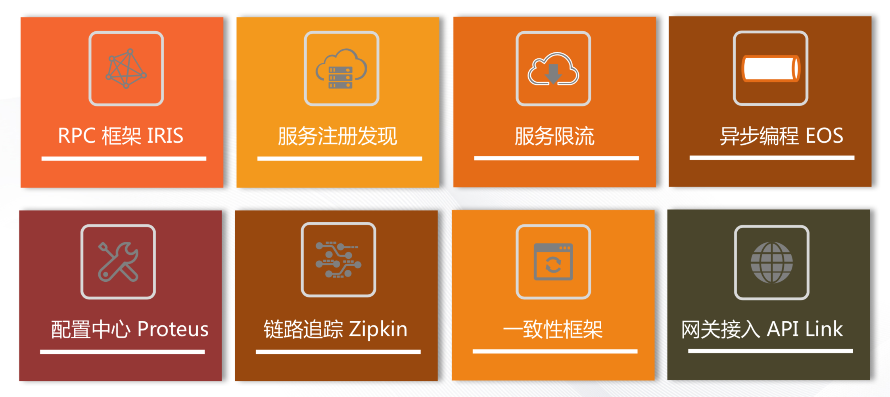
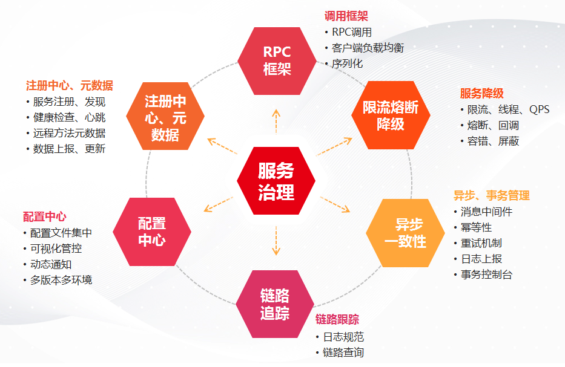
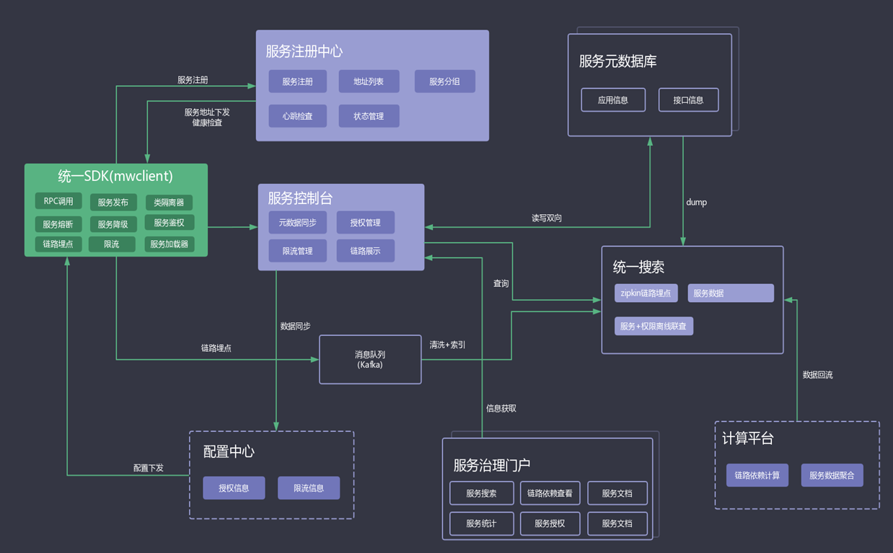
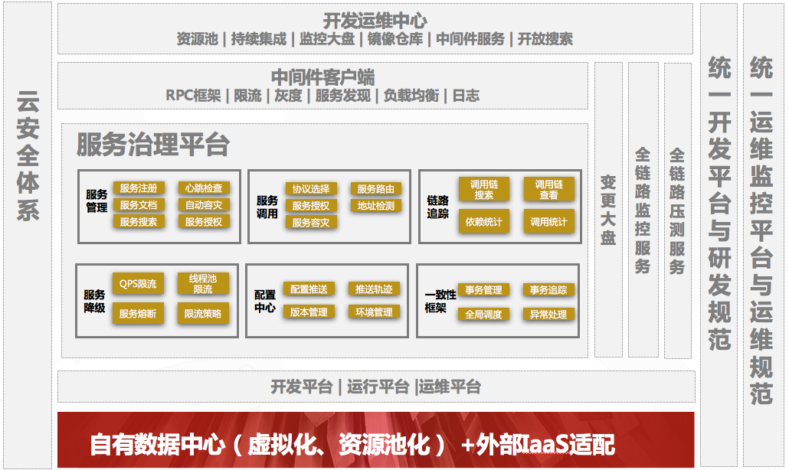

# 产品概述

服务治理平台是用友云平台发布的一款支撑微服务架构应用全生命周期管理的平台，为开发者提供从开发到运维、运行的一系列开发套件和服务，包含RPC框架、配置中心、注册中心、服务链路追踪、服务限流、服务熔断、服务统计、服务评价等组件和服务。

平台兼容spring框架以及springboot框架，为开发者实现微服务应用架构提供完整的底层支持，帮助开发者进行系统的服务化拆分和架构扩展。

专属版本的微服务治理平台使用最小化的安装方式，简化部署所依赖的后端支撑服务，意在让微服务的初级使用者快速安装和使用平台，利用单机环境来部署和启动服务治理平台，简单快速，易于上手。

## 平台核心功能

用友云平台-服务治理平台的主要功能如下：

- RPC调用框架，简单实现远程服务调用
- 服务自动注册发现、实现客户端负载均衡
- 服务限流控制，避免雪崩效应，保证服务稳定性
- 异步编程框架，实现基于可靠消息的异步异步操作
- 配置中心，支持配置文件的变更通知，动态加载
- 链路追踪，方便业务调用链路的查看和分析
- 一致性框架，保证数据的最终一致性
- 网关接入，方便暴露微服务接口和接入其它扩展服务

利用服务治理平台提供的功能，可以快速的构建微服务应用，线下开发、调试，并在统一的服务治理平台门户进行管控。

## 技术架构图
微服务治理平台对外提供RPC框架的SDK，包含同步调用和异步调用的功能；后端支撑服务集成了认证中心、配置中心、统一控制台、元数据、消息中间件管理、事务管理控制台等服务等，以完整的能力对外输出。 服务治理平台的整体技术架构图如下：

## 功能架构图

微服务治理平台提供微服务开发到运维的完整生命周期的管理，并与云平台的其它服务进行整合，其功能模块图如下：

用友云服务治理平台，帮助您更好的拆分、开发、运维和管理微服务应用！

