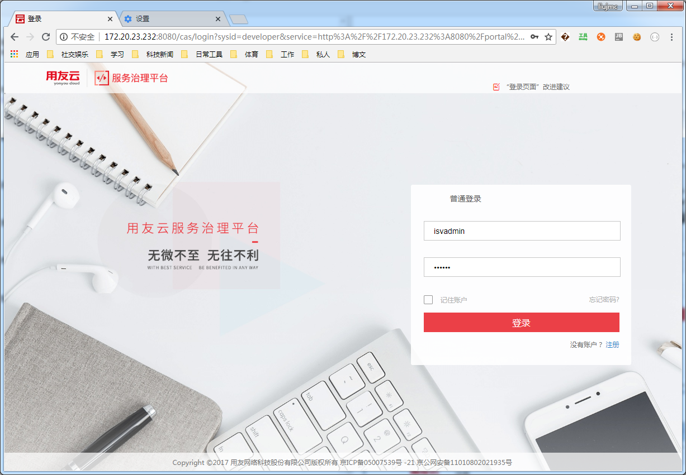
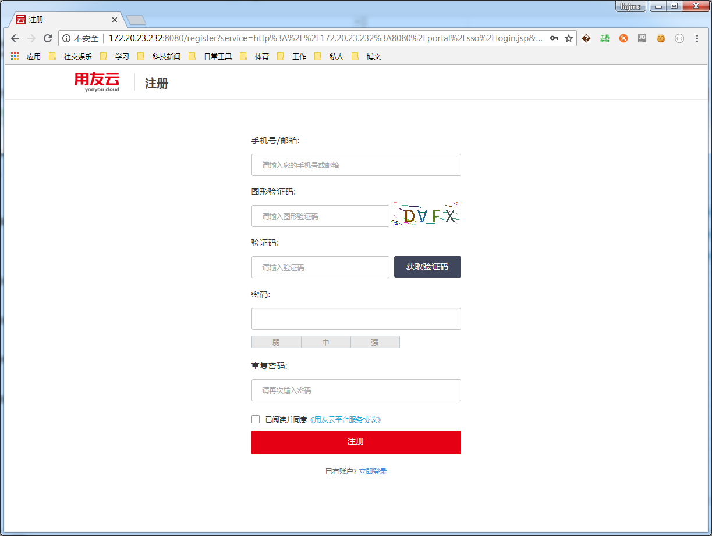
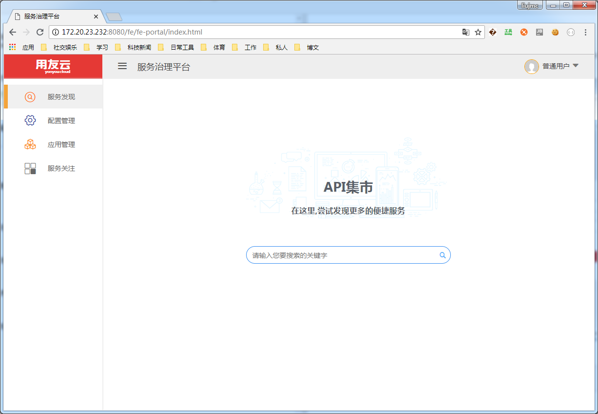

## 预置用户说明与新用户注册

  在浏览器中输入地址，打开微服务治理平台；例如，安装地址为172.20.17.4，输入地址为http://172.20.17.4 ，打开微服务治理平台的登录界面，如下：

输入预置账号和密码可以登录系统，进行相关操作，预置账号及说明如下：

    isvadmin：租户管理员，密码默认为111111；
	user0：普通用户，密码默认为111111；

**注意：系统安装完成和初始化后，请修改用户密码。**

使用租户管理员账号密码登录后，可以看到控制台、容器服务、微服务、DevOps服务、微服务运营、中间件服务、配置中心、资源申请及审批、系统管理等功能，界面如下:

## 注册新用户

使用方可以注册新用户，点击注册按钮，进入新用户注册申请界面：

填入手机号/邮箱、验证码、密码等信息，注册新账号。

在入驻界面中输入申请信息,点击提交按钮确认提交。注册成功后，登录可以拥有普通用户的权限。
