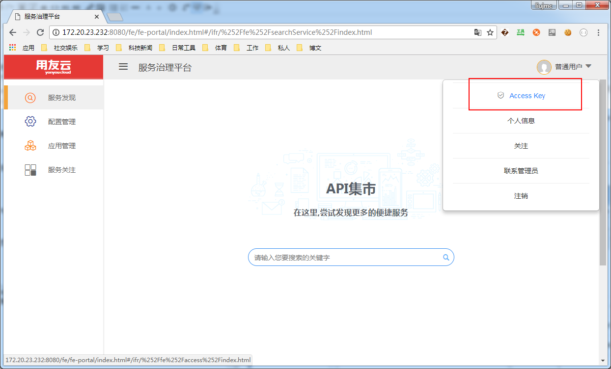
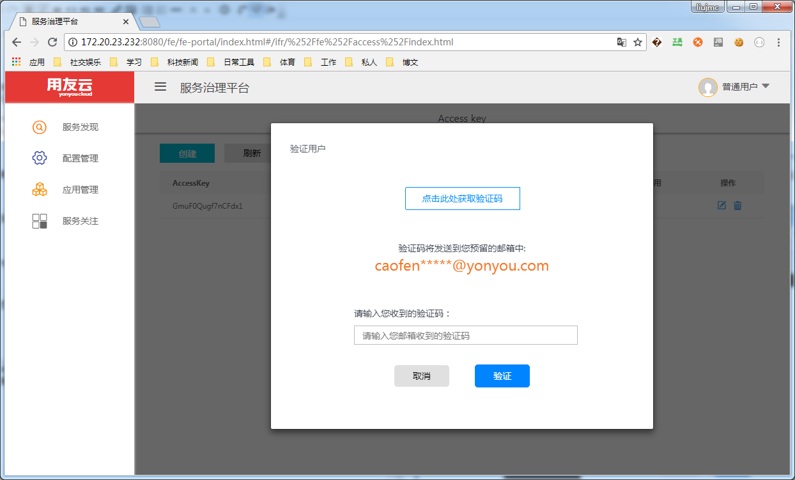
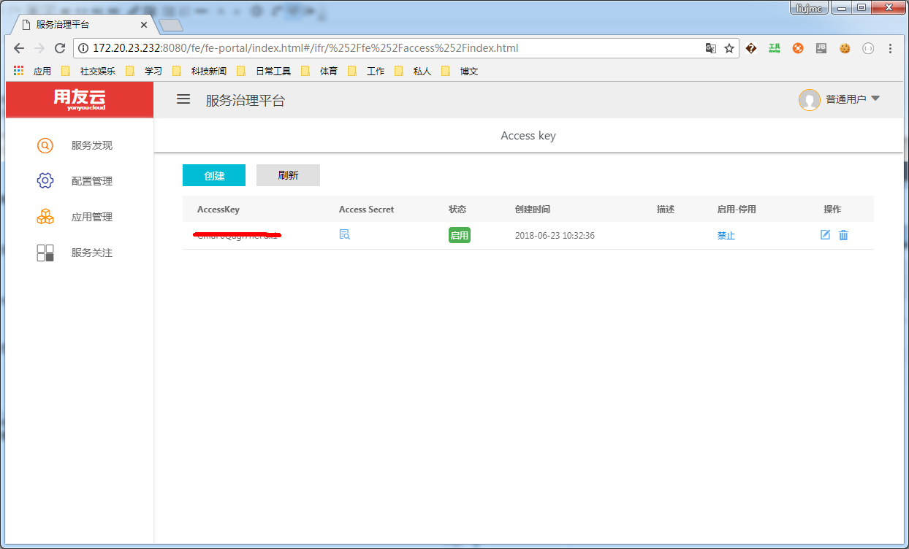

# AccessKey 使用说明

## AccessKey 介绍

微服务治理平台使用AccessKey的方式进行服务调用间的加签和认证，微服务工程在开发调试和正式部署的时候均需要配置AccessKey和Secret，开发者可以登录微服务治理平台进行申请。

微服务治理平台中，一般要求用户将AccessKey和秘钥配置在工程的属性配置文件中，例如classpath根目录的application.properties或者application.yml.

## AccessKey 申请流程

登录微服务治理平台，点击右上角下拉框中的Access Key，进入AccessKey列表界面:

在AccessKey 列表界面，点击创建按钮，进入验证码获取窗口，点击获取验证码，从邮箱接收验证码并输入进行验证，如下图：

点击验证后，生成新的AccessKey，

同理，通过邮件接收验证码的方式可以查看AccessKey对应的秘钥信息。将AccessKey和秘钥值配置到工程中，进行微服务的开发调试。

## 注意事项

- 请用户申请自身的AccessKey，切勿拷贝其他开发者的AccessKey信息，造成应用的权限问题；
- AccssKey的申请需要使用邮件形式，请确认用户信息的完整性；
- AccessKey和秘钥为用户在微服务治理平台的合法性认证依据，请勿泄露；
