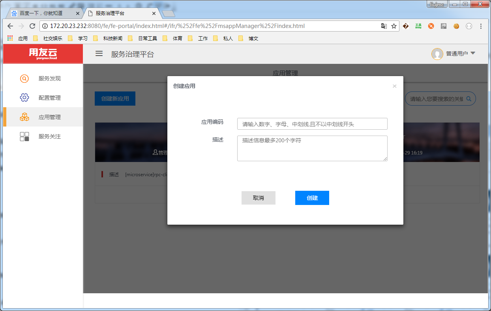
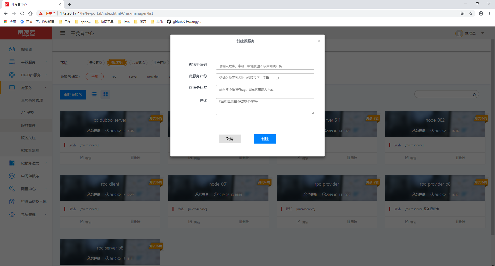
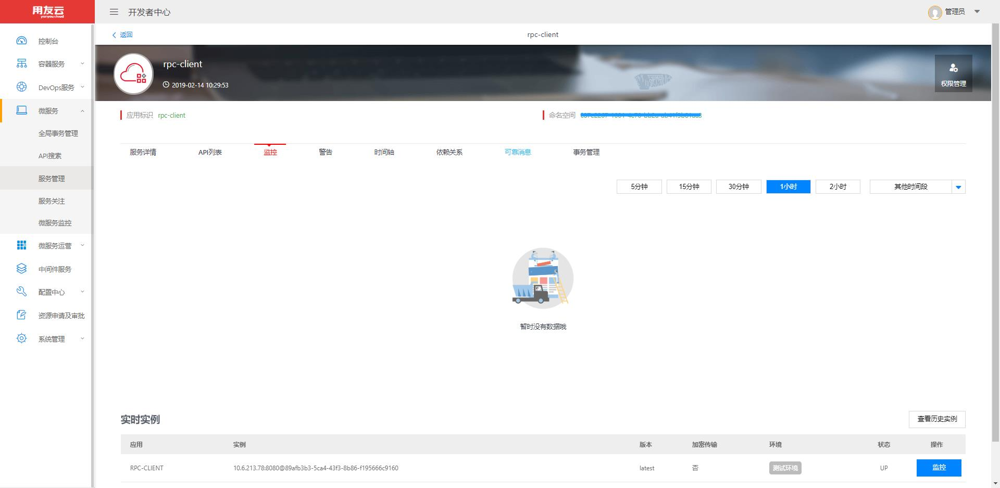
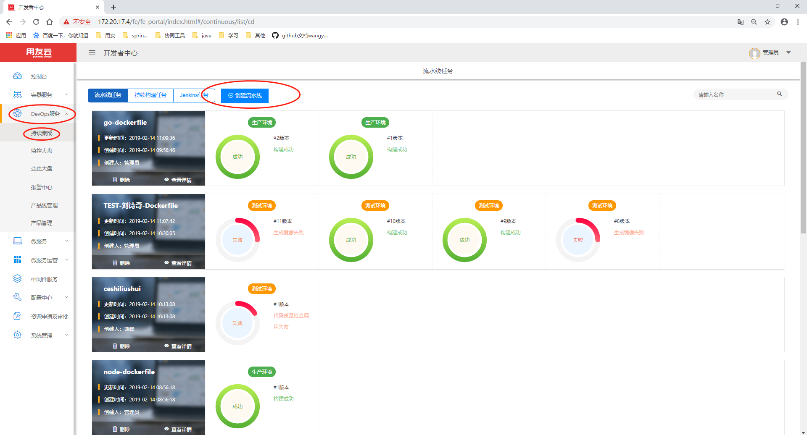
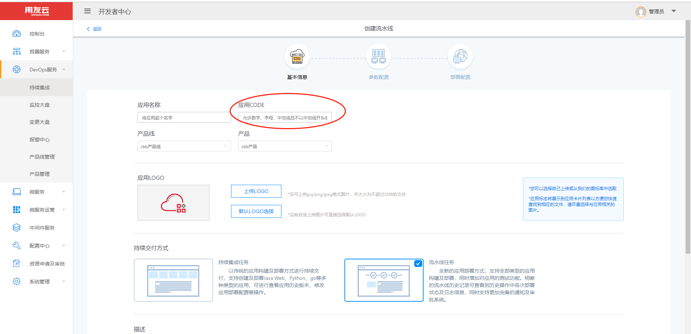
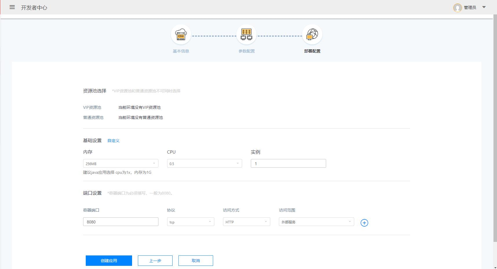
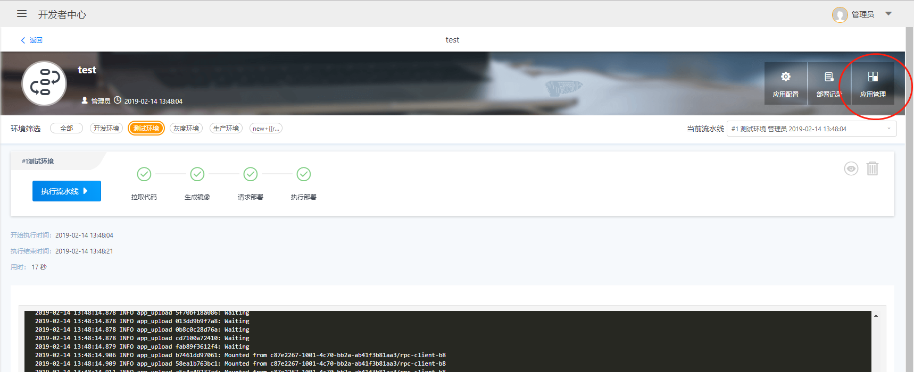
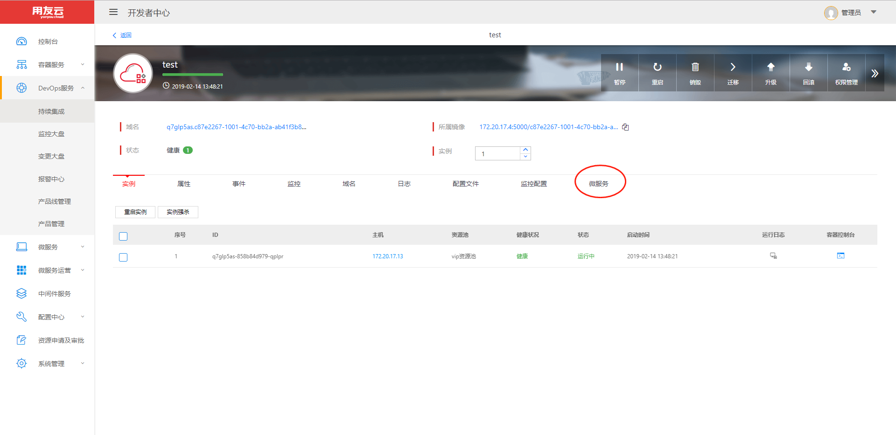
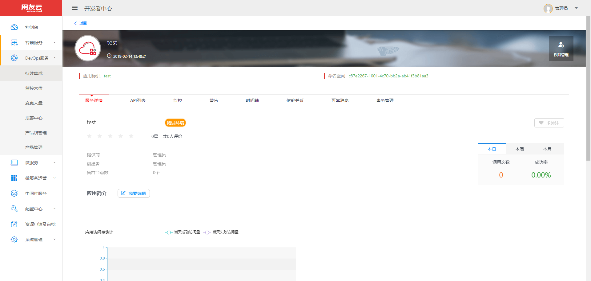

# 微服务应用创建

微服务类业务工程开发之前，可以先在微服务治理平台创建对应的应用，系统会初始化编码信息和配置文件，微服务开发过程和启动调试时，会和后端服务进行通信，处理应用的元数据。

服务开发完成之后，使用Tomcat等容器部署应用时，也可以在对应的应用中看到对应的信息。

## 创建微服务

**1：左侧边栏选择微服务--服务管理菜单，点击创建微服务按钮；**

**2：根据提示填写微服务应用名称和描述，点击创建；**

**3：微服务创建会自动建立全部环境的微服务；**

**4：成功的创建微服务以后，你可以运行本地的微服务应用测试一下；**
修改application.properties的配置项，加入

- access.key
- access.secret
- spring.application.name
- spring.profiles.active

其中spring.application.name项要与创建微服务的名字一致

比如我这里建立的微服务名字为rpc-client那么spring.application.name=rpc-client
启动以后可以通过微服务标签查看微服务的各种状态，例如查看启动实例：

## 在开发者中心部署微服务
如果想要在开发者中心的资源池运行微服务就要进行微服务部署，这里我们介绍一下流水线方式部署微服务的方法。

**本部分详细操作请参考开发者中心文档，流水线创建部分**

**1：左侧边栏选择DevOps服务菜单下的持续集成，点击页面中的创建流水线按钮；**

**2：按提示填入所需信息，注意：应用CODE这部分填入微服务应用创建的对应名称，应用名推荐与微服务名称一样；**

**3：第一次使用时产品线和产品是没有的需要预先创建产品线和产品；**

**4：填入相关信息后点击下一步，这一步需要用户填入应用类型、部署环境、编码类型、基础镜像等请按需选择；**

**5：填入相关信息后点击下一步，进入部署信息配置按照实际需求填入、资源池、基础设置、端口设置等；**

**6：填入相关信息后点击创建应用，流水线就创建完毕了；**

**7：点击流水线界面的红圈处按钮可以进入应用管理页面；**

**8：应用管理页面处选择微服务标签，就可以查看微服务相关信息了；**

**9：比如这里，查看一下部署实例，这个实例是通过流水线部署在线上资源池里的；**

这个页面也可以从微服务->服务管理页面进入

## 常见问题

**应用名称重复**

- 所输入的名称与已有的应用名重复，同一个租户下不允许有重复名称的应用；
