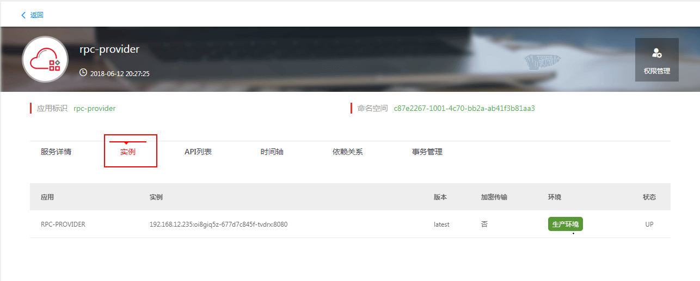

## 微服务应用部署

微服务应用开发完成之后，可以构建成war包，在Tomcat中进行部署。

## 部署应用 ##

**1：使用Maven命令进行工程的打包；**

	mvn clean package

**2：使用tomcat部署应用包；**

**3：应用启动成功后，可以应用管理菜单下搜索到对应的服务；**

## 注意事项 ##

**访问路径**

- 注意部署时服务的Context名称默认为war包名称，请注意示例测试访问时的URL路径正确；