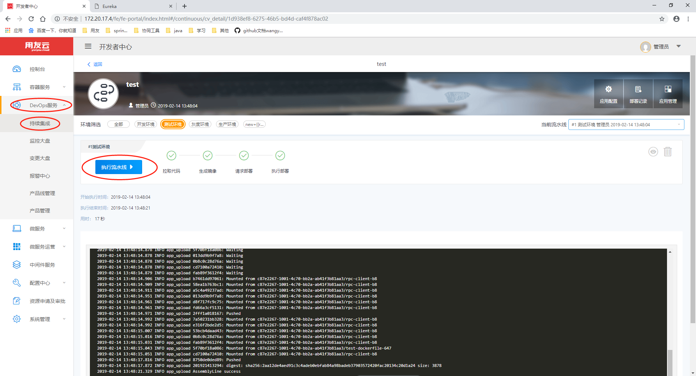
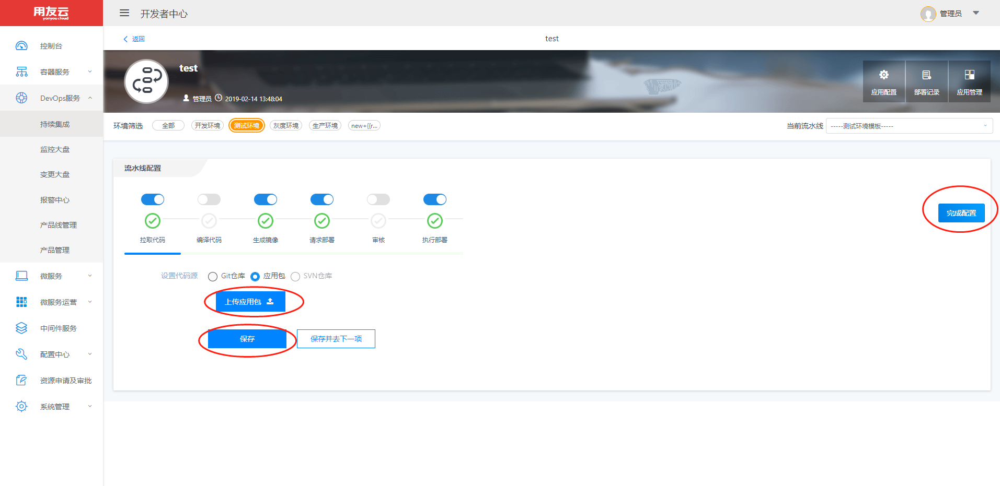

# 微服务应用更新

在微服务开发新的版本后，可以通过DevOps服务下的持续集成功能更新微服务应用的版本

## 代码更新 ##

**1：首先选择DevOps服务下的持续集成功能**

如果建立流水线时采用的是拉取代码进行编译的方式，那么在更新应用时我们直接点击执行流水线就可以了。

## 上传应用包更新 ##

**1.如果是采用上传应用包的方式生成的流水线，先选择一个对应环境模板。再点击编辑**

**2.进入流水线编辑页面以后，首先点击上传应用包步骤**

**3.上传新版本的应用包**

**4.点击完成配置**

**4.最后和代码更新一样点击执行流水线**
