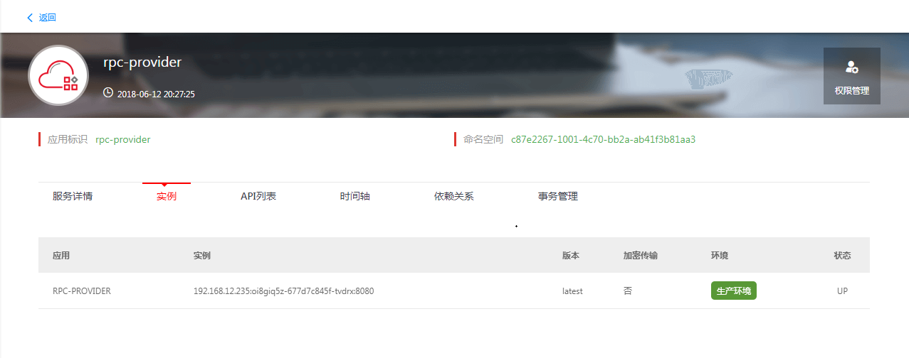
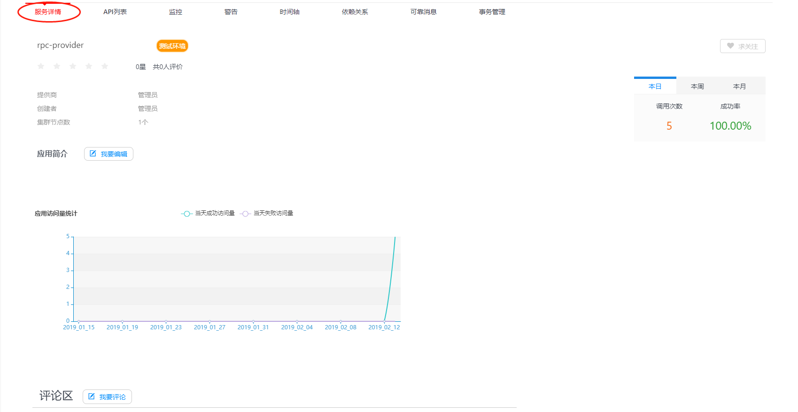
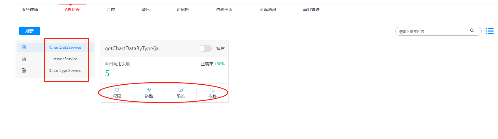
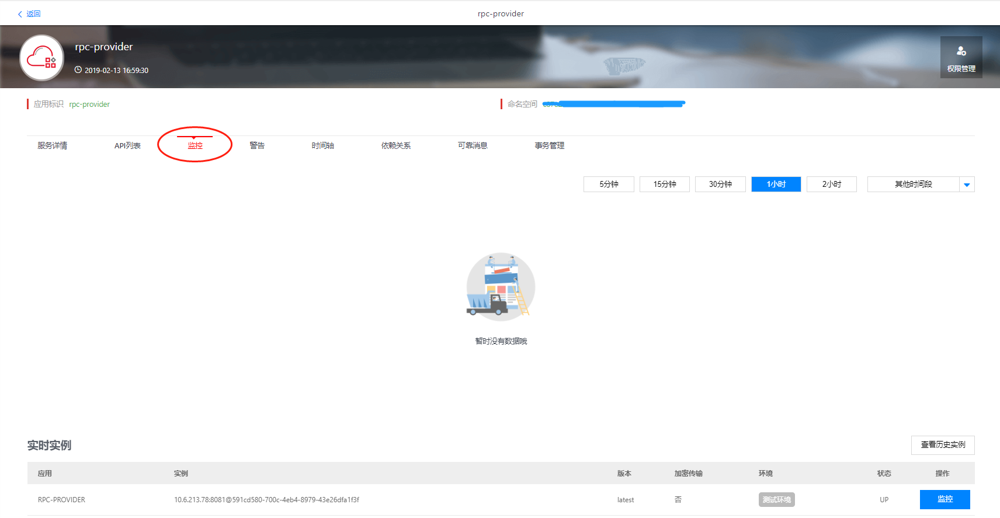
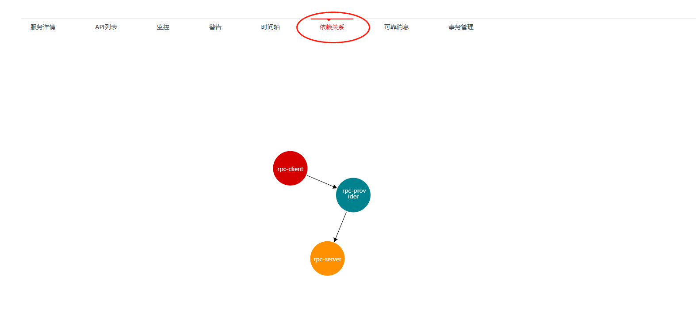
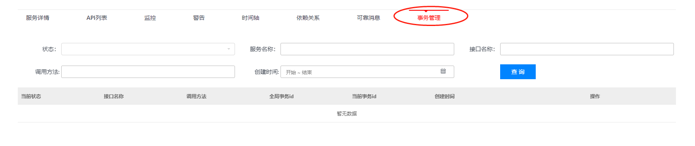

# 微服务调用与管理 #

## 一：服务启动 ##

**1：使用Jetty启动**

- 查看pom.xml中jetty-maven-plugin的端口配置,使用maven命令: `mvn jetty:run` 进行启动;
- 在eclipse中可右键Debug As > Maven build... > 在弹出框的Goals输入框中填写jetty:run, 然后点击Debug即可启动.

**2：使用Tomcat方式启动**

- 将工程使用mvn package的方式打成war包，部署在tomcat中, 启动即可.

## 二：服务注册 ##

**服务注册说明**
	
- 服务注册启动后会自动连接服务注册中心, 在服务注册中心可以看到对应的实例列表, 实例的格式为:"IP:主机名:端口号.部署环境", 一般在启动后两分钟内可注册到服务注册中心；

- 发起RPC调用时, 服务提供方需要已经启动并注册到服务注册中心, 否则会报错:`can not find active server from eureka! server url is ...`；

- 服务消费者和服务提供方都会注册到服务注册中心；

**客户端负载均衡**

说明：服务治理平台的注册中心可以动态的发现新注册和注销的实例信息，可以实现客户端调用服务端时的负载均衡，如果有多个服务端实例启动并注册成功，RPC调用会均匀的发送到各个实例。

## 三：服务调用 ##

RPC的远程调用通过客户端的本地Service的方法进行触发，可以在本地方法中调用服务端提供的远程接口。示例中给出的调用过程为：

1. 浏览器输入URL方位客户端的RestFulful服务；
2. 客户端的Controller访问本地的Service；
3. 本地Service通过Spring Bean的方式引入远程服务并调用；
4. 远程服务提供实现并返回数据；

例如，本地启动rpc-client工程，在浏览器中输入http://localhost:8080/rpc-client 进行调用，调用结果如下：

## 四：服务管理 ##

调用成功后，可以到微服务的管理控制台查看API信息、服务实例信息、统计信息等，也可以对服务进行限流控制和权限控制。

在服务治理平台管理界面中打开应用微服务-服务管理菜单，使用应用编码进行搜索，打开服务提供者对应的环境的卡片，展示如下：

**主控制台分服务详情、API列表、监控、警告、时间轴、依赖关系、可靠关系、事务管理等页签，主要功能说明如下:**

- 服务详情：展示服务的基本信息、环境、创建人、访问统计、评论等，还包含服务调用的周、月统计；

 
- API列表：展示RPC接口列表、方法列表，是链路查看、权限管理、依赖查看的功能入口；

- 监控：展示服务启动后，服务的调用状态、注册到注册中心的实例信息；

- 时间轴：以时间轴图形的方式展示服务API信息变化情况，可对比各个版本的变化；

- 依赖关系：图形化展示多个微服务间的调用关系； 
 

- 事务管理：展示异步调用的错误事务列表以及重试操作入口； 

# 常见问题

## 常见问题1：can not find active server from eureka! server url is ...

**出现此问题的原因有以下几种:**

- 服务提供方未启动或down掉

- 服务提供方因网络原因未注册到服务注册中心

- 服务提供方的部署时的对外服务端口和`application.properties`属性文件中配置的`server.port`属性值不一致.

- 服务提供方访问路径中的`ContextPath`与`application.properties`属性文件中配置的`spring.application.name`属性值不一致.

- 一般情况下, 项目名称、项目maven配置的artifactId、`application.properties`属性文件中配置的`spring.application.name`属性值 及 部署时的`ContextPath`这四项要一致; 项目部署时的对外服务端口和`application.properties`属性文件中配置的`server.port`属性值要一致, 如果使用内置Jetty还需要和`pom.xml`中`jetty-maven-plugin`插件的`port`值要一致.

## 常见问题2：项目往服务注册中心注册或注销操作有延迟.

**几个重要的时间段**

- 注册到服务注册中心:
	- 实例心跳上报时间间隔: 30秒; 第一次心跳在30秒后(参见:[HeartbeatThread](com.netflix.discovery.DiscoveryClient.initScheduledTasks() "HeartbeatThread") 和 [TimedSupervisorTask](com.netflix.discovery.TimedSupervisorTask.TimedSupervisorTask ("TimedSupervisorTask"))
	
- 实例状态刷新
	- 45秒如果服务注册中心未接收到心跳, 将会计划移除此实例.

- 拉取注册列表
	- 每30秒从服务注册中心拉取下最新的实例增量信息, 但服务增量信息将会在服务注册中心中保持3分钟.

- 注销
	- 在正常关闭容器(有执行shutdown操作而不是直接kill进程)的情况下, 客户端示例会向服务注册中心发送注销请求.
	- 服务器移除实例参见:[EvictionTask](com.netflix.eureka.registry.AbstractInstanceRegistry.EvictionTask "EvictionTask")

- 客户端注册/注销的时间延迟
	- 客户端注册/注销反应到所有的实例一般需要两分钟.
		- 注册:30秒注册+30标识为健康状态+30从服务注册中心拉取=90秒内.
		- 注销:直接kill进程情况下,43秒(优化前为60秒)定时移除过期实例和45秒(优化前为90秒)实例过期时间 +30秒被所有实例拉取=约75秒(优化前为120秒)内.

