# 微服务监控

微服务监控主要正对一下问题：
1. 服务启动失败
2. 微服务配置错误
3. RPC调用失败、异常
4. 异常的eos、cc调用
5. 实时的调用超时，次数、qps、失败率等
6. 统一查看微服务实例下的API 调用统计信息

我们主要通过两方面进行开发：全局监控、单个应用的监控

## 全局应用监控

全局监控是针对当前用户有权限访问的所有应用的监控数据，可以通过【微服务】中的【微服务监控】 进入查看。

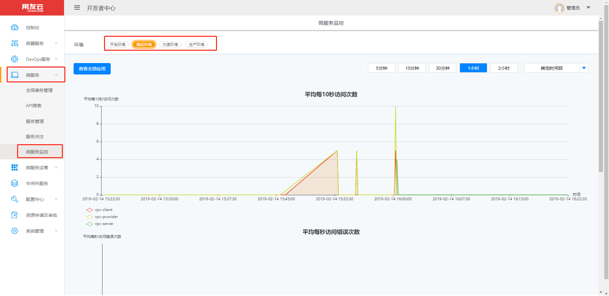

在这个界面有三个统计图实时更新， 分别为：平均每秒访问错误次数， 平均每秒访问次数， 响应时间

在这个页面中可以通过筛选环境来查看不同环境下的应用的监控数据，也可以在在右侧选择时间段来查看某个环境中某个时间段下的应用监控数据。默认我们展示前 10 条数据，点击左侧查看全部应用，查看全部应用的监控数据，当查看全部应用之后，可以切换查看前 10 条数据。

## 单个应用的监控

单个应用中会有多个实例，在【微服务】中【服务管理】页面中，点击某个应用进入单个应用，然后点击 tab 【监控】。

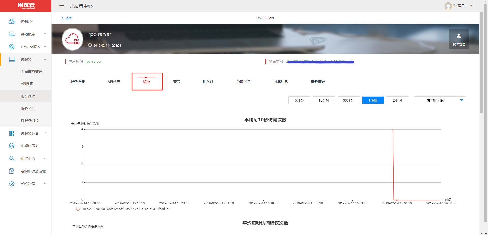

在当前页面分为两部分：

1. 实例监控统计数据

当前应用下所有实例的实时监控数据。同样有三个图：平均每秒访问错误次数， 平均每秒访问次数， 响应时间

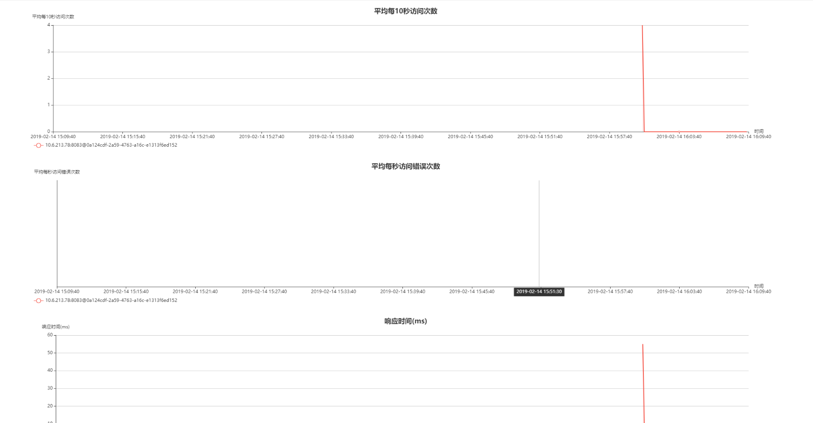

统计图可以通过选择统计图右上角的时间段来查看不同时间段的统计信息

2.  监控实例列表

当前应用下所有监控实例的详细信息。

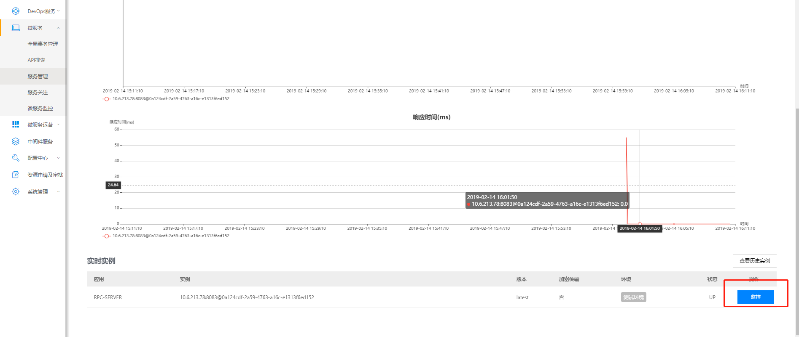

点击每个实例后面的 【监控】 按钮，会弹出当前监控中接口的统计信息和相关的配置信息。
可以通过切换按钮组来切换接口统计图和配置信息，在接口统计信息中，可以通过选择时间段来筛选不同时间段内接口的调用情况。

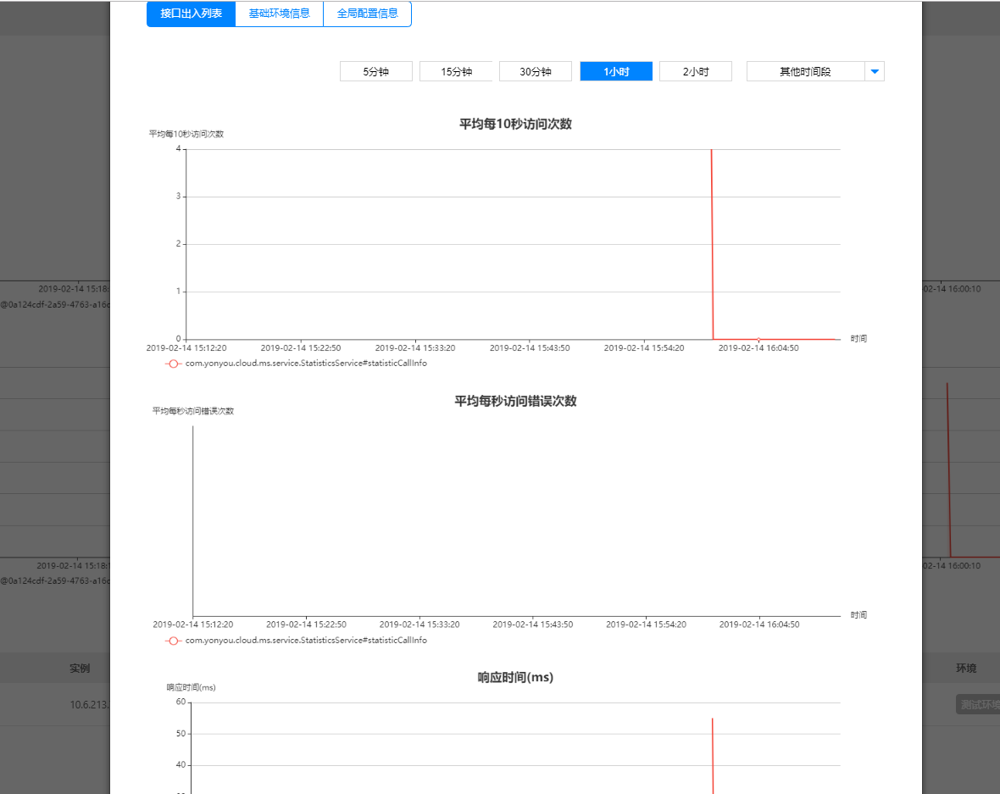
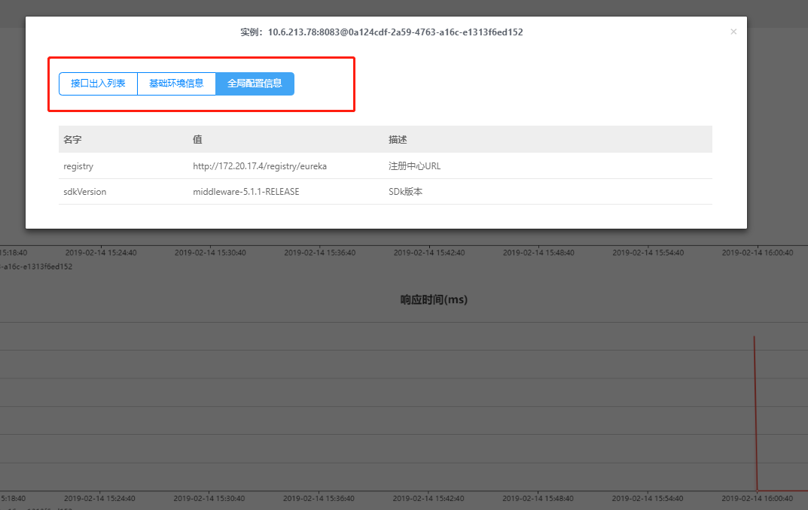

## 历史实例

在单个应用 【实例】tab 中，在实时实例列表右侧有【查看历史实例】按钮，点击进去就可以查看历史实例了，

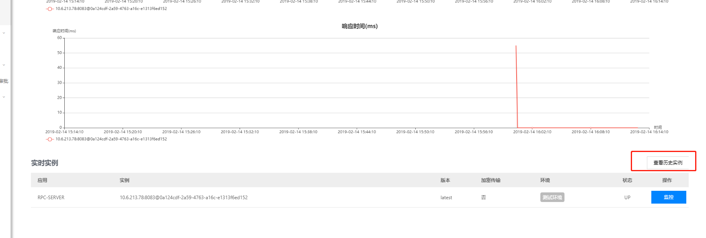
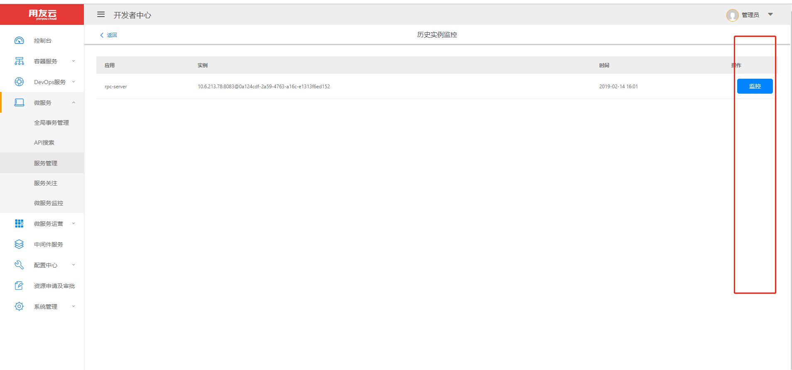
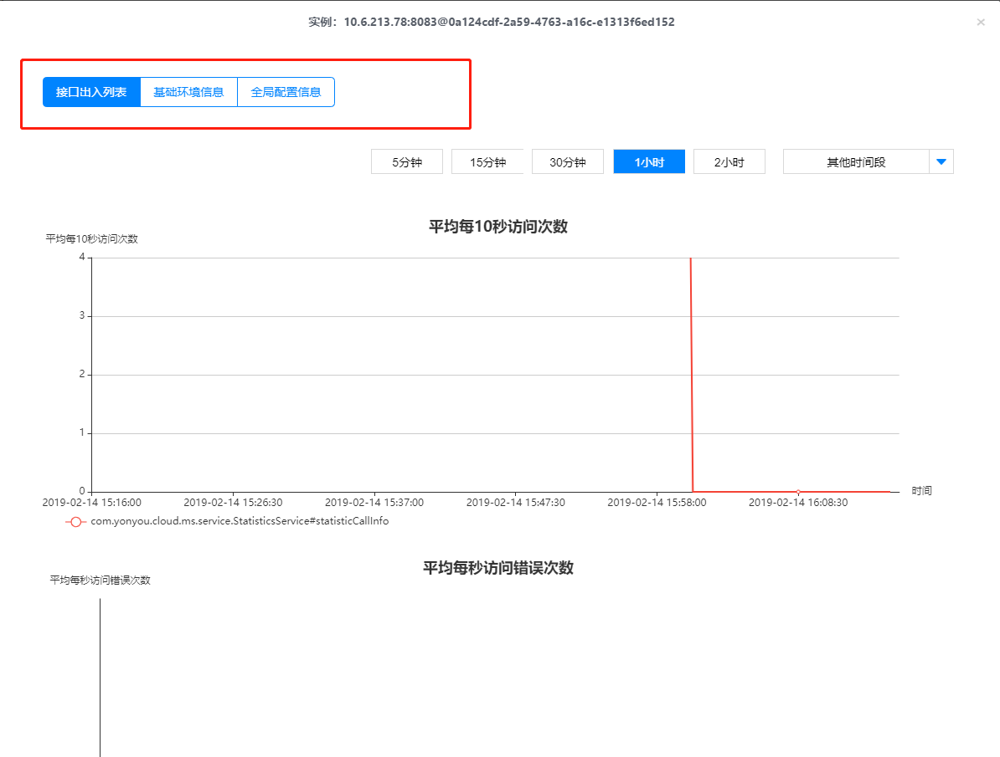

## 警告

在单个应用 【警告】tab 中，有所有异常事件列表，可以切换 error 和 warning，默认为 errorr，也可以通过选择特定事件段内的数据，点击某条数据中的详情按钮，可以查看数据输出的详细日志。

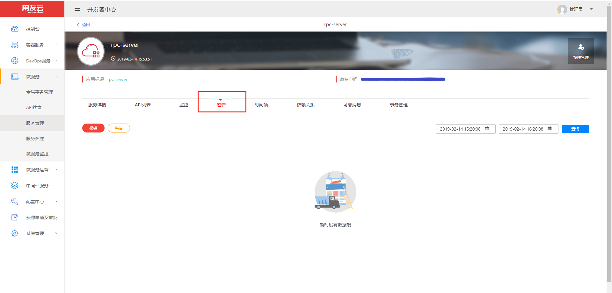
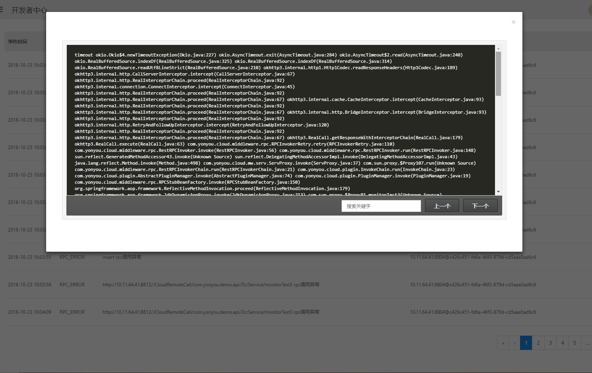

