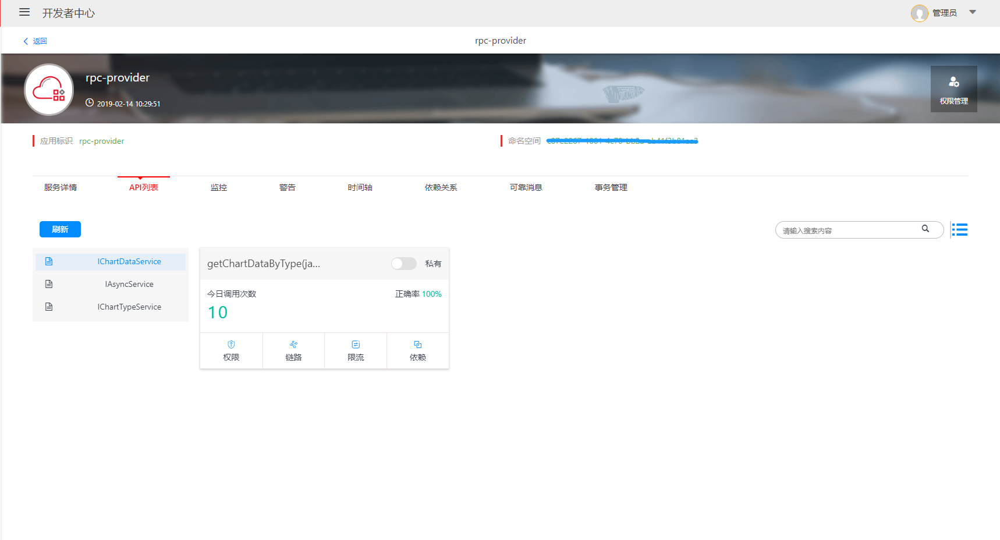
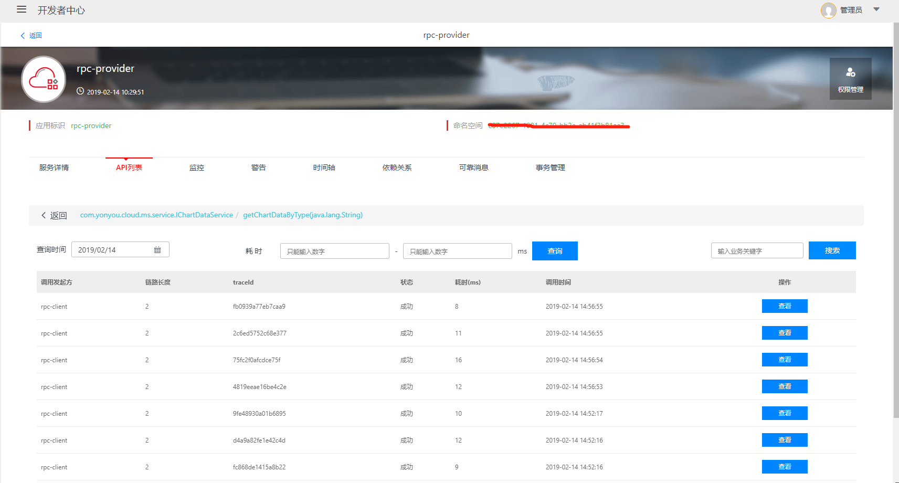
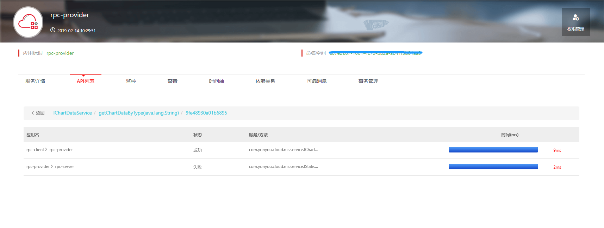
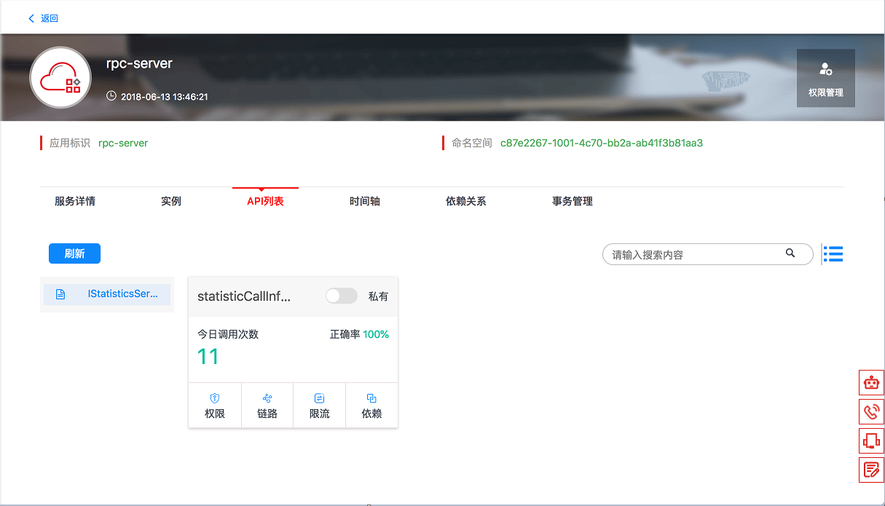
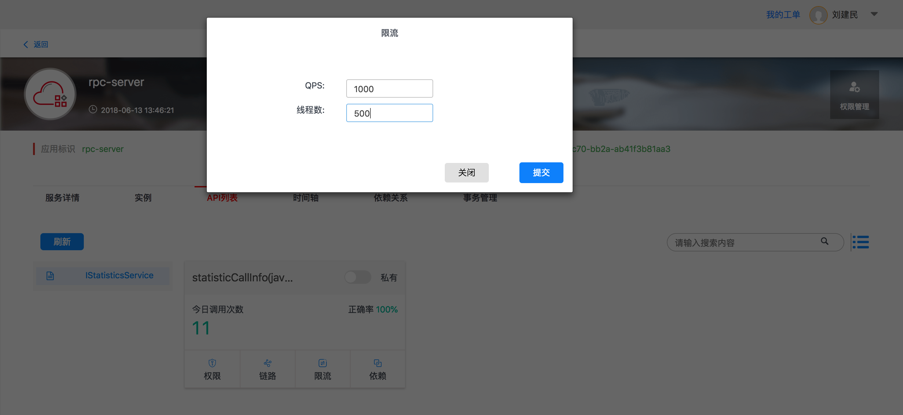

# 服务稳定性管控
服务治理平台提供流量限制和链路追踪功能，保障微服务稳定。服务的管理员可以在控制台可视化的设置针对某个接口的流量控制规则，限制访问的QPS和线程数；同时服务治理平台会对接口的调用进行记录，通过界面中的链路查看，可以跟踪业务的调用关系。

平台的RPC调用的SDK也提供熔断的功能，业务开发在实现业务逻辑时，可以在方法上使用熔断的API进行控制，编写补偿方法。

## 服务调用链路查看
在提供的示例中，rpc-client调用rpc-provider成功之后，可以在微服务的控制台查看调用的链路信息。

进入应用管理菜单，打开服务提供者的应用，例如rpc-provider，进入应用信息的多页签界面，点击“API”列表，如下图所示：

选择接口下的方法，点击“链路”按钮，进入链路列表查看界面，如下图：

可以根据方法调用的开始时间、结束时间、调用耗时、业务关键字等条件进行综合查询，针对查询结果，可以点击查看按钮，进入某次调用的具体调用链路，如下图：

根据链路详情可以查看到应用调用的层级，调用结果状态、每个层级中调用到的方法、IP、耗时等信息。

## 服务调用流量控制

管理者可以对服务提供者的某个具体方法进行限流设置，通过设置QPS和线程数，控制实例的流入流量。

进入应用管理菜单，打开服务提供者的应用，例如rpc-provider，进入对应的环境下的微服务多页签界面，点击“API”列表，进入列表、卡片界面，如下图：

点击“限流”按钮，进入限流设置界面，如下图：

输入QPS和线程数，点击提交按钮。治理平台会将用户的设置动态下发到运行的实例中，进行流量控制。当请求的压力大于设置的阈值时，流控模块会生效，返回调用方特殊的异常信息。

## 熔断控制
业务开发在实现业务逻辑时，可以在方法上使用熔断的API进行控制，编写补偿方法。详细的编程示例请参考本文档的开发指南部分。

