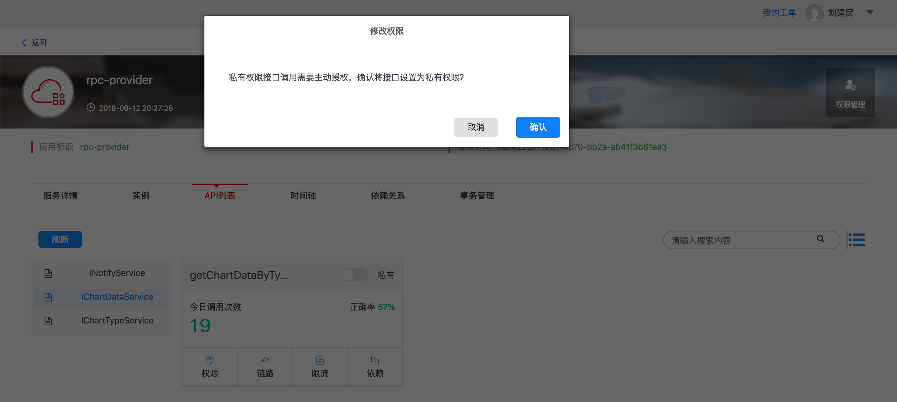
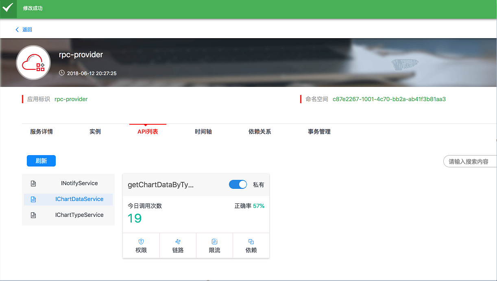
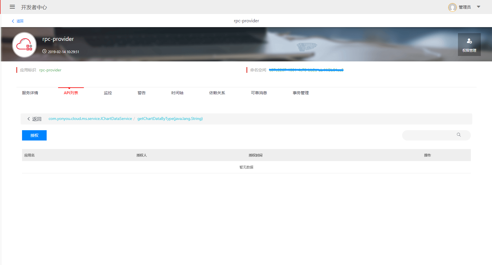
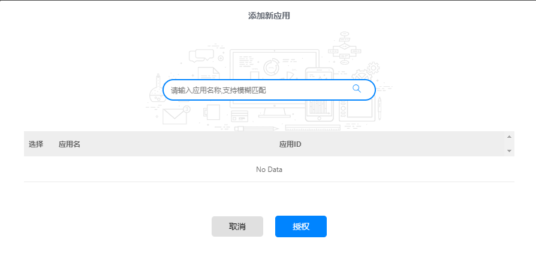
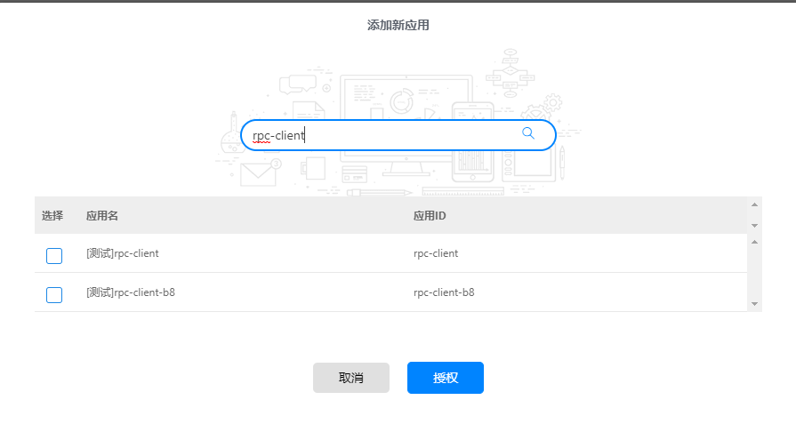
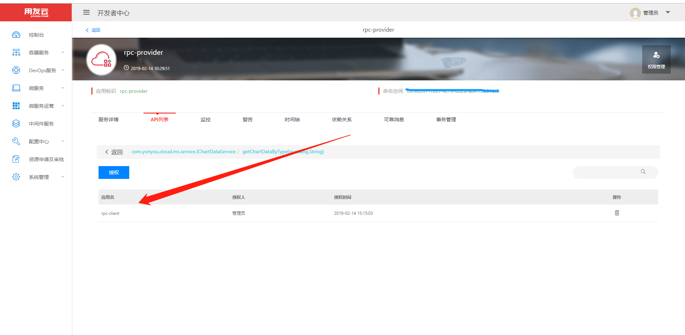
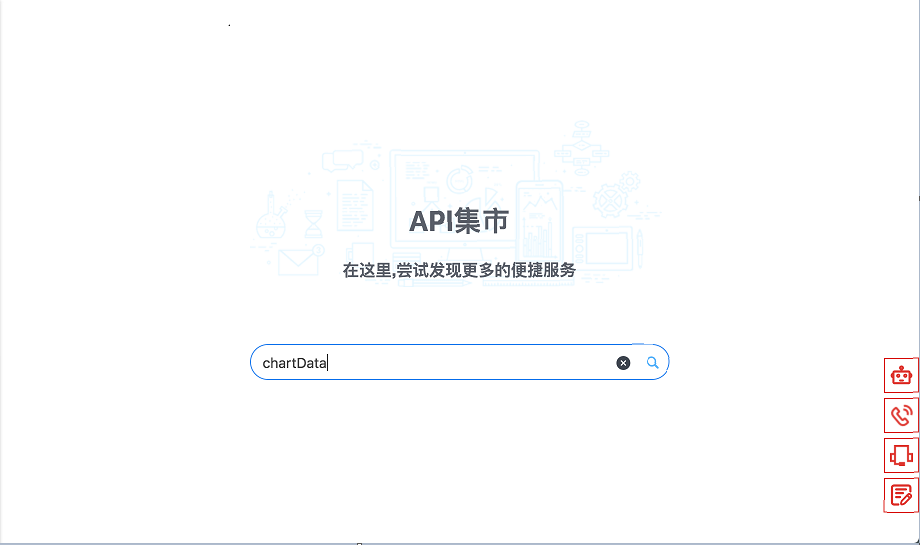
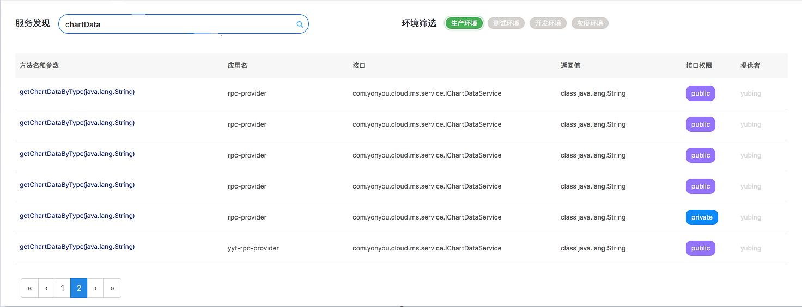
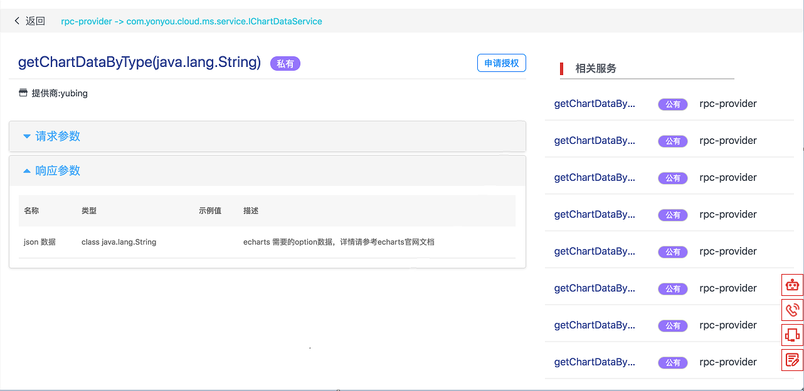
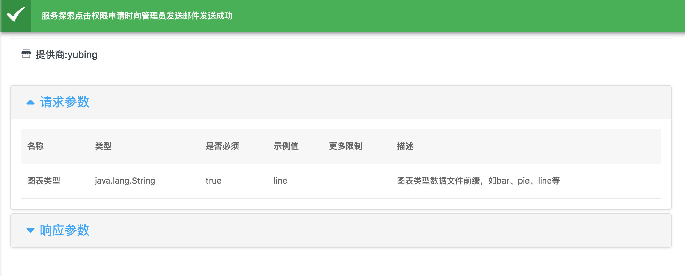

# 服务权限管理
服务治理平台对微服务调用进行了权限控制，用户对服务下的特殊接口设置权限后，只有授权的服务调用方才能访问的到，尤其针对线上环境的微服务接口，提供了安全性保障。

## 权限设置

进入微服务--服务管理菜单，打开服务提供者的应用，例如rpc-provider，进入对应的环境下的微服务多页签界面，点击“API”列表，进入列表、卡片界面，选中需要设置权限的接口，界面会以卡片或者列表的方式展示接口下的方法。

元数据中暴露的远程方法默认为公有，如果需要设置权限，点击公有/私有开关，会弹出确认窗口，如下图所示：

点击确认按钮，设置提示权限成功，如下图：

设置为私有权限的接口，允许对其它调用者进行授权，在公有权限的方法上点击权限按钮会弹出禁止操作警告。

## 服务授权

设置为私有权限的方法，在RPC方法进行调用时后台会提示错误，不能访问通过。可以添加允许访问的应用，点击权限按钮，跳转到方法的授权界面，如下图：

点击授权按钮，弹出添加应用窗口，如下图所示：

在搜索框输入允许调用的应用的名称，点击回车进行查询，结果如下图所示：

选择允许访问的应用，点击授权按钮，提示授权成功，列表页展示已经添加的授权应用列表，如下图：

再次对远程方法进行调用测试，授权的应用可以调用通过，未授权的应用调用时后台提示权限错误。

## 调用申请

用户在服务发现下可以根据关键字搜索需要的远程接口和方法，如果方位设置了私有的权限，可以申请调用。

例如，在微服务--api搜索的搜索界面输入chartData关键字进行查询，如下图所示：

搜索后，界面显示查询结果，列表中包含私有权限的服务，如下图所示：

选择私有权限的方法对应的行，点击进入方法的详细信息页面，如下所示：

针对私有权限的方法，点击申请授权按钮，弹出应用选择界面，选中需要授权的应用，点击申请按钮，申请成功，弹出申请成功提示，如下图所示：

等待服务提供方的管理员授权后，调用方即可调用。

