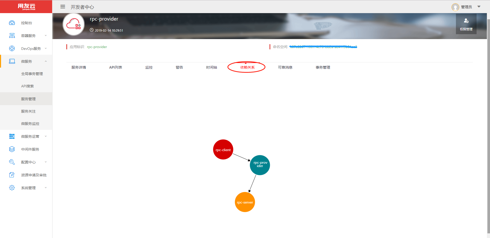

# 服务依赖管理

服务治理平台会定期根据RPC接口的调用记录，计算出各个应用之间的调用关系，并在统一的管控面针对不同的应用进行具体的图表展示，管理员可以查看其应用和其他应用之间的依赖关系。

针对某个指定的接口，也可以查看此接口和其上下游接口间的调用依赖关系。

## 服务依赖

服务依赖是指本服务与其他微服务的依赖关系，可以在【微服务--服务管理】进入服务，打开微服务多页签下面的【依赖关系】进入查看

**箭头指向方向为被依赖方**

如图所示我们进入的是rpc-provider应用，rpc-provider依赖rpc-server,而rpc-provider被rpc-client依赖

## 接口依赖

接口依赖是指本服务某个指定的接口与其他微服务的调用接口之间的依赖关系，可以在【微服务-服务管理】进入你的服务打开微服务多页签界面下的API列表卡片，选中具体的接口和方法，点击依赖链接进行查看。