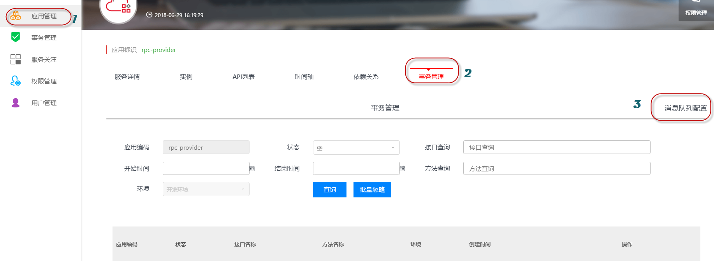
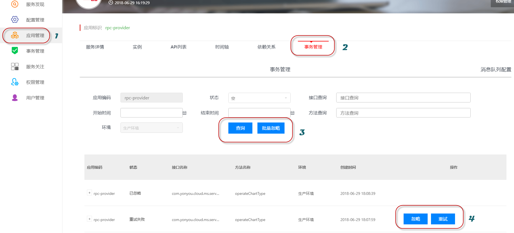

# EOS异步一致性框架·用户指南

## 产品介绍

企业级分布式异步调用数据一致性组件（名称 EOS）, 为企业提供高可用和分布式的异步数据一致性解决方案。

EOS 充分利用快速的异步消息和本地事务，并在此基础上提供了一系列强大的功能，包括事务内的消息发送和接收处理、人工对账控制台、重试/忽略异常消息、链路追踪等。这些功能经过严苛的压力测试和稳定性测试, 保证EOS的高性能和稳定性。

通过 EOS，您可以轻松构建异步调用服务，为您的服务建设大规模异步快速调用，保证数据的最终一致性，以满足不断增长的业务需求。

## 功能介绍

* 提供接口的异步调用和处理能力.
* 保证接口调用和接收处理的数据一致性, 并保证整个调用过程的最终数据一致性.
* 提供人工对账界面, 对于超出重试次数的业务调用进行人工干预处理.
* 提供公共消息中间件, 也可自建由用友云提供消息中间件的连接认证.

## EOS架构图

## EOS控制台
* EOS控制台为EOS处理异常消息的事务管理界面, 为用户提供了业务无法通过重试成功的消息的查询及重试/忽略操作界面.

* 在使用EOS框架前, 需要配置应用的RabbitMQ地址:
	* 页面导航: 开发者中心左边菜单 &gt;&gt; 微服务 &gt;&gt; 服务管理 &gt;&gt; 找到对应的应用 &gt;&gt; 点进对应的环境 &gt;&gt; 微服务 &gt;&gt; 事务管理 &gt;&gt; 消息队列配置 &gt;&gt; 在输入框中填写RabbitMQ地址, 如: IP1:Port1,IP2:Port2; 参见下图:

* 消息地址配置输入框:

* 配置完消息地址后, 按照异步框架的开发指南进行工程配置, 若有异常会上报到EOS控制台; 按照以下步骤查询异常消息: 
开发者中心左边菜单 &gt;&gt; 微服务 &gt;&gt; 服务管理 &gt;&gt; 找到对应的应用 &gt;&gt; 点进对应的环境 &gt;&gt; 微服务 &gt;&gt; **事务管理** &gt;&gt;

* 点击重试后会下发命令到客户端进行重试, 客户端重试完成后会上报重试结果, 重试成功后会在状态列中显示"重试成功", 否则显示"重试失败".
* 点击忽略后会下发命令到客户端进行忽略, 被忽略的消息应交由人工处理, 进行数据的校对和检查.

