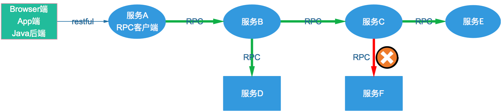
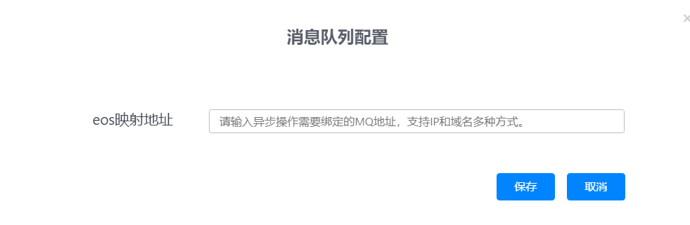
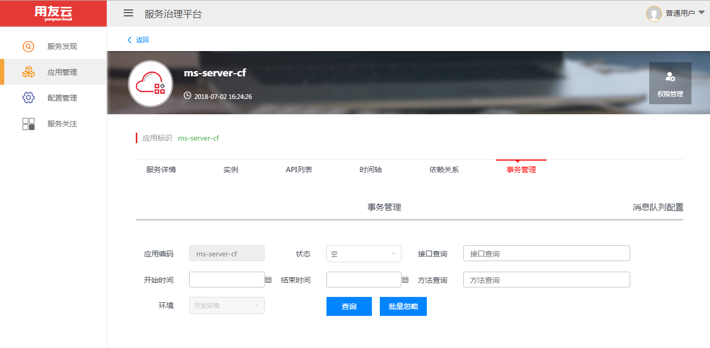
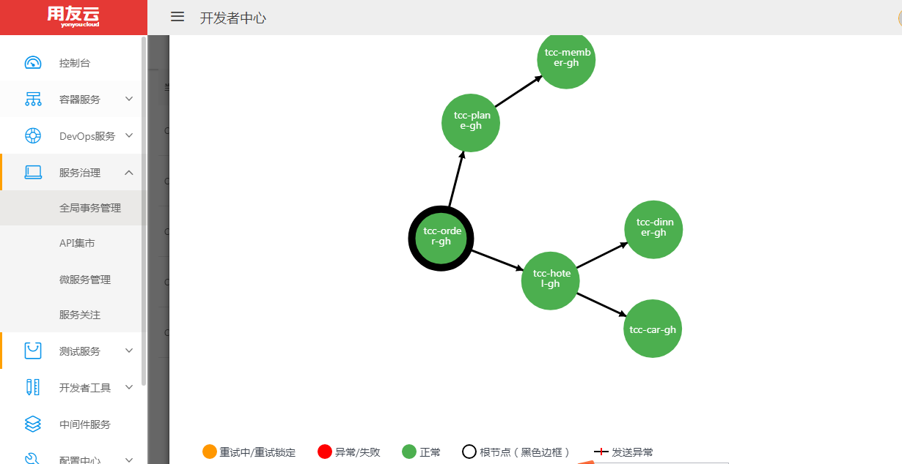

#SagasTransaction分布式事务框架·用户指南

## 产品介绍

SagasTransaction分布式事务框架是解决微服务开发环境中，事务一致性问题而提出的一种解决方案，
SagasTransaction是一个没有事务协调器、没有事务中心概念，事务由各个参与者共同完成整个事务的管理，是用友微服务治理平台提供的
一个核心功能组件。


## 功能介绍

* 解决分布式事务一致性问题，业务使用分布式事务一致性功能只需两个注解，  @SagasTransactional(cancel="cancelOrder")标识业务方法需要使用分布式事务
  cancel属性指定了业务异常时的补偿方法，与业务方法在同一个接口中实现，补偿方法上加入  @Async注解
* 基于可靠消息的异步调用框架（EOS）的最终一致性
* 支持链式rpc调用中各个业务节点的事务一致性
* 基于用友微服务治理平台rpc框架Iris
* 事务信息数据与业务库一起，保证业务与消息发送一致性，分布式事务数据记录由框架自行操作，用户无需关心
* 框架不提供隔离机制，业务本身需具备可回退性，在业务方法执行本地事务时，可将用户数据存储到当前事务上下文中，然后在补偿方法内可以根据工具获取，间demo
* 补偿方法第一个参数为SagasTransactionContext context，代表当前事务上下文信息
* cancel方法必须确保幂等性操作


## SagasTransaction事务场景
* SagasTransaction分布式事务框架解决rpc链式同步调用事务一致性



## SagasTransaction事务异步消息
* 在使用SagasTransaction框架前, 需要配置应用的RabbitMQ地址:
	* 页面导航: 开发者中心左边菜单 &gt;&gt; 微服务 &gt;&gt; 服务管理 &gt;&gt; 找到对应的应用 &gt;&gt; 点进对应的环境 &gt;&gt; 微服务 &gt;&gt; 事务管理 &gt;&gt; 消息队列配置 &gt;&gt; 在输入框中填写RabbitMQ地址, 如: IP1:Port1,IP2:Port2; 参见下图:

* 消息地址配置输入框:


* 配置完消息地址后, 按照异步框架的开发指南进行工程配置, 若有异常会上报到EOS控制台; 按照以下步骤查询异常消息: <p>开发者中心左边菜单 &gt;&gt; 微服务 &gt;&gt; 服务管理 &gt;&gt; 找到对应的应用 &gt;&gt; 点进对应的环境 &gt;&gt; 微服务 &gt;&gt; **事务管理** &gt;&gt;</p>
* 点击重试后会下发命令到客户端进行重试, 客户端重试完成后会上报重试结果, 重试成功后会在状态列中显示"重试成功", 否则显示"重试失败".
* 点击忽略后会下发命令到客户端进行忽略, 被忽略的消息应交由人工处理, 进行数据的校对和检查.



## SagasTransaction事务管理控制台
* SagasTransaction控制台为分布式事务控制管理提供了可视化的界面, 当分布式事务节点cancel异常，导致事务最终不一致的时候提供人工介入处理的途径，可以通过该界面，查看当前
全局不一致的事务，并可以发起补偿操作。进入开发者中心左边"服务治理"->"事务管理"进入事务管理页面，显示当前事务列表（只显示出现过不一致的全局事务）

* 点击详情进入该全局事务，可以查看该事务所有事务节点状态，发送事务或接收事务失败则可进行人工重试，重试后状态变为重试中，重试成功后事务状态一致


## SagasTransaction事务使用
* 业务场景，见图，实箭头表示同步调用，虚箭头为异步调用  

* 引入相关jar包
```
		<dependency>
			<groupId>com.yonyou.cloud.middleware</groupId>
			<artifactId>eos-spring-support</artifactId>
			<version>${mw.version}</version>
		</dependency>
		<dependency>
			<groupId>com.yonyou.cloud.middleware</groupId>
			<artifactId>Sagastrans-spring-support</artifactId>
			<version>${Sagastrans-spring-support.version}</version>
		</dependency>
		<dependency>
			<groupId>com.yonyou.cloud.middleware</groupId>
			<artifactId>mwclient</artifactId>
			<version>${mw.version}</version>
			<type>pom</type>
		</dependency>
```

* 编写业务接口，包括业务方法和补偿方法，通过分布式事务注解来实现
```
       /**
        * 订单服务
        * @author Administrator
        *
       */
      @RemoteCall(AppConstant.APP_INFO_ORDERSERVICE)
      public interface IOrderService {
	   @ApiOperation(value="下旅游订单", response=TourOrder.class)
	   @SagasTransactional(cancel="cancelOrder")
	   public abstract TourOrder order(TourOrder paramTourOrder);
	  
	   @ApiOperation(value="取消旅游订单", response=TourOrder.class)
	   @Async
	   public abstract TourOrder cancelOrder(SagasTransactionContext context, TourOrder paramTourOrder);
       }

       /**
        * 机票预订服务
        * @author Administrator
        *
        */
       @RemoteCall(AppConstant.APP_INFO_PLANESERVICE)
       public interface IMsPlaneService {
	  @ApiOperation(value="预订机票", response=Void.class)
	  @SagasTransactional(cancel="cancelPlane")
	  public abstract void orderPlane(PlaneOrder paramPlaneOrder);
	  
	  @ApiOperation(value="取消机票预定", response=Void.class)
	  @Async
	  public abstract void cancelPlane(SagasTransactionContext context, PlaneOrder paramPlaneOrder);
	  
	  @ApiOperation(value="测试", response=String.class)
	  @Async
	  public abstract String testAsync(String hello);
       }
       

       /**
        * 积分服务
        * @author Administrator
        *
        */
       @RemoteCall(AppConstant.APP_INFO_MEMBERSERVICE)
       public interface IMsMemberService {
	   @ApiOperation(value="会员积分", response=Void.class)
	   @SagasTransactional(cancel="cancelPoints")
	   public abstract void addPoints(String paramString1, String paramString2, Double paramDouble);
	  
	  @ApiOperation(value="取消会员积分", response=Void.class)
	  @Async
	  public abstract void cancelPoints(SagasTransactionContext context, String paramString1, String paramString2, Double paramDouble);
       }


       /**
        * 酒店预订服务
        * @author Administrator
        *
        */

      @RemoteCall(AppConstant.APP_INFO_HOTELSERVICE)
      public interface IMsHotelService {
	   @ApiOperation(value="预订酒店", response=Void.class)
	   @SagasTransactional(cancel="cancelHotel")
	   public abstract void orderHotel(HotelOrder paramHotelOrder);
	  
	   @ApiOperation(value="取消酒店预订", response=Void.class)
	   @Async
	   public abstract void cancelHotel(SagasTransactionContext context, HotelOrder paramHotelOrder);
      }

       /**
        * 车辆预订服务
        * @author Administrator
        *
        */
       @RemoteCall(AppConstant.APP_INFO_CARSERVICE)
       public interface IMsCarService {
	    @ApiOperation(value="车辆预订", response=Void.class)
	    @SagasTransactional(cancel="cancelCar")
	    public abstract void orderCar(CarOrder paramCarOrder);
	  
	    @ApiOperation(value="取消车辆预订", response=Void.class)
	    @Async
	    public abstract void cancelCar(SagasTransactionContext context, CarOrder paramCarOrder);
      }


      /**
       * 餐饮预订服务
       * @author Administrator
       *
       */
      @RemoteCall(AppConstant.APP_INFO_DINNERSERVICE)
      public interface IMsDinnerService {
	
	  @ApiOperation(value="餐饮预定", response=Void.class)
	  @SagasTransactional(cancel="cancelDinner")
	  public abstract void orderDinner(DinnerOrder paramDinnerOrder);
	  
	  @ApiOperation(value="取消餐饮预定", response=Void.class)
	  @Async
	  public abstract void cancelDinner(SagasTransactionContext context, DinnerOrder paramDinnerOrder);
      }

      /**
       * 异步服务，测试事务边界
       * @author Administrator
       *
       */
     @RemoteCall(AppConstant.APP_INFO_MSGSERVICE)
     public interface IMsMsgService {
	   @ApiOperation(value="短信服务", response=Void.class)
	   @SagasTransactional(cancel="cancelMsg")
	   @Async
	   public abstract void sendMsg(String phone, String msg, String bizId);
	  
	   @ApiOperation(value="取消短信服务", response=Void.class)
	   @Async
	   public abstract void cancelMsg(SagasTransactionContext context, String phone, String msg, String bizId);
     }


     /**
      * 短信计费服务
      * @author Administrator
      *
     */
     @RemoteCall(AppConstant.APP_INFO_MSGfEESERVICE)
     public interface IMsMsgFeeService {
	   @ApiOperation(value="短信计费服务", response=Void.class)
	   @SagasTransactional(cancel="cancelMsgFee")
	   public abstract void MsgFee(String bizId, Double fee);
	  
	   @ApiOperation(value="取消短信计费服务", response=Void.class)
	   @Async
	   public abstract void cancelMsgFee(SagasTransactionContext context, String bizId, Double fee);
     }


      
```

* 服务提供方实现业务接口
```

   /**
    * 订单服务
    * @author Administrator
    *
    */
   public class OrderService implements IOrderService {
	 private static final Logger logger = LoggerFactory
			.getLogger(OrderService.class);
	@Autowired
	private JdbcTemplate jdbcTemplate;
	@Autowired
	private IMsPlaneService msPlaneService;
	@Autowired
	private IMsHotelService msHotelService;

	@Transactional
	public TourOrder order(TourOrder dto) {
		this.jdbcTemplate
				.update("insert into biz_tourorder (orderName,userId,userName,dest,status,tourOrderId)values (?,?,?,?,?,?)",
						new Object[] { dto.getOrderName(), dto.getUserId(),
								dto.getUserName(), dto.getDest(),
								dto.getStatus(), dto.getTourOrderId() });
		PlaneOrder planeOrder = new PlaneOrder();
		planeOrder.setAirport("首都国际机场");
		planeOrder.setArrive("上海虹桥机场");
		planeOrder.setPlaneNo("SagasAC5982");
		planeOrder.setPlaneOrderId(UUID.randomUUID().toString());
		planeOrder.setPrice(Double.valueOf(2903.0D));
		planeOrder.setStart(new DateTime().toString());
		planeOrder.setUserId(dto.getUserId());
		planeOrder.setStatus("NORMAL");

		this.msPlaneService.orderPlane(planeOrder);
		HotelOrder hotelOrder = new HotelOrder();
		hotelOrder.setStart(new DateTime().toString());
		hotelOrder.setEnd(new DateTime().toString());
		hotelOrder.setHotelName("锦江之星宾馆");
		hotelOrder.setHotelOrderId(UUID.randomUUID().toString());
		hotelOrder.setRoomNo("401");
		hotelOrder.setStatus("NORMAL");
		hotelOrder.setUserId(dto.getUserId());
		hotelOrder.setUserName(dto.getUserName());
                //保存业务数据到当前事务上下文中，可以在回退逻辑中获取
		this.msHotelService.orderHotel(hotelOrder);
				try {
			SagasTransactionUtils.setContext(OBJECT_MAPPER.writeValueAsString(dto));
		} catch (JsonProcessingException e) {
			// TODO Auto-generated catch block
			e.printStackTrace();
		}

		return dto;
	}

	@Transactional
	public TourOrder cancelOrder(SagasTransactionContext context,TourOrder dto) {
	        //获取当前上下文用户数据
		String restore = SagasTransactionUtils.getContext(context);
		this.jdbcTemplate.update(
				"update biz_tourorder set status=?  where tourOrderId=?",
				new Object[] { AppConstant.DELETED, dto.getTourOrderId() });
		return dto;
	}


       /**
        * 机票预订服务
        * @author Administrator
        *
        */
      @Service("msPlaneService")
      public class MsPlaneService implements IMsPlaneService {
	   private static final Logger logger = LoggerFactory
			.getLogger(MsPlaneService.class);
	
	   @Autowired
	   private JdbcTemplate jdbcTemplate;
	   @Autowired
	   IMsMemberService msMemberService;
	   public static final ObjectMapper OBJECT_MAPPER = new ObjectMapper();
	
	   @Transactional
	   public void orderPlane(PlaneOrder dto) {
			this.jdbcTemplate
					.update("insert into biz_planeorder(start,arrive,airport,price,userId,planeNo,planeOrderId,status) values (?,?,?,?,?,?,?,?)",
							new Object[] { dto

							.getStart(), dto.getArrive(), dto.getAirport(),
									dto.getPrice(), dto.getUserId(),
									dto.getPlaneNo(), dto.getPlaneOrderId(),
									dto.getStatus() });
	
		Double points = Double.valueOf(0.1D);
		String bizId = UUID.randomUUID().toString();
		try {
			SagasTransactionUtils.setContext(OBJECT_MAPPER.writeValueAsString(dto));
		} catch (JsonProcessingException e) {
			// TODO Auto-generated catch block
			e.printStackTrace();
		}
		this.msMemberService.addPoints(dto.getUserId(), bizId, points);
	   }

  	  @Transactional
	  public void cancelPlane(SagasTransactionContext context, PlaneOrder dto) {
		String restore = SagasTransactionUtils.getContext(context);
		logger.info("===========================" + restore);
		this.jdbcTemplate.update(
				"update biz_planeorder set status=? where planeOrderId=?",
				new Object[] { AppConstant.DELETED, dto.getPlaneOrderId() });
	  }
	
	  @Override
	  public String testAsync(String hello) {
		// TODO Auto-generated method stub
		return "hello world";
	  }
	
     }

       /**
        * 积分服务
        * @author Administrator
        *
        */

        @Service("msMemberService")
        public class MsMemberService implements IMsMemberService {
	     private static final Logger logger = LoggerFactory
			.getLogger(MsMemberService.class);
	     @Autowired
	     private JdbcTemplate jdbcTemplate;
	
	     @Autowired
	     private IMsMsgService msMsgService;
	
	     @Transactional
	     public void addPoints( String userid, String bizId, Double points) {
		this.jdbcTemplate
				.update("insert into biz_membership (userId,bizId,points, status) values(?,?,?,?)",
						new Object[] { userid, bizId, points, "NORMAL" });
		//短信通知
		msMsgService.sendMsg("18210260858", "获取积分2.5", UUID.randomUUID().toString());
	     }
	
	     @Transactional
	     public void cancelPoints(SagasTransactionContext context, String userid, String bizId, Double points) {
		this.jdbcTemplate.update(
				"update  biz_membership set status=?  where bizId=?",
				new Object[] { AppConstant.DELETED, bizId });
	     }
         }


        /**
        * 酒店预订服务
        * @author Administrator
        *
        */
	 @Service("msHotelService")
         public class MsHotelServicele implements IMsHotelService {
	     private static final Logger logger = LoggerFactory
	  		.getLogger(MsHotelServicele.class);
	     @Autowired
	     private JdbcTemplate jdbcTemplate;
	     @Autowired
	     IMsCarService msCarService;
	     @Autowired
	     IMsDinnerService msDinnerService;

	     @Transactional
	     public void orderHotel(HotelOrder dto) {
			this.jdbcTemplate
					.update("insert into biz_hotelorder(hotelName,roomNo,start,end,userId,userName,status,hotelOrderId) values(?,?,?,?,?,?,?,?)",
							new Object[] { dto.getHotelName(), dto.getRoomNo(),
									dto.getStart(), dto.getEnd(),
									dto.getUserId(), dto.getUserName(),
									dto.getStatus(), dto.getHotelOrderId() });
		CarOrder car = new CarOrder();
		car.setCarOrderId(UUID.randomUUID().toString());
		car.setCarType("Benz");
		car.setEnd(new Date().toString());
		car.setStart(new Date().toString());
		car.setStatus(AppConstant.NORMAL);
		car.setUserId(dto.getUserId());
		car.setUserName(dto.getUserName());
		this.msCarService.orderCar(car);
		DinnerOrder dinner = new DinnerOrder();
		dinner.setDinnerOrderId(UUID.randomUUID().toString());
		dinner.setDinnerPlace("朝阳区慧忠北里老北京");
		dinner.setDinnerRoom("宴会厅");
		dinner.setDinnerTime(new Date().toString());
		dinner.setStatus(AppConstant.NORMAL);
		dinner.setUserId(dto.getUserId());
		dinner.setUserName(dto.getUserName());
		this.msDinnerService.orderDinner(dinner);
	     }

	     @Transactional
	     public void cancelHotel(SagasTransactionContext context, HotelOrder dto) {
		this.jdbcTemplate.update(
				"update biz_hotelorder set status=? where hotelOrderId=?",
				new Object[] { AppConstant.DELETED, dto.getHotelOrderId() });
	    }
         }

       /**
        * 车辆预订服务
        * @author Administrator
        *
        */
         @Service("msCarService")
        public class MsCarService implements IMsCarService {
	      private static final Logger logger = LoggerFactory
			.getLogger(MsCarService.class);
	      @Autowired
	      private JdbcTemplate jdbcTemplate;
	      @Transactional
	      public void orderCar(CarOrder dto) {
			this.jdbcTemplate
					.update("insert into biz_carorder(carType,start,end,userId,userName,carOrderId,status) values (?,?,?,?,?,?,?)",
							new Object[] { dto
							.getCarType(), dto.getStart(), dto.getEnd(),
									dto.getUserId(), dto.getUserName(),
									dto.getCarOrderId(), dto.getStatus() });
	      }
	     @Transactional
	     public void cancelCar(SagasTransactionContext context, CarOrder dto) {
		this.jdbcTemplate.update(
				"update biz_carorder set status=? where carOrderId=?",
				new Object[] { AppConstant.DELETED, dto.getCarOrderId() });
	      }

        }


       /**
        * 餐饮预订服务
        * @author Administrator
        *
        */
	@Service("msDinnerService")
         public class MsDinnerService implements IMsDinnerService {
	       private static final Logger logger = LoggerFactory
			.getLogger(MsDinnerService.class);
	       @Autowired
	       private JdbcTemplate jdbcTemplate;
	
	       @Transactional
	        public void orderDinner(DinnerOrder dto) {
		    this.jdbcTemplate
				.update("insert into biz_dinnerorder (userId,userName,dinnerPlace,dinnerTime,dinnerRoom,status,dinnerOrderId) values(?,?,?,?,?,?,?)",
						new Object[] { dto

						.getUserId(), dto.getUserName(), dto.getDinnerPlace(),
								dto.getDinnerTime(), dto.getDinnerRoom(),
								dto.getStatus(), dto.getDinnerOrderId() });
	       }
	     @Transactional
	     public void cancelDinner(SagasTransactionContext context, DinnerOrder dto) {
		this.jdbcTemplate.update(
				"update biz_dinnerorder set status=? where dinnerOrderId=?",
				new Object[] { AppConstant.DELETED, dto.getDinnerOrderId() });
	     }
           }


       /**
       * 异步服务，测试事务边界
       * @author Administrator
       *
       */
        @Service("msMsgService")
        public class MsMsgService implements IMsMsgService {
	    private static final Logger logger = LoggerFactory
			.getLogger(MsMsgService.class);
	    @Autowired
	    private JdbcTemplate jdbcTemplate;
	
	    @Autowired
	    private IMsMsgFeeService msMsgFeeService;
	    @Transactional
	    public void sendMsg(String phone, String msg, String bizId) {
		 this.jdbcTemplate
				.update("insert into biz_msg (phone,msg, status,bizId) values(?,?,?,?)",
						new Object[] { phone, msg, "NORMAL", bizId });
		//短信发送成功后，需要通知计费服务记录通道短信费用
		
		msMsgFeeService.MsgFee(UUID.randomUUID().toString(), 3.6d);
		
	      }
	
	   @Override
	   @Transactional
	   public void cancelMsg(SagasTransactionContext context, String phone, String msg, String bizId) {
		this.jdbcTemplate.update(
				"update  biz_msg set status=?  where bizId=?",
				new Object[] { AppConstant.DELETED, bizId });
	    }

         }

      /**
        * 短信计费服务
        * @author Administrator
        *
        */

     @Service("msMsgFeeService")
     public class MsMsgFeeService implements IMsMsgFeeService {
	  private static final Logger logger = LoggerFactory
			.getLogger(MsMsgFeeService.class);
	  @Autowired
	  private JdbcTemplate jdbcTemplate;
	  @Transactional
	  public void MsgFee(String bizId, Double fee) {
		this.jdbcTemplate
				.update("insert into biz_msgfee (bizId,fee, status) values(?,?,?)",
						new Object[] { bizId, fee, "NORMAL" });
	  }
	
	  @Transactional
	  public void  cancelMsgFee(SagasTransactionContext context, String bizId, Double fee) {
		this.jdbcTemplate.update(
				"update  biz_msgfee set status=?  where bizId=?",
				new Object[] { AppConstant.DELETED, bizId });
	}
      }

```

* 服务型消费方调用业务业务接口
```

     @Service("webApiService")
     public class WebApiService {
	@Autowired
	private IOrderService orderService;
	@Autowired
	private JdbcTemplate jdbcTemplate;

	@Transactional
	@SagasTransactional(cancel = "cancel")
	public void placeOrder(TourOrder dto) {
			String restore = SagasTransactionUtils.getContext(context);
		this.orderService.order(dto);
		this.jdbcTemplate.update("insert into biz_send(content) values(?)",
				new Object[] { dto.toString() });
	}

	public void cancel(TourOrder dto) {
	}
     }
```