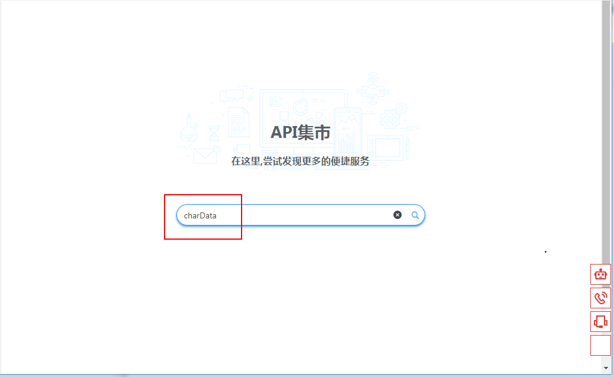
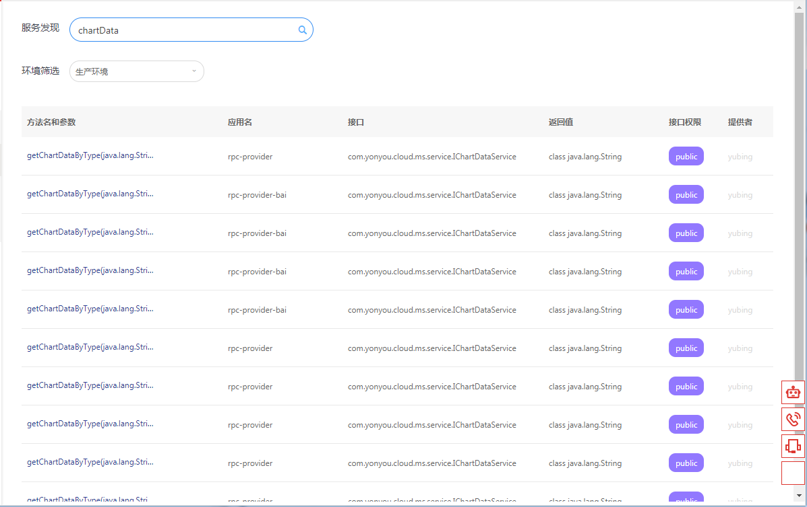
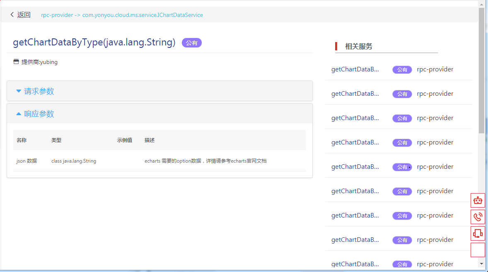
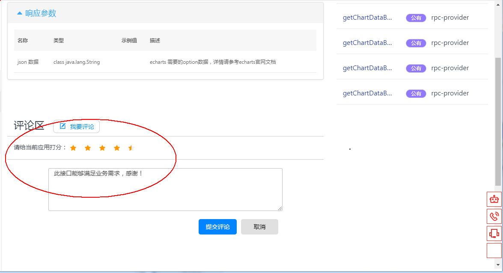
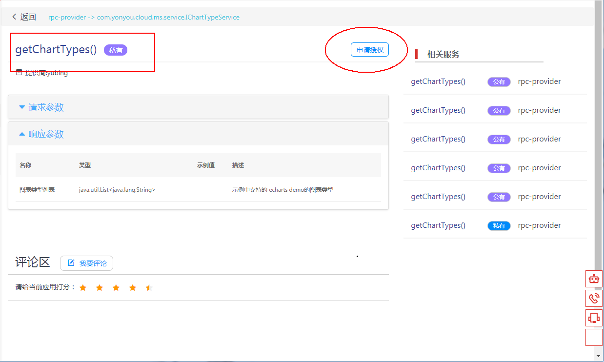
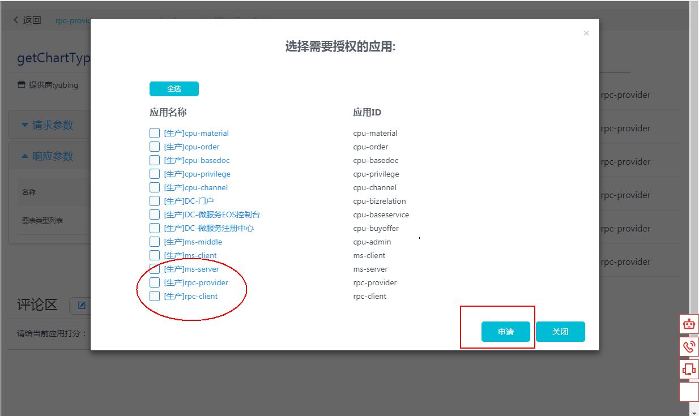

# 服务搜索

## 功能简介

在微服务治理平台的服务搜索界面，用户可以统一搜索发布在微服务治理平台的微服务接口，根据接口名、方法名等关键字进行模糊搜索，可以针对搜索结果进行详细信息的查看，评论。

针对设置为私有权限的接口，可以申请授权，系统会发送邮件到服务提供者，待审核通过后，申请者可以调用。

## 功能操作

### API集市服务搜索

打开服务治理平台的"服务搜索"菜单，界面如下所示：

在搜索框中输入方法名进行查询，例如“chartData”，点击搜索按钮或者回车，对含有此关键字的服务进行查询，效果如下：

列表区展示了方法名中含有“chartData”的所有服务接口，点击其中一行记录，进入详细信息查看界面，如下图：

在API详细信息展示区域，可以看到服务的基本信息、提供商、关联服务、此方法的入参和出参信息等，在界面的下方，可以对此服务进行评价和打分，界面如下：

### API调用申请

针对私有权限的接口，服务需要授权才能访问，使用者可以申请授权，如下图：

勾选需要授权的应用，点击“申请”按钮，进行调用授权申请：

