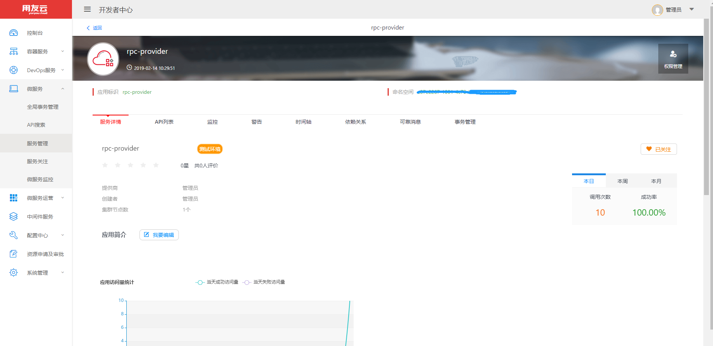
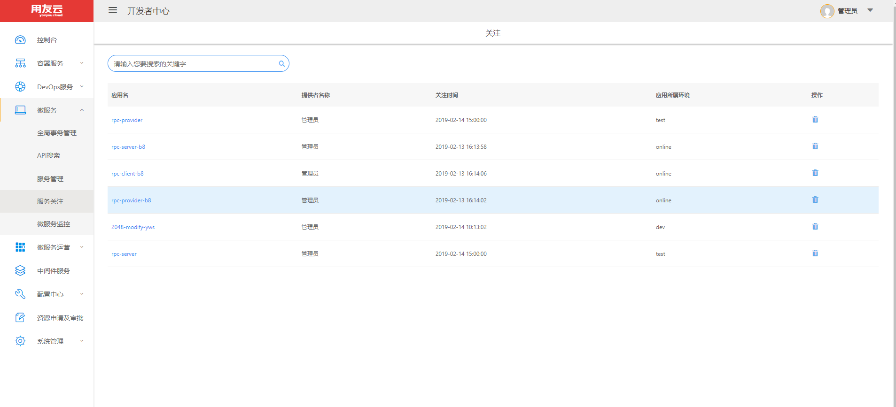
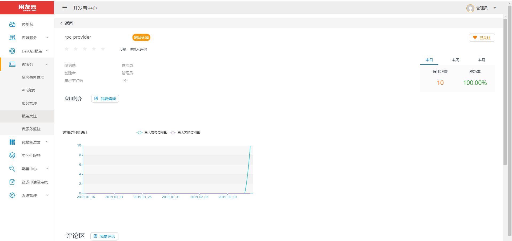

# 服务关注

用户可以对关心的相关微服务进行关注，关注后可以在关注列表中有针对性的浏览查看，帮助用户快速了解相关服务的调用统计、信息变化等。

## 关注服务

打开服务治理平台的服务关注菜单，搜索到关心的微服务应用，在服务详情页签中，点击关注按钮，如下图：

关注成功后，按钮修改成“已关注”状态。

## 服务查看

进入微服务菜单的服务关注功能，主显示区域展示出当前用户已经关注的服务列表，如下图所示：

点击服务名称，可以查看此服务的详细信息，如下图：

