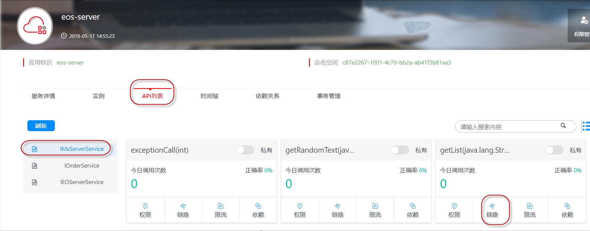
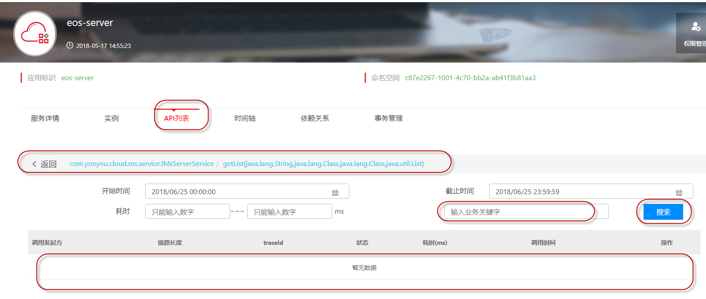

# 业务跟踪

用户经常会遇到根据某个关键属性, 查询整个链路的情况; 如: 根据"订单号"查询各种关联数据, 如: 订单信息、买家信息、卖家信息等.服务治理品台允许开发者在RPC调用过程中设置业务关键字，在成功调用后，可以根据业务关键字进行调用链路的查询，方便跟踪具体的业务调用过程。

## 一：业务编码设置 ##

业务代码在调用RPC接口之前，可以设置业务编码，bizCode为业务的辨识属性值。

<pre>
com.yonyou.cloud.yyeye.itf.Tracer.setBusiCode(bizCode)
</pre>

## 二：根据业务关键字进行搜索 ##

设置业务编码后，成功调用RPC服务，可以再调用链路中进行查询。

导航: 服务治理 >微 服务 > 具体应用 > 对应环境 > 微服务(页签) > API列表 > 调用设置业务编码的API > 链路 > 查询界面:

链路详情页:

## 三：使用限制 ##

上述设置只能设置在被调用端(服务提供者)设置, 调用端/服务消费者的调用中设置无效.

