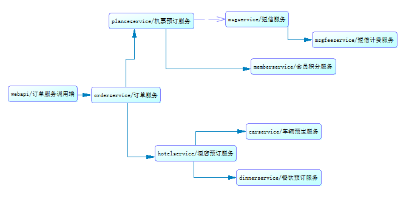
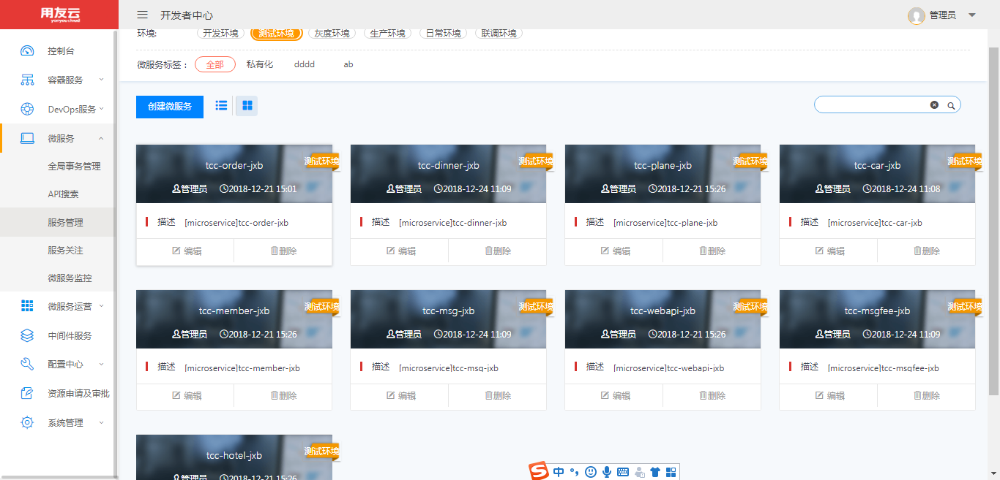
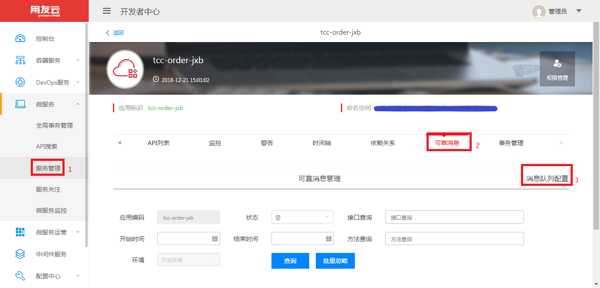
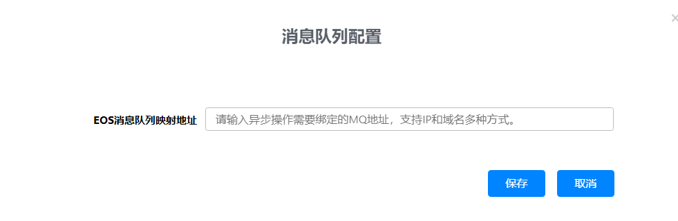
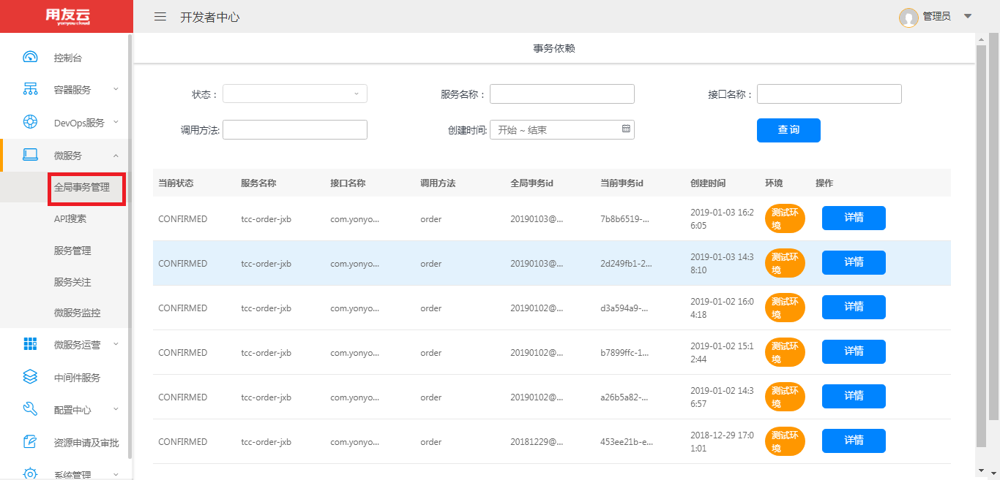
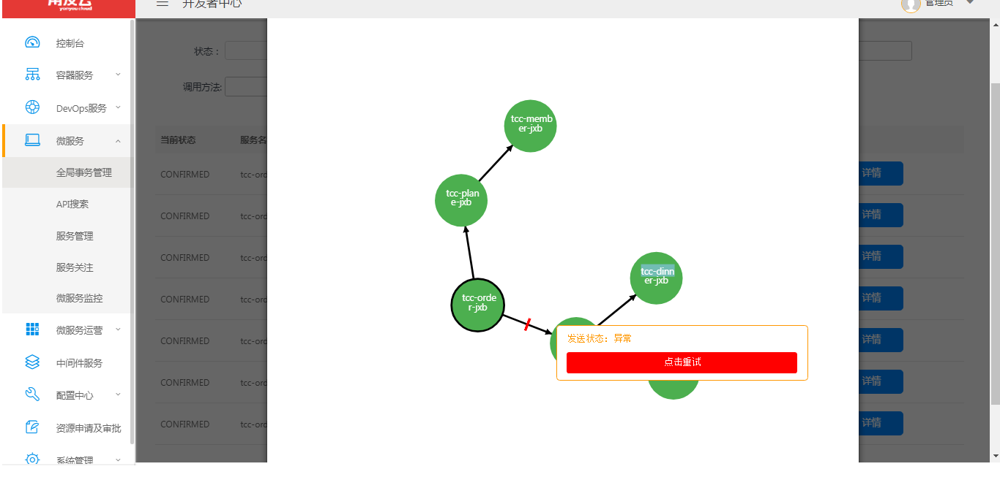
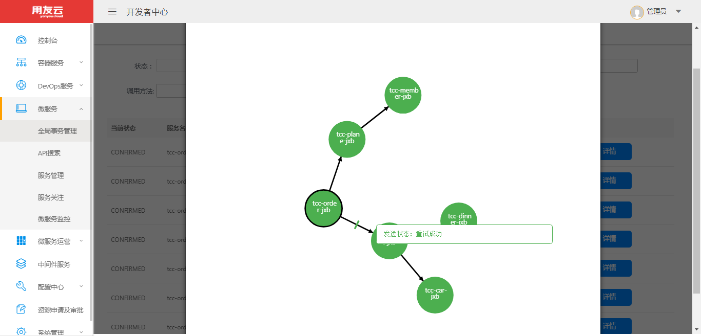

## TccTransaction事务使用案例  
* 业务场景，见图，实箭头表示同步调用，虚箭头为异步调用  
  


tcc事务框架使用最佳实践，本实例以旅游订单为例，共涉及九个微服务实例，调用关系如图，其中webapi是服务网关，提供访问微服务的入口，可通过http://host:port/tcc-webapi/tcc/order/?name=***&dest=**发起访问服务
## 第一步：开发服务接口项目，服务接口在服务端和调用端都需要使用，所以将接口单独作为一个maven工程,引入依赖
          <parent>
		    <groupId>com.yonyou.cloud</groupId>
		    <artifactId>tcc-demos</artifactId>
		    <version>5.1.1-SNAPSHOT</version>
	     </parent>
	     <artifactId>tcc-pubapi</artifactId>
	     <packaging>jar</packaging>

                <!--引入tcc-->
		<dependency>
			<groupId>com.yonyou.cloud.middleware</groupId>
			<artifactId>tcc</artifactId>
			<version>${tcc.version}</version>
		</dependency>
		
                <!--引入eos-->
		<dependency>
			<groupId>com.yonyou.cloud.middleware</groupId>
			<artifactId>eos-spring-support</artifactId>
			<version>${eos-spring-support.version}</version>
		</dependency>
		
		      <!--引入sdk-->
		<dependency>
			<groupId>com.yonyou.cloud.middleware</groupId>
			<artifactId>mwclient</artifactId>
			<version>${mw.version}</version>
			<type>pom</type>
		</dependency>

 **各接口定义如下：**

    /**
     * 订单服务
     * @author Administrator
     *
     */
     @RemoteCall("tcc-order-gh@c87e2267-1001-4c70-bb2a-ab41f3b81aa3")
     public interface IOrderService {

	  @ApiOperation(value="下旅游订单", response=TourOrder.class)
	  @TccTransactional(confirm="confirmOrder", cancel="cancelOrder")
	  public abstract TourOrder order(TourOrder paramTourOrder);

	  @ApiOperation(value="确定旅游订单", response=TourOrder.class)
	  @Async
	  public abstract TourOrder confirmOrder(TccTransactionContext context, TourOrder paramTourOrder);
	  
	  @ApiOperation(value="取消旅游订单", response=TourOrder.class)
	  @Async
	  public abstract TourOrder cancelOrder(TccTransactionContext context, TourOrder paramTourOrder);
     }


    /**
     * 机票预订服务
     * @author Administrator
     *
     */
     //应用名@租户id
     @RemoteCall("tcc-plane-gh@c87e2267-1001-4c70-bb2a-ab41f3b81aa3")
     public interface IMsPlaneService {
	  @ApiOperation(value="预订机票", response=Void.class)
	  // 业务方法，由sdk同步调用
	  @TccTransactional(confirm="confirmPlane", cancel="cancelPlane")
	  public abstract void orderPlane(PlaneOrder paramPlaneOrder);

	  
	  // 注意 Async注解为 com.yonyou.cloud.middleware.rpc.Async，此方法由框架自动调用，异步执行，用于确认业务修改
	  @ApiOperation(value="确定机票预定", response=Void.class)
	  @Async
	  public abstract void confirmPlane(TccTransactionContext context, PlaneOrder paramPlaneOrder);
	  

	   // 注意 Async注解为 com.yonyou.cloud.middleware.rpc.Async，此方法由框架自动调用，异步执行，用于取消业务修改
	  @ApiOperation(value="取消机票预定", response=Void.class)
	  @Async
	  public abstract void cancelPlane(TccTransactionContext context, PlaneOrder paramPlaneOrder);
	  
	  
     }

    /**
     * 积分服务
     * @author Administrator
     *
     */
     @RemoteCall("tcc-member-gh@c87e2267-1001-4c70-bb2a-ab41f3b81aa3")
     public interface IMsMemberService {
	  @ApiOperation(value="会员积分", response=Void.class)
	  @TccTransactional(confirm="confirmPoints", cancel="cancelPoints")
	  public abstract void addPoints(String paramString1, String paramString2, Double paramDouble);
	 
	 
	  @ApiOperation(value="确认会员积分", response=Void.class)
	  @Async
	  public abstract void confirmPoints(TccTransactionContext context, String paramString1, String paramString2, Double paramDouble);
	  
	  @ApiOperation(value="取消会员积分", response=Void.class)
	  @Async
	  public abstract void cancelPoints(TccTransactionContext context, String paramString1, String paramString2, Double paramDouble);
     }

    /**
     * 酒店预订服务
     * @author Administrator
     *
     */

     @RemoteCall("tcc-hotel-gh@c87e2267-1001-4c70-bb2a-ab41f3b81aa3")
     public interface IMsHotelService {
	  @ApiOperation(value="预订酒店", response=Void.class)
	  @TccTransactional(confirm="confirmHotel", cancel="cancelHotel")
	  public abstract void orderHotel(HotelOrder paramHotelOrder);

	  @ApiOperation(value="确认酒店预订", response=Void.class)
	  @Async
	  public abstract void confirmHotel(TccTransactionContext context, HotelOrder paramHotelOrder);
	  
	  @ApiOperation(value="取消酒店预订", response=Void.class)
	  @Async
	  public abstract void cancelHotel(TccTransactionContext context, HotelOrder paramHotelOrder);
     }


    /**
     * 车辆预订服务
     * @author Administrator
     *
     */
    @RemoteCall("tcc-car-gh@c87e2267-1001-4c70-bb2a-ab41f3b81aa3")
    public interface IMsCarService {
	  @ApiOperation(value="车辆预订", response=Void.class)
	  @TccTransactional(confirm="confirmCar", cancel="cancelCar")
	  public abstract void orderCar(CarOrder paramCarOrder);
	
	  @ApiOperation(value="确认车辆预订", response=Void.class)
	  @Async
	  public abstract void confirmCar(TccTransactionContext context, CarOrder paramCarOrder);
	  
	  
	  @ApiOperation(value="取消车辆预订", response=Void.class)
	  @Async
	  public abstract void cancelCar(TccTransactionContext context, CarOrder paramCarOrder);
	  
     }

    /**
     * 餐饮预订服务
     * @author Administrator
     *
     */
     @RemoteCall("tcc-dinner-gh@c87e2267-1001-4c70-bb2a-ab41f3b81aa3")
     public interface IMsDinnerService {
	
	  @ApiOperation(value="餐饮预定", response=Void.class)
	  @TccTransactional(confirm="confirmDinner", cancel="cancelDinner")
	  public abstract void orderDinner(DinnerOrder paramDinnerOrder);
	
	  
	  @ApiOperation(value="确认餐饮预定", response=Void.class)
	  @Async
	  public abstract void confirmDinner(TccTransactionContext context, DinnerOrder paramDinnerOrder);
	  
	  @ApiOperation(value="取消餐饮预定", response=Void.class)
	  @Async
	  public abstract void cancelDinner(TccTransactionContext context, DinnerOrder paramDinnerOrder);
     }

    /**
     * 异步服务，测试事务边界
     * @author Administrator
     *
     */
     @RemoteCall("tcc-msg-gh@c87e2267-1001-4c70-bb2a-ab41f3b81aa3")
     public interface IMsMsgService {
	  @ApiOperation(value="短信服务", response=Void.class)
	  @TccTransactional(confirm="confirmMsg", cancel="cancelMsg")
	  @Async
	  public abstract void sendMsg(String phone, String msg, String bizId);

	  @ApiOperation(value="确认短信服务", response=Void.class)
	  @Async
	  public abstract void confirmMsg(TccTransactionContext context, String phone, String msg, String bizId);
	 
	  @ApiOperation(value="取消短信服务", response=Void.class)
	  @Async
	  public abstract void cancelMsg(TccTransactionContext context, String phone, String msg, String bizId);
     }

    /**
     * 异步服务
     * @author Administrator
     *
     */
    @RemoteCall("tcc-msgfee-gh@c87e2267-1001-4c70-bb2a-ab41f3b81aa3")
    public interface IMsMsgFeeService {
	  @ApiOperation(value="短信计费服务", response=Void.class)
	  @TccTransactional(confirm="confirmMsgFee", cancel="cancelMsgFee")
	  public abstract void MsgFee(String bizId, Double fee);

	  @ApiOperation(value="确认短信计费服务", response=Void.class)
	  @Async
	  public abstract void confirmMsgFee(TccTransactionContext context, String bizId, Double fee);
	 
	  @ApiOperation(value="取消短信计费服务", response=Void.class)
	  @Async
	  public abstract void cancelMsgFee(TccTransactionContext context, String bizId, Double fee);
    }


## 第二步：开发服务，导入接口项目依赖，实现各个接口，在服务内实现服务之间的调用关系及confirm & cancel
新建maven项目，导入接口项目依赖及eos、sdk等其他依赖包，pom.xml如下

          <!--eos框架-->
		<dependency>
			<groupId>com.yonyou.cloud.middleware</groupId>
			<artifactId>eos-spring-support</artifactId>
			<!--需要引入eos-spring-support 5.1.0以后的包-->
			<version>${mw.version}</version>
		</dependency>

		<!--tcc事务框架包-->
		<dependency>
			<groupId>com.yonyou.cloud.middleware</groupId>
			<artifactId>Tcc</artifactId>
			<version>${Tcc.version}</version>
		</dependency>
		<!--引入middleware sdk-->
		<dependency>
			<groupId>com.yonyou.cloud.middleware</groupId>
			<artifactId>mwclient</artifactId>
			<version>${mw.version}</version>
			<type>pom</type>
		</dependency>

**在 springContext.xml配置文件中配置数据源、事务管理器、eos及tcc相关的bean定义**

*  在项目配置文件中加入相关bean定义
tcc和eos框架本身需要对数据库进行读写，内部使用了jdbctemplate进行数据库操作，业务尽量也使用jdbctemplate来进行数据库操作，事务及数据源都交由spring容器管理。
如果业务需要用其它orm框架，如hibernate、mybatis或者jpa，需要确保jdbctemplate和业务orm框架兼容使用同一数据源及事务管理器，确保业务和eos、tcc框架能在一个事务中。
jpa：业务使用jpa操作数据库时，EOSConfig配置的jdbctemplate要所配置DataSource要与jpa事务管理器使用同一个DataSource，TransactionManager应使用JpaTransactionManager
hibernate：业务使用hibernate操作数据库时使用 HibernateTransactionManager事务管理器
mybatis：业务使用mybatis操作数据库时使用DataSourceTransactionManager事务管理器
jdbctemplate：业务使用jdbctemplate操作数据库时使用DataSourceTransactionManager事务管理器

```
     <bean id="eosConfig" class="com.yonyou.cloud.config.eos.EOSConfig">
    		<property name="jdbcTemplate" ref="jdbcTemplate"/>
    		<property name="transactionManager" ref="transactionManager"/>
    		<property name="authSDKClient" ref="authSDKClient"/>
    		<property name="fullScanIntevalSend" value="0"/>
    		<property name="fullScanIntevalActionLog" value="0"/>
 	     <!--eos控制台地址，默认为registry地址+/eos-console/-->      	 
 	     <property name="eosCenterUrl" value="${eos.cloud.url:http://localhost/eos-console/}"/>
     </bean>
    
     <bean id="tccMonitorConfig" class="com.yonyou.cloud.config.TccMonitorConfig">
         <!--tcc事务控制台地址--，默认为registry地址+/eos-console/> 
 	  <property name="tccMonitorUrl" value="${tcc.cloud.url:https://developer-test.yonyoucloud.com/eos-console/}"/> 
     </bean>
     
     <!--jdbctemplate，配置数据库操作的jdbctemplate-->
     <bean id="jdbcTemplate" class="org.springframework.jdbc.core.JdbcTemplate">
        <property name="dataSource" ref="dataSource"></property>
     </bean>

     <!-- 启用spring事务管理器 -->
    <tx:annotation-driven transaction-manager="transactionManager" proxy-target-class="true"/>

     <!-- 事务配置 -->
    <bean id="transactionManager" class="org.springframework.jdbc.datasource.DataSourceTransactionManager">
        <property name="dataSource" ref="dataSource"/>
    </bean>
 
     <!-- 数据源配置, 使用Tomcat JDBC连接池    -->
    <bean id="dataSource" class="org.apache.tomcat.jdbc.pool.DataSource" destroy-method="close" lazy-init="false">
        <property name="driverClassName" value="${jdbc.driver}"/>
        <property name="url" value="${jdbc.url}"/>
        <property name="username" value="${jdbc.username}"/>
        <property name="password" value="${jdbc.password}"/>

        <property name="defaultAutoCommit" value="false"/>
        <property name="maxActive" value="${jdbc.pool.maxActive}"/>
        <property name="maxIdle" value="${jdbc.pool.maxIdle}"/>
        <property name="minIdle" value="${jdbc.pool.minIdle}"/>
        <property name="maxWait" value="${jdbc.pool.maxWait}"/>
        <property name="minEvictableIdleTimeMillis" value="${jdbc.pool.minEvictableIdleTimeMillis}"/>
        <property name="removeAbandoned" value="${jdbc.pool.removeAbandoned}"/>
        <property name="removeAbandonedTimeout" value="${jdbc.pool.removeAbandonedTimeout}"/>
        <property name="testWhileIdle" value="true"/> 
        <property name="validationQuery" value="select 1"/> 
    </bean>  

    <!--数据库连接池信息，tcc创建内部数据源使用，保持跟业务数据源配置信息一致  -->
    <bean id="specialJdbcTemplateConfig" class="com.yonyou.cloud.config.SpecialJdbcTemplateConfig">
        <property name="driverClassName" value="${jdbc.driver}"/>
        <property name="url" value="${jdbc.url}"/>
        <property name="username" value="${jdbc.username}"/>
        <property name="password" value="${jdbc.password}"/>
        <property name="defaultAutoCommit" value="true"/>
        <property name="maxActive" value="${jdbc.pool.maxActive}"/>
        <property name="maxIdle" value="${jdbc.pool.maxIdle}"/>
        <property name="minIdle" value="${jdbc.pool.minIdle}"/>
        <property name="maxWait" value="${jdbc.pool.maxWait}"/>
        <property name="minEvictableIdleTimeMillis" value="${jdbc.pool.minEvictableIdleTimeMillis}"/>
        <property name="removeAbandoned" value="${jdbc.pool.removeAbandoned}"/>
        <property name="removeAbandonedTimeout" value="${jdbc.pool.removeAbandonedTimeout}"/>
    </bean> 
    
    <!-- 使用annotation 自动注册bean, 并保证@Required、@Autowired的属性被注入 -->
    <context:component-scan base-package="com.yonyou.cloud">
	    <context:exclude-filter type="annotation" expression="org.springframework.stereotype.Controller"/>
	    <context:exclude-filter type="annotation" expression="org.springframework.web.bind.annotation.ControllerAdvice"/>
    </context:component-scan>
```

* 服务提供方实现业务接口

```
       /**
        * 订单服务
        * @author Administrator
        *
        */
      @Service("orderService")
      public  class OrderService implements IOrderService {
	  private static final Logger logger = LoggerFactory
			.getLogger(OrderService.class);
	  @Autowired
	  private JdbcTemplate jdbcTemplate;
	
	  @Autowired
	  private IMsHotelService msHotelService;
	
	  @Autowired
	  private IMsPlaneService msPlaneService;

	  public static final ObjectMapper OBJECT_MAPPER = new ObjectMapper();
	
	  @Transactional
	  public TourOrder order(TourOrder dto) {
		dto.setStatus(AppConstant.CONFIRMING);
		//执行当前服务的业务数据
		this.jdbcTemplate
				.update("insert into biz_tourorder (orderName,userId,userName,dest,status,tourOrderId) values (?,?,?,?,?,?)",
						new Object[] { dto.getOrderName(), dto.getUserId(),
								dto.getUserName(), dto.getDest(),
								dto.getStatus(), dto.getTourOrderId() });
		PlaneOrder planeOrder = new PlaneOrder();
		planeOrder.setAirport("首都国际机场");
		planeOrder.setArrive("上海虹桥机场");
		planeOrder.setPlaneNo("CCAC5982");
		planeOrder.setPlaneOrderId(UUID.randomUUID().toString());
		planeOrder.setPrice(Double.valueOf(2903.0D));
		planeOrder.setStart(new DateTime().toString());
		planeOrder.setUserId(dto.getUserId());
		planeOrder.setStatus(AppConstant.CONFIRMING);
		try {
		// 将当前业务数据保存到当前事务上下文中，便于在confirm或cancel时能够获取到该业务数据做提交或回退操作
			System.out.println(OBJECT_MAPPER.writeValueAsString(dto));
			TccTransactionUtils.setContext(OBJECT_MAPPER.writeValueAsString(dto));
		} catch (Throwable e) {
			e.printStackTrace();
			throw new RuntimeException("参数序列化异常");
		}
		// 发起对plane服务的调用，形成过一个同步调用链
	        this.msPlaneService.orderPlane(planeOrder);
		HotelOrder hotelOrder = new HotelOrder();
		hotelOrder.setStart(new DateTime().toString());
		hotelOrder.setEnd(new DateTime().toString());
		hotelOrder.setHotelName("锦江之星宾馆");
		hotelOrder.setHotelOrderId(UUID.randomUUID().toString());
		hotelOrder.setRoomNo("401");
		hotelOrder.setStatus(AppConstant.CONFIRMING);
		hotelOrder.setUserId(dto.getUserId());
		hotelOrder.setUserName(dto.getUserName());

		// 发起对hotel服务的调用，形成过一个同步调用链
		this.msHotelService.orderHotel(hotelOrder);
		return dto;
	  }

          // 整个调用链成功时，框架自动异步地执行该方法，确认业务的操作
	  @Transactional
	  public TourOrder confirmOrder(TccTransactionContext context,TourOrder dto) {
	        //获取当前事务上下文数据
		String restore = TccTransactionUtils.getContext(context);
		logger.info("===========================" + restore);
		this.jdbcTemplate.update(
				"update biz_tourorder set status=?  where tourOrderId=?",
				new Object[] { AppConstant.CONFIRMED, dto.getTourOrderId() });
		return dto;
	  }
	// 整个调用链有失败时，框架自动异步地执行该方法，取消业务的操作
	  @Transactional
	  public TourOrder cancelOrder(TccTransactionContext context,TourOrder dto) {
	        //获取当前事务上下文数据
		String restore = TccTransactionUtils.getContext(context);
		logger.info("===========================" + restore);
		this.jdbcTemplate.update(
				"update biz_tourorder set status=?  where tourOrderId=?",
				new Object[] { AppConstant.DELETED, dto.getTourOrderId() });
		return dto;
	  }
      }


       /**
        * 机票预订服务
        * @author Administrator
        *
        */
      @Service("msPlaneService")
      public class MsPlaneService implements IMsPlaneService {
	  private static final Logger logger = LoggerFactory
	 		.getLogger(MsPlaneService.class);
	
	  @Autowired
	  private JdbcTemplate jdbcTemplate;
	  @Autowired
	  IMsMemberService msMemberService;
	  public static final ObjectMapper OBJECT_MAPPER = new ObjectMapper();
	
	  @Transactional
	  public void orderPlane(PlaneOrder dto) {
			this.jdbcTemplate
					.update("insert into biz_planeorder(start,arrive,airport,price,userId,planeNo,planeOrderId,status) values (?,?,?,?,?,?,?,?)",
							new Object[] { dto

							.getStart(), dto.getArrive(), dto.getAirport(),
									dto.getPrice(), dto.getUserId(),
									dto.getPlaneNo(), dto.getPlaneOrderId(),
									dto.getStatus() });
	
		Double points = Double.valueOf(0.1D);
		String bizId = UUID.randomUUID().toString();
		try {
			TccTransactionUtils.setContext(OBJECT_MAPPER.writeValueAsString(dto));
		} catch (JsonProcessingException e) {
			// TODO Auto-generated catch block
			e.printStackTrace();
		}
		this.msMemberService.addPoints(dto.getUserId(), bizId, points);
	  }

	
	  @Transactional
	  public void confirmPlane(TccTransactionContext context, PlaneOrder dto) {
		String restore = TccTransactionUtils.getContext(context);
		logger.info("===========================" + restore);
		this.jdbcTemplate.update(
				"update biz_planeorder set status=? where planeOrderId=?",
				new Object[] { AppConstant.CONFIRMED, dto.getPlaneOrderId() });
	  }
	
	  @Transactional
	  public void cancelPlane(TccTransactionContext context, PlaneOrder dto) {
		String restore = TccTransactionUtils.getContext(context);
		logger.info("===========================" + restore);
		this.jdbcTemplate.update(
				"update biz_planeorder set status=? where planeOrderId=?",
				new Object[] { AppConstant.DELETED, dto.getPlaneOrderId() });
	  }
	
	  @Override
	  public String testAsync(String hello) {
		// TODO Auto-generated method stub
		return "hello world";
	  }
	
     }


       /**
        * 积分服务
        * @author Administrator
        *
        */

     @Service("msMemberService")
     public class MsMemberService implements IMsMemberService {
	  private static final Logger logger = LoggerFactory
			.getLogger(MsMemberService.class);
	  @Autowired
	  private JdbcTemplate jdbcTemplate;
	
	  @Autowired
	  private IMsMsgService msMsgService;
	
	  @Transactional
	  public void addPoints( String userid, String bizId, Double points) {
		this.jdbcTemplate
				.update("insert into biz_membership (userId,bizId,points, status) values(?,?,?,?)",
						new Object[] { userid, bizId, points, AppConstant.CONFIRMING });
		//短信通知
		msMsgService.sendMsg("18210260858", "获取积分2.5", UUID.randomUUID().toString());
	  }
	
	  @Transactional
	  public void confirmPoints(TccTransactionContext context, String userid, String bizId, Double points) {
		this.jdbcTemplate.update(
				"update  biz_membership set status=?  where bizId=?",
				new Object[] { AppConstant.CONFIRMED, bizId });
	  }
	
	  @Transactional
	  public void cancelPoints(TccTransactionContext context, String userid, String bizId, Double points) {
		this.jdbcTemplate.update(
				"update  biz_membership set status=?  where bizId=?",
				new Object[] { AppConstant.DELETED, bizId });
	  }
	  
     }


        /**
        * 酒店预订服务
        * @author Administrator
        *
        */
      @Service("msHotelService")
      public class MsHotelServicele implements IMsHotelService {
	  private static final Logger logger = LoggerFactory
			.getLogger(MsHotelServicele.class);
	  @Autowired
	  private JdbcTemplate jdbcTemplate;
	  @Autowired
	  IMsCarService msCarService;
	  @Autowired
	  IMsDinnerService msDinnerService;

	@Transactional
	public void orderHotel(HotelOrder dto) {
			this.jdbcTemplate
					.update("insert into biz_hotelorder(hotelName,roomNo,start,end,userId,userName,status,hotelOrderId) values(?,?,?,?,?,?,?,?)",
							new Object[] { dto.getHotelName(), dto.getRoomNo(),
									dto.getStart(), dto.getEnd(),
									dto.getUserId(), dto.getUserName(),
									dto.getStatus(), dto.getHotelOrderId() });
		CarOrder car = new CarOrder();
		car.setCarOrderId(UUID.randomUUID().toString());
		car.setCarType("Benz");
		car.setEnd(new Date().toString());
		car.setStart(new Date().toString());
		car.setStatus(AppConstant.CONFIRMING);
		car.setUserId(dto.getUserId());
		car.setUserName(dto.getUserName());
		this.msCarService.orderCar(car);
		DinnerOrder dinner = new DinnerOrder();
		dinner.setDinnerOrderId(UUID.randomUUID().toString());
		dinner.setDinnerPlace("朝阳区慧忠北里老北京");
		dinner.setDinnerRoom("宴会厅");
		dinner.setDinnerTime(new Date().toString());
		dinner.setStatus(AppConstant.CONFIRMING);
		dinner.setUserId(dto.getUserId());
		dinner.setUserName(dto.getUserName());
		this.msDinnerService.orderDinner(dinner);
	}

	  @Transactional
	  public void confirmHotel(TccTransactionContext context, HotelOrder dto) {
		this.jdbcTemplate.update(
				"update biz_hotelorder set status=? where hotelOrderId=?",
				new Object[] { AppConstant.CONFIRMED, dto.getHotelOrderId() });
	  }
	
	  @Transactional
	  public void cancelHotel(TccTransactionContext context, HotelOrder dto) {
		this.jdbcTemplate.update(
				"update biz_hotelorder set status=? where hotelOrderId=?",
				new Object[] { AppConstant.DELETED, dto.getHotelOrderId() });
	  }
     }
   


       /**
        * 车辆预订服务
        * @author Administrator
        *
        */
      @Service("msCarService")
      public class MsCarService implements IMsCarService {
	  private static final Logger logger = LoggerFactory
			.getLogger(MsCarService.class);
	  @Autowired
	  private JdbcTemplate jdbcTemplate;
	  @Transactional
	  public void orderCar(CarOrder dto) {
			this.jdbcTemplate
					.update("insert into biz_carorder(carType,start,end,userId,userName,carOrderId,status) values (?,?,?,?,?,?,?)",
							new Object[] { dto
							.getCarType(), dto.getStart(), dto.getEnd(),
									dto.getUserId(), dto.getUserName(),
									dto.getCarOrderId(), dto.getStatus() });
	  }
	
	  @Transactional
	  public void confirmCar(TccTransactionContext context, CarOrder dto) {
		this.jdbcTemplate.update(
				"update biz_carorder set status=? where carOrderId=?",
				new Object[] { AppConstant.CONFIRMED, dto.getCarOrderId() });
	  }
	
	  @Transactional
	  public void cancelCar(TccTransactionContext context, CarOrder dto) {
		this.jdbcTemplate.update(
				"update biz_carorder set status=? where carOrderId=?",
				new Object[] { AppConstant.DELETED, dto.getCarOrderId() });
	  }

     }


       /**
        * 餐饮预订服务
        * @author Administrator
        *
        */
      @Service("msDinnerService")
      public class MsDinnerService implements IMsDinnerService {
	  private static final Logger logger = LoggerFactory
			.getLogger(MsDinnerService.class);
	  @Autowired
	  private JdbcTemplate jdbcTemplate;
	
	  @Transactional
	  public void orderDinner(DinnerOrder dto) {
		this.jdbcTemplate
				.update("insert into biz_dinnerorder (userId,userName,dinnerPlace,dinnerTime,dinnerRoom,status,dinnerOrderId) values(?,?,?,?,?,?,?)",
						new Object[] { dto

						.getUserId(), dto.getUserName(), dto.getDinnerPlace(),
								dto.getDinnerTime(), dto.getDinnerRoom(),
								dto.getStatus(), dto.getDinnerOrderId() });
	   }
	
	
	   @Transactional
	   public void confirmDinner(TccTransactionContext context, DinnerOrder dto) {
		this.jdbcTemplate.update(
				"update biz_dinnerorder set status=? where dinnerOrderId=?",
	 			new Object[] { AppConstant.CONFIRMED, dto.getDinnerOrderId() });
	   }
	
	   @Transactional
	   public void cancelDinner(TccTransactionContext context, DinnerOrder dto) {
		this.jdbcTemplate.update(
				"update biz_dinnerorder set status=? where dinnerOrderId=?",
				new Object[] { AppConstant.DELETED, dto.getDinnerOrderId() });
	   }
       }


       /**
       * 异步服务，测试事务边界
       * @author Administrator
       *
       */
       @Service("msMsgService")
       public class MsMsgService implements IMsMsgService {
	   private static final Logger logger = LoggerFactory
			.getLogger(MsMsgService.class);
	   @Autowired
	   private JdbcTemplate jdbcTemplate;
	
	   @Autowired
	   private IMsMsgFeeService msMsgFeeService;
	   @Transactional
	   public void sendMsg(String phone, String msg, String bizId) {
		this.jdbcTemplate
				.update("insert into biz_msg (phone,msg, status,bizId) values(?,?,?,?)",
						new Object[] { phone, msg, AppConstant.CONFIRMING, bizId });
		//短信发送成功后，需要通知计费服务记录通道短信费用
		
		msMsgFeeService.MsgFee(UUID.randomUUID().toString(), 3.6d);
		
	    }
	
	   @Override
	   @Transactional
	   public void confirmMsg(TccTransactionContext context, String phone, String msg, String bizId) {
		this.jdbcTemplate.update(
				"update  biz_msg set status=?  where bizId=?",
				new Object[] { AppConstant.CONFIRMED, bizId });
	    }
	  
	    @Override
	    @Transactional
	    public void cancelMsg(TccTransactionContext context, String phone, String msg, String bizId) {
		this.jdbcTemplate.update(
				"update  biz_msg set status=?  where bizId=?",
				new Object[] { AppConstant.DELETED, bizId });
	   }

      }


     /**
        * 短信计费服务
        * @author Administrator
        *
        */

      @Service("msMsgFeeService")
      public class MsMsgFeeService implements IMsMsgFeeService {
	  private static final Logger logger = LoggerFactory
			.getLogger(MsMsgFeeService.class);
	  @Autowired
	  private JdbcTemplate jdbcTemplate;
	  @Transactional
	  public void MsgFee(String bizId, Double fee) {
		this.jdbcTemplate
				.update("insert into biz_msgfee (bizId,fee, status) values(?,?,?)",
						new Object[] { bizId, fee, AppConstant.CONFIRMING });
	}
	
	@Transactional
	public void  confirmMsgFee(TccTransactionContext context, String bizId, Double fee) {
		this.jdbcTemplate.update(
				"update  biz_msgfee set status=?  where bizId=?",
				new Object[] { AppConstant.CONFIRMED, bizId });
	}
	
	
	@Transactional
	public void  cancelMsgFee(TccTransactionContext context, String bizId, Double fee) {
		this.jdbcTemplate.update(
				"update  biz_msgfee set status=?  where bizId=?",
				new Object[] { AppConstant.DELETED, bizId });
	}
      }
```

* 服务消费方调用业务业务接口

```
      @Service("webApiService")
      public class WebApiService {
	  @Autowired
	  private IOrderService orderService;
	  @Autowired
	  private JdbcTemplate jdbcTemplate;

	  @Transactional
	  @CCTransactional(cancel = "cancel")
	  public void placeOrder(TourOrder dto) {
			String restore = CCTransactionUtils.getContext(context);
		this.orderService.order(dto);
		this.jdbcTemplate.update("insert into biz_send(content) values(?)",
				new Object[] { dto.toString() });
	  }
 
	  public void cancel(TourOrder dto) {
	  }
      }
```
## 第三步：将以上9个服务build生成war包，copy到tomcat或者在开发者中心持续构建或流水线构建
服务启动后，业务数据库应该包含如下数据库表。其中，以日期为表名后缀的表采用了分表策略，默认首次启动后悔创建当前日期前后十天的备用表。
启动后，开发者中心的有如下几个服务，如图



## 第四步：为服务配置可靠消息队列

 要使用tcc框架开发分布式事务应用,在应用启动后，需要配置应用的RabbitMQ消息队列的地址:
* 页面导航: 开发者中心左边菜单 &gt;&gt; 微服务 &gt;&gt; 服务管理 &gt;&gt; 找到对应的应用 &gt;&gt; 点进对应的环境 &gt;&gt; 微服务 &gt;&gt;服务管理 &gt;&gt;可高消息 &gt;&gt; 消息队列配置 &gt;&gt; 在输入框中填写RabbitMQ地址, 如: IP1:Port1,IP2:Port2; 参见下图:

* 消息地址配置输入框:


* 配置完消息地址后, 按照异步框架的开发指南进行工程配置, 若有异常会上报到EOS控制台; 按照以下步骤查询异常消息: <p>开发者中心左边菜单 &gt;&gt; 微服务 &gt;&gt; 服务管理 &gt;&gt; 找到对应的应用 &gt;&gt; 点进对应的环境 &gt;&gt; 微服务 &gt;&gt; **可靠消息** &gt;&gt;</p>
* 点击重试后会下发命令到客户端进行重试, 客户端重试完成后会上报重试结果, 重试成功后会在状态列中显示"重试成功", 否则显示"重试失败".
* 点击忽略后会下发命令到客户端进行忽略, 被忽略的消息应交由人工处理, 进行数据的校对和检查.


## 第五步：验证
向webapi服务发起http请求，请求为http://host:port/tcc-webapi/tcc/order/?name=***&dest=**
正常情况下：返回结果为 success：.....，代表请求正常，业务执行成功
事务数据正确性：各业务节点中tcc_transaction_*中应有一条事务数据，order和msg服务节点类型为ROOT,其它节点为BRANCH，且状态因为CONFIRMED
业务数据正确性：各业务节点的业务表中数据应为CONFIRMED，整个事务完成了CONFIRMED

若返回结果为 error:.....，代表请求失败，事务会回滚，各业务节点中是否状态为FAILED的节点，业务数据没有插入成功，事务状态为CANCEL的节点，业务数据状态应为DELETED,整个事务回退


## 第六步：消息异常处理
* 如果消息收发异常，如cancel或confirm方法抛出异常会导致消息接收异常，或应用未配置可靠消息队列，会导致向该应用发送消息异常，如遇到收发消息异常，
框架会自动将该事务链上所有节点事务信息上报到云端，如图：


* 点击详情进入该事务，可以查看该事务的所有事务节点，并查看其状态，如图所示代表order向hotel发送消息异常，如图


* 将导致收发消息失败的问题解决后，点击重试，重新发送或接收消息，当消息重试成功后整个事务链的事务最终一致，都为CONFIRMED或CANCEL及FAILED,如图


* 有权限进入业务的人员可以查看当前业务所参与的所有事务，并可以查看，该用户可以重试或忽略当前业务的不一致事务，但是不可用操作该事务所在全局事务的其他业务节点
如图