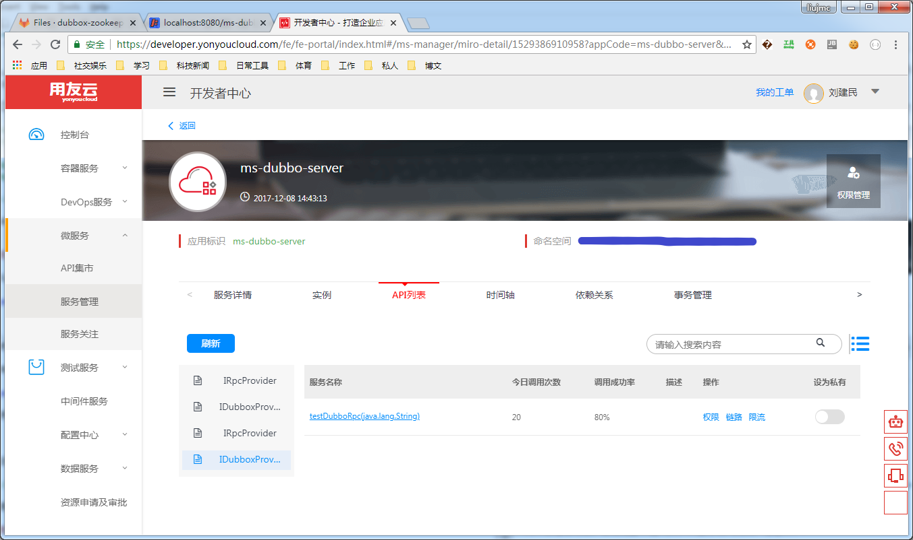
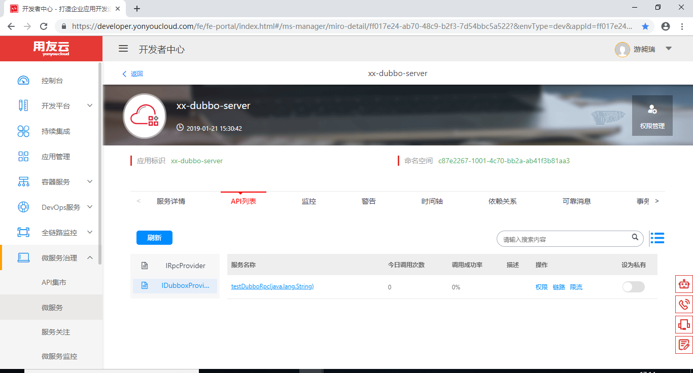

# iuap-dubbo-fuse的适配

微服务治理平台同样支持无缝迁移使用dubbox和微服务治理平台共同开发（简称组合开发）的微服务应用。通过引入服务治理平台的dubbo-fuse-support组件和修改部分配置文件，不需修改源码即可完成迁移，方便开发者对原有工程的改造。

服务治理平台的dubbo-fuse适配组件在服务启动时解析原生的dubbox的配置文件，将暴露出的远程服务同时注册到服务治理平台的注册中心和dubbo的注册中心, 调用过程中实际生效的为组合开发的RPC调用。

## 说明
本功能及接下来的实例说明仅支持5.1.7-RELEASE及以上版本。

## 示例说明
文档编写过程中使用的两个示例为ms-dubbo-client和ms-dubbo-server，工程1为dubbox方式RPC调用的客户端，工程2为服务端。

开发者可以启动本地的zookeeper，然后使用mvn jetty:run的方式运行两个工程，通过浏览器简单访问client工程提供的示例调用地址，完成对原生dubbo方式的RPC调用，调用地址如下：

	http://localhost:8080/ms-dubbo-client/testDubboRpc?param=test

本文档将介绍如何使用微服务治理平台的dubbo-fuse适配组件将原生的dubbox的RPC调用改造成组合开发的RPC调用。

## Dubbox工程配置

文档中提及的两个示例，支持原生dubbo方式的运行，其主要组件依赖和配置文件说明如下。

maven组件依赖对应的pom.xml中，依赖如下：

	<!-- dubbo 依赖 -->
    <dependency>
        <groupId>com.yonyou.iuap</groupId>
        <artifactId>iuap-dubbox</artifactId>
        <version>3.2.1-SNAPSHOT</version>
    </dependency>
    <dependency>
        <groupId>com.alibaba</groupId>
        <artifactId>dubbo</artifactId>
        <version>2.8.4.RELEASE</version>
    </dependency>
    <dependency>
        <groupId>com.github.sgroschupf</groupId>
        <artifactId>zkclient</artifactId>
        <version>0.1</version>
    </dependency>
    <dependency>
        <groupId>org.apache.zookeeper</groupId>
        <artifactId>zookeeper</artifactId>
        <version>3.4.6</version>
    </dependency>

客户端属性配置文件application.properties示例：
	
	#dubbo
	spring.application.name=ms-dubbo-client
	dubbo.registry.address=zookeeper://localhost:2181
	rpc.remote.appCode=ms-dubbo-server

客户端针对dubbo的spring配置文件如下：

    <!-- dubbo 配置 -->
    <dubbo:application name="${spring.application.name}"/>
    <dubbo:registry address="${dubbo.registry.address}" timeout="15000"/>
    <dubbo:consumer check="false"/>

    <!-- 消费者声明 -->
    <dubbo:reference id="dubboxConsumer" interface="com.yonyou.cloud.ms.service.itf.IDubboxProvider" group="${rpc.remote.appCode}" version="0.1"/>

远程RPC接口声明如下：

	package com.yonyou.cloud.ms.service.itf;
	
	public interface IDubboxProvider {
		public String testDubboRpc(String param1);
	}

客户端通过RestFul接口的方式暴露了testDubboRpc的调用过程，开发者只需要在浏览器中输入正确地址即可测试，服务提供方，也提供相应的配置，其maven组件依赖同上，属性配置文件的示例如下：
	
	#dubbo
	spring.application.name=ms-dubbo-server
	#dubbo适配
	dubbo.registry.address=zookeeper://localhost:2181
	dubbo.monitor.protocol=registry
	dubbo.protocol.name=dubbo
	dubbo.protocol.port=20880

在spring的配置文件中，需要对服务提供者进行声明，其声明示例如下：

    <!-- dubbo 配置 -->
    <dubbo:application name="${spring.application.name}"/>
    <dubbo:registry address="${dubbo.registry.address}"/>
    <dubbo:protocol name="${dubbo.protocol.name}" port="${dubbo.protocol.port}"/>

    <dubbo:monitor protocol="${dubbo.monitor.protocol}"></dubbo:monitor>
 
    <!-- 生产者声明 -->
    <dubbo:service group="${spring.application.name}" interface="com.yonyou.cloud.ms.service.itf.IDubboxProvider" ref="dubboxProvider" version="0.1" />

通过上述配置，可以实现利用Dubbox方式完成RPC的调用，其中，dubbo的spring配置文件中，包含group的配置加以区分不同的分组。本文档后续章节将介绍如何将上述的两个工程通过修改配置的方式，适配成微服务治理平台的RPC调用与原生Dubbox的RPC调用融合共存的工程, 即客户端可以根据不同接口选择不同的调用方式, 服务端可以对外提供dubbo和服务治理平台RPC两种服务方式.

## 微服务治理平台配置

修改Maven工程的组件依赖，增加dubbo-fuse组件的依赖，依赖如下(注意仅5.1.7-RELEASE及以上支持dubbo-fuse)：

	<dependency>
		<groupId>com.yonyou.cloud.middleware</groupId>
		<artifactId>mwclient</artifactId>
		<version>5.1.7-RELEASE</version>
		<type>pom</type>
	</dependency>
	<dependency>
		<groupId>com.yonyou.cloud.middleware</groupId>
		<artifactId>iris-dubbo-fuse-support</artifactId>
		<version>5.1.7-RELEASE</version>
	</dependency>

修改客户端工程的application.properties, 使用组合调用方式适配后，内容如下：

	access.key=用户在开发者中心申请的AccessKey
	access.secret=AccessKey对应的秘钥
	
	spring.application.name=ms-dubbo-client
	spring.profiles.active=dev

	#组合适配开关（默认为false）
	MWCLIENT_ENABLE=true

	#rpc适配
	rpc.remote.appCode=ms-dubbo-server
	
	#dubbo适配
	dubbo.business.group=ms-dubbo-server@providerid

其中access.key、access.secret和providerid需要使用开发者的账号，到对应的开发者中心的环境中申请。

修改服务端工程的属性配置文件，修改后内容如下：

	access.key=用户在开发者中心申请的AccessKey
	access.secret=AccessKey对应的秘钥
	
	spring.application.name=ms-dubbo-server
	spring.profiles.active=dev

	MWCLIENT_ENABLE=true
	
	#dubbo适配
	dubbo.registry.address=zookeeper://localhost:2181
	dubbo.monitor.protocol=registry
	dubbo.protocol.name=dubbo
	dubbo.protocol.port=20880

至此，原dubbox工程到组合调用工程适配已经修改成功，可以使用jetty的方式或者打成war包的方式进行调用。

## 示例调用

在IDE中到入已有的maven工程，使用 jetty:run 方式调试运行两个工程，如下图：

启动过程中，服务治理平台会扫描工程中的dubbo的配置文件，将相应的接口信息上报到服务治理平台后台，可以从统一管控界面中看到启动的实例和API声明信息。

登录开发者中心，进入微服务治理下的微服务界面，找到对应的微服务应用，显示实例信息如下：

切换到微服务页签，点击API列表，可以查看工程中对应的远程接口和方法，如下图：

两个工程启动后，在浏览器中输入以下url进行访问测试，地址如下：

	http://localhost:8080/ms-dubbo-client/testDubboRpc?param=test

界面显示调用结果，适配成功。

## 工程下载

从开发者中心下载dubbox适配的示例工程，下载地址如下：

	https://developer.yonyoucloud.com/download/microservice/ms-dubbo-fuse.zip

解压后，可以导入已有的maven工程到IDE，工程所需的依赖组件位于maven.yonyou.com的仓库中，请配置对应的依赖库。