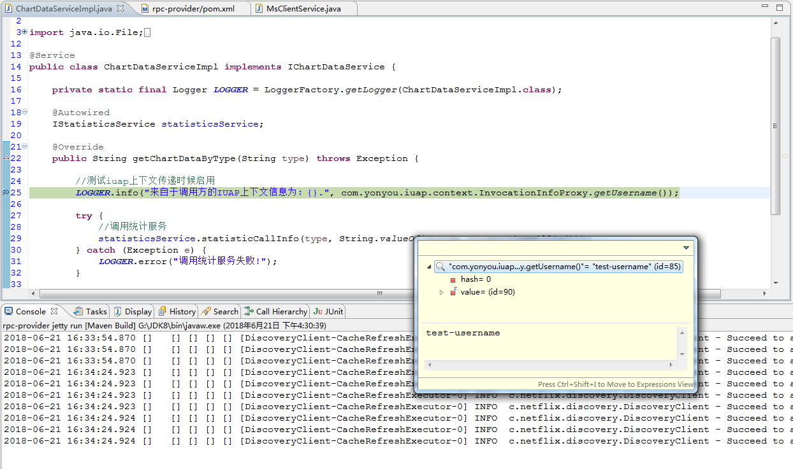

# IUAP上下文传递

在用友IUAP平台的基础组件中，系统登录之后会在线程绑定变量中记录一些上下文信息，如用户ID、主题、语种、系统ID等，当此类应用在使用服务治理平台进行RPC远程方法调用的时候，希望将调用方的上下文的信息自动携带到服务提供方，方便服务提供方的业务编码时自动从上下文中取出相关信息。

## 工程配置
IUAP开发平台的上下文存取需要依赖iuap-generic组件，同时需要依赖iris-iuap-support组件，依赖的配置如下：

	<dependency>
		<groupId>com.yonyou.iuap</groupId>
		<artifactId>iuap-generic</artifactId>
		<version>3.2.1-SNAPSHOT</version>
	</dependency>
	<dependency>
		<groupId>com.yonyou.cloud.middleware</groupId>
		<artifactId>iris-iuap-support</artifactId>
		<version>5.1.1-RELEASE</version>
	</dependency>

## 上下文信息设置

基于IUAP开发平台构建的工程中，可以使用InvocationInfoProxy存取相关属性进行业务开发，例如租户ID、应用编码、用户名称、语种、主题等。如果希望RPC调用可以携带特殊属性，可以在调用远程方法之前通过相应的API进行属性的设置，设置示例如下：

## 服务端信息接收

服务的调用方可以直接从iuap上下文中取出客户端调用RPC方法前的环境中的相关属性，示例代码如下：

	//测试iuap上下文传递时候启用
	LOGGER.info("来自于调用方的IUAP上下文信息为：{}.",com.yonyou.iuap.context.InvocationInfoProxy.getUsername());

运行客户端和服务端工程，服务端可以打印出日志如下:

 