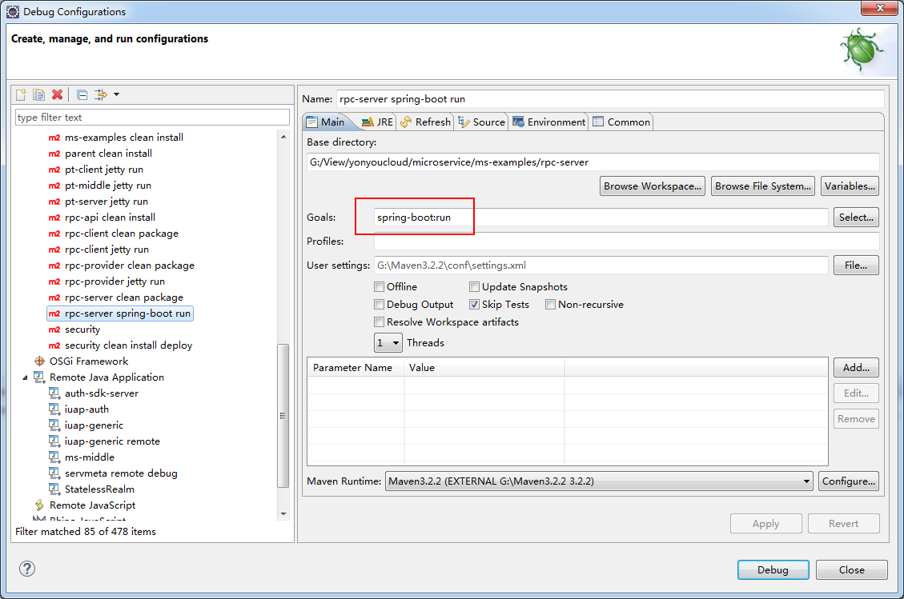

# SpringBoot支持 #

微服务治理平台的开发过程，支持SpringBoot的方式，开发者只需要引入治理平台针对SpringBoot的支持组件即可。

## 一：SpringBoot工程适配方式 ##

SpringBoot工程一般开发方式为在pom.xml中依赖SpringBoot提供的parent工程，其依赖如下：

	<parent>
		<groupId>org.springframework.boot</groupId>
		<artifactId>spring-boot-starter-parent</artifactId>
		<version>1.5.4.RELEASE</version>
	</parent>

如果项目上已有自身的parent工程，则可以使用普通依赖的方式进行引入，示例如下：

    <dependency>
        <groupId>org.springframework.boot</groupId>
        <artifactId>spring-boot-dependencies</artifactId>
        <version>${springboot.version}</version>
        <type>pom</type>
        <scope>import</scope>
    </dependency>

同时，如果需要支持springboot的maven插件运行，还需要引入如下配置：

	<build>
		<finalName>${project.artifactId}</finalName>
		<plugins>
			<plugin>
				<groupId>org.springframework.boot</groupId>
				<artifactId>spring-boot-maven-plugin</artifactId>
				<version>${springboot.version}</version>
			</plugin>
		</plugins>
	</build>

完整的示例代码请参考本文档后续的示例介绍章节。

## 二：工程配置 ##

### (1) YML文件配置 ###

SpringBoot工程默认使用application.yml方式进行工程的配置，配置示例如下：

	server:
	  # 本地调试时引入的端口和context声明，部署时不需要
	  port: 8083    
	  context-path: /rpc-server
	spring: 
	  application:
	    name: rpc-server
	  profiles:
		# 环境配置
	    active: online
	  
	access: 
	  key: 开发者在开发者中心申请的AccessKey
	  secret: AccessKey对应的秘钥信息

### (2) 启动类配置 ###

主启动类一般放置在工程的主package下，需要配置SpringBoot工程需要的相关注解，配置示例如下：

	@SpringBootApplication
	public class RpcServerApplication extends SpringBootServletInitializer {
	
		public static void main(String[] args) {
			SpringApplication.run(RpcServerApplication.class, args);
		}
	
		@Override
		protected SpringApplicationBuilder configure(SpringApplicationBuilder builder) {
			return builder.sources(RpcServerApplication.class);
		}
	
	}

集成SpringBootServletInitializer以支持war包方式部署。

## 三：启动调试 ##

工程开发完成后，可以直接使用Main方法的方式运行工程，也可以使用SpringBoot的Maven插件的方式运行，后者的运行方式如下图所示：

启动过程中，可以在IDE的控制台打印出启动日志，如下图所示：

