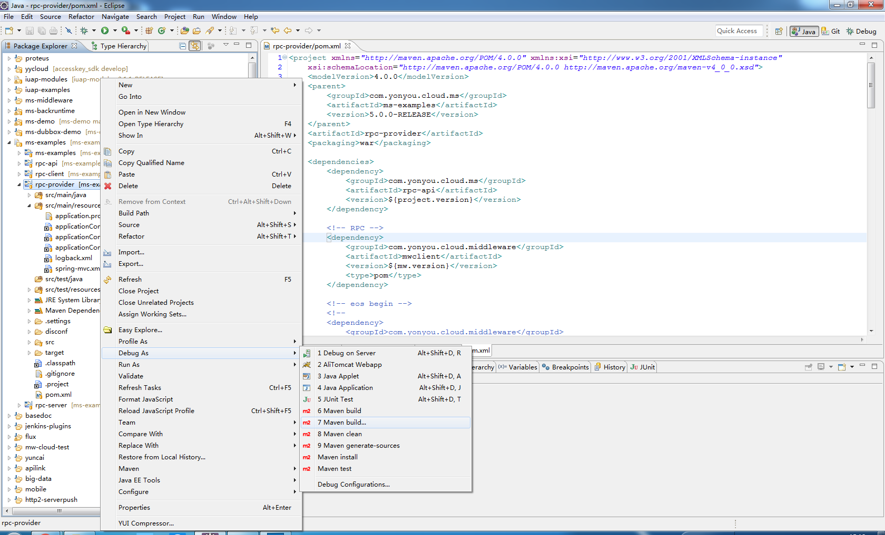
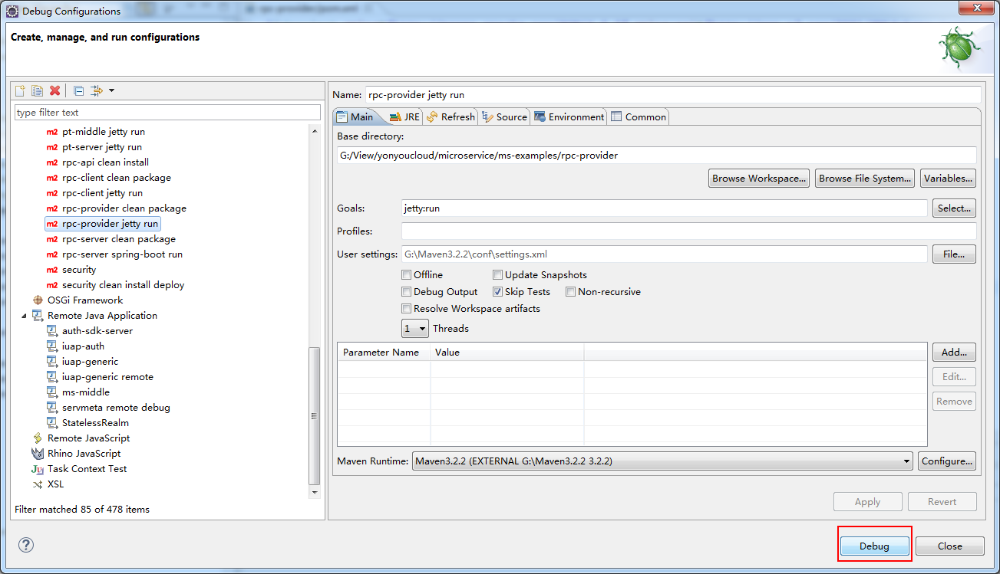
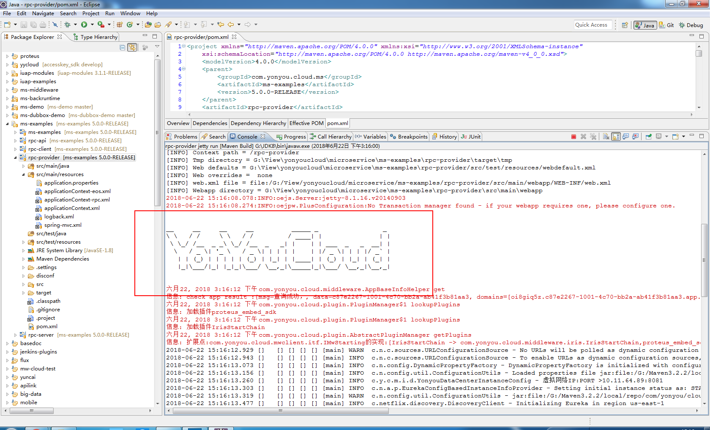
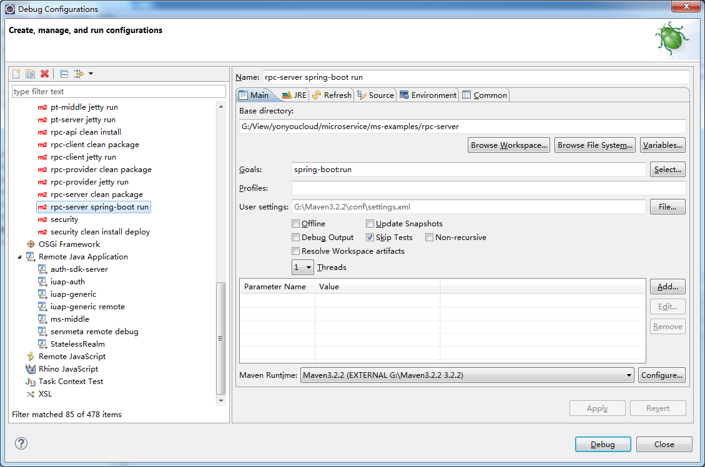
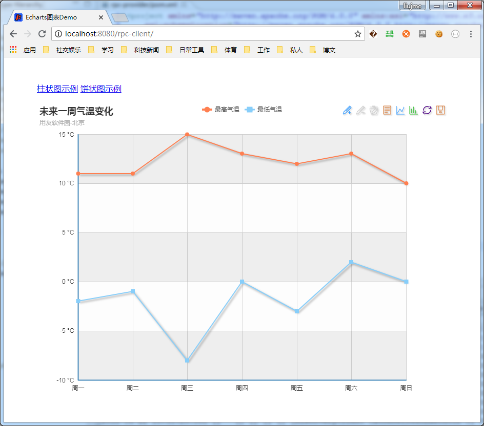

# 示例配置与运行

导入到IDE后，开发者需要将申请的AccessKey和秘钥添加到配置文件中，检查属性配置文件application.properties,调整工程编码等后，使用jetty的方式或者打成war包运行。

## 工程配置

rpc-provider属性文件配置application.properties示例：

	access.key=申请的AK
	access.secret=AK对应的秘钥值
	
    #工程编码，同一租户内不能重复
	spring.application.name=rpc-provider
	spring.profiles.active=online

	微服务注册地址:registry=http://172.20.17.4
	
rpc-server为SpringBoot方式的工程，其配置文件application.yml格式如下：

	server:
	  # 端口号，正式部署时不需要，本地调试防止端口冲突时使用
	  port: 8083  
	  context-path: /rpc-server
	spring: 
	  application:
	    name: rpc-server
	  profiles:
	    active: online
	  
	access: 
	  key: 申请的AK
	  secret: AK对应的秘钥值

	registry: http://172.20.17.4
	
## 工程运行

使用mvn clean install命令构建ms-example工程，rpc-api工程会输出接口所在的jar包。

在IDE中，可以直接使用jetty:run的方式运行rpc-client和rpc-provider，运行方式如下：

选择Maven Build ... 选项打开设置窗口，填写相应的信息如下：

点击Debug按钮调试运行工程，控制台会打印启动日志如下：

控制台输出YonYouCloud的信息，工程启动成功，同理可启动rpc-client工程。

rpc-server为SpringBoot方式的工程，直接运行后者使用spring-boot:run 方式运行即可，运行方式如下：

工程启动成功后，可以在浏览器中输入地址进行RPC调用测试，例如：

示例中的图表数据是rpc-client通过RPC的方式方位远程服务获取的，通过IDE的控制台可以看到日志的输出，开发者也可以通过断点的方式进行调试。

异步调用和动态调用的示例开发运行，请参考开发手册中的相应章节。