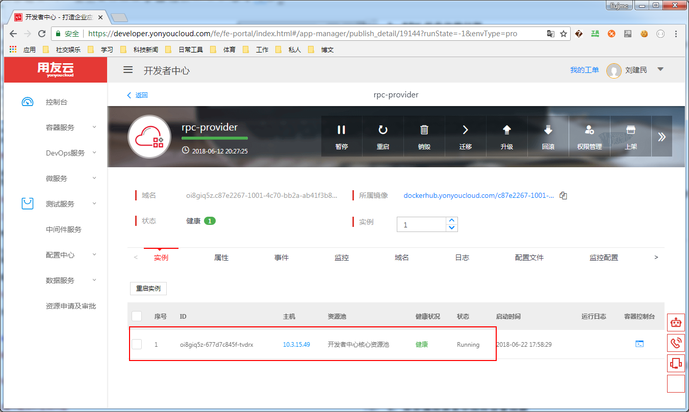
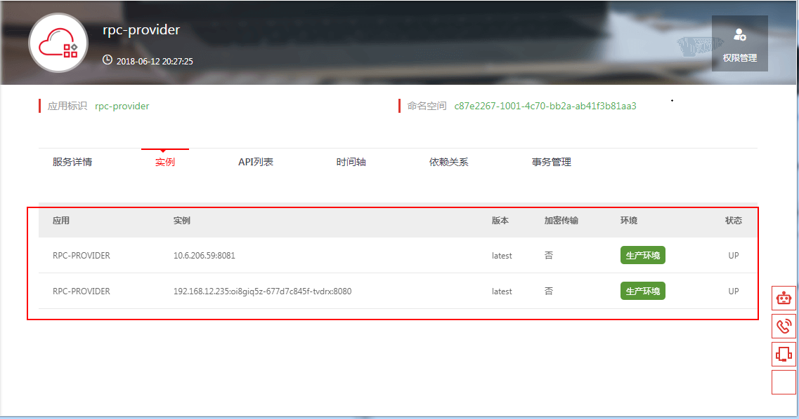
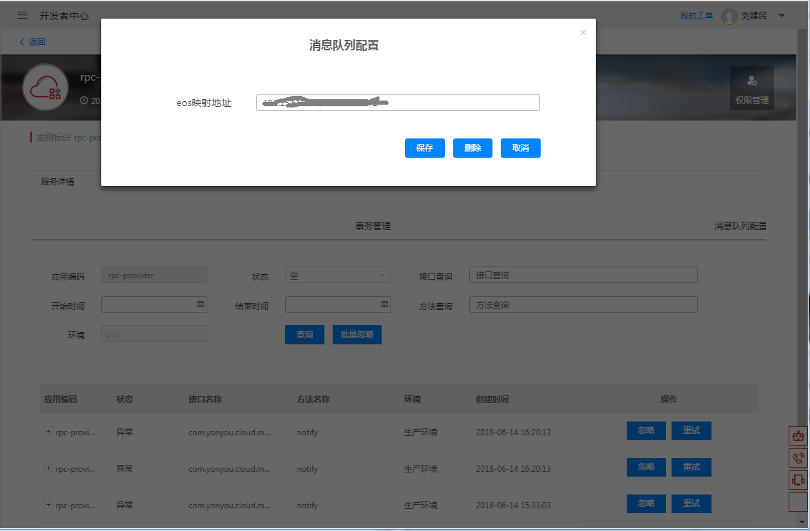
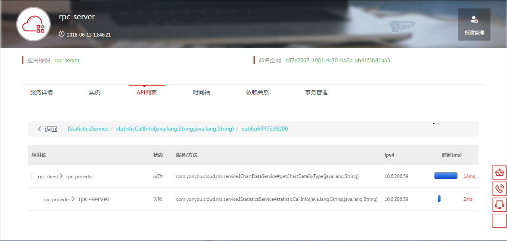

# 服务治理平台常见问题

## 服务启动常见问题

### 1：微服务服务工程启动失败，不能找到app

微服务工程启动过程中，会在开发者中心下检查配置的AccessKey对应的用户是否存在此应用，如果持续集成和应用管理下存在此应用，校验通过后可以启动；如果不存在此应用，请根据前面的文档创建该应用。

当工程中配置的应用和租户下其他用户的应用重名时，可能导致创建应用失败，最终导致服务不能启动。

建议开发者在启动前确认是否存在此应用，或者在开发者中心的持续集成中，明确创建此应用，并选择微服务的类型，避免自动创建工程遇到问题。

### 2：微服务启动报错，没有应用相关权限

开发者启动过程中，控制台打印没有应用的权限，请检查配置的AccessKey所属的用户是否具有应用编码对应的应用的权限，一般造成这种问题的原因是使用了其他人的AccessKey信息或者管理员未给当前用户分配应用权限导致。

开发者可以检查AK信息，并检查应用是否被管理员授权排查问题。

### 3：SDK 组件依赖问题

开发者可以从已有的工程进行改造，来生成新的支持微服务调用的工程，原工程中可能存在旧版本的微服务的SDK和旧版本的IUAP组件，5.1.1-RELEASE版本引用的各个组件的版本如下，可以帮助开发者排查依赖.

- mwclient 5.1.1-RELEASE pom类型
- middleware 5.1.1-RELEASE pom类型
- iuap 3.2.1-SNAPSHOT
- auth-sdk-client 1.0.15-SNAPSHOT
- iris-springboot-support 5.1.1-RELEASE
- iris-iuap-support 5.1.1-RELEASE
- iris-dubbox-support 5.1.1-RELEASE
- eos-spring-support 5.1.1-RELEASE

### 4：工程更新，pom.xml中依赖更新不到

微服务治理平台提供的SDK默认存放的Maven仓库地址为maven.yonyou.com，用友办公网可直接访问，如果不能访问用友办公网，请通过其他渠道购买或者获得相关组件后，推送到私有的Maven仓库中使用。

### 5：提示服务验证失败.请确认accessKey 和application.name的正确性! 

- 输入的access.key和access.secret不一致或者错误
- 此AccessKey已被停用或者删除
- application.name即应用编码输入错误
- 此用户下没有应用编码为application.name的应用

### 6：can not find active server from eureka! server url is ...

- 服务提供方未启动或down掉
- 服务提供方因网络原因未注册到服务注册中心
- 服务提供方的部署时的对外服务端口和`application.properties`属性文件中配置的`server.port`属性值不一致.
- 服务提供方访问路径中的`ContextPath`与`application.properties`属性文件中配置的`spring.application.name`属性值不一致.

一般情况下, 项目名称、项目maven配置的artifactId、`application.properties`属性文件中配置的`spring.application.name`属性值、部署时的`ContextPath`及RemoteCall注解的应用编码（RemoteCall注解由应用编码@租户id组成）这五项内容要一致; 项目部署时的对外服务端口和`application.properties`属性文件中配置的`server.port`属性值要一致, 如果使用内置Jetty还需要和`pom.xml`中`jetty-maven-plugin`插件的`port`值要一致.

### 7：部署到开发者中心环境变量覆盖问题

微服务应用部署到开发者中心时，如果使用的是旧版本的微服务治理平台SDK，可能由于环境变量的问题导致配置不生效，请检查属性中的access_key、access_secret、mw_profiles_active等项是否有效或者与配置文件一致。5.1.1-RELEASE版本的SDK已经对此问题进行适配。

如果不匹配，请删除几项环境变量或者修改成与配置中相同的值，保存并重启。修改环境变量的位置为：容器服务->应用管理->具体应用->对应环境->“属性”页签, 详细信息中的环境列表展示了所有的环境变量。

mw_profiles_active的值建议修改成dev、test、stage、online，分别对应开发、测试、灰度、生产。

## 微服务控制台常见问题

### 1：应用工程的创建过程问题

在开发者中心界面上，微服务可以通过从两种方式来创建：

1. 创建普通的java web工程，工程改造成微服务工程，上传war包重新部署
2. 通过持续构建，创建微服务类型应用，开发完成后再进行部署

使用者可以根据自身情况，选择新建和改造工程以达到微服务化的效果。

### 2：微服务应用的实例信息问题

微服务应用启动后，从容器服务菜单下的应用管理下，搜索到相应的应用，展开卡片信息，选择实例页签，可以查看实例信息，如下图所示：

此实例信息代表Docker容器的实例，Docker容器中运行着微服务工程。

此外，展开微服务的服务管理菜单，查询到对应的微服务，展开监控页签，可以查看微服务注册中心的实例信息，如下图所示：

此实例信息代表微服务启动后注册到注册中心的实例信息。

### 3：异步调用消息中间件设置问题

使用微服务治理平台的异步调用SDK时，需确保已经在管理界面对应用设置了定制的RabbitMQ中间件的连接地址，此地址可以是服务治理平台提供的公共地址，也可以是用户按照治理平台的要求启动的定制的MQ，设置位置如下图所示：

### 4：微服务间应用依赖问题

微服务间成功调用后，可以从服务管控界面查看应用或者接口的依赖信息，需要注意的是，微服务后端服务是计算依据为当前时间的前一天的调用记录,会有一定的延时性。

### 5：限流设置不能及时生效问题

微服务治理平台的限流配置和权限控制是通过配置中心推送配置文件生效的，配置文件的推送和生效需要5-10秒的延时，会导致调用时权限和限流生效一定延时，请在一定时间后验证设置的效果。

### 6：接口权限设置问题

服务的接口设置成私有权限后，需要对允许调用的客户端工程进行授权，调用方才能调用通过，设置授权时，请注意选择正确的应用的环境。

开发态和测试态的服务间相互调用，没有权限的验证，请开发者注意。

### 7：服务调用链路查询问题

针对微服务暴露出的接口，可以查看具体方法的调用链路信息，多级调用时，可以进入详细信息页面查看调用的层级，查询条件中支持根据业务关键字查询，业务关键字需要开发者在开发过程中设置，详细设置的API请参考开发手册中的相关章节。

## 联调问题

### 1. 本地启动test环境
> 本地启动时会把本地启动的服务注册到注册中心，这样会被调用方发现并调用。 

解决方案：
1. 在代码的/src/test/resources/目录中放置一个与应用的application.properties对应的application.yml,里面设置app.version=xxx
2. 加上环境变量  -Deureka.registration.enabled=false不会把本服务注册到注册中心

### 2. can not find active app from registry
>健康检查配置的是基于端口的检测,端口启动时候新应用还没真正启动完毕,老的实例被提前杀死；

解决方案：
1. 开发者中心配置健康检查时，添加微服务的健康检查

